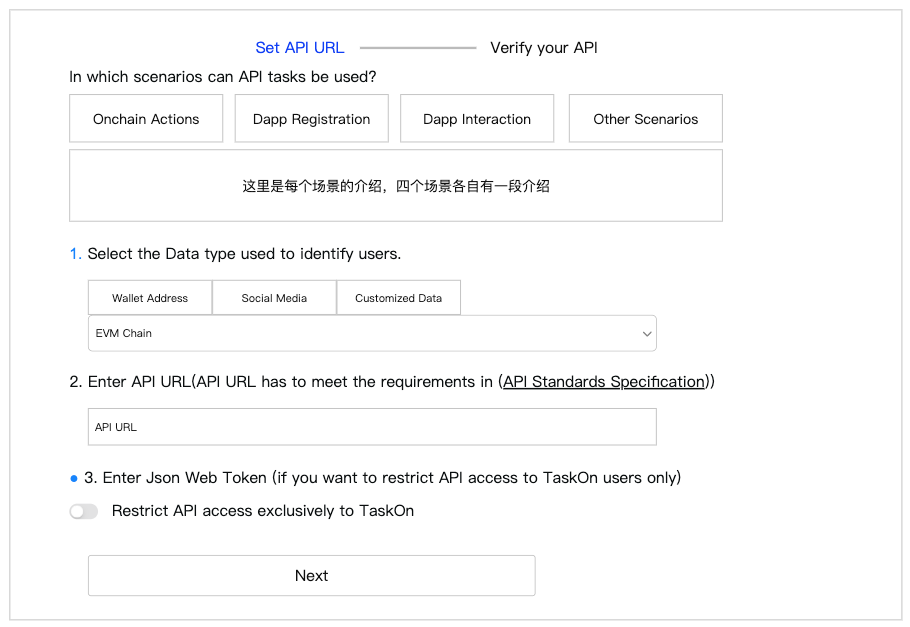
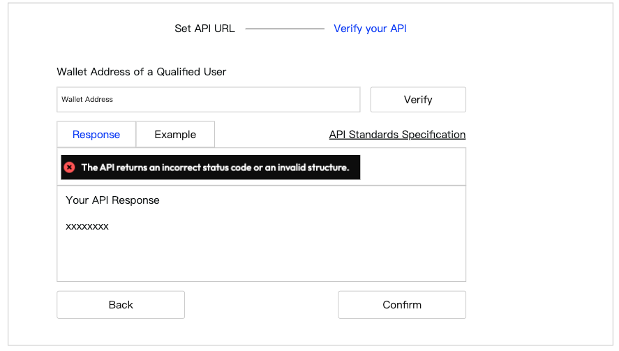
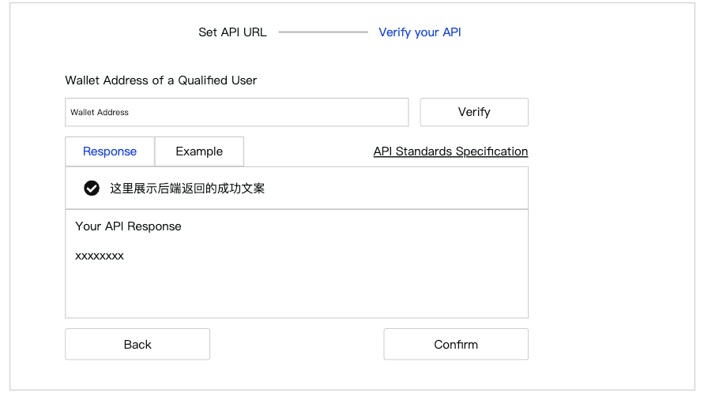
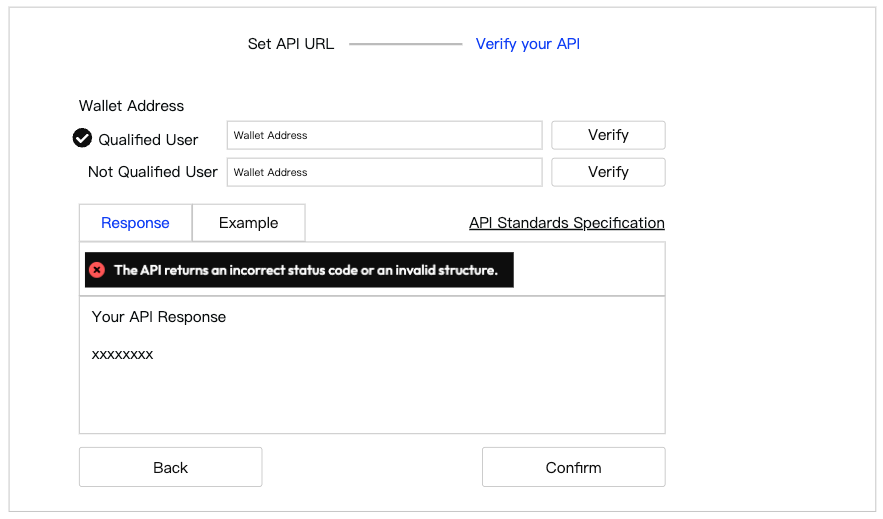

# API任务模版优化

## 需求背景

现在API任务模版有3个主要的问题：

*   客户不知道什么情况下该使用API模版，需要增加一些场景介绍；
*   运营人员对API配置搞不清楚，需要界面更友好让他们能看懂；
*   API调试报错信息不清晰；

## 需求详情

### 1.1 第一步Set API URL

> **图片描述:** [请在此处描述第一张图片的内容，关于API URL设置界面]

增加了四种API场景的介绍，介绍文案如下

*   **Onchain Actions**：If you want to verify a user's Onchain Actions but Taskon has not yet integrated this type of Action, you can develop your own API for verification. In this case, you will need to use the wallet address as a parameter to identify the user.
*   **Dapp Registration**：If you want to verify that a user has successfully registered on your dapp, you can develop your own API for verification. For example, if your dapp uses email for registration, you can select the email from social media as a parameter to identify the user.
*   **Dapp Interaction**：If you want users to complete specific interactions on your dapp, such as playing a game or booking a hotel, you can develop your own API for verification. If your users register with an email, you can use the email from social media as a parameter to identify them.
*   **Other Scenarios**：If you want to verify other types of parameters, you can use Customized Data. This field allows you to transmit any data you define, but you need to clearly explain its meaning to users in the description.

下面只是调整了排版，所有功能没有变化

### 2. 第二步Verify your API

#### 2.1 Performance Based API

> **图片描述:** [请在此处描述第二张图片的内容，关于Performance Based API的验证界面]

上一步骤选择了什么参数，这里就会要求用户填写什么参数，这部分逻辑没有变化；

点击Verify，则调用API接口，并且把调试结果展示在下面的Response区域

增加了Response区域

*   展示报错内容，这部分报错文案要调整成运营能读懂的
*   **Your API Response**，这里展示对方API完整的返回内容
*   **Example**，切换到Example，展示我们要求的API返回样例

点击API Standards Specification，跳转文档

> **图片描述:** [请在此处描述第三张图片的内容，关于API返回结果正确的示例]

返回结果正确，才能点击Confirm，否则Confirm不能点击

#### 2.2 Completion Based API

> **图片描述:** [请在此处描述第四张图片的内容，关于Completion Based API的验证界面]

*   需要测试Qulified User和Not Qualified User，但是这两类User可以分别测试，有两个Verify按钮
*   最开始Qualified和Not Qualified，都没有打勾
*   比如客户先填写了一个Qualified，点击Verify，下面Response区域展示返回结果
*   **注意**：该返回结果必须返回为合格，才算通过，这时候给Qualified前面打上勾
*   如果返回结果为不合格，需要在文案中清晰的告知是这种情况
*   再验证Not Qualified，返回结果必须为不合格，才算通过
*   Qualified和Not Qualified都打上勾，Confirm按钮才能点击
