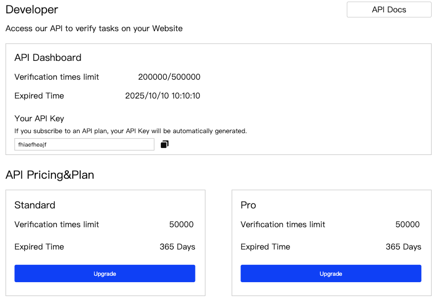

# API服务需求文档

## 需求背景

API服务不同于API任务，API服务指的是Taskon对外提供API，项目方可以集成这些API用于验证自己的用户是否完成了任务。

## 需求详情

> **图片描述:** [请在此处描述图片内容，关于Developer后台的API Dashboard界面]

*   **入口**：在B端后台左侧菜单，增加Developer，位置在Other Product上面。
*   API是独立套餐，与当前的pricing&plan无关。
*   点击 **API Docs**，跳转新写的API文档。

### API Dashboard字段

*   **Verification times limit**：API已使用次数/总次数
*   **Expired Time**：过期时间
*   **Your API Key**：如果用户未购买套餐，这里不展示Key，如果购买了，这里自动生成API Key。

### API Pricing & Plan

*   每个套餐上展示次数限制和过期时间。
*   点击 **Upgrade**，跳转三方支付的付款，与现在的Pricing流程相同。
*   在有套餐的情况下，套餐可以重复购买，重复购买会直接把新的API调用次数和过期时间叠加在当前数值上面。
    *   比如当前是20000/50000，过期时间是10月1日，购买时间是8月1日，再购买一个50000、过期时间1年的套餐，那么最终数据会变成20000/100000，过期时间是8月1日+1年。
