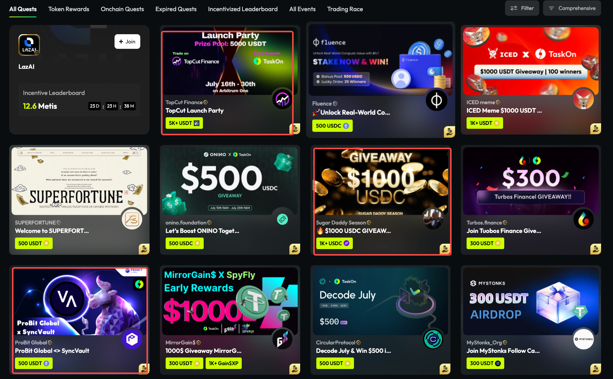
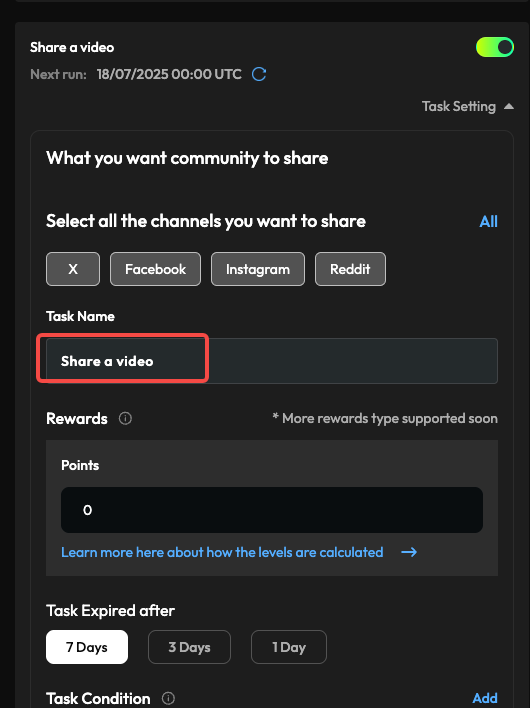
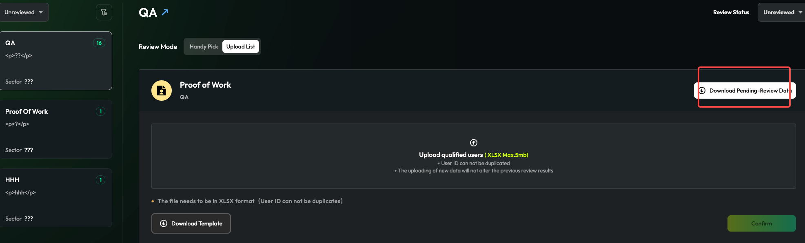

# BD反馈问题清单

## 增加到多个手动配置Incentive的位置

*   后端可以返回在前三排的任意位置插入广告，广告数量不限。
*   比如说可以根据配置方式，在如图3个位置插入2个incentive和1个图片广告，扩展成这种灵活程度。

> 
>
> **图片描述:** [请在此处描述图片内容，关于灵活插入Incentive和广告的示例]

## Youtube Smart task改名字

*   Youtube，看视频任务的bug。
*   Youtube选择share任务，名字要根据所选的channel来，比如选择了X和Facebook，那么创建两个task名字分别是Share a video on X和Share a video on Facebook。

> 
>
> **图片描述:** [请在此处描述图片内容，关于Youtube分享任务命名规则的示例]

*   incentive右边被挡住。

## Task Review增加下载入口

*   把upload这里的下载功能，在handy pick模式下也放一个，功能是完全一致的。

> 
>
> **图片描述:** [请在此处描述图片内容，关于在Handy Pick模式下增加下载功能的示例]
