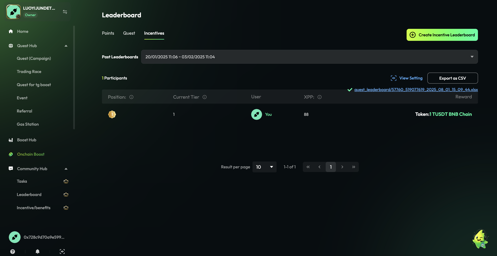

# Billy- BD 反馈

## Ellen 反馈的问题:

*   积分没有用户领取的情况下允许删除, 现有的 hide/unhide 按钮改成 删除 按钮, 点击后提供二次弹窗确认
    > 
    >
    > **图片描述:** [请在此处描述图片内容，关于删除积分按钮的UI]

*   新建 quest, 默认添加 token 奖励
    > 
    >
    > **图片描述:** [请在此处描述图片内容，关于新建Quest默认添加Token奖励的界面]

*   quest 里奖励积分的设置要展示出全部积分名称, 最好做成能自适应的, 根据积分的名称长度显示
    > 
    >
    > **图片描述:** [请在此处描述图片内容，关于奖励积分名称自适应显示的示例]

*   Pricing Plan 样式优化, 把标记位置中的数字样式调的明显一点
    > 
    >
    > **图片描述:** [请在此处描述图片内容，关于Pricing Plan样式优化的示例]

*   针对按排名发奖的奖励显示, 如果是确定的奖励金额, 则在 Rewards Per Winner 显示信息上带上 token 名称, 比如图下截图的示例中, 显示为 100 USDT
    > 
    >
    > **图片描述:** [请在此处描述图片内容，关于按排名发奖的奖励显示优化示例]

## Joe To-do:

*   INCENTIVE leaderboard 增加每个用户完成任务的数据, 新增的三个字段插入在 User 和 奖励积分的中间:
    *   字段名: Tasks Participated, 表示用户参与过多少个任务
    *   字段名: Tasks Submitted, 表示用户提交了多少个任务
    *   字段名: Tasks Qualified, 表示用户完成并通过审核的任务数量
    *   这些新增的字段只需要在 B端后台显示, 同时需要注意导出的数据表里也需要包括这三个字段
    > 
    >
    > **图片描述:** [请在此处描述图片内容，关于INCENTIVE leaderboard增加新字段的UI]

*   Draft 状态下的 quest 卡片: quest data 按钮改成 edit, 同时去掉底下的编辑按钮
    > 
    >
    > **图片描述:** [请在此处描述图片内容，关于Draft状态下Quest卡片按钮的修改]

## Quest 数据分析板块优化

> 
>
> **图片描述:** [请在此处描述图片内容，关于Quest数据分析板块的整体优化]

*   去掉原有的 Task Participant 和 Quest Participant ,统一整合成 Export. 点击按钮后, 页面往下滚, 定位到 Task Performance 板块, 同时高亮 Task Performance 和 Submitter List 中的 Export 按钮
    > 
    >
    > **图片描述:** [请在此处描述图片内容，关于统一导出按钮的交互效果]

*   **新增 Task Performance 板块**
    *   在板块右上角放置导出入口, 点击后导出现有 Task Participant 的信息
    *   Task Name 显示任务名称, 直接显示该任务在C端的任务名称
    *   每个任务展示三个关键指标:
        *   **Participants%**: 计算公式= Task Submitters/Quest Participants, 精度到百分比的小数点后两位
        *   **Submitters**: 任务级别的 Submitters
        *   **Qualifiers**: 任务级别的 Qualifiers
    *   每个任务提供 Export Details 入口, 点击后下载该任务参与的用户明细数据, 字段与现有的 Task Participant 信息字段保持一致
    *   该板块一页最多放5个任务, 更多任务通过分页切换; 任务排序与B端在 Quest 里配置的排序一致

*   **新增 Qualifier List**, 放在 submitter list 右边; 显示的信息和UI布局与 submitter list 保持一致

*   **Submitter list /Qualifier List/ winner list** 每个列表下都分别提供单独的用户明细导出按钮; 不同的用户列表提供不同的字段
    > 
    >
    > **图片描述:** [请在此处描述图片内容，关于不同列表导出不同字段的示例]

    <table>
      <thead>
        <tr>
          <th>用户类型</th>
          <th>导出字段 (为了便于区分原来 quest participants 的字段, 标灰的是去掉的字段)</th>
        </tr>
      </thead>
      <tbody>
        <tr>
          <td>Submitter list</td>
          <td>UserId User Name User Address(evm) TwitterId TwitterHandle DiscordId DiscordName TelegramId TelegramName Email IsWinner IsQualifier IsSubmitter TotalPoints OptTaskPoints Location CompleteTime Reward Type Reward Detail Reward Amount</td>
        </tr>
        <tr>
          <td>Qualifier List</td>
          <td>UserId User Name User Address(evm) TwitterId TwitterHandle DiscordId DiscordName TelegramId TelegramName Email IsWinner IsQualifier IsSubmitter TotalPoints OptTaskPoints Location CompleteTime Reward Type Reward Detail Reward Amount</td>
        </tr>
        <tr>
          <td>Winner list</td>
          <td>UserId User Name User Address(evm) TwitterId TwitterHandle DiscordId DiscordName TelegramId TelegramName Email IsWinner IsQualifier IsSubmitter TotalPoints OptTaskPoints Location CompleteTime Reward Type Reward Detail Reward Amount</td>
        </tr>
      </tbody>
    </table>

*   PS. 导出的表格里要去掉原有 quest participants 导出中包括的这五行
    > 
    >
    > **图片描述:** [请在此处描述图片内容，关于导出表格中需移除的字段]

*   导出样式优化, 输入邮件后整个输入框都看不见输入的内容了:
    > 
    >
    > **图片描述:** [请在此处描述图片内容，关于导出邮件输入框的样式优化]

## Ellen To-do:

### 装修的优化:

*   Announcement 模块调整一下位置, 放在 header 下面
*   community intro 图片比例引导有歧义, 需要优化:
    *   根据板块的数量, 自动显示推荐的图片比例
    *   在图片上传的组件中, 去掉 Recommended Ratio 2:1 的文案显示
    > 
    >
    > **图片描述:** [请在此处描述图片内容，关于community intro图片比例引导的优化]
*   装修右侧的预览界面能点击海报跳转链接

### Quest join your community 任务优化:

*   任务 logo 改成使用项目方自己的 logo
*   去掉填写 community name 的配置项
*   增加文案描述, 告知这个任务模版是干嘛的
*   任务描述里默认填充为项目信息中 About Us 的描述
    > 
    >
    > **图片描述:** [请在此处描述图片内容，关于'Join Your Community'任务的优化]

### B端 setting 页面优化:

*   针对 community owner, 在 team member 之后增加 tab: Personal Profile ↗
*   点击后, 打开一个新页面, 跳转至 https://taskon.xyz/profile
    > 
    >
    > **图片描述:** [请在此处描述图片内容，关于B端setting页面增加Personal Profile的示例]

*   包含 Pow 任务的 quest 结束后, 如果有未审核的任务, 需要强化 task review 没有审核后七天后会全部通过的提示:
    *   在 quest 卡片里增加操作按钮: Review, 点击后跳转到 Quest 详情页里的 Task Review Tab
    *   在 quest 卡片里增加提示: Note: Please complete all reviews by 2025-08-13 08:26:00 UTC. Submissions left unreviewed will be **automatically approved**. \[cara 设计下样式\]
    > 
    >
    > **图片描述:** [请在此处描述图片内容，关于Quest卡片增加Review按钮和提示的示例]
*   在B端后台增加横幅提示: Note: Please complete all reviews by 2025-08-13 08:26:00 UTC. Submissions left unreviewed will be **automatically approved**. 按钮: Review Now, 点击后跳转到 Task Review 页面. 样式类似以下的:
    > 
    >
    > **图片描述:** [请在此处描述图片内容，关于B端后台增加横幅提示的示例]
*   有项目方在 Task Review 里误触点击 all pass 后通过了所有 pow 任务, 为了避免误触, 在当前的二次确认弹窗里, 引导用户需要手动输入 all pass 后才能点击 confirm 按钮; 文案显示改成: For safety, please type **all pass** to confirm this action. This will pass all submissions.
    > 
    >
    > **图片描述:** [请在此处描述图片内容，关于'all pass'二次确认弹窗的优化]

*   Telegram mini app, 找不到输入链接. 需要在任务设置引导里加提示,目前没找到带 start app 的链接
    > 
    >
    > **图片描述:** [请在此处描述图片内容，关于Telegram mini app任务设置的引导提示]

### Smart task 的统一优化

*   入口样式要做的明显一点
*   文案变更, 分别改成 articles 和 videos
    > 
    >
    > **图片描述:** [请在此处描述图片内容，关于Smart task入口样式和文案的优化]
*   Smart task 开关打开后, 默认读取前7天内发布的推文/medium 的文章/ youtube 视频, 并且去掉下面这个弹窗提示
    > 
    >
    > **图片描述:** [请在此处描述图片内容，关于移除Smart task弹窗提示的示例]
*   默认分数是0, 要改成每个任务默认拿到的积分; 另外如果有多套积分体系的话, 需要通过下拉列表支持选择 points
    > 
    >
    > **图片描述:** [请在此处描述图片内容，关于Smart task默认分数和积分体系选择的优化]
*   Medium 和 YouTube 去掉截图里标注的文案
    >  
    >
    > **图片描述:** [请在此处描述图片内容，关于移除Medium和Youtube中多余文案的示例]

*   youtube channel 链接里不支持没有带 @ 的链接, 实测是可以正常打开的. 需要在 community task 和 quest 里都支持这种格式
    > 
    >
    > **图片描述:** [请在此处描述图片内容，关于支持不带@的Youtube Channel链接]

*   visite youtube 的任务名称是 visite URL, 改成 Visit Youtube Video; community 和 quest 的都要改

*   Quest 里编辑 proof of work 名称的交互有问题, 现在点击编辑后, 任务卡片会收起来, 但是鼠标焦点不会放到输入框中; 希望实现的效果: 点击编辑后, 在输入框中完成输入定焦
    > 
    >
    > **图片描述:** [请在此处描述图片内容，关于编辑proof of work名称交互的优化]

*   **变更时间显示格式**,
    *   Plan 里的套餐过期时间改成年月日, 即 2025-12-31
        > 
        >
        > **图片描述:** [请在此处描述图片内容，关于Plan套餐过期时间的显示格式变更]
    *   C端看到的 incentive 时间, 改成 Quest 的时间显示格式: (UTC+8) 2025-07-23 11:13 ～ 08-02 17:00
        > 
        >
        > **图片描述:** [请在此处描述图片内容，关于C端incentive时间的显示格式变更]

*   **community 的导航栏调整顺序**:
    *   Home > Quest > Leaderboard > Sprint > Rewards Shop > Lucky Wheel > Event
    *   如果项目方下的 ongoing 和 end 状态的 event 数量为0, 则不需要显示 event 菜单栏
    > 
    >
    > **图片描述:** [请在此处描述图片内容，关于community导航栏顺序的调整]

*   优化未付费情况下添加 points 奖励的样式, 现在需要hover 到 锁上面才有文案提示, 需要改成 hover 整个 button 就有提示
    > 
    >
    > **图片描述:** [请在此处描述图片内容，关于未付费情况下添加points奖励样式的优化]

*   whitelist 奖励做成付费, 需要 standard 及以上的套餐才可以使用添加. 未付费情况下的交互样式参考 points 的

*   Quest 改时间的 hint 提示弹窗, 要精简文案和去掉图样式
    *   修改的文案: Once your quest goes live, you'll still have a 12-hour window to make a one-time extension.
    > 
    >
    > **图片描述:** [请在此处描述图片内容，关于Quest改时间提示弹窗的优化]

## 其他发版本遗漏的

*   Apt 的 token 集成 (不支持 USDC 的 token 格式)
*   Lucky wheel 发 NFT 奖励的分支
*   Community performance api 任务加自定义字段

## (不用看) 其他未做的

*   Benefit 设置
*   创建 token benefit, 先显示多少积分等于多少token
*   增加 benefit shop 用户兑换的分数门槛
*   rewards shop 在C端的样式不吸引人
*   point 跟 token 的兑换对调
*   Rewards 列表页不够吸引人, 优化样式
*   Performance api 任务, 不要显示 ???, 可以分析一下与其他任务的完成情况
*   Quest 里支持发 airdrop 奖励
*   白名单的 description 在 C端做的好一点
*   Task review 支持下载所有结果(包括通过, 未通过, 待定) 这个任务详情的导出也需要支持
*   装修页面 加个 points 的改名
