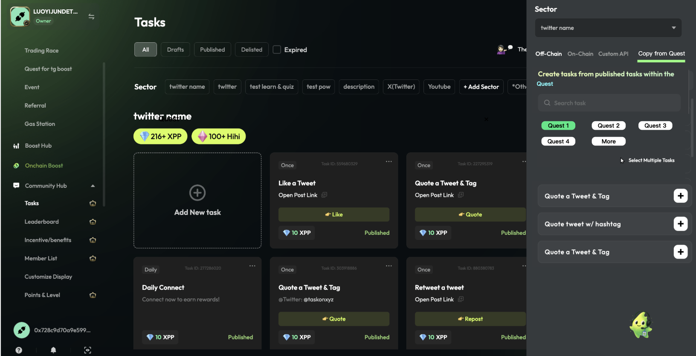

# B端客服反馈小优化

## Community hub 复制 Quest 中的 tasks

> 
>
> **图片描述:** [请在此处描述图片内容，关于Community Hub中复制Quest任务的界面]

### 交互逻辑:

*   当项目方发布的 quest (不含草稿) 数量大于0时, 在 custom API 后出现 **Copy from Quest**
*   点击 **Copy from Quest** 后, 展示所有已发布的 quest
*   每个 quest 按钮上显示 quest 名称, 是单选项
*   创建时间越晚的, 排名越靠前. 默认选中第一个 quest
*   选中 quest 后, 展示该 quest 下的任务
    *   任务顺序按照 quest 里的配置顺序来
    *   每个任务名称同 quest 里配置的任务名称
*   支持多选, 操作逻辑同 quest 里的 copy from community task
*   点击任务上 **+** 后, 将该任务添加至 sector 中, 新创建的社区任务参数与 quest 里的任务参数保持一致

## 进入 communtiy task 页面默认选中 published 和 draft

> 
>
> **图片描述:** [请在此处描述图片内容，关于进入Community Task页面默认选中项的示例]

## 运营后台工具需求

*   增加清除incentives里用户的积分
*   增加支持修改 ongoing 状态的 ranking，fcfs 和open to all quest时间

## (待定不用看) 在Quest中添加一个"测试Quest"功能 (测API 和 swap)

*   在 publish 前进行测试，否则发布后发现问题， 又要重新下架
*   **核心诉求：**
    *   能验证任务是否能正常执行
    *   Quest 能修改
*   **解决方案：**
    *   允许 ongoing 状态下更改 api 和 swap 任务
    *   intract, 嵌在流程里, 只能先 test , 再发布; 在preview 页面增加一个 Test 按钮， 点击后跳转到 quest 详情页， 该页面下只能测试任务是否能正常完成, 不计入 participants 和 winner, B端可以随时修改 quest 的配置
    *   用户在 preview 状态下, 增加引导: 如果想进行测试的话, 可进入 Test 状态(等同于 private), 可以检查任务是否能正常完成, 没问题再发布
    *   在 quest 详情页卡片, 增加 Test 状态, 该状态下增加 Launch Quest 按钮
    > 
    >
    > **图片描述:** [请在此处描述图片内容，关于Quest的Test状态和Launch Quest按钮]
