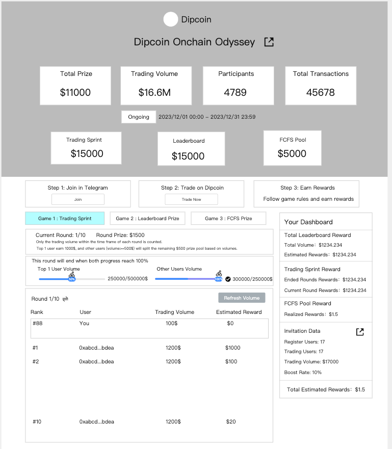
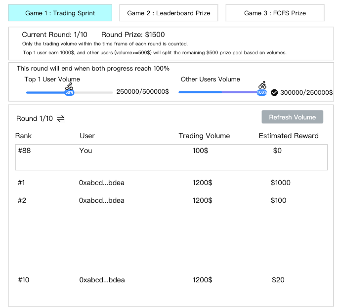
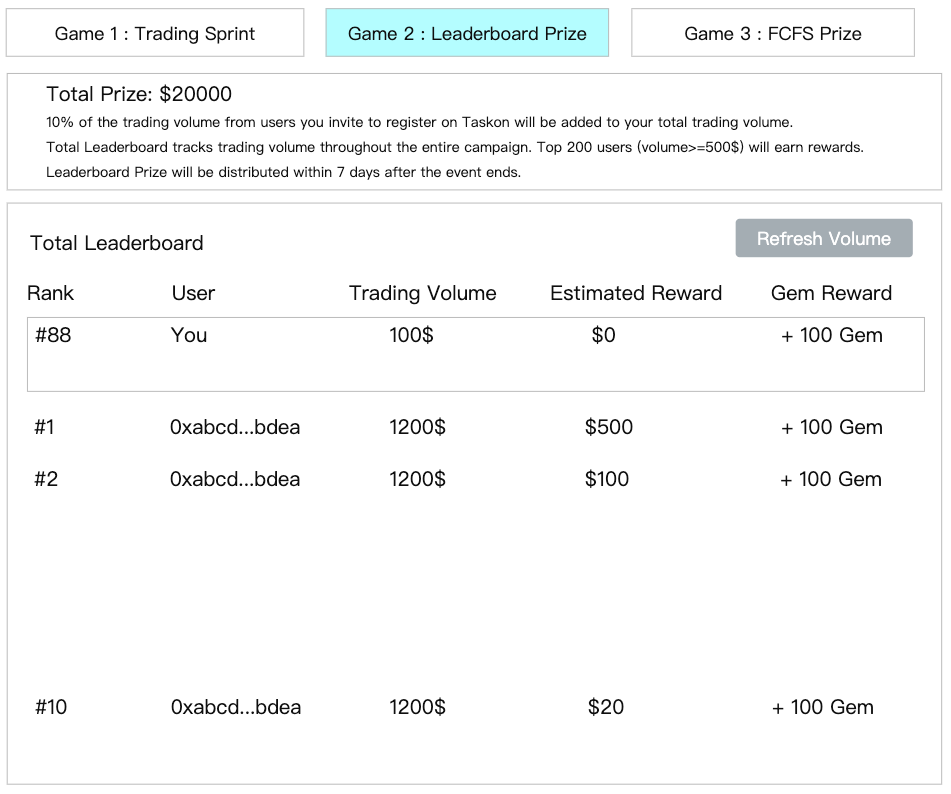
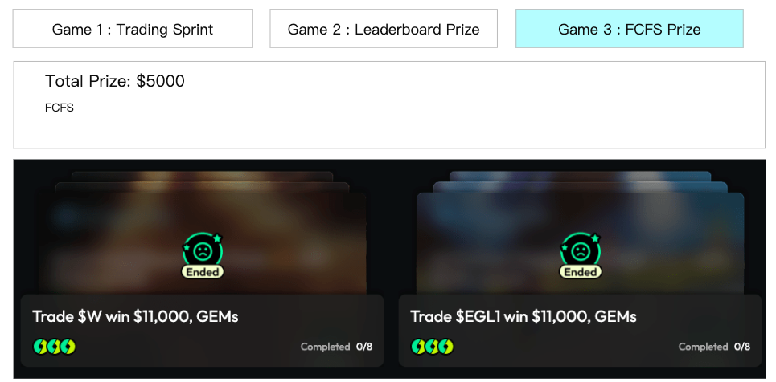
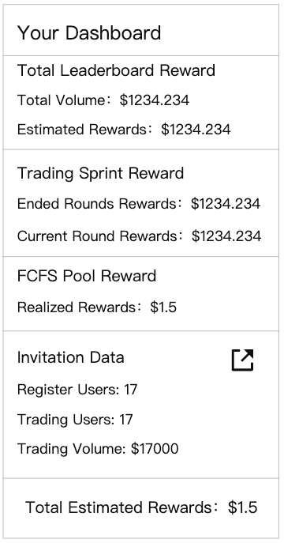

# Dipcoin交易大赛

## 需求背景

Dipcoin是一个Sui上面的Dex交易所，网站是：<https://www.dipcoin.io/swap/SUI-USDC>

这次活动是用户从我们平台上查看规则，然后跳到dipcoin网站上进行交易，最后回到我们平台上查看排行榜和奖励，最后奖励依然使用上次写好的脚本手动发放。

## 开发量评估

*   从Dipcoin的API来进行数据统计和清算
*   冲刺池玩法和发奖规则
*   活动页面

## 需求详情

### 1. 交易记录清算

*   **交易量统计**
    *   只展示我们这边过去的用户，也就是说必须在taskon绑定过sui钱包
    *   数据记录和活动效果分析，明细数据都要落库，可分析
    *   邀请榜单的数据，能统计KOL的带量数据
    *   活动结束后不再统计

### 2. 活动页面

> 
>
> **图片描述:** [请在此处描述图片内容，关于活动页面的整体布局]

#### 2.1 活动流程

#### 2.2 冲刺池玩法

##### 核心规则

*   冲刺池一共分10个轮次，从第一个轮次开始，每个轮次结束后立刻开始下一个轮次，每个轮次的奖金是1500U。
*   冲刺池的榜单只会统计这个冲刺池期间内的交易量。
*   冲刺池的结束条件有两个：第一名交易量达到50w刀，并且剩余所有人加起来达到25w刀。
*   如果冲刺池结束，则立刻结算奖励，第一名获得1000U，剩余用户（交易量大于500U）根据交易量瓜分500U。
*   10个轮次全部结束后，停留在最后一个轮次的页面。

##### 页面布局

*   当前轮次和轮次奖金
*   文案：Only the trading volume within the time frame of each round is counted.
*   文案：Top 1 user earn 1000\$, and other users (volume\>=500\$) will split the remaining \$500 prize pool based on volumes.
*   设置两个进度条，展示当前冲刺池进度
    *   文案：This round will end when both progress reach 100%
*   **Top 1 User Volume**，展示榜一的交易量进度，达到50w为100%，达到了展示一个对勾
*   **Other Users Volume**，展示除了榜一之外其他人的交易量总和，达到25w为100%
*   两个进度条都达到100%，冲刺池结束，按照规则自动发奖
*   **冲刺池排行榜**
    *   默认展示当前的Round，可以切换轮次，点击切换，可以切换所有历史和当前轮次的榜单。比如现在是第5轮，则可以切换1-5轮
    *   排行榜中的交易量只统计该冲刺池有效期内的交易量
    *   **Estimated Reward**，第一名固定写1000U，后面的根据当前冲刺池总交易量平分，计算出预估奖励，500U交易量以下没有奖励，展示预估奖励=0，要展示文案提示用户，文案跟之前的一样
> 
>
> **图片描述:** [请在此处描述图片内容，关于冲刺池玩法的页面布局和排行榜]

#### 2.3 Leaderboard Prize玩法

##### 核心规则

*   统计整个活动期间，所有的交易量，买和卖都算。
*   按照排名给奖励，具体排名和奖励的关系，运营提供表格。
*   排名还会给Gem，也是运营提供表格。
*   排行榜奖励不用自动发，活动结束后7天内发就行。

##### 页面布局

*   文案：
    *   10% of the trading volume from users you invite to register on Taskon will be added to your total trading volume.
    *   Total Leaderboard tracks trading volume throughout the entire campaign. Top 200 users (volume\>=500\$) will earn rewards.
    *   Leaderboard Prize will be distributed within 7 days after the event ends.
*   **排行榜**
    *   跟上次交易大赛一样的排行榜。
> 
>
> **图片描述:** [请在此处描述图片内容，关于Leaderboard Prize的页面布局和排行榜]

#### 2.4 FCFS Prize玩法

##### 核心规则

*   这里就是放两个FCFS的Action

##### 页面布局

*   文案：待补充
> 
>
> **图片描述:** [请在此处描述图片内容，关于FCFS Prize的页面布局]

#### 2.5 Your Dashboard

##### 字段介绍

*   **Total Leaderboard Rewards**
    *   **Total Volume**：所有交易量
    *   **Estimated Rewards**：总排行榜的预估奖励
*   **Trading Sprint Reward**
    *   **Ended Rounds Rewards**：已结束的所有轮次奖励总和
    *   **Current Round Rewards**：当前轮次的预估奖励
*   **FCFS Pool Reward**
    *   FCFS的奖励总和
*   **Invitation Data**
    *   右边是分享按钮，带着个人邀请码
    *   **Register Users**：邀请来的注册用户数
    *   **Trading Users**：邀请来的交易用户数，是符合本次活动的交易
    *   **Trading Volume**：邀请来的用户，符合本次活动的交易量
*   **Total Estimated Rewards**: 所有奖励的总和
> 
>
> **图片描述:** [请在此处描述图片内容，关于Your Dashboard的字段和布局]
