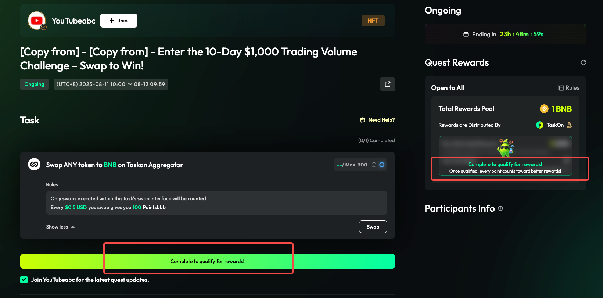
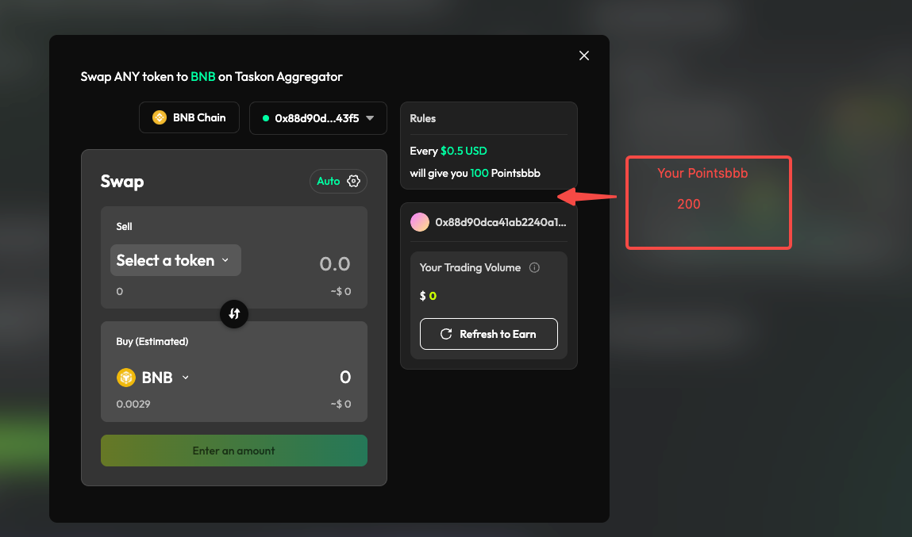
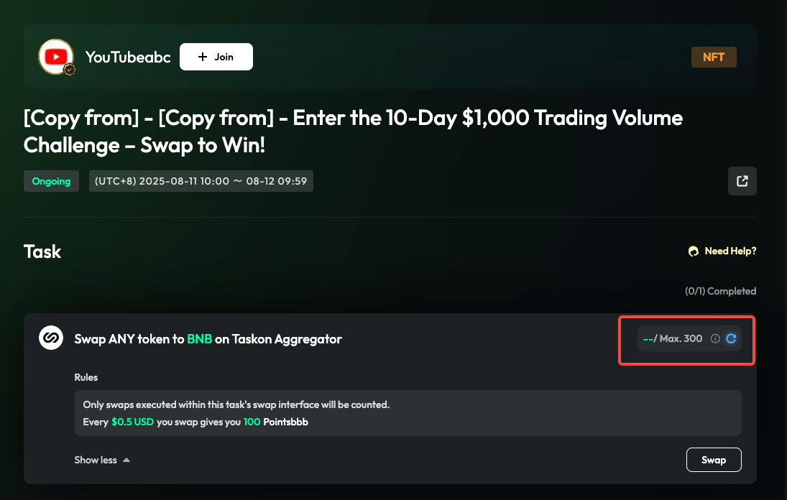
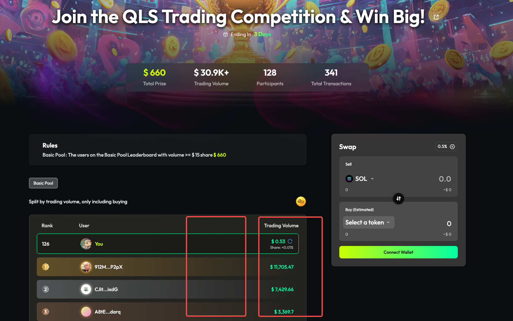

# Hotfix清单

## 1. 后端，交易统一的绑定方案

在quest，task，action，trading race各个地方进行的交易，都统一绑定到各自的任务上面，不会互相之间重复计算。

## 2. Quest-Open to all按量场景的体验优化

> 
>
> **图片描述:** [请在此处描述图片内容，关于Open to all按量场景的初步UI]

*   去掉complete按钮，完成所有必选任务右侧就会自动展示分数和预估奖励；
*   右侧绿色文案改为：Complete all tasks to qualify for rewards!

> 
>
> **图片描述:** [请在此处描述图片内容，关于Swap弹窗的优化]

*   点开swap，这里增加字段，展示已获得的积分数量；
*   点击refresh的时候，积分数量和trading volume同时刷新；

> 
>
> **图片描述:** [请在此处描述图片内容，关于刷新后主界面的数据同步]

*   如果在弹窗里面刷新过，外面直接展示积分数据，不需要用户再刷新一次了；

## 3. Trading Race增加Estimated Rewards

*   把trading volume放在第三列
*   第四列增加Estimated Rewards，按照规则计算预估奖励，计算规则有如下分类，三类规则的预估奖励计算都要实现和测试
    *   前xx名，根据交易量平分
    *   交易量大于xx U，根据交易量平分
    *   所有人根据交易量平分

> 
>
> **图片描述:** [请在此处描述图片内容，关于Trading Race排行榜增加Estimated Rewards列]

## 4. 各种介绍页

*   Setup Guide-Display介绍页
*   Onchain介绍页
*   anti-bot介绍页
*   incentive三个介绍页
