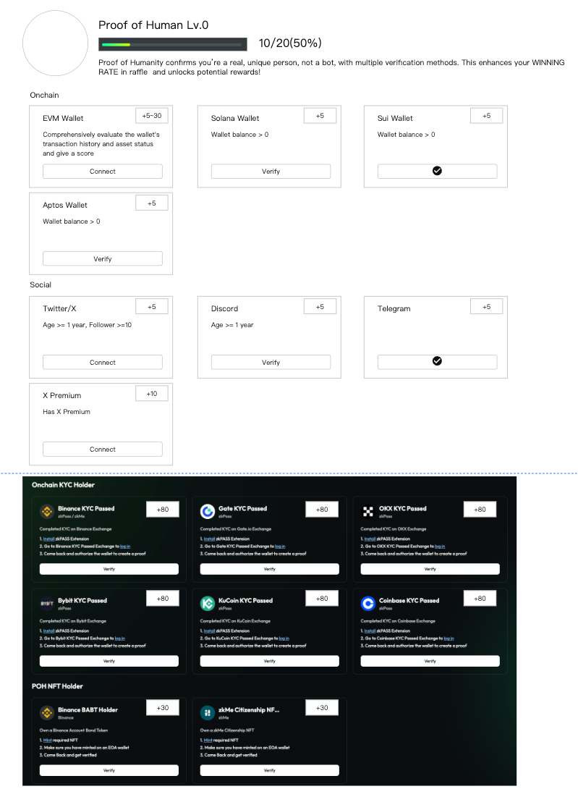
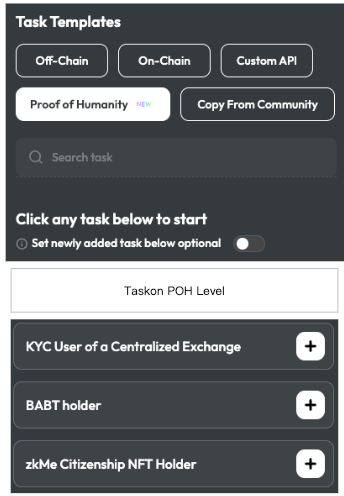
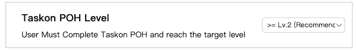

# POH Score需求文档

## 需求背景

POH Score是把用户所有能做的用于证明他是真人的动作，都统一为Score，这样在其他的地方如果需要限制用户是真人，就可以直接引用POH Score或者POH Level，不用勾选复杂的POH选项了。

## POH分数规则

[POH Score](https://ontology.sg.larksuite.com/wiki/UN6DwjcSfiVdTmkyfZ1lOFeKgVd)

## 需求详情

### 1. C端页面

#### 1.1 C端POH Score页面

> 
>
> **图片描述:** [请在此处描述图片内容，关于C端POH Score页面的整体布局]

##### 页面布局

*   顶部是头像、POH等级、Score和升级进度
*   下面是所有可以做的POH
*   分区顺序：Onchain、Social、KYC、NFT
*   每个卡片上增加分数的内容

##### POH积分规则

*   **升级规则**
    *   初始为0级
    *   到达20分，升1级
    *   到达100分，升2级
*   完成每个POH，可以得到表格中对应的分数
*   EVM钱包会根据钱包评分得到一个浮动分数，规则如下
    *   首先查询Thirdwave，如果没有任何记录，则EVM钱包评分为0分
    *   如果有记录，则钱包评分=Thirdwave Score/4 + 5，分数区间在5-30分（正常情况下Thirdwave分数在0-100分，如果出现越界，需要报警，并且按照极限值来处理，比如出现负数按照0处理，超过100按照100处理）

##### 交互逻辑

*   未连接某个媒介，按钮展示为Connect，点击执行绑定操作（此处与Profile的绑定页面是互通的，比如Profile绑定了EVM钱包，这里也展示为绑定）
*   如果在POH页面执行了绑定，直接进行一次Verify验证是否符合积分条件，如果符合则按钮变更为对勾状态，并加上具体分数；
*   POH加分要在右上角有一个加分特效
*   直接更新POH的分数和等级
*   特效分为加分不升级和加分升级两种样式
*   如果Verify不符合条件，则提示用户：Verify Failed: You do not meet the basic requirements，此时按钮展示为Verify，再次点击可以再次触发Verify
*   如果EVM钱包评分为0分，按钮为Verify，点击后重新获取Thirdwave评分

#### 1.2 Quest中设置POH Level的展示

*   点击卡片/链接跳转到POH页面。
*   点击Verify，验证用户是否满足了POH等级。
> 
>
> **图片描述:** [请在此处描述图片内容，关于Quest中POH Level的展示和验证]

### 2. B端设置

#### 2.1 Quest设置

*   Quest中增加一个Taskon POH Level的选项。(Community中的anti bot，也同步增加这个选项）
> 
>
> **图片描述:** [请在此处描述图片内容，关于B端Quest设置中增加POH Level选项]

*   点击添加后，只能设置等级，这里推荐设置2级，2级意味着强KYC，基本上是需要有交易所KYC。
*   下拉菜单有三个：\>=Lv.1, \>=Lv.2 (Recommend), \>=Lv.3
> 
>
> **图片描述:** [请在此处描述图片内容，关于POH Level等级选择的下拉菜单]
