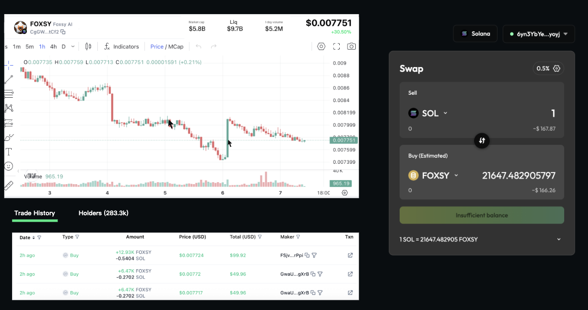
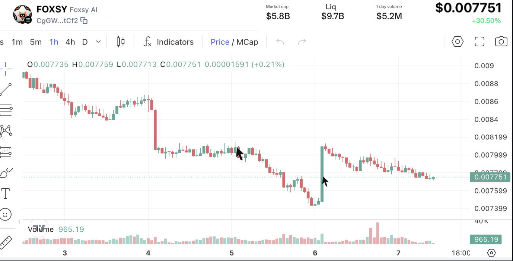
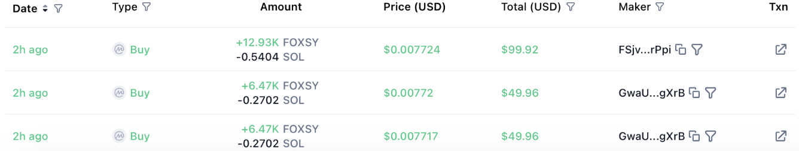
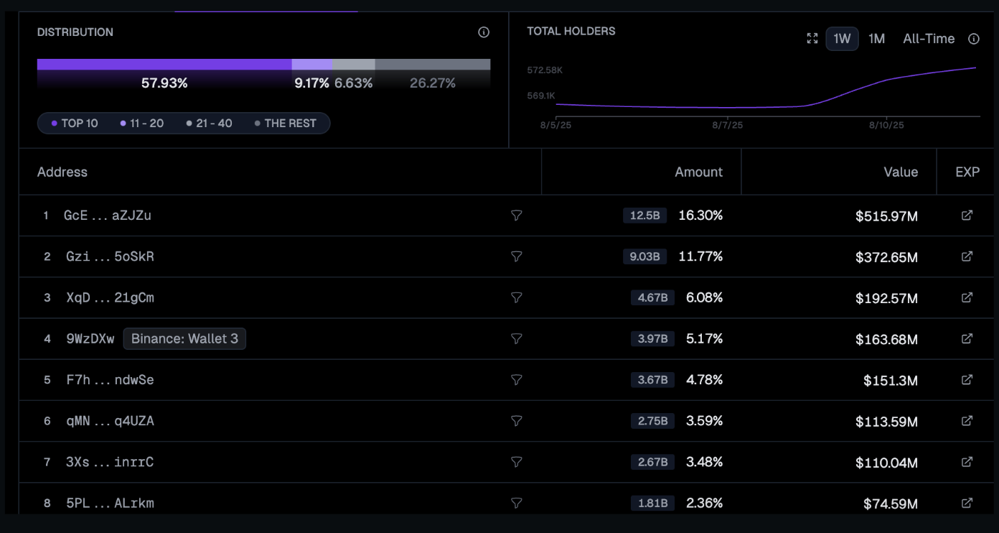

# Swap 组件增加交易K线

## 需求概览

当前 swap 组件缺乏看价格 k 线等相关辅助交易决策的信息, 需要补齐。在 swap 页面 (https://taskon.xyz/swap)新增价格k线, 交易历史, holder 分析。

> 
>
> **图片描述:** [请在此处描述图片内容，关于Swap页面增加K线、交易历史和Holder分析的整体布局]

### 增加价格k线

> 
>
> **图片描述:** [请在此处描述图片内容，关于价格K线图的具体样式]

根据 swap 组件中最近一次选择的 token, 显示其对应的信息:

*   Token logo
*   Token 项目名称
*   Token 合约地址
*   **Token marketcap**: Token 当前以美元计价的 marketcap
*   **Token liquidity**: Token 在 dex 上的池子美元计价的规模
*   **1 day volume**: 最近24小时的交易量
*   Token 的美元计价
*   Token 近24小时的变化幅度
*   Token 美元计价的趋势图 + 交易量趋势图
*   用户进入 Swap 页面默认最近一次选择的 token 是 ETH

### 增加交易历史

> 
>
> **图片描述:** [请在此处描述图片内容，关于交易历史记录的展示样式]

**示例:** <https://dex.coinmarketcap.com/token/solana/CgGWS19zR5xTzgCEcW5Svsuon4hBZwzBwUFimoJStCf2/>

根据 swap 组件中最近一次选择的 token, 显示其对应的交易历史信息:

*   **Date**: 交易时间
*   **Type**: 交易类型, buy 或者 sell
*   **Amount**: 买入和卖出的 token 数量
*   **Price(USD)**: 交易时的 token 价格
*   **Total (USD)**: 交易的规模
*   **Maker**: 发起交易的地址
    *   支持复制
    *   支持筛选出当前地址发起的所有交易
*   **Txn**: 交易在链上的交易哈希跳转入口, 点击打开新页面跳转
*   以下字段需要支持筛选, 交互逻辑复用上面示例链接中的交互:
    *   Date
    *   Type
    *   Total (USD)
    *   Maker

### 增加 holder 分析

> 
>
> **图片描述:** [请在此处描述图片内容，关于Holder分析的图表和列表样式]

**示例:** <https://www.geckoterminal.com/solana/pools/FAqh648xeeaTqL7du49sztp9nfj5PjRQrfvaMccyd9cz>

根据 swap 组件中最近一次选择的 token, 显示其对应的 token holder 信息:

*   Token 按持有量 top 10/11-20/21-40 用户的 token 占比信息
*   Holders 的数量变化趋势
    *   支持按时间周期筛选: 1W/1M/All-time
    *   默认 1W
*   **Address**: Token top holder 的地址信息
*   **Amount**: Token top holder 的持币信息
    *   Token 数量
    *   占比
*   **Value**: Token top holder 的持币价值
*   **Exp**: 当前地址在浏览器中的信息, 点击后打开新页面跳转

## 数据提供商

<table>
  <thead>
    <tr>
      <th>名称</th>
      <th>亮点</th>
      <th>备注</th>
      <th>说明文档</th>
    </tr>
  </thead>
  <tbody>
    <tr>
      <td><strong>TradingView Widget</strong></td>
      <td>免费, 不需要额外开发图表</td>
      <td>验证了下 W token 的显示有问题, 其他四个 token 都没问题 (EGL1, GRDM, W, TAG)</td>
      <td><a href="https://www.tradingview.com/widget-docs/widgets/charts/advanced-chart/">文档链接</a></td>
    </tr>
    <tr>
      <td><strong>CoinGecko API + 自绘图表</strong></td>
      <td>免费 API</td>
      <td>图表需自行开发, 免费版本, 需要标注数据来源, 10K/mo. <strong>支持的 Token :</strong> Grdm 搜不了(没有支持 lbank), 0xf625b131336b4544907e160507aa8d8568104444</td>
      <td><a href="https://www.coingecko.com/en/api/pricing">付费价格</a>, <a href="https://docs.coingecko.com/reference/token-ohlcv-token-address">接口说明</a></td>
    </tr>
    <tr>
      <td><strong>CoinMarketCap API + Trading view 图表</strong> [最优选]</td>
      <td>免费API, 1M call credits/mo</td>
      <td>图表使用 Tradingview 的免费开源图表</td>
      <td><a href="https://coinmarketcap.com/api/pricing/#dex">价格说明</a>, <a href="https://coinmarketcap.com/api/documentation/v1/#operation/getPairHistoricalOHLCV">接口说明</a>, <a href="https://www.tradingview.com/lightweight-charts/">Tradingview图表</a></td>
    </tr>
    <tr>
      <td><strong>CoinGecko Chart</strong></td>
      <td></td>
      <td>无法根据合约搜索</td>
      <td><a href="https://www.coingecko.com/en/widgets/coin_price_chart_widget">文档链接</a></td>
    </tr>
    <tr>
      <td><strong>Dextools</strong></td>
      <td>适合 DeFi 项目, 支持 DEX 实时数据</td>
      <td>UI 可调性差, 容易出现没数据的情况, 通过 iframe 实现</td>
      <td><code>&lt;iframe id="dextools-widget" title="DEXTools Trading Chart" width="500" height="400" src="https://www.dextools.io/widget-chart/cn/bnb/pe-light/0x6d76e7bb743fee795a2f00a317760acf822ee2be?theme=light&amp;chartType=2&amp;chartResolution=30&amp;drawingToolbars=false"&gt;&lt;/iframe&gt;</code></td>
    </tr>
  </tbody>
</table>

### 五个交易大赛的 Token 合约地址:

*   `0xf4b385849f2e817e92bffbfb9aeb48f950ff4444`
*   `0x3c8d20001fe883934a15c949a3355a65ca984444`
*   `0x208bf3e7da9639f1eaefa2de78c23396b0682025`
*   `0x19683a9d2a31508847a026dfe77f53a05a084444`
*   `0xf625b131336b4544907e160507aa8d8568104444`

### Todo:

*   预留交易记录和 holder 分析, traders, 流动性池子, 仓位
*   Token 基本概览信息
*   Token 交易信息
*   交易笔数
*   交易 volume
*   净买入
*   买入笔数
*   卖出笔数
*   Trading view 传统视图
*   Tradingview 账号申请
*   安全性(交易+token)
    *   [Goplus](https://gopluslabs.io/token-security/solana/2BcBT4em5Dp7oKj9ua3N3sXy9RNzM5J8N1rsoXxMm2q2)
    *   [GT Score](https://support.coingecko.com/hc/en-us/articles/38381394237593-What-is-GT-Score-How-is-GT-Score-calculated)
*   [Coingeco token 界面](https://www.geckoterminal.com/solana/pools/4D9pGBVFk32AB4MxYBigEr7CezadtSJbfD9oygqCXmNb?utm_source=coingecko&utm_medium=referral&utm_campaign=searchresults)
*   [Gmgn 界面](https://gmgn.ai/sol/token/HSyxcWLAd2RryX8wEMmorrrm1NP5wShy2NjJpWGwehYM?tag=kol)
*   [Openocean 界面](https://app.openocean.finance/swap/solana/PENGU/USDT)
