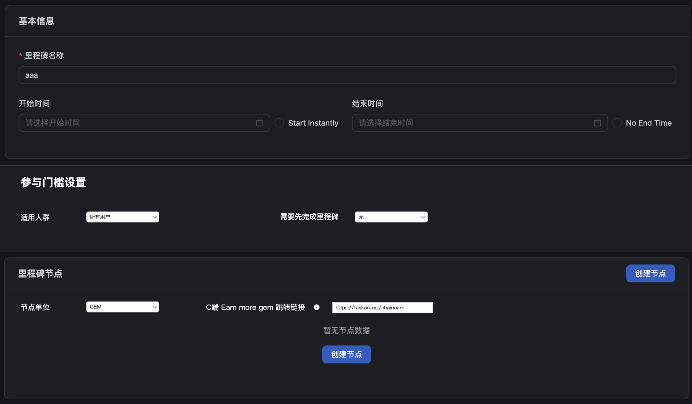
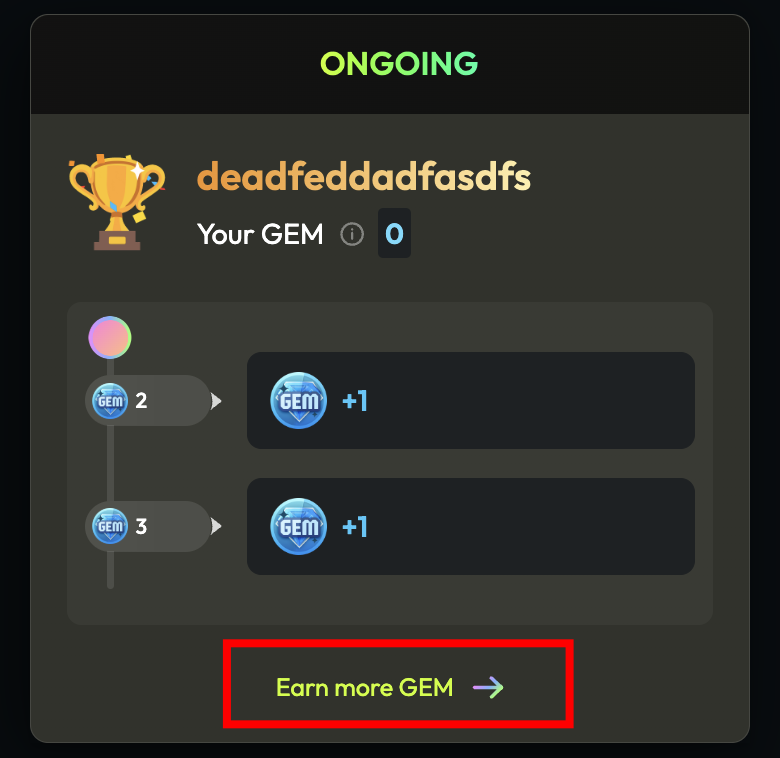
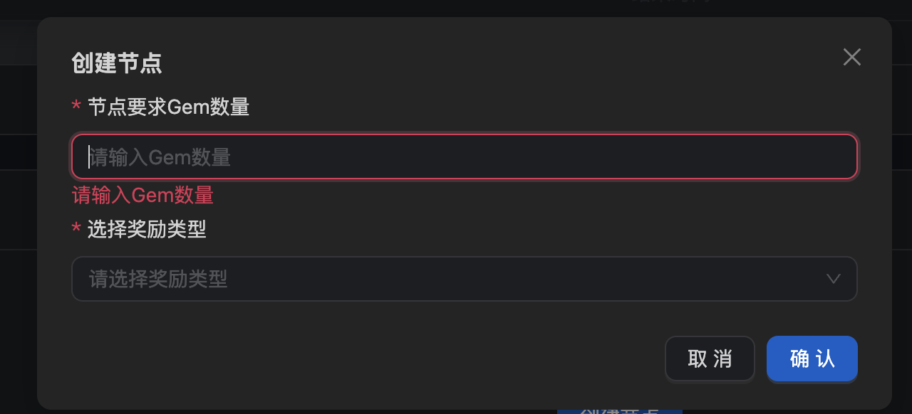
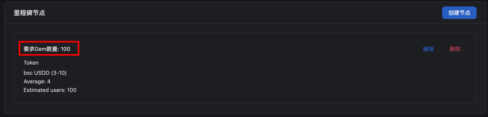
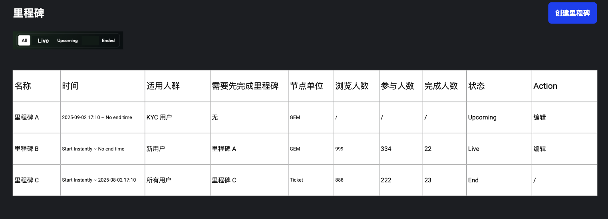
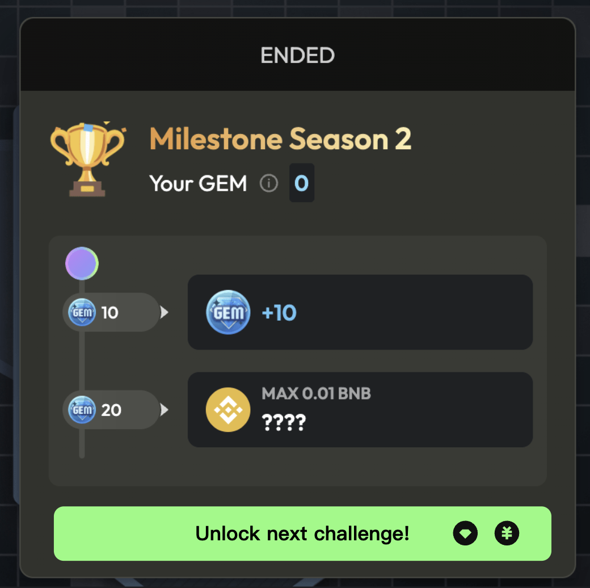
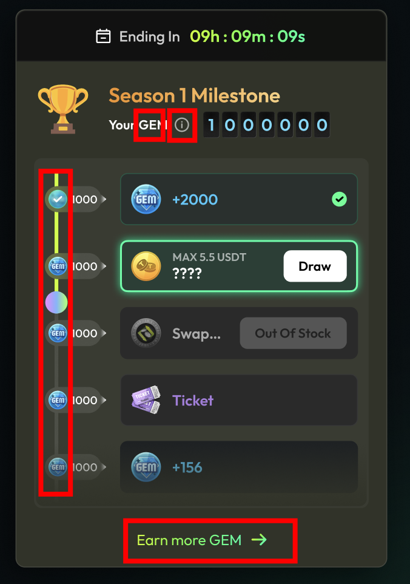
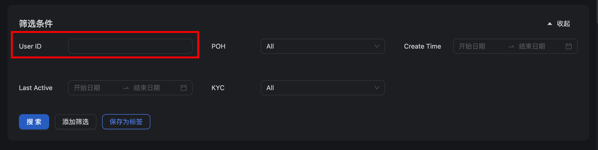

# 里程碑升级

## 需求背景

当前里程碑在业务需求上不满足以下诉求:

*   用户做完里程碑活动之后, 无法再参与新的里程碑活动
*   针对新手无法设计专门的里程碑活动
*   支持以 tickets 计算里程碑进度

## 需求概览

*   B端支持配置多个并行的里程碑活动，每个活动可独立设置开始与结束时间。
*   里程碑活动支持设定适用人群，只有符合条件的用户才能查看并参与。
*   里程碑活动新增"需要先完成里程碑"配置，用户需满足设定条件后才能参与。
*   里程碑节点支持自定义计量单位，除 gem 外，可配置其他单位。
*   新增 tickets 作为可选计量单位之一。

## 需求描述

### B端配置

#### 里程碑详情页增加配置字段

> 
>
> **图片描述:** [请在此处描述图片内容，关于里程碑详情页的新增配置字段]

##### 一、新增 [参与门槛设置]模块, 里面可设置适用人群和需要先完成里程碑

*   **适用人群:**
    *   **定义**: 只有符合条件的用户才能查看并参与该里程碑活动
    *   该组件是下拉列表, 支持多选; 默认选项是所有用户; 数据范围: 所有用户 + 运营配置的用户标签
*   **需要先完成里程碑**
    *   **定义**: 用户到达里程碑的最后一个奖励节点
    *   该组件是下拉列表, 支持单选; 默认选项是无; 数据范围: 无 + 除了本活动外的其他 ongoing 里程碑活动

##### 二、在里程碑节点下新增节点单位

*   该组件是下拉列表, 支持单选
*   数据范围: GEM, Ticket; 默认选项: GEM

##### 三、在里程碑节点下新增 earn more gem跳转链接配置

*   gem 是动态参数, 根据节点单位的选择显示对应的计量单位名称. 如果计量单位选的是 ticket, 则显示C端 Earn more ticket 跳转链接
*   C端 Earn more gem 跳转链接旁边有 i 符号, 点击后弹窗显示图片:
    > 
    >
    > **图片描述:** [请在此处描述图片内容，关于Earn more gem的说明弹窗]
*   输入框有默认链接: `https://taskon.xyz/chainearn`
*   除此之外, 原有固定写死 Gem 的信息,需要改成动态显示的, 根据配置的节点单位显示
    > 
    >
    > **图片描述:** [请在此处描述图片内容，关于动态显示计量单位的示例1]

    > 
    >
    > **图片描述:** [请在此处描述图片内容，关于动态显示计量单位的示例2]

#### 增加里程碑列表页

> 
>
> **图片描述:** [请在此处描述图片内容，关于里程碑列表页的整体布局]

##### 显示字段:

*   **名称**: 里程碑的名字
*   **时间**: 里程碑的开始时间\~结束时间
*   **适用人群**: 显示配置的内容
*   **需要先完成里程碑**: 显示配置的内容
*   **节点单位**: 显示配置的内容
*   **浏览人数**: 看到里程碑组件的用户数, 用 user_id 去重计算; 只需要计算 ongoing 期间的数据即可
*   **参与人数**: 领取了里程碑中至少一个节点的奖励的用户数, 用 user_id 去重计算
*   **完成人数**: 领取了里程碑中所有节点的奖励的用户数, 用 user_id 去重计算
*   **状态**: upcoming/live/end
*   有多个活动的情况下, 根据最后编辑时间排序, 最后编辑的排在最前面
*   Upcoming 和 live 状态活动在 action 列中提供编辑选项

##### 交互逻辑:

*   提供根据状态进行筛选的单选组件, 默认选择 All
*   点击创建里程碑进入新里程碑的创建页面
*   点击编辑进入对应的里程碑编辑页面

### C端用户

#### 一、当用户命中 live 状态的里程碑活动数量大于1个

*   用户已完成当前的里程碑的情况下, 显示 unlock next challenge 按钮.
*   点击按钮后, 切换显示另一个里程碑 (需要有切换动效)
*   如果用户在当前的里程碑奖励中有未领取的奖励, 弹窗提示:
    > **Unclaimed rewards will be automatically collected when you start the next challenge.**
*   点击 confirm 按钮后, 自动领取所有奖励, 并且显示下一个里程碑.
    > 
    >
    > **图片描述:** [请在此处描述图片内容，关于解锁下一个挑战及自动领取奖励的交互]

#### 二、涉及计量单位的显示, 要统一改成B端配置的计量单位

*   不同计量单位影响的地方有:
    *   名字和 logo
    *   Your GEM 旁边的 i 里的说明文案改成: Only \[GEM] earned during the activity is counted. \[GEM] 是计量单位的名字
    *   Earn more GEM 文案改成 Earn more \[GEM]; \[GEM] 是计量单位的名字
    *   不同计量单位 Earn more \[GEM] 上的跳转链接是不一样的, 根据B端后台配置的来
        > 
        >
        > **图片描述:** [请在此处描述图片内容，关于根据计量单位动态显示的UI]
*   **文案变更**:
    *   New season incoming. 改成 New activity incoming.
        > 
        >
        > **图片描述:** [请在此处描述图片内容，关于'New activity incoming'的文案变更]

#### 三、多个里程碑之间的展示顺序

*   在 C 端用户满足多个 live 状态的活动时, 展示最早创建的活动

### 标签需求

*   当前无法指定多个 user_id 保存为标签, 因此希望 user id 做成可以输入多个 user_id 的设置, 通过换行识别
    > 
    >
    > **图片描述:** [请在此处描述图片内容，关于批量输入user_id创建标签的UI]
*   标签增加活动开始后的注册用户
