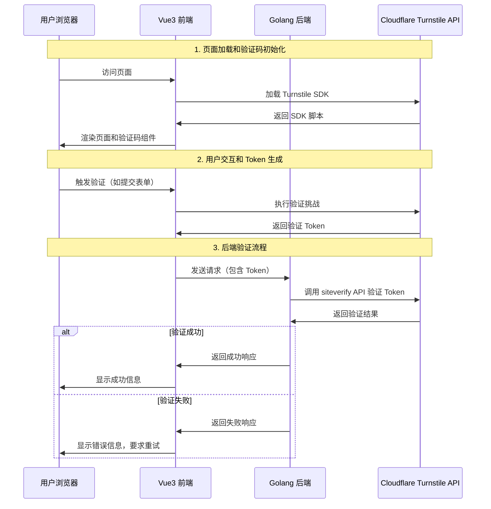
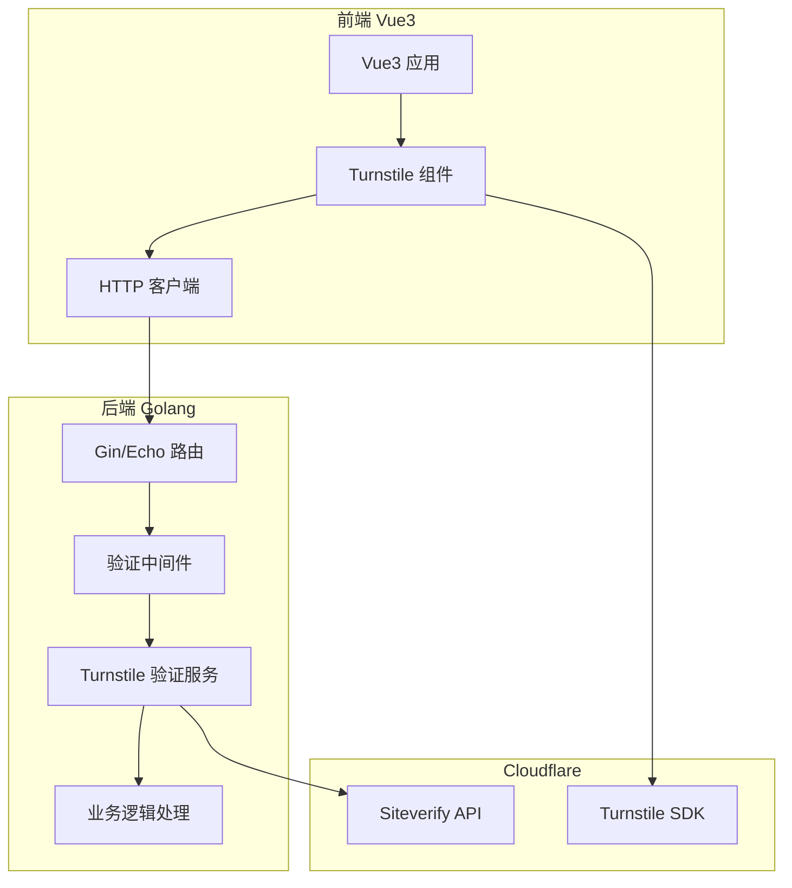

# Cloudflare Turnstile 集成技术方案

## 项目概述

本文档详细描述如何在 Vue3 前端和 Golang 后端项目中集成 Cloudflare Turnstile 验证码服务。Turnstile 是一个免费、现代化的 CAPTCHA 替代方案，提供优秀的用户体验和强大的机器人防护能力。

## 系统架构设计

### 整体架构流程图



### 技术栈架构



## 前期准备

### 1. 获取 Cloudflare Turnstile 密钥

1. 访问 [Cloudflare Dashboard](https://dash.cloudflare.com/)
2. 选择 "Turnstile" 服务
3. 创建新的 Site Key
4. 记录以下信息：
   - **Site Key**（公开密钥，用于前端）
   - **Secret Key**（私密密钥，用于后端验证）

### 2. 配置域名白名单

在 Cloudflare 控制台中配置允许的域名：
- 开发环境：`localhost`、`127.0.0.1`
- 测试环境：`test.yourdomain.com`
- 生产环境：`yourdomain.com`

## Vue3 前端集成实现

### 1. 安装依赖

```bash
# 如果使用 TypeScript，可以安装类型定义
npm install --save-dev @types/turnstile
```

### 2. 创建 Turnstile 组件

**文件：`src/components/TurnstileWidget.vue`**

```vue
<template>
  <div class="turnstile-container">
    <div
      ref="turnstileElement"
      class="cf-turnstile"
      :data-sitekey="siteKey"
      :data-theme="theme"
      :data-size="size"
      :data-callback="callbackName"
      :data-error-callback="errorCallbackName"
      :data-expired-callback="expiredCallbackName"
    ></div>

    <!-- 错误状态显示 -->
    <div v-if="error" class="error-message">
      <p>验证失败：{{ error }}</p>
      <button @click="resetWidget" class="retry-button">重试</button>
    </div>

    <!-- 加载状态 -->
    <div v-if="loading" class="loading-indicator">
      <span>正在验证...</span>
    </div>
  </div>
</template>

<script setup lang="ts">
import { ref, onMounted, onUnmounted, nextTick } from 'vue'

// Props 定义
interface Props {
  siteKey: string
  theme?: 'light' | 'dark' | 'auto'
  size?: 'normal' | 'compact'
  mode?: 'managed' | 'non-interactive' | 'invisible'
}

const props = withDefaults(defineProps<Props>(), {
  theme: 'auto',
  size: 'normal',
  mode: 'managed'
})

// Emits 定义
const emit = defineEmits<{
  success: [token: string]
  error: [error: string]
  expired: []
  loading: [isLoading: boolean]
}>()

// 响应式数据
const turnstileElement = ref<HTMLElement>()
const widgetId = ref<string>()
const error = ref<string>('')
const loading = ref(false)

// 回调函数名称（需要全局可访问）
const callbackName = `turnstileCallback_${Math.random().toString(36).substr(2, 9)}`
const errorCallbackName = `turnstileErrorCallback_${Math.random().toString(36).substr(2, 9)}`
const expiredCallbackName = `turnstileExpiredCallback_${Math.random().toString(36).substr(2, 9)}`

// 验证成功回调
const onSuccess = (token: string) => {
  loading.value = false
  error.value = ''
  emit('success', token)
  emit('loading', false)
}

// 验证失败回调
const onError = (errorCode: string) => {
  loading.value = false
  error.value = getErrorMessage(errorCode)
  emit('error', error.value)
  emit('loading', false)
}

// 验证过期回调
const onExpired = () => {
  loading.value = false
  error.value = '验证已过期，请重新验证'
  emit('expired')
  emit('loading', false)
}

// 错误代码转换为用户友好的消息
const getErrorMessage = (errorCode: string): string => {
  const errorMessages: Record<string, string> = {
    'timeout-or-duplicate': '验证超时或重复提交',
    'invalid-input-secret': '配置错误，请联系管理员',
    'missing-input-secret': '缺少必要配置',
    'invalid-input-response': '验证响应无效',
    'missing-input-response': '验证响应缺失',
    'bad-request': '请求格式错误',
    'timeout-or-duplicate': '请求超时或重复',
    'internal-error': '服务内部错误，请稍后重试'
  }
  return errorMessages[errorCode] || `未知错误: ${errorCode}`
}

// 重置组件
const resetWidget = async () => {
  if (widgetId.value && window.turnstile) {
    window.turnstile.reset(widgetId.value)
    error.value = ''
    loading.value = false
  }
}

// 手动触发验证（适用于 invisible 模式）
const executeChallenge = () => {
  if (widgetId.value && window.turnstile) {
    loading.value = true
    emit('loading', true)
    window.turnstile.execute(widgetId.value)
  }
}

// 获取当前 token
const getToken = (): string | null => {
  if (widgetId.value && window.turnstile) {
    return window.turnstile.getResponse(widgetId.value)
  }
  return null
}

// 初始化 Turnstile
const initTurnstile = async () => {
  await nextTick()

  if (!window.turnstile) {
    console.error('Turnstile SDK not loaded')
    return
  }

  // 设置全局回调函数
  ;(window as any)[callbackName] = onSuccess
  ;(window as any)[errorCallbackName] = onError
  ;(window as any)[expiredCallbackName] = onExpired

  // 渲染 widget
  if (turnstileElement.value) {
    try {
      const renderOptions: any = {
        sitekey: props.siteKey,
        theme: props.theme,
        size: props.size,
        callback: callbackName,
        'error-callback': errorCallbackName,
        'expired-callback': expiredCallbackName
      }

      // 添加模式特定配置
      if (props.mode === 'invisible') {
        renderOptions.size = 'invisible'
      }

      widgetId.value = window.turnstile.render(turnstileElement.value, renderOptions)
    } catch (err) {
      console.error('Failed to render Turnstile widget:', err)
      error.value = '验证组件加载失败'
    }
  }
}

// 加载 Turnstile SDK
const loadTurnstileSDK = (): Promise<void> => {
  return new Promise((resolve, reject) => {
    if (window.turnstile) {
      resolve()
      return
    }

    const script = document.createElement('script')
    const renderMode = props.mode === 'invisible' ? 'explicit' : 'explicit'
    script.src = `https://challenges.cloudflare.com/turnstile/v0/api.js?render=${renderMode}`
    script.async = true
    script.defer = true

    script.onload = () => {
      // 等待 SDK 完全加载
      const checkTurnstile = () => {
        if (window.turnstile) {
          resolve()
        } else {
          setTimeout(checkTurnstile, 100)
        }
      }
      checkTurnstile()
    }

    script.onerror = () => {
      reject(new Error('Failed to load Turnstile SDK'))
    }

    document.head.appendChild(script)
  })
}

// 组件挂载
onMounted(async () => {
  try {
    await loadTurnstileSDK()
    await initTurnstile()
  } catch (err) {
    console.error('Turnstile initialization failed:', err)
    error.value = 'SDK 加载失败，请检查网络连接'
  }
})

// 组件卸载清理
onUnmounted(() => {
  // 清理全局回调函数
  if ((window as any)[callbackName]) {
    delete (window as any)[callbackName]
  }
  if ((window as any)[errorCallbackName]) {
    delete (window as any)[errorCallbackName]
  }
  if ((window as any)[expiredCallbackName]) {
    delete (window as any)[expiredCallbackName]
  }
})

// 暴露方法给父组件
defineExpose({
  resetWidget,
  executeChallenge,
  getToken
})
</script>

<style scoped>
.turnstile-container {
  margin: 16px 0;
}

.error-message {
  margin-top: 8px;
  padding: 12px;
  background-color: #fef2f2;
  border: 1px solid #fecaca;
  border-radius: 6px;
  color: #dc2626;
}

.retry-button {
  margin-top: 8px;
  padding: 6px 12px;
  background-color: #dc2626;
  color: white;
  border: none;
  border-radius: 4px;
  cursor: pointer;
}

.retry-button:hover {
  background-color: #b91c1c;
}

.loading-indicator {
  margin-top: 8px;
  padding: 8px;
  text-align: center;
  color: #6b7280;
  font-size: 14px;
}
</style>
```

### 3. TypeScript 类型定义

**文件：`src/types/turnstile.d.ts`**

```typescript
interface Window {
  turnstile: {
    render: (element: HTMLElement | string, options: TurnstileOptions) => string
    reset: (widgetId: string) => void
    execute: (widgetId: string) => void
    getResponse: (widgetId: string) => string | null
    remove: (widgetId: string) => void
  }
}

interface TurnstileOptions {
  sitekey: string
  theme?: 'light' | 'dark' | 'auto'
  size?: 'normal' | 'compact' | 'invisible'
  callback?: string | ((token: string) => void)
  'error-callback'?: string | ((error: string) => void)
  'expired-callback'?: string | (() => void)
  'before-interactive-callback'?: string | (() => void)
  'after-interactive-callback'?: string | (() => void)
  'unsupported-callback'?: string | (() => void)
}

interface TurnstileResponse {
  success: boolean
  'error-codes'?: string[]
  challenge_ts?: string
  hostname?: string
  action?: string
  cdata?: string
}
```

### 4. 使用示例

**文件：`src/views/LoginForm.vue`**

```vue
<template>
  <div class="login-form">
    <form @submit.prevent="handleSubmit">
      <div class="form-group">
        <label for="username">用户名：</label>
        <input
          id="username"
          v-model="form.username"
          type="text"
          required
        />
      </div>

      <div class="form-group">
        <label for="password">密码：</label>
        <input
          id="password"
          v-model="form.password"
          type="password"
          required
        />
      </div>

      <!-- Turnstile 验证码组件 -->
      <TurnstileWidget
        :site-key="turnstileSiteKey"
        theme="auto"
        mode="managed"
        @success="onTurnstileSuccess"
        @error="onTurnstileError"
        @loading="onTurnstileLoading"
      />

      <button
        type="submit"
        :disabled="!turnstileToken || submitting"
        class="submit-button"
      >
        {{ submitting ? '登录中...' : '登录' }}
      </button>
    </form>
  </div>
</template>

<script setup lang="ts">
import { ref, reactive } from 'vue'
import TurnstileWidget from '@/components/TurnstileWidget.vue'
import { loginApi } from '@/api/auth'

// 配置
const turnstileSiteKey = import.meta.env.VITE_TURNSTILE_SITE_KEY

// 响应式数据
const form = reactive({
  username: '',
  password: ''
})

const turnstileToken = ref<string>('')
const submitting = ref(false)
const turnstileLoading = ref(false)

// Turnstile 事件处理
const onTurnstileSuccess = (token: string) => {
  turnstileToken.value = token
  console.log('Turnstile verification successful')
}

const onTurnstileError = (error: string) => {
  turnstileToken.value = ''
  console.error('Turnstile error:', error)
  // 可以显示用户友好的错误信息
}

const onTurnstileLoading = (loading: boolean) => {
  turnstileLoading.value = loading
}

// 表单提交
const handleSubmit = async () => {
  if (!turnstileToken.value) {
    alert('请完成人机验证')
    return
  }

  submitting.value = true

  try {
    const response = await loginApi({
      username: form.username,
      password: form.password,
      turnstileToken: turnstileToken.value
    })

    // 处理登录成功
    console.log('Login successful:', response)

  } catch (error) {
    console.error('Login failed:', error)
    // 重置 Turnstile token，要求重新验证
    turnstileToken.value = ''
  } finally {
    submitting.value = false
  }
}
</script>
```

### 5. 环境变量配置

**文件：`.env.development`**

```env
# 开发环境 Turnstile 配置
VITE_TURNSTILE_SITE_KEY=1x00000000000000000000AA
VITE_API_BASE_URL=http://localhost:8080
```

**文件：`.env.production`**

```env
# 生产环境 Turnstile 配置
VITE_TURNSTILE_SITE_KEY=your_production_site_key
VITE_API_BASE_URL=https://api.yourdomain.com
```

## Golang 后端集成实现

### 1. 项目结构

```
backend/
├── main.go
├── config/
│   └── config.go
├── middleware/
│   └── turnstile.go
├── service/
│   └── turnstile.go
├── handler/
│   └── auth.go
├── model/
│   └── response.go
└── go.mod
```

### 2. 依赖安装

**文件：`go.mod`**

```go
module your-project

go 1.21

require (
    github.com/gin-gonic/gin v1.9.1
    github.com/go-resty/resty/v2 v2.10.0
    github.com/joho/godotenv v1.4.0
    github.com/sirupsen/logrus v1.9.3
)
```

### 3. 配置管理

**文件：`config/config.go`**

```go
package config

import (
    "os"
    "strconv"
    "time"

    "github.com/joho/godotenv"
    "github.com/sirupsen/logrus"
)

type Config struct {
    TurnstileSecretKey string
    TurnstileTimeout   time.Duration
    ServerPort         string
    LogLevel           string
    Environment        string
}

var AppConfig *Config

// InitConfig 初始化配置
func InitConfig() {
    // 加载环境变量文件
    if err := godotenv.Load(); err != nil {
        logrus.Warn("No .env file found, using system environment variables")
    }

    AppConfig = &Config{
        TurnstileSecretKey: getEnv("TURNSTILE_SECRET_KEY", ""),
        TurnstileTimeout:   getDurationEnv("TURNSTILE_TIMEOUT", 10*time.Second),
        ServerPort:         getEnv("SERVER_PORT", "8080"),
        LogLevel:           getEnv("LOG_LEVEL", "info"),
        Environment:        getEnv("ENVIRONMENT", "development"),
    }

    // 验证必要配置
    if AppConfig.TurnstileSecretKey == "" {
        logrus.Fatal("TURNSTILE_SECRET_KEY is required")
    }

    logrus.WithFields(logrus.Fields{
        "environment": AppConfig.Environment,
        "port":        AppConfig.ServerPort,
    }).Info("Configuration initialized")
}

func getEnv(key, defaultValue string) string {
    if value := os.Getenv(key); value != "" {
        return value
    }
    return defaultValue
}

func getDurationEnv(key string, defaultValue time.Duration) time.Duration {
    if value := os.Getenv(key); value != "" {
        if duration, err := time.ParseDuration(value); err == nil {
            return duration
        }
    }
    return defaultValue
}
```

### 4. Turnstile 验证服务

**文件：`service/turnstile.go`**

```go
package service

import (
    "encoding/json"
    "fmt"
    "net"
    "time"

    "github.com/go-resty/resty/v2"
    "github.com/sirupsen/logrus"
    "your-project/config"
)

const (
    TurnstileSiteverifyURL = "https://challenges.cloudflare.com/turnstile/v0/siteverify"
)

// TurnstileRequest Siteverify API 请求结构
type TurnstileRequest struct {
    Secret   string `json:"secret"`
    Response string `json:"response"`
    RemoteIP string `json:"remoteip,omitempty"`
}

// TurnstileResponse Siteverify API 响应结构
type TurnstileResponse struct {
    Success     bool      `json:"success"`
    ChallengeTS time.Time `json:"challenge_ts"`
    Hostname    string    `json:"hostname"`
    ErrorCodes  []string  `json:"error-codes,omitempty"`
    Action      string    `json:"action,omitempty"`
    CData       string    `json:"cdata,omitempty"`
}

// TurnstileService Turnstile 验证服务
type TurnstileService struct {
    client    *resty.Client
    secretKey string
}

// NewTurnstileService 创建新的 Turnstile 服务实例
func NewTurnstileService() *TurnstileService {
    client := resty.New().
        SetTimeout(config.AppConfig.TurnstileTimeout).
        SetRetryCount(3).
        SetRetryWaitTime(500 * time.Millisecond).
        SetRetryMaxWaitTime(2 * time.Second)

    return &TurnstileService{
        client:    client,
        secretKey: config.AppConfig.TurnstileSecretKey,
    }
}

// VerifyToken 验证 Turnstile token
func (s *TurnstileService) VerifyToken(token, remoteIP string) (*TurnstileResponse, error) {
    if token == "" {
        return nil, fmt.Errorf("token is required")
    }

    // 构建请求
    request := TurnstileRequest{
        Secret:   s.secretKey,
        Response: token,
        RemoteIP: remoteIP,
    }

    logrus.WithFields(logrus.Fields{
        "remoteIP": remoteIP,
        "hasToken": token != "",
    }).Debug("Verifying Turnstile token")

    var response TurnstileResponse

    // 发送验证请求
    resp, err := s.client.R().
        SetHeader("Content-Type", "application/json").
        SetBody(request).
        SetResult(&response).
        Post(TurnstileSiteverifyURL)

    if err != nil {
        logrus.WithError(err).Error("Failed to call Turnstile siteverify API")
        return nil, fmt.Errorf("verification request failed: %w", err)
    }

    if resp.StatusCode() != 200 {
        logrus.WithFields(logrus.Fields{
            "statusCode": resp.StatusCode(),
            "body":       resp.String(),
        }).Error("Turnstile API returned non-200 status")
        return nil, fmt.Errorf("verification API returned status %d", resp.StatusCode())
    }

    // 记录验证结果
    logrus.WithFields(logrus.Fields{
        "success":     response.Success,
        "hostname":    response.Hostname,
        "errorCodes":  response.ErrorCodes,
        "challengeTs": response.ChallengeTS,
    }).Debug("Turnstile verification completed")

    return &response, nil
}

// ValidateToken 验证 token 并返回是否成功
func (s *TurnstileService) ValidateToken(token, remoteIP string) (bool, error) {
    response, err := s.VerifyToken(token, remoteIP)
    if err != nil {
        return false, err
    }

    if !response.Success {
        logrus.WithFields(logrus.Fields{
            "errorCodes": response.ErrorCodes,
            "remoteIP":   remoteIP,
        }).Warn("Turnstile verification failed")

        return false, fmt.Errorf("verification failed: %v", response.ErrorCodes)
    }

    return true, nil
}

// GetClientIP 从请求中获取客户端真实 IP
func GetClientIP(remoteAddr, xForwardedFor, xRealIP string) string {
    // 优先使用 X-Forwarded-For
    if xForwardedFor != "" {
        // X-Forwarded-For 可能包含多个 IP，取第一个
        if ip := parseFirstIP(xForwardedFor); ip != "" {
            return ip
        }
    }

    // 其次使用 X-Real-IP
    if xRealIP != "" {
        if net.ParseIP(xRealIP) != nil {
            return xRealIP
        }
    }

    // 最后使用 RemoteAddr
    if host, _, err := net.SplitHostPort(remoteAddr); err == nil {
        return host
    }

    return remoteAddr
}

func parseFirstIP(forwarded string) string {
    if forwarded == "" {
        return ""
    }

    // 分割多个 IP
    ips := strings.Split(forwarded, ",")
    if len(ips) > 0 {
        ip := strings.TrimSpace(ips[0])
        if net.ParseIP(ip) != nil {
            return ip
        }
    }

    return ""
}
```

### 5. 中间件实现

**文件：`middleware/turnstile.go`**

```go
package middleware

import (
    "net/http"
    "strings"

    "github.com/gin-gonic/gin"
    "github.com/sirupsen/logrus"
    "your-project/service"
)

// TurnstileValidator Turnstile 验证中间件
func TurnstileValidator(turnstileService *service.TurnstileService) gin.HandlerFunc {
    return func(c *gin.Context) {
        // 获取 token
        token := getTurnstileToken(c)
        if token == "" {
            logrus.Warn("Missing Turnstile token in request")
            c.JSON(http.StatusBadRequest, gin.H{
                "error":   "missing_turnstile_token",
                "message": "Turnstile token is required",
            })
            c.Abort()
            return
        }

        // 获取客户端 IP
        clientIP := service.GetClientIP(
            c.Request.RemoteAddr,
            c.GetHeader("X-Forwarded-For"),
            c.GetHeader("X-Real-IP"),
        )

        // 验证 token
        valid, err := turnstileService.ValidateToken(token, clientIP)
        if err != nil {
            logrus.WithFields(logrus.Fields{
                "error":    err.Error(),
                "clientIP": clientIP,
            }).Error("Turnstile validation error")

            c.JSON(http.StatusBadRequest, gin.H{
                "error":   "turnstile_validation_failed",
                "message": "Human verification failed",
            })
            c.Abort()
            return
        }

        if !valid {
            logrus.WithField("clientIP", clientIP).Warn("Turnstile validation failed")
            c.JSON(http.StatusBadRequest, gin.H{
                "error":   "turnstile_validation_failed",
                "message": "Human verification failed",
            })
            c.Abort()
            return
        }

        logrus.WithField("clientIP", clientIP).Debug("Turnstile validation successful")
        c.Next()
    }
}

// OptionalTurnstileValidator 可选的 Turnstile 验证（用于测试环境）
func OptionalTurnstileValidator(turnstileService *service.TurnstileService, skipInDev bool) gin.HandlerFunc {
    return func(c *gin.Context) {
        if skipInDev && isDevEnvironment() {
            logrus.Debug("Skipping Turnstile validation in development environment")
            c.Next()
            return
        }

        TurnstileValidator(turnstileService)(c)
    }
}

// getTurnstileToken 从请求中提取 Turnstile token
func getTurnstileToken(c *gin.Context) string {
    // 尝试从 JSON body 中获取
    if c.Request.Method == "POST" || c.Request.Method == "PUT" {
        var body map[string]interface{}
        if err := c.ShouldBindJSON(&body); err == nil {
            if token, ok := body["turnstileToken"].(string); ok {
                // 重新绑定 body（因为已经被读取了）
                c.Set("requestBody", body)
                return token
            }
        }
    }

    // 尝试从 form 数据中获取
    if token := c.PostForm("turnstileToken"); token != "" {
        return token
    }

    // 尝试从 query 参数中获取
    if token := c.Query("turnstileToken"); token != "" {
        return token
    }

    // 尝试从 header 中获取
    if token := c.GetHeader("X-Turnstile-Token"); token != "" {
        return token
    }

    return ""
}

func isDevEnvironment() bool {
    env := strings.ToLower(os.Getenv("ENVIRONMENT"))
    return env == "development" || env == "dev" || env == "local"
}
```

### 6. 处理器实现

**文件：`handler/auth.go`**

```go
package handler

import (
    "net/http"
    "time"

    "github.com/gin-gonic/gin"
    "github.com/sirupsen/logrus"
)

// LoginRequest 登录请求结构
type LoginRequest struct {
    Username      string `json:"username" binding:"required"`
    Password      string `json:"password" binding:"required"`
    TurnstileToken string `json:"turnstileToken" binding:"required"`
}

// LoginResponse 登录响应结构
type LoginResponse struct {
    Success bool   `json:"success"`
    Message string `json:"message"`
    Token   string `json:"token,omitempty"`
    User    *User  `json:"user,omitempty"`
}

type User struct {
    ID       int    `json:"id"`
    Username string `json:"username"`
    Email    string `json:"email"`
}

// AuthHandler 认证处理器
type AuthHandler struct {
    // 这里可以注入用户服务、JWT 服务等
}

// NewAuthHandler 创建认证处理器
func NewAuthHandler() *AuthHandler {
    return &AuthHandler{}
}

// Login 用户登录（已经通过 Turnstile 中间件验证）
func (h *AuthHandler) Login(c *gin.Context) {
    var req LoginRequest

    // 绑定请求数据
    if err := c.ShouldBindJSON(&req); err != nil {
        logrus.WithError(err).Error("Failed to bind login request")
        c.JSON(http.StatusBadRequest, LoginResponse{
            Success: false,
            Message: "Invalid request format",
        })
        return
    }

    // 验证用户凭据（这里是示例，实际应该查询数据库）
    user, err := h.validateUserCredentials(req.Username, req.Password)
    if err != nil {
        logrus.WithFields(logrus.Fields{
            "username": req.Username,
            "error":    err.Error(),
        }).Warn("Login attempt failed")

        c.JSON(http.StatusUnauthorized, LoginResponse{
            Success: false,
            Message: "Invalid username or password",
        })
        return
    }

    // 生成 JWT token（这里是示例）
    jwtToken, err := h.generateJWTToken(user)
    if err != nil {
        logrus.WithError(err).Error("Failed to generate JWT token")
        c.JSON(http.StatusInternalServerError, LoginResponse{
            Success: false,
            Message: "Failed to generate authentication token",
        })
        return
    }

    logrus.WithFields(logrus.Fields{
        "userID":   user.ID,
        "username": user.Username,
    }).Info("User login successful")

    c.JSON(http.StatusOK, LoginResponse{
        Success: true,
        Message: "Login successful",
        Token:   jwtToken,
        User:    user,
    })
}

// validateUserCredentials 验证用户凭据（示例实现）
func (h *AuthHandler) validateUserCredentials(username, password string) (*User, error) {
    // 这里应该查询数据库验证用户名和密码
    // 示例实现
    if username == "admin" && password == "password123" {
        return &User{
            ID:       1,
            Username: "admin",
            Email:    "admin@example.com",
        }, nil
    }

    return nil, errors.New("invalid credentials")
}

// generateJWTToken 生成 JWT token（示例实现）
func (h *AuthHandler) generateJWTToken(user *User) (string, error) {
    // 这里应该使用 JWT 库生成 token
    // 示例实现
    return fmt.Sprintf("jwt_token_for_user_%d_%d", user.ID, time.Now().Unix()), nil
}
```

### 7. 主应用程序

**文件：`main.go`**

```go
package main

import (
    "context"
    "fmt"
    "net/http"
    "os"
    "os/signal"
    "syscall"
    "time"

    "github.com/gin-gonic/gin"
    "github.com/sirupsen/logrus"
    "your-project/config"
    "your-project/handler"
    "your-project/middleware"
    "your-project/service"
)

func main() {
    // 初始化配置
    config.InitConfig()

    // 设置日志级别
    level, err := logrus.ParseLevel(config.AppConfig.LogLevel)
    if err != nil {
        logrus.Warn("Invalid log level, using info")
        level = logrus.InfoLevel
    }
    logrus.SetLevel(level)

    // 设置 Gin 模式
    if config.AppConfig.Environment == "production" {
        gin.SetMode(gin.ReleaseMode)
    }

    // 创建服务
    turnstileService := service.NewTurnstileService()
    authHandler := handler.NewAuthHandler()

    // 创建路由
    router := gin.New()

    // 添加中间件
    router.Use(gin.Logger())
    router.Use(gin.Recovery())
    router.Use(corsMiddleware())

    // 健康检查端点
    router.GET("/health", func(c *gin.Context) {
        c.JSON(http.StatusOK, gin.H{
            "status":    "healthy",
            "timestamp": time.Now(),
            "version":   "1.0.0",
        })
    })

    // API 路由组
    api := router.Group("/api/v1")
    {
        // 需要 Turnstile 验证的路由
        protected := api.Group("")
        protected.Use(middleware.TurnstileValidator(turnstileService))
        {
            protected.POST("/auth/login", authHandler.Login)
            // 其他需要验证的端点...
        }

        // 不需要验证的路由
        api.GET("/info", func(c *gin.Context) {
            c.JSON(http.StatusOK, gin.H{
                "message": "API is running",
                "version": "1.0.0",
            })
        })
    }

    // 启动服务器
    srv := &http.Server{
        Addr:    ":" + config.AppConfig.ServerPort,
        Handler: router,
    }

    // 优雅关闭
    go func() {
        logrus.WithField("port", config.AppConfig.ServerPort).Info("Starting server")
        if err := srv.ListenAndServe(); err != nil && err != http.ErrServerClosed {
            logrus.WithError(err).Fatal("Failed to start server")
        }
    }()

    // 等待中断信号
    quit := make(chan os.Signal, 1)
    signal.Notify(quit, syscall.SIGINT, syscall.SIGTERM)
    <-quit
    logrus.Info("Shutting down server...")

    // 给服务器 5 秒时间优雅关闭
    ctx, cancel := context.WithTimeout(context.Background(), 5*time.Second)
    defer cancel()

    if err := srv.Shutdown(ctx); err != nil {
        logrus.WithError(err).Fatal("Server forced to shutdown")
    }

    logrus.Info("Server exited")
}

// corsMiddleware CORS 中间件
func corsMiddleware() gin.HandlerFunc {
    return func(c *gin.Context) {
        origin := c.Request.Header.Get("Origin")

        // 在生产环境中，应该限制允许的源
        c.Header("Access-Control-Allow-Origin", origin)
        c.Header("Access-Control-Allow-Credentials", "true")
        c.Header("Access-Control-Allow-Headers", "Content-Type, Content-Length, Accept-Encoding, X-CSRF-Token, Authorization, accept, origin, Cache-Control, X-Requested-With, X-Turnstile-Token")
        c.Header("Access-Control-Allow-Methods", "POST, OPTIONS, GET, PUT, DELETE")

        if c.Request.Method == "OPTIONS" {
            c.AbortWithStatus(204)
            return
        }

        c.Next()
    }
}
```

### 8. 环境变量配置

**文件：`.env.development`**

```env
# Turnstile 配置
TURNSTILE_SECRET_KEY=1x0000000000000000000000000000000AA
TURNSTILE_TIMEOUT=10s

# 服务器配置
SERVER_PORT=8080
LOG_LEVEL=debug
ENVIRONMENT=development
```

**文件：`.env.production`**

```env
# Turnstile 配置
TURNSTILE_SECRET_KEY=your_production_secret_key
TURNSTILE_TIMEOUT=10s

# 服务器配置
SERVER_PORT=8080
LOG_LEVEL=info
ENVIRONMENT=production
```

## 部署和监控

### 1. Docker 部署

**文件：`Dockerfile`**

```dockerfile
# 构建阶段
FROM golang:1.21-alpine AS builder

WORKDIR /app
COPY go.mod go.sum ./
RUN go mod download

COPY . .
RUN go build -o main .

# 运行阶段
FROM alpine:latest

RUN apk --no-cache add ca-certificates
WORKDIR /root/

COPY --from=builder /app/main .
COPY --from=builder /app/.env.production .env

EXPOSE 8080

CMD ["./main"]
```

**文件：`docker-compose.yml`**

```yaml
version: '3.8'

services:
  frontend:
    build:
      context: ./frontend
      dockerfile: Dockerfile
    ports:
      - "3000:80"
    environment:
      - VITE_TURNSTILE_SITE_KEY=${TURNSTILE_SITE_KEY}
      - VITE_API_BASE_URL=${API_BASE_URL}
    depends_on:
      - backend

  backend:
    build:
      context: ./backend
      dockerfile: Dockerfile
    ports:
      - "8080:8080"
    environment:
      - TURNSTILE_SECRET_KEY=${TURNSTILE_SECRET_KEY}
      - SERVER_PORT=8080
      - LOG_LEVEL=info
      - ENVIRONMENT=production
    restart: unless-stopped

  nginx:
    image: nginx:alpine
    ports:
      - "80:80"
      - "443:443"
    volumes:
      - ./nginx.conf:/etc/nginx/nginx.conf
      - ./ssl:/etc/nginx/ssl
    depends_on:
      - frontend
      - backend
    restart: unless-stopped
```

### 2. 监控和日志

**文件：`service/metrics.go`**

```go
package service

import (
    "sync"
    "time"

    "github.com/sirupsen/logrus"
)

// TurnstileMetrics Turnstile 验证指标
type TurnstileMetrics struct {
    mu                 sync.RWMutex
    TotalVerifications int64
    SuccessfulVerifications int64
    FailedVerifications     int64
    AverageResponseTime     time.Duration
    LastVerificationTime    time.Time
}

var metrics = &TurnstileMetrics{}

// RecordVerification 记录验证指标
func RecordVerification(success bool, duration time.Duration) {
    metrics.mu.Lock()
    defer metrics.mu.Unlock()

    metrics.TotalVerifications++
    metrics.LastVerificationTime = time.Now()

    if success {
        metrics.SuccessfulVerifications++
    } else {
        metrics.FailedVerifications++
    }

    // 计算平均响应时间
    if metrics.TotalVerifications > 1 {
        metrics.AverageResponseTime = (metrics.AverageResponseTime + duration) / 2
    } else {
        metrics.AverageResponseTime = duration
    }

    // 记录日志
    logrus.WithFields(logrus.Fields{
        "success":     success,
        "duration":    duration,
        "total":       metrics.TotalVerifications,
        "successRate": float64(metrics.SuccessfulVerifications) / float64(metrics.TotalVerifications) * 100,
    }).Info("Turnstile verification recorded")
}

// GetMetrics 获取当前指标
func GetMetrics() TurnstileMetrics {
    metrics.mu.RLock()
    defer metrics.mu.RUnlock()

    return *metrics
}
```

## 测试策略

### 1. 前端测试

**文件：`src/components/__tests__/TurnstileWidget.test.ts`**

```typescript
import { mount } from '@vue/test-utils'
import { describe, it, expect, vi, beforeEach } from 'vitest'
import TurnstileWidget from '../TurnstileWidget.vue'

// Mock Turnstile SDK
const mockTurnstile = {
  render: vi.fn().mockReturnValue('widget-id'),
  reset: vi.fn(),
  execute: vi.fn(),
  getResponse: vi.fn().mockReturnValue('test-token'),
  remove: vi.fn()
}

// 设置全局 window.turnstile
Object.defineProperty(window, 'turnstile', {
  value: mockTurnstile,
  writable: true
})

describe('TurnstileWidget', () => {
  beforeEach(() => {
    vi.clearAllMocks()
  })

  it('renders correctly with required props', () => {
    const wrapper = mount(TurnstileWidget, {
      props: {
        siteKey: 'test-site-key'
      }
    })

    expect(wrapper.find('.turnstile-container').exists()).toBe(true)
    expect(wrapper.find('.cf-turnstile').exists()).toBe(true)
  })

  it('emits success event when verification succeeds', async () => {
    const wrapper = mount(TurnstileWidget, {
      props: {
        siteKey: 'test-site-key'
      }
    })

    // 模拟成功回调
    const component = wrapper.vm as any
    component.onSuccess('test-token')

    expect(wrapper.emitted('success')).toBeTruthy()
    expect(wrapper.emitted('success')?.[0]).toEqual(['test-token'])
  })

  it('shows error message when verification fails', async () => {
    const wrapper = mount(TurnstileWidget, {
      props: {
        siteKey: 'test-site-key'
      }
    })

    // 模拟错误回调
    const component = wrapper.vm as any
    component.onError('timeout-or-duplicate')

    await wrapper.vm.$nextTick()

    expect(wrapper.find('.error-message').exists()).toBe(true)
    expect(wrapper.text()).toContain('验证超时或重复提交')
  })
})
```

### 2. 后端测试

**文件：`service/turnstile_test.go`**

```go
package service

import (
    "net/http"
    "net/http/httptest"
    "testing"
    "time"

    "github.com/stretchr/testify/assert"
    "github.com/stretchr/testify/require"
)

func TestTurnstileService_VerifyToken(t *testing.T) {
    // 创建模拟服务器
    server := httptest.NewServer(http.HandlerFunc(func(w http.ResponseWriter, r *http.Request) {
        assert.Equal(t, "POST", r.Method)
        assert.Equal(t, "application/json", r.Header.Get("Content-Type"))

        w.WriteHeader(http.StatusOK)
        w.Write([]byte(`{
            "success": true,
            "challenge_ts": "2024-01-01T00:00:00Z",
            "hostname": "localhost",
            "error-codes": []
        }`))
    }))
    defer server.Close()

    // 创建服务实例
    service := &TurnstileService{
        client:    resty.New().SetTimeout(5 * time.Second),
        secretKey: "test-secret",
    }

    // 临时替换 URL 为测试服务器
    originalURL := TurnstileSiteverifyURL
    TurnstileSiteverifyURL = server.URL
    defer func() { TurnstileSiteverifyURL = originalURL }()

    // 执行测试
    response, err := service.VerifyToken("test-token", "127.0.0.1")

    require.NoError(t, err)
    assert.True(t, response.Success)
    assert.Equal(t, "localhost", response.Hostname)
}

func TestTurnstileService_ValidateToken_Success(t *testing.T) {
    // 模拟成功响应
    server := httptest.NewServer(http.HandlerFunc(func(w http.ResponseWriter, r *http.Request) {
        w.WriteHeader(http.StatusOK)
        w.Write([]byte(`{"success": true}`))
    }))
    defer server.Close()

    service := &TurnstileService{
        client:    resty.New(),
        secretKey: "test-secret",
    }

    originalURL := TurnstileSiteverifyURL
    TurnstileSiteverifyURL = server.URL
    defer func() { TurnstileSiteverifyURL = originalURL }()

    valid, err := service.ValidateToken("test-token", "127.0.0.1")

    require.NoError(t, err)
    assert.True(t, valid)
}

func TestTurnstileService_ValidateToken_Failure(t *testing.T) {
    // 模拟失败响应
    server := httptest.NewServer(http.HandlerFunc(func(w http.ResponseWriter, r *http.Request) {
        w.WriteHeader(http.StatusOK)
        w.Write([]byte(`{
            "success": false,
            "error-codes": ["timeout-or-duplicate"]
        }`))
    }))
    defer server.Close()

    service := &TurnstileService{
        client:    resty.New(),
        secretKey: "test-secret",
    }

    originalURL := TurnstileSiteverifyURL
    TurnstileSiteverifyURL = server.URL
    defer func() { TurnstileSiteverifyURL = originalURL }()

    valid, err := service.ValidateToken("test-token", "127.0.0.1")

    require.Error(t, err)
    assert.False(t, valid)
    assert.Contains(t, err.Error(), "timeout-or-duplicate")
}
```

### 3. 集成测试

**文件：`integration_test.go`**

```go
package main

import (
    "bytes"
    "encoding/json"
    "net/http"
    "net/http/httptest"
    "testing"

    "github.com/gin-gonic/gin"
    "github.com/stretchr/testify/assert"
    "github.com/stretchr/testify/require"
    "your-project/handler"
    "your-project/middleware"
    "your-project/service"
)

func TestLoginWithTurnstile(t *testing.T) {
    // 设置测试模式
    gin.SetMode(gin.TestMode)

    // 创建模拟的 Turnstile 服务
    mockService := &MockTurnstileService{
        shouldSucceed: true,
    }

    // 创建路由
    router := gin.New()
    authHandler := handler.NewAuthHandler()

    protected := router.Group("/api/v1")
    protected.Use(middleware.TurnstileValidator(mockService))
    protected.POST("/auth/login", authHandler.Login)

    // 准备测试数据
    loginData := map[string]string{
        "username":      "admin",
        "password":      "password123",
        "turnstileToken": "valid-token",
    }

    jsonData, err := json.Marshal(loginData)
    require.NoError(t, err)

    // 发送请求
    req, err := http.NewRequest("POST", "/api/v1/auth/login", bytes.NewBuffer(jsonData))
    require.NoError(t, err)
    req.Header.Set("Content-Type", "application/json")

    w := httptest.NewRecorder()
    router.ServeHTTP(w, req)

    // 验证响应
    assert.Equal(t, http.StatusOK, w.Code)

    var response handler.LoginResponse
    err = json.Unmarshal(w.Body.Bytes(), &response)
    require.NoError(t, err)

    assert.True(t, response.Success)
    assert.NotEmpty(t, response.Token)
    assert.Equal(t, "admin", response.User.Username)
}

// MockTurnstileService 模拟 Turnstile 服务
type MockTurnstileService struct {
    shouldSucceed bool
}

func (m *MockTurnstileService) ValidateToken(token, remoteIP string) (bool, error) {
    if token == "" {
        return false, errors.New("token is required")
    }

    return m.shouldSucceed, nil
}
```

## 性能优化建议

### 1. 前端优化

- **延迟加载**：只在需要时加载 Turnstile SDK
- **组件复用**：避免重复创建 widget
- **错误重试**：实现智能重试机制
- **缓存策略**：适当缓存验证状态

### 2. 后端优化

- **连接池**：使用 HTTP 连接池减少建连时间
- **超时控制**：设置合理的超时时间
- **并发控制**：限制同时验证的请求数量
- **缓存验证结果**：在短时间内缓存验证结果（注意安全性）

### 3. 监控指标

- 验证成功率
- 平均响应时间
- 错误率分布
- QPS 性能指标

## 总结

本技术方案提供了 Cloudflare Turnstile 在 Vue3 和 Golang 环境下的完整集成方案。主要特点：

1. **零成本**：完全免费，无使用限制
2. **高性能**：支持高并发，无 QPS 限制
3. **用户友好**：三种模式适应不同场景
4. **安全可靠**：强制服务端验证，防止绕过
5. **易于维护**：代码结构清晰，文档完善

建议在实施过程中：
- 先在开发环境进行充分测试
- 监控验证成功率和用户体验
- 准备备用方案（如 hCaptcha）
- 定期检查和更新相关依赖