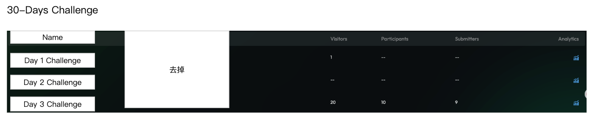

# Day Chain需求文档

## 目录

- [需求背景](#需求背景)
- [需求详情](#需求详情)
  - [1. B端](#1-b端)
    - [1.1 B端列表页](#11-b端列表页)
    - [1.2 Day Challenge数据分析页面](#12-day-challenge数据分析页面)
    - [1.3 Day Challenge状态管理](#13-day-challenge状态管理)
  - [2. C端样式](#2-c端样式)
- [技术实现要点](#技术实现要点)
  - [时间控制机制](#时间控制机制)
  - [依赖关系管理](#依赖关系管理)
  - [用户体验设计](#用户体验设计)
- [业务流程说明](#业务流程说明)
  - [项目方操作流程](#项目方操作流程)
  - [用户参与流程](#用户参与流程)

---

## 需求背景

Day Chain是为了满足项目方设置按照时间解锁不同任务的情景。

为了更好的复用性，每一天设定为一个Task Chain。

## 需求详情

### 1. B端

#### 1.1 B端列表页

**图片说明：** 此图展示了B端Day Chain管理界面的实际布局。页面采用深色背景，顶部显示"30-Days Challenge"的Sector标题。主体区域是一个水平滚动的卡片容器，包含多个Day Challenge卡片，每个卡片显示如"Day 1 Challenge"、"Day 2 Challenge"等名称，并带有各自的状态标识和操作按钮。卡片采用统一的设计风格，有明确的边框和圆角。右侧有一个突出显示的"+ Add New Day"按钮，用于添加新的日挑战。整个界面布局清晰，便于项目方直观管理整个30天挑战系列。

点击Add 30-days Challenge，会自动添加1个Sector，名字叫30-Days
Challenge，最开始Sector下面只有一个卡片叫Add New Day；

点击Add New Day，会创建一个Task Chain，打开一个新的Task Chain创建页面；

名字固定为Day 1 Challenge，不可编辑；

时间默认为直接开始和永不结束，并且不可编辑；

再次Add New Day，会创建一个Day 2 Challenge，依次类推，最多创建Day 30
Challenge；

Day 2 Challenge必须在完成Day 1 Challenge之后的1天才会解锁，以此类推，Day
3 必须在完成Day 2的1天后解锁；

时间必须连续，如果Publish Day 3 Challenge，必须保证Day 1和Day
2都Publish了，否则会弹窗

点击Publish All，会把所有之前的日期都一起Publish

> 
> 
> **图片说明：** 此图展示了Day Challenge发布确认弹窗的具体界面。弹窗采用白色背景的模态设计，标题区域显示警告图标和相关提示信息。弹窗主体内容区域包含详细的操作说明文字，解释发布操作对前置Day Challenge的影响和依赖关系。底部是两个对比鲜明的操作按钮："Cancel"（取消）按钮通常为次要样式，"Publish All"（全部发布）按钮为主要操作样式，通常为蓝色或高亮显示。弹窗外部背景呈现半透明的遮罩效果，确保用户聚焦于当前操作。

如果Delist Day 1
Challenge，必须保证后面所有的Day都Delist或者End了，否则会弹窗

点击Delist All或者End All，会把所有之后日期都一起Delist或者End

> 
> 
> **图片说明：** 此图展示了Day Challenge下架确认弹窗的实际界面。弹窗同样采用白色背景的模态设计，保持与发布弹窗一致的视觉风格。标题区域包含警告或提示图标，明确标识这是一个重要操作。弹窗主体部分显示详细的操作说明文本，解释下架操作的连锁影响和后续Day Challenge的处理规则。底部操作区域包含"Cancel"（取消）按钮和"Delist All"或"End All"（全部下架/结束）的确认按钮，按钮样式与发布弹窗保持一致。整个弹窗设计遵循统一的UI规范，确保用户体验的一致性。

删除Sector就会一起delist所有的day challenge

编辑Sector可以更改名字和描述

Day Challenge不能被Move to其他Sector，直接不展示这个按钮

点击Day Challenge的数据分析按钮，进入Day Challenge数据分析页面

#### 1.2 Day Challenge数据分析页面

**图片说明：** 此图展示了Day Challenge数据分析页面的表格界面设计。页面采用清晰的表格布局，表头行包含五个主要列：Name（名称）、Visitors（访问者）、Participants（参与者）、Submitters（提交者）和Analytics（分析）。表格内容区域显示多行数据，每一行代表一天的Challenge记录，各列显示相应的数值统计。表格采用了斑马纹设计（隔行变色）以提高可读性。Analytics列显示为可点击的链接或按钮样式，用于跳转到详细分析页面。整个表格界面简洁专业，数据展示清晰有序。

展示每一天的Challenge列表，字段为name、visitors、participants、submitters、analytics；

点击analytics，跳转到这一天的数据分析页面，就是对应的task
chain数据分析页面；

#### 1.3 Day Challenge状态管理

Day Challenge具有以下几种状态：

- **Draft（草稿）**：刚创建但未发布的状态
- **Upcoming（即将开始）**：已发布但未到开始时间
- **Ongoing（进行中）**：用户可以参与完成任务的状态
- **Ended（已结束）**：任务已结束，不再接受新的参与

状态转换规则：
- Draft → Upcoming：通过发布操作
- Upcoming → Ongoing：到达开始时间自动转换
- Ongoing → Ended：管理员手动结束或到达结束时间

### 2. C端样式

**图片说明：** 此图展示了C端用户看到的Day Chain界面的完整布局。页面顶部是导航栏和用户信息区域，显示用户等级、经验值等信息。主体内容区域上方有一个Onboarding任务的介绍区域，包含任务描述和参与按钮。下方是Day Chain的核心展示区域，水平排列显示了Day 1、Day 2、Day 3等多个挑战卡片。Day 1 Challenge显示为可参与状态（无锁定图标），而Day 2、Day 3等后续挑战明确显示了锁定图标，并附有"Complete the Day X challenge, then wait until next day to unlock"的提示文字。每个卡片还显示奖励信息和剩余参与名额。整个界面清晰地传达了时间顺序解锁的机制。

复用Task Chain的卡片样式，只是增加了锁定效果；

每天0点 UTC+0，更新任务锁定状态；

## 技术实现要点

### 时间控制机制
- 系统需要实现精确的时间控制，确保Day Challenge按照预设的时间顺序解锁
- 使用UTC+0时区作为全球统一的时间基准
- 每日0点自动更新所有用户的任务锁定状态

### 依赖关系管理
- 严格的前后依赖关系：Day N只能在完成Day N-1后的1天解锁
- 发布和下架操作的连锁检查机制
- 数据一致性保证：确保不会出现跳跃式的任务状态

### 用户体验设计
- 清晰的视觉反馈：锁定状态的图标和提示
- 进度展示：让用户了解整个30天挑战的进展情况
- 激励机制：通过逐步解锁营造期待感和成就感

---

## 业务流程说明

### 项目方操作流程
1. **创建30天挑战**：点击"Add 30-days Challenge"创建新的挑战系列
2. **配置日挑战**：逐一添加Day 1到Day 30的具体挑战内容
3. **设置依赖关系**：系统自动设置时间解锁依赖
4. **发布管理**：按顺序发布挑战，确保连续性
5. **数据监控**：通过数据分析页面监控用户参与情况

### 用户参与流程
1. **发现挑战**：在C端界面看到30天挑战
2. **开始第一天**：完成Day 1 Challenge获得奖励
3. **等待解锁**：等待24小时后Day 2自动解锁
4. **持续参与**：逐日完成挑战，培养习惯
5. **获得成就**：完成整个30天挑战系列

---

**注：** 本文档描述了Day Chain功能的完整需求，该功能将与Task Chain和白标系统无缝集成，为项目方提供强大的时间序列任务管理能力。
