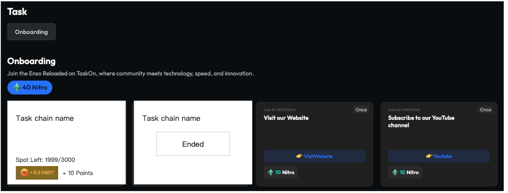

# Task Chain需求文档

## 目录

- [需求背景](#需求背景)
- [需求详情](#需求详情)
  - [1. B端配置Task Chain](#1-b端配置task-chain)
    - [1.1 新建Task Chain](#11-新建task-chain)
    - [1.2 Task Chain卡片上的各种功能](#12-task-chain卡片上的各种功能)
    - [1.3 Task Chain数据分析](#13-task-chain数据分析)
  - [2. C端Task Chain](#2-c端task-chain)
    - [2.1 列表页](#21-列表页)
    - [2.2 Task Chain Detail页](#22-task-chain-detail页)

---

## 需求背景

Task
Chain是为了满足项目方在GTC中配置多步骤task的需求，并希望采用Action的UI样式呈现，用户体验较好。

在设计上，目前希望复用Quest的B端设置流程和Action的C端样式。

Task Chain会同时应用在GTC和白标GTC中。

## 需求详情

### 1. B端配置Task Chain

**图片说明：** 此图展示了B端任务管理界面的完整布局。页面顶部是深色导航栏，主体内容区域显示"Community Tasks"模块。在任务列表区域的右上角位置，可以看到两个操作按钮："Add New Task"和"Add Task Chain"，这两个按钮样式一致，以蓝色或高亮色彩显示。下方是任务列表展示区域，显示已创建的各种任务卡片。整个界面保持了一致的设计风格，新增的"Add Task Chain"按钮与现有界面完美融合。

之前Add New Task的位置，变成了两个按钮，加了一个Add Task Chain；

点击Add Task Chain，打开一个新tab，新建Task Chain；

#### 1.1 新建Task Chain

新建Task Chain的流程最大程度复用Quest，步骤如下。

##### 1.1.1 Task Chain Info

**图片说明：** 此图展示了Task Chain信息配置页面的详细界面。页面采用经典的左右分栏布局，左侧配置面板包含多个表单字段：顶部有Name（名称）输入框，下方是Description（描述）的大文本框，再下方是时间设置区域，包含"Start Immediately"和"No End Time"两个切换开关。右侧是实时预览面板，显示Task Chain在用户端的实际展示效果，包括标题、描述和时间信息的呈现。整个页面设计简洁专业，配置选项清晰明了。

需要填写name、description和时间，时间默认是Start Immediately和No End
Time，此时意味着发布后立刻开始，并且没有结束时间；

如果项目方关闭了Start Immediately，则可以手动设置开始时间；

如果项目方关闭了No End Time，则可以手动设置结束时间；

所有校验规则与Quest相同；

编辑name和description会联动右边的预览；

##### 1.1.2 Rewards

**图片说明：** 此图展示了Task Chain奖励配置页面的界面。页面延续左右分栏布局，左侧配置区域显示两个固定的奖励类型：Token奖励（FCFS模式）和Points奖励（Open to All模式）。每个奖励类型都有对应的开关控制和数值设置字段。右侧预览区域实时显示配置的奖励信息，展示用户最终看到的奖励效果。整体设计简洁明了，突出了Task Chain奖励的固定配置特性。

Rewards无法选择发奖方式，固定为1个FCFS的Token奖励+1个OpentoAll的Points奖励，项目方可以关闭任意一个，但至少保留一个；

编辑奖励会联动右边的预览；

如果只有points奖励，则不展示Spot Left字段，因为奖励是无限的；

##### 1.1.3 Tasks

**图片说明：** 此图展示了Task Chain任务配置页面的界面布局。页面继续采用左右分栏设计，左侧为任务配置区域，显示多个任务类型的选择按钮或卡片，用于添加不同类型的任务到Task Chain中。右侧预览区域展示已配置任务的效果。页面底部或相应区域提供添加任务的操作入口。整个界面设计与Quest的任务配置页面保持一致，但去除了特定的社区任务选项。

去掉join community这个任务；

不设置任何默认task；

去掉including taskon community task这个选项；

其他保持与quest相同；

##### 1.1.4 Eligibility

**图片说明：** 此图展示了Task Chain资格设置页面的界面。页面保持左右分栏布局，左侧为资格条件配置区域，包含多个资格设置选项，如代币持有量、社交媒体关注、特定NFT持有等条件的设置界面。每个条件都有对应的开关控制和参数设置字段。右侧预览区域显示资格要求对用户的实际展示效果。页面设计与Quest的资格设置页面基本一致，但相关文案更新为Task Chain相关术语。

文案要改一下，把quest替换成task chain，其他不变；

##### 1.1.5 Preview&Publish

**图片说明：** 此图展示了Task Chain预览发布页面的完整界面。页面顶部显示Task Chain的基本信息预览，包括标题、描述、奖励等关键信息。中间主体区域展示Task Chain在C端的实际样式效果，用户可以看到任务链的具体呈现方式。页面底部或侧边提供导航控件，允许在不同任务之间切换预览。整体页面设计让项目方能够全面检查Task Chain的最终效果后再进行发布。

预览页面头部复用quest的预览头部，下面是task
chain的C端样式，可以来回切换页面查看任务；

点击Publish，就发布了；

发布之后，自动跳转回到Community Tasks页面；

#### 1.2 Task Chain卡片上的各种功能

Edit

Draft和Upcoming状态下，Edit直接进入与新建Task Chain相同的页面进行编辑；

Ongoing状态下，点击Edit按照Ongoing Quest的编辑权限处理；

Delist：下架Task Chain，C端不能看见这个Task Chain，也不能继续做；

Duplicate：复制一个，名字按照现有规则加个Copy字样；

End：提前结束Task Chain；

Copy Link：复制链接，C端打开的时候要直接打开C端详情页面；

Results：跳转Task Chain数据分析页面；

Delete：与quest逻辑相同，draft可以删除，upcoming和ongoing不展示这个按钮；

Move To：变更到另一个Sector；

拖拽排序：与Task卡片拖拽逻辑相同；

#### 1.3 Task Chain数据分析

复用Quest的数据分析detail页，只是里面的所有Quest文案要变更为Task Chain；

Billy补充一下。

### 2. C端Task Chain

#### 2.1 列表页

**图片说明：** 此图展示了C端Task Chain列表页的卡片展示效果。页面显示多个Task Chain卡片，每个卡片显示任务链的名称、奖励信息（如Token数量、Points等）和剩余名额。卡片采用与普通Task相似的尺寸，但在视觉设计上通过特定的样式元素（如图标、布局等）体现出这是一个包含多步骤的任务链。卡片整体设计简洁明了，突出显示关键信息以吸引用户参与。

Task Chain的卡片大小和Task卡片保持一致；

展示信息：

Name

Spot Left

奖励

样式上看起来是包含多个task

点击打开弹屏，类似Action，进入Task Chain Detail页

如果奖励领光了，或者活动结束了，展示为Ended样式

#### 2.2 Task Chain Detail页

**图片说明：** 此图展示了Task Chain详情页的界面布局。页面顶部显示Task Chain的整体信息，中间主体区域展示当前步骤的具体任务内容，采用与Quest任务相同的展示样式。页面底部有导航控制区域，包含"Back"和"Next"按钮用于在不同任务步骤间切换。整个界面设计清晰地体现了分步骤完成任务的概念，当前任务完成验证后会自动进入下一步骤。

按照B端设置时的顺序，每个步骤展示1个Task，样式和Quest中task样式保持一致；

Task Verify通过后，自动跳到下一步骤；

用户可以通过Next和Back切换展示的task

第一个task没有Back

最后一个Task没有Next

只有一个Task，两个按钮都没有

所有Task
Verify通过后，进入奖励领取页面，只有token和points两种奖励，都复用Action

> 
> 
> **图片说明：** 此图展示了Task Chain完成后的奖励领取页面界面。页面采用庆祝式的设计风格，顶部显示完成祝贺信息，中间区域展示可领取的奖励项目，包括Token和Points两种奖励类型，每种奖励都有相应的数量显示和领取按钮。页面底部可能包含额外的操作选项。整体设计复用了Action的奖励页面样式，保持了平台的设计一致性。
