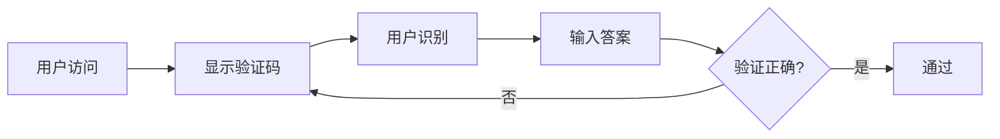
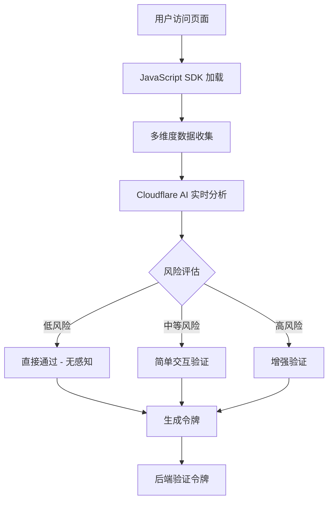
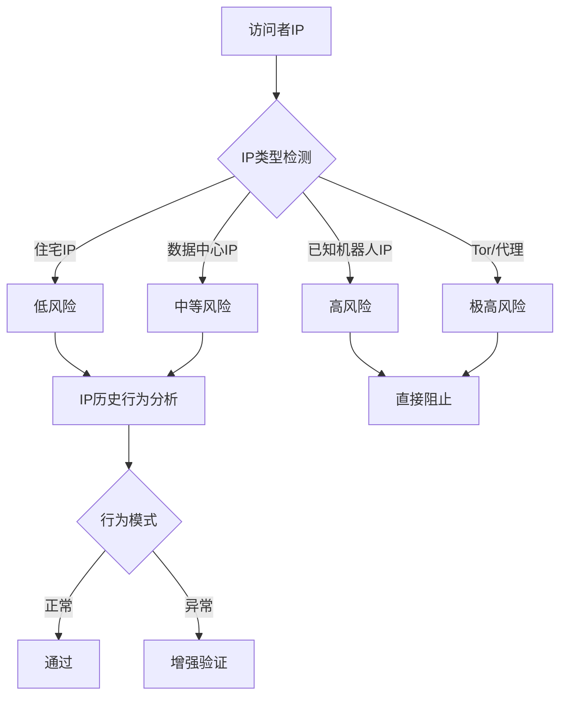
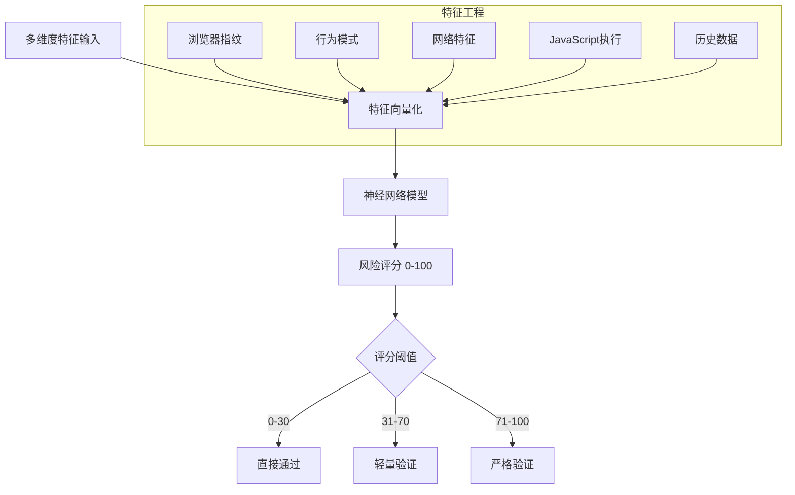
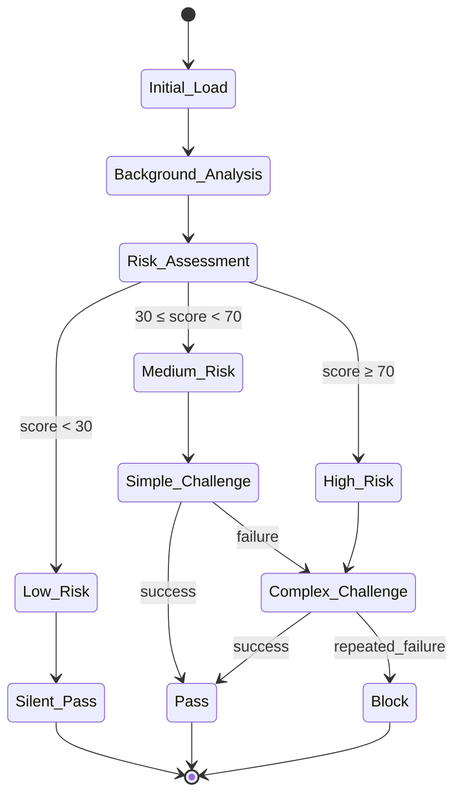
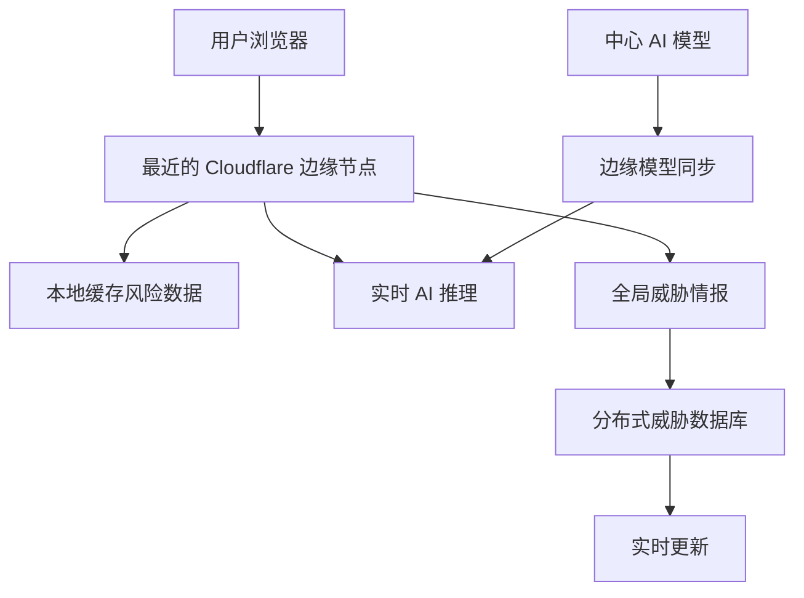
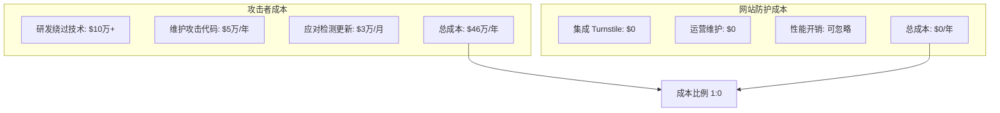

# Cloudflare Turnstile 核心原理解析

## 🧠 核心理念：从"挑战-响应"到"行为分析"

### 传统 CAPTCHA 的问题


**传统CAPTCHA问题：**
- 😤 用户体验差：强制所有用户解决难题
- 🤖 机器人进化：AI 已能解决大部分视觉验证码
- ♿ 无障碍性差：对视觉/听觉障碍用户不友好
- 📱 移动端困难：小屏幕上难以操作

### Turnstile 的革命性方法


## 🔍 多维度检测技术

### 1. 浏览器指纹识别
**收集的信息：**
```javascript
// 示例：Turnstile 可能收集的浏览器特征
const browserFingerprint = {
    userAgent: navigator.userAgent,
    platform: navigator.platform,
    language: navigator.language,
    timezone: Intl.DateTimeFormat().resolvedOptions().timeZone,
    screenResolution: `${screen.width}x${screen.height}`,
    colorDepth: screen.colorDepth,
    installedPlugins: navigator.plugins.length,
    canvasFingerprint: generateCanvasFingerprint(),
    webglFingerprint: generateWebGLFingerprint(),
    audioFingerprint: generateAudioFingerprint(),
    fontList: detectFonts(),
    cookiesEnabled: navigator.cookieEnabled,
    storageSupport: checkStorageSupport(),
    touchSupport: 'ontouchstart' in window
}
```

**指纹分析原理：**
- 🎯 **设备唯一性**：每个真实设备都有独特的硬件/软件组合
- 🤖 **机器人特征**：自动化工具通常有相似的指纹模式
- 📊 **统计异常**：大量相同指纹 = 可疑活动

### 2. 行为模式分析
**鼠标/触摸行为：**
```javascript
// 示例：行为数据收集
const behaviorData = {
    mouseMovements: [
        {x: 100, y: 150, timestamp: 1640995200000},
        {x: 102, y: 152, timestamp: 1640995200050},
        // ... 轨迹数据
    ],
    clickPatterns: {
        clickTiming: [150, 200, 180], // 点击间隔(毫秒)
        clickPressure: [0.8, 0.7, 0.9], // 触摸压力
        clickAccuracy: 0.95 // 点击精确度
    },
    keyboardDynamics: {
        typingSpeed: 240, // WPM
        keystrokeInterval: [100, 120, 90], // 按键间隔
        typingRhythm: 'natural' // 节奏模式
    },
    scrollBehavior: {
        scrollSpeed: 'variable',
        scrollPattern: 'organic',
        pauseFrequency: 'normal'
    }
}
```

**人类 vs 机器人行为特征：**

| 特征维度 | 人类用户 | 机器人 |
|---------|---------|--------|
| **鼠标轨迹** | 平滑曲线，微小抖动 | 直线，完美路径 |
| **点击时机** | 随机延迟，自然节奏 | 精确间隔，机械化 |
| **页面交互** | 阅读停顿，自然浏览 | 快速跳转，目标明确 |
| **设备传感器** | 陀螺仪数据，环境光 | 缺失或模拟数据 |

### 3. 网络行为分析
**IP 信誉系统：**


**网络模式识别：**
- 🌐 **地理位置一致性**：IP地理位置与用户行为匹配
- 📡 **连接特征**：ISP类型、延迟模式、MTU大小
- 🔄 **请求模式**：访问频率、会话持续时间
- 🛡️ **威胁情报**：已知恶意IP库、机器人网络识别

### 4. JavaScript 执行环境检测
**无头浏览器检测：**
```javascript
// 检测自动化工具的典型方法
const detectionChecks = {
    // WebDriver 检测
    webDriverPresent: !!window.webdriver || !!window.navigator.webdriver,

    // PhantomJS 检测
    phantomJS: !!window.callPhantom || !!window._phantom,

    // Selenium 检测
    seleniumPresent: !!window.selenium || !!document.$cdc_asdjflasutopfhvcZLmcfl_,

    // Chrome headless 检测
    chromeHeadless: /HeadlessChrome/.test(navigator.userAgent),

    // 插件检测
    pluginMismatch: navigator.plugins.length === 0 && navigator.mimeTypes.length === 0,

    // 时间差异检测
    performanceTimingGap: checkPerformanceTiming(),

    // DOM 渲染检测
    fakeDOMElements: checkForFakeElements(),

    // 事件监听器检测
    eventListenerCount: getEventListenerCount()
}
```

**JavaScript 沙箱挑战：**
```javascript
// 示例：计算挑战（简化版）
function cryptographicChallenge() {
    // 1. CPU密集型计算
    const startTime = performance.now()
    let result = 0
    for(let i = 0; i < 100000; i++) {
        result += Math.sin(i) * Math.cos(i)
    }
    const executionTime = performance.now() - startTime

    // 2. 内存模式测试
    const memoryPattern = new Array(1000).fill(0).map(() => Math.random())

    // 3. GPU 指纹
    const canvas = document.createElement('canvas')
    const gl = canvas.getContext('webgl')
    const gpuInfo = gl.getExtension('WEBGL_debug_renderer_info')

    return {
        computeTime: executionTime,
        memoryHash: hashArray(memoryPattern),
        gpuRenderer: gl.getParameter(gpuInfo.UNMASKED_RENDERER_WEBGL),
        gpuVendor: gl.getParameter(gpuInfo.UNMASKED_VENDOR_WEBGL)
    }
}
```

## 🧮 AI 驱动的风险评分系统

### 机器学习模型


**模型特点：**
- 🤖 **实时学习**：基于全球流量不断更新模型
- 🎯 **个性化**：针对不同网站类型优化
- ⚡ **低延迟**：毫秒级评分响应
- 🛡️ **对抗训练**：针对新型攻击自动适应

### 风险评分算法（简化版）
```python
def calculate_risk_score(features):
    score = 0

    # 1. 浏览器指纹风险 (权重: 25%)
    if features['browser_entropy'] < 0.3:  # 过于常见的配置
        score += 25
    elif features['browser_entropy'] > 0.9:  # 过于独特可能是伪造
        score += 15

    # 2. 行为模式风险 (权重: 30%)
    if features['mouse_trajectory_straightness'] > 0.95:  # 过于完美的轨迹
        score += 30
    if features['click_timing_variance'] < 0.1:  # 机械化点击
        score += 20

    # 3. 网络信誉风险 (权重: 20%)
    if features['ip_type'] == 'datacenter':
        score += 15
    if features['ip_in_botnet_db']:
        score += 50

    # 4. JavaScript 执行风险 (权重: 25%)
    if features['webdriver_detected']:
        score += 40
    if features['compute_time_anomaly'] > 2.0:  # 异常的执行时间
        score += 20

    return min(score, 100)  # 最高100分
```

## 🔄 动态防御机制

### 自适应挑战升级


### 挑战类型演进
**第一层：无感知验证**
- ✅ 后台 JavaScript 计算
- ✅ 设备指纹验证
- ✅ 行为模式匹配

**第二层：轻量交互**
- 🔘 简单的勾选框
- 🔄 短暂的加载验证
- 🎯 单次点击确认

**第三层：增强挑战**
- 🧩 图像识别任务
- 🔤 扭曲文字识别
- 🎨 空间推理验证

## ⚡ 性能优化策略

### 边缘计算架构


**关键优化：**
- 🌍 **全球分布**：200+ 数据中心就近处理
- ⚡ **毫秒响应**：边缘 AI 推理
- 🔄 **实时同步**：威胁情报秒级更新
- 💾 **智能缓存**：已知用户快速通过

## 🛡️ 对抗机器人的核心优势

### 1. 成本不对等
**攻击者成本：**
- 💰 需要模拟复杂的人类行为
- 🔧 需要绕过多层检测机制
- ⏱️ 需要投入大量开发时间
- 🔄 需要持续更新绕过方法

**防御者成本：**
- 🆓 集成简单，几行代码
- 🤖 AI 自动学习和适应
- ⚡ 性能开销极小
- 🔒 全球威胁情报共享

### 2. 检测深度
```python
# 传统 CAPTCHA：单点检测
def traditional_captcha():
    answer = user_input()
    return answer == correct_answer  # 二元判断

# Turnstile：多维度连续评分
def turnstile_detection():
    features = {
        'browser_fingerprint': analyze_browser(),
        'behavior_pattern': analyze_behavior(),
        'network_reputation': check_ip_reputation(),
        'js_environment': analyze_js_execution(),
        'historical_data': lookup_user_history()
    }

    risk_score = ai_model.predict(features)
    confidence = calculate_confidence(features)

    return {
        'decision': get_challenge_level(risk_score),
        'confidence': confidence,
        'reason': explain_decision(features)
    }
```

### 3. 进化能力
- 📊 **数据驱动**：基于全球攻击数据训练
- 🧠 **持续学习**：新攻击模式自动识别
- 🔄 **快速适应**：小时级模型更新
- 🎯 **精准定向**：针对特定攻击类型优化

## 🔬 技术实现细节

### 客户端采集代码（简化版）
```javascript
class TurnstileAnalyzer {
    constructor() {
        this.features = {}
        this.startTime = performance.now()
    }

    collectBrowserFingerprint() {
        this.features.browser = {
            userAgent: navigator.userAgent,
            language: navigator.language,
            platform: navigator.platform,
            cookieEnabled: navigator.cookieEnabled,
            doNotTrack: navigator.doNotTrack,
            hardwareConcurrency: navigator.hardwareConcurrency,
            maxTouchPoints: navigator.maxTouchPoints,
            deviceMemory: navigator.deviceMemory,
            // ... 更多指纹特征
        }
    }

    trackMouseBehavior() {
        let mouseData = []

        document.addEventListener('mousemove', (e) => {
            mouseData.push({
                x: e.clientX,
                y: e.clientY,
                timestamp: performance.now()
            })
        })

        this.features.mouse = {
            trajectory: mouseData,
            velocity: this.calculateVelocity(mouseData),
            acceleration: this.calculateAcceleration(mouseData),
            jitter: this.calculateJitter(mouseData)
        }
    }

    performComputeChallenge() {
        const challenges = [
            this.cryptoChallenge(),
            this.canvasRenderingChallenge(),
            this.webglChallenge(),
            this.audioContextChallenge()
        ]

        this.features.compute = {
            results: challenges,
            executionTime: performance.now() - this.startTime,
            memoryUsage: this.estimateMemoryUsage()
        }
    }

    generateToken() {
        const payload = {
            features: this.features,
            timestamp: Date.now(),
            userAgent: navigator.userAgent,
            referrer: document.referrer
        }

        // 加密并返回 token
        return this.encryptPayload(payload)
    }
}
```

### 服务端验证流程
```python
class TurnstileVerifier:
    def __init__(self):
        self.ai_model = load_risk_assessment_model()
        self.threat_db = ThreatIntelligenceDB()

    def verify_token(self, token, client_ip):
        # 1. 解密和验证 token
        payload = self.decrypt_token(token)
        if not self.validate_token_integrity(payload):
            return {'success': False, 'reason': 'invalid_token'}

        # 2. 提取特征
        features = self.extract_features(payload, client_ip)

        # 3. AI 风险评估
        risk_score = self.ai_model.predict([features])

        # 4. 威胁情报检查
        threat_level = self.threat_db.check_ip(client_ip)

        # 5. 综合决策
        final_score = self.combine_scores(risk_score, threat_level)

        return {
            'success': final_score < THRESHOLD,
            'score': final_score,
            'challenge_ts': payload.timestamp,
            'hostname': self.get_hostname(payload)
        }
```

## 📊 效果对比

### 传统 CAPTCHA vs Turnstile

| 维度 | 传统 CAPTCHA | Cloudflare Turnstile |
|------|-------------|---------------------|
| **用户体验** | 😤 中断式，强制解题 | 😊 无感知，智能判断 |
| **准确率** | 📉 70-85% (AI 可破解) | 📈 95%+ (多维度检测) |
| **性能影响** | ⚡ 轻微 | ⚡ 极轻微 |
| **无障碍性** | ♿ 较差 | ♿ 优秀 |
| **成本** | 💰 中等 | 🆓 免费 |
| **维护工作** | 🔧 需要更新题库 | 🤖 自动更新 |

### 攻防成本对比


## 🔮 未来发展方向

### 1. 更智能的 AI 检测
- 🧠 **大语言模型**：理解用户意图和上下文
- 🎯 **个性化模型**：为每个网站定制检测策略
- 🔄 **联邦学习**：保护隐私的分布式训练

### 2. 生物特征集成
- 👁️ **眼动追踪**：WebRTC 实现的视线分析
- 📱 **传感器数据**：陀螺仪、加速度计模式
- 🗣️ **语音识别**：自然语音与合成语音区分

### 3. 隐私保护增强
- 🔐 **零知识证明**：验证用户真实性而不泄露信息
- 🌐 **边缘计算**：本地处理敏感数据
- 🛡️ **差分隐私**：保护个人行为模式

## 💡 总结

Cloudflare Turnstile 的核心创新在于：

1. **从单点检测到全方位分析**：不再依赖单一的视觉验证码，而是综合分析用户的数字行为指纹

2. **从静态规则到动态学习**：使用 AI 模型持续学习新的攻击模式，自动适应威胁演进

3. **从中断式到无感知**：让安全验证在后台进行，为正常用户提供无缝体验

4. **从成本对等到成本不对等**：让攻击者的成本远高于防御者的成本

**本质上，Turnstile 是将"证明你是人类"的问题，转换为"证明你不是机器人"的问题** —— 这看似细微的差别，却带来了用户体验和安全性的革命性提升。