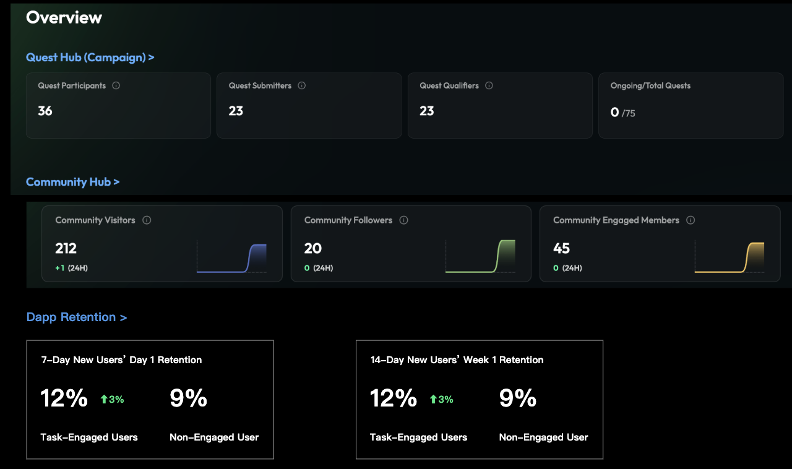
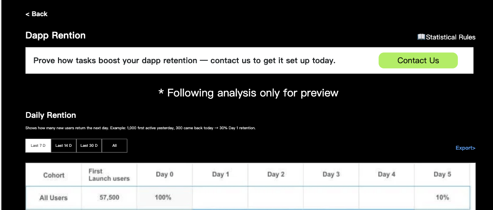
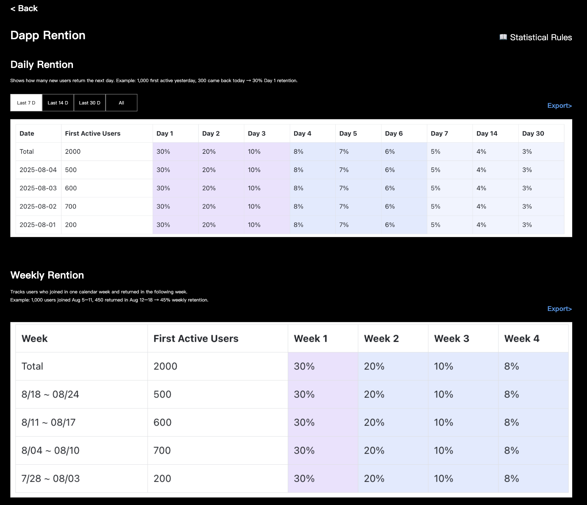
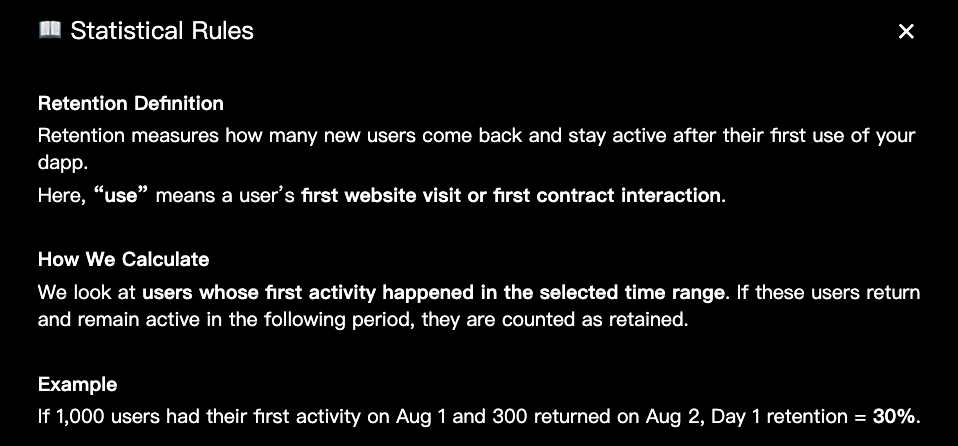
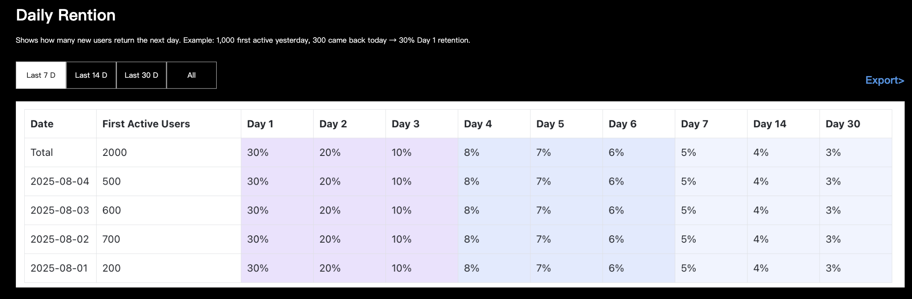
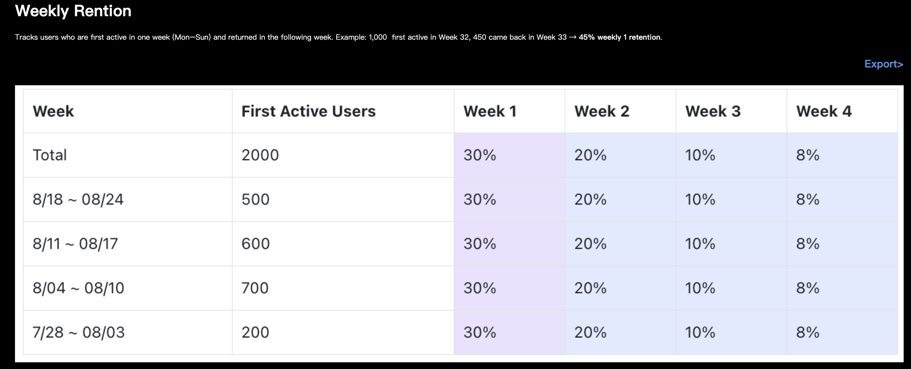

# 产品留存数据分析

## 目录

- [需求背景](#需求背景)
- [需求概览](#需求概览)
- [需求描述](#需求描述)
  - [1. 功能入口](#1-功能入口)
  - [2. 分析详情页(预览状态)](#2-分析详情页预览状态)
  - [3. 数据统计](#3-数据统计)
  - [4. 分析详情页(有数据状态)](#4-分析详情页有数据状态)
    - [4.1 日留存率](#41-日留存率)
    - [4.2 周留存率](#42-周留存率)

---

## 需求背景

项目方希望验证任务对用户增长的实际价值。为此，需要一个功能来对比
**做任务用户** 与 **没做任务用户** **留存率**，并剔除老用户干扰。

## 需求概览

在 Analytics 功能下增加 Dapp Retention 模块

项目方通过线下沟通对接需要过滤的老用户数据(可选)

计算用户使用产品的日留存和周留存数据

## 需求描述

需求描述按用户的使用流程说明.

### 1. 功能入口

在 Analytics 功能下增加 Dapp Retention 模块

**图片说明：** 此图展示了Analytics功能的模块选择界面。页面采用深色背景，顶部有导航栏。主体区域以网格卡片形式展示各种分析模块，包括"Campaign Analytics"、"Task Analytics"、"User Analytics"等现有模块，以及新增的"Dapp Retention"模块。每个模块卡片显示图标、标题和简短描述文字。"Dapp Retention"卡片与其他模块保持一致的设计风格，采用相同的卡片尺寸和布局。整个界面设计简洁统一，新功能模块自然融入现有的分析工具生态。

点击 Dapp Retention 后进入分析详情页

仅针对白名单用户开放该功能入口

要补充未接入的样式.

### 2. 分析详情页(预览状态)

**图片说明：** 此图展示了Dapp Retention功能预览状态的完整页面布局。页面顶部显示"Dapp Retention"标题。中间是一个蓝色背景的提示横幅，包含"Prove how tasks boost dapp retention --- contact us to get it set up today."的文案，其中"contact us"显示为白色下划线的可点击链接样式。下方展示了两个示例数据区域：左侧是Daily Retention的数据表格预览，右侧是Weekly Retention的数据表格预览，都使用灰色占位符显示模拟数据。每个数据区域都有相应的说明文字和热力图样式的表格展示。整个页面设计专业，让用户能够清楚了解功能的实际效果。

当用户没接入之前, 使用预览状态样式

**横幅文案:**\
Prove how tasks boost dapp retention --- contact us to get it set up
today.

**交互逻辑:**

点击 contact us 后, 打开跳转链接: https://t.me/Taskonpremium

预览状态下, 需要提供假数据给用户查看这个板块下有数据的状态是什么样的.

### 3. 数据统计

**统计用户范围:**

剔除老用户, 仅分析新用户,
老用户范围通过线下沟通确认(可通过合约交互或手工清单确认)

使用 taskon 的 user_id 作为用户标识统计

**统计时间范围:**

开始分析的日期线下制定

**留存率计算规则：**

以用户首次使用应用的日期为 Day 0.
使用应用意味着用户完成以下任意一种行为:

访问网站 (依赖项目方接入 SDK 上报用户访问信息)

访问 iframe 网站

发起与客户提供的合约交互

计算日留存: 计算首次使用产品后的30天内的每日留存

Day 1 留存 → 第二天继续使用产品的用户数/ 首次使用产品的用户数

以此类推

计算周留存: 计算首次使用产品后的下一个自然周内是否有继续使用产品

Week 1 留存 → 第二个自然周继续使用产品的用户数/
第一个自然周有使用产品的的用户数

自然周定义: 从 周一 (Monday) 开始，到周日 (Sunday) 结束。

以此类推

最终得出的日留存和周留存数据如下:

日留存数据

| Date | First Active Users | Day1 | ... | Day30 |
|------|-------------------|------|-----|-------|
| 2025-08-01 | 500 | 300 | ... | 30 |
| 2025-08-02 | 600 | 400 | ... | 40 |
| 2025-08-03 | 700 | 200 | ... | 20 |
| 2025-08-04 | 200 | 100 | ... | 10 |
| ... | ... | ... | ... | ... |

周留存数据

| Week | First Active Users | Week 1 | ... | Week 4 |
|------|-------------------|--------|-----|--------|
| 7/28 ~ 08/03 | 500 | 300 | ... | 30 |
| 8/04 ~ 08/10 | 600 | 400 | ... | 40 |
| 8/11 ~ 08/17 | 700 | 200 | ... | 20 |
| 8/18 ~ 08/24 | 200 | 100 | ... | 10 |
| ... | ... | ... | ... | ... |

数据统计案例:

<table>
<tr>
<td valign="top">

**交互明细记录**

| **时间** | **活动类型** | **user_id** |
|----------|------------|-----------|
| 2025-07-20 | 合约交互 | B |
| 2025-08-01 | 白标任务系统上线 | - |
| 2025-08-01 | 访问网站 | A |
| ~~2025-08-01~~ | ~~访问网站~~ | ~~B~~ |
| 2025-08-01 | 访问网站 | C |
| 2025-08-01 | 访问 iframe | C |
| 2025-08-02 | 合约交互 | C |
| 2025-08-04 | 访问 iframe | A |

</td>
<td valign="top">

**第一步: 剔除老用户**

老用户定义: 以白标任务系统上线前与合约交互过就算老用户为例 (老用户也可以由项目方提供地址列表指定)

在此环节下, 过滤掉B用户, 不参与到后续的留存率分析

**第二步: 观察首次使用产品用户是否留存**

**日留存计算**

针对 2025-08-01 首次使用产品的用户计算 Day1 留存.

2025-08-01 首次使用产品的用户有: A 和 C

观察 A 和 C 在 2025-08-02 有没有使用过产品:
A用户没使用过, C与合约交互过, 所以C是留存用户.

**周留存计算**

针对 2025-08-01 首次使用产品的用户计算 Week1 留存.

2025-07-28 ~ 2025-08-03 首次使用产品的用户有: A 和 C

下一个自然周是: 2025-08-04 ~ 2025-08-10

A 在下一个自然周内活跃过, C没有. 因此A是 Week 1 留存用户

</td>
</tr>
</table>

### 4. 分析详情页(有数据状态)

**图片说明：** 此图展示了Dapp Retention功能的实际数据分析界面。页面顶部左侧显示"Dapp Retention"标题，右上角有"📖 Statistical Rules"的蓝色链接。页面主体垂直分为两个数据分析区域：上半部分是"Daily Retention"日留存率分析，下半部分是"Weekly Retention"周留存率分析。每个分析区域都包含功能说明文字、时间筛选下拉菜单（显示"Last 7D"等选项）、右上角的"Export"导出按钮，以及详细的数据表格。表格采用热力图设计，单元格根据留存率百分比高低显示从深蓝到浅蓝的渐变色彩，数值越高颜色越深。表格清晰展示了用户的留存数据趋势，整体界面设计专业且信息密度合理。

右上角是 📖 Statistical Rules, 点击后显示弹窗, 用来介绍统计规则的:

**图片说明：** 此图展示了Statistical Rules说明弹窗的界面设计。弹窗采用白色背景的模态设计，标题区域显示"Statistical Rules"。弹窗主体内容包含三个部分：Retention Definition（留存定义）、How We Calculate（计算方法）和Example（示例说明）。每个部分都有清晰的标题和详细的英文解释文字。弹窗设计简洁专业，字体层次分明，帮助用户深入理解留存率的统计逻辑和计算规则。

**弹窗文案内容:**

**Retention Definition**

Retention measures how many new users come back and stay active after their first use of your dapp.

Here, **"use"** means a user's **first website visit or first contract interaction**.

**How We Calculate**

We look at **users whose first activity happened in the selected time range**. If these users return and remain active in the following period, they are counted as retained.

**Example**

If 1,000 users had their first activity on Aug 1 and 300 returned on Aug 2, Day 1 retention = **30%**.

#### 4.1 日留存率

**图片说明：** 此图展示了Daily Retention日留存率数据表格的具体界面。顶部左侧有功能描述文字，左上角是时间筛选下拉菜单显示"Last 7D"选项，右上角是蓝色的"Export"导出按钮。主体是详细的数据表格，表头包含Date、First Active Users和Day 1-7、Day 14、Day 30等列。第一行是"Total"汇总数据，显示总体留存率统计。后续行按日期倒序排列，展示具体日期的数据。表格采用蓝色热力图设计，单元格颜色深浅代表留存率高低，数值以百分比形式显示（如30%、20%等）。表格设计清晰，便于快速比较不同时期的留存表现。

文案: Shows how many new users return the next day. Example: 1,000 first
active yesterday, 300 came back today → 30% Day 1 retention.

左上角是时间筛选器:

用于筛选出在该段时间内的首次活跃数据

提供 Last 7/14/30D 和 all 时间筛选器 (Last 7D 代表过去7天)

右上角是导出选项, 将表格里的数据导出成 csv 文件,
要把过去30天每一天的留存率数据都显示出来

如果没有数据的情况下, 显示: Data for this period is still accumulating.
No data available yet. 不显示导出按钮

展示留存率的表格数据使用以下格式:

第一行显示汇总值

First Active Users: 显示用户数

日期按倒序排, 新的排前面

留存率日期范围: Day 1\~7、 Day 14、 Day 30
(这里不需要显示全部天数的留存率, 不然太多了)

留存率单元格里显示向上取整后得出的百分比, 不需要保留小数点;
如果没有数据, 则显示为 -

单元格背景颜色希望可以按照数值的大到小, 从深到浅显示

| **Date** | **First Active Users** | **Day 1** | **Day 2** | **Day 3** | **Day 4** | **Day 5** | **Day 6** | **Day 7** | **Day 14** | **Day 30** |
|----------|------------------------|----------|----------|----------|----------|----------|----------|----------|-----------|-----------|
| Total | 2000 | 30% | 20% | 10% | 8% | 7% | 6% | 5% | 4% | 3% |
| 2025-08-04 | 500 | 30% | 20% | 10% | 8% | 7% | 6% | 5% | 4% | 3% |
| 2025-08-03 | 600 | 30% | 20% | 10% | 8% | 7% | 6% | 5% | 4% | 3% |
| 2025-08-02 | 700 | 30% | 20% | 10% | 8% | 7% | 6% | 5% | 4% | 3% |
| 2025-08-01 | 200 | 30% | 20% | 10% | 8% | 7% | 6% | 5% | 4% | 3% |

#### 4.2 周留存率

**图片说明：** 此图展示了Weekly Retention周留存率数据表格的具体界面。页面布局与日留存率保持一致，顶部左侧有功能描述文字，右上角是蓝色的"Export"导出按钮。数据表格表头包含Week、First Active Users、Week 1、Week 2、Week 3、Week 4等列。第一行显示"Total"汇总统计数据。后续行展示具体周期的数据，Week列显示日期范围格式（如"Aug 4 - Aug 10"、"Aug 11 - Aug 17"等）。表格同样采用蓝色热力图设计，根据留存率百分比显示不同深浅的蓝色，数值以百分比格式展示。整个表格设计与日留存率保持视觉一致性，便于用户进行周期性数据分析对比。

文案: Tracks users who joined in one calendar week and returned in the
following week. Example: 1,000 users joined Aug 4--10, 450 returned in
Aug 11--17 → 45% Week 1 retention.

右上角是导出选项, 将表格里的数据导出成 csv 文件

展示留存率的表格数据使用以下格式:

第一行显示汇总值

First Active Users: 显示用户数

周按倒序排, 新的排前面

留存率日期范围: Week1 \~4

留存率单元格里显示向上取整后得出的百分比, 不需要保留小数点;
如果没有数据, 则显示为 -

单元格背景颜色希望可以按照数值的大到小, 从深到浅显示

| **Week** | **First Active Users** | **Week 1** | **Week 2** | **Week 3** | **Week 4** |
|----------|------------------------|-----------|-----------|-----------|-----------|
| Total | 2000 | 30% | 20% | 10% | 8% |
| 8/18 ~ 08/24 | 500 | 30% | 20% | 10% | 8% |
| 8/11 ~ 08/17 | 600 | 30% | 20% | 10% | 8% |
| 8/04 ~ 08/10 | 700 | 30% | 20% | 10% | 8% |
| 7/28 ~ 08/03 | 200 | 30% | 20% | 10% | 8% |
