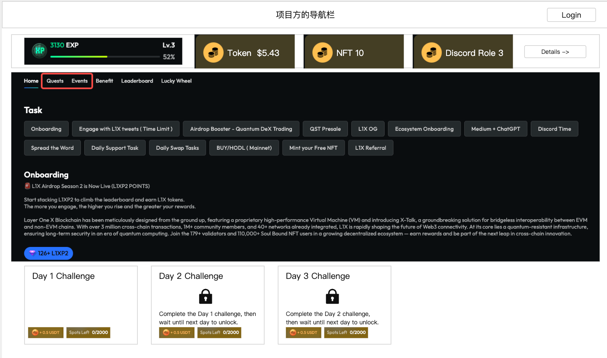
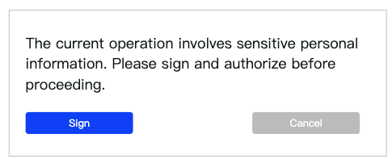
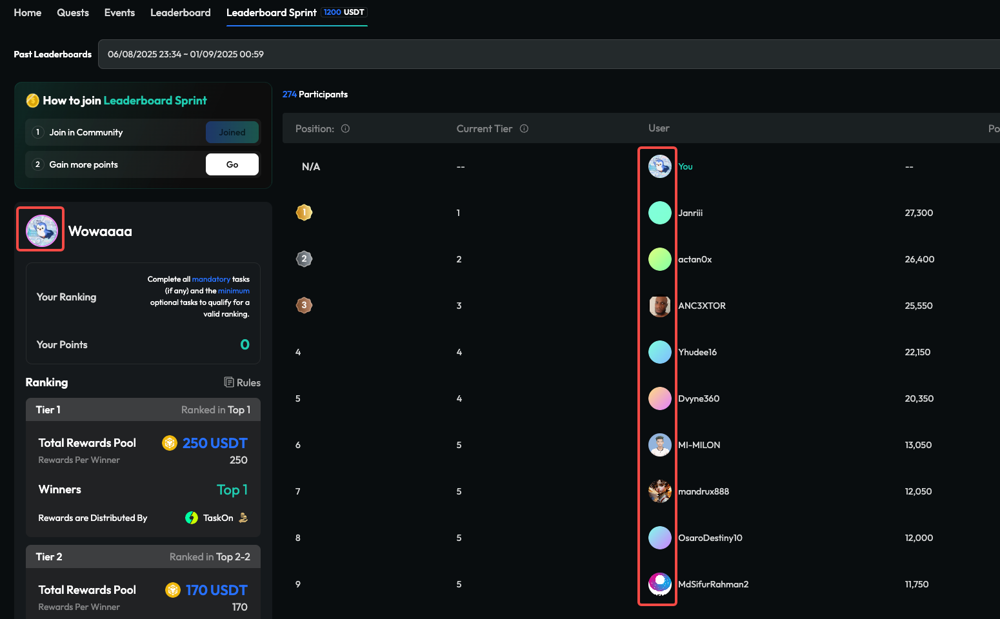
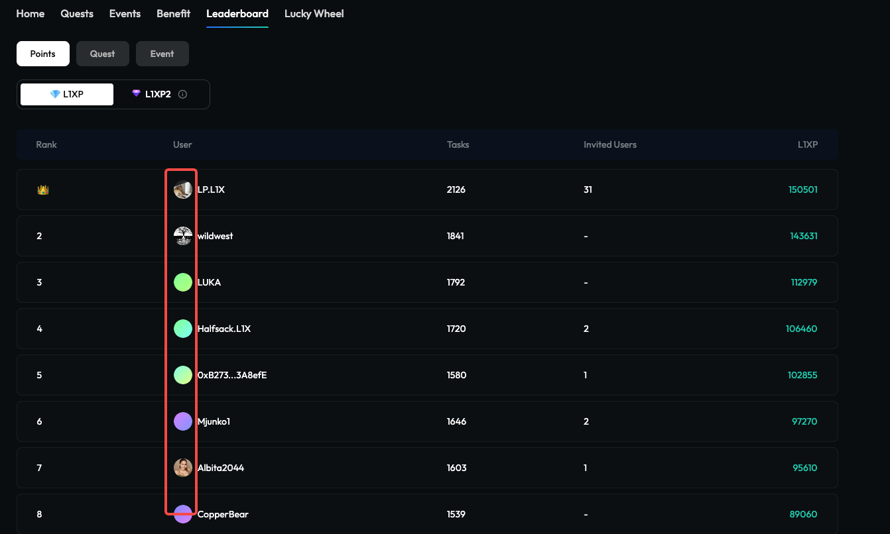
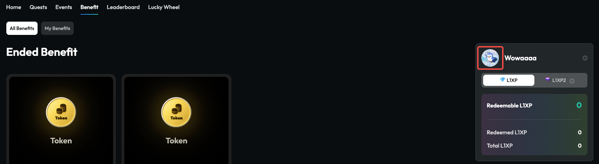
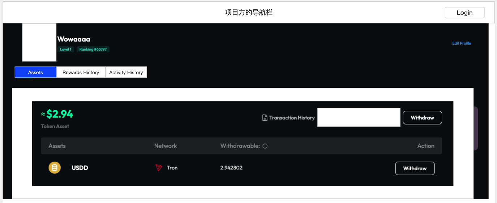
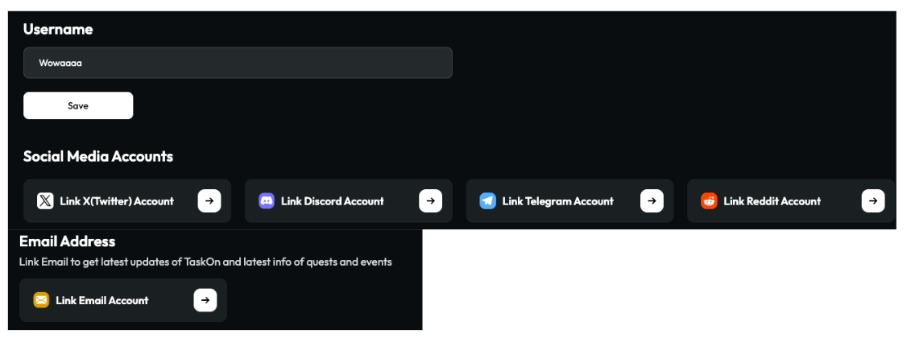

# 白标全流程需求

## 目录

- [需求背景](#需求背景)
- [需求详情](#需求详情)
  - [1. 嵌入项目方网站](#1-嵌入项目方网站)
    - [1.1 去掉所有的头像元素](#11-去掉所有的头像元素)
    - [1.2 去掉右边的微型个人中心](#12-去掉右边的微型个人中心)
    - [1.3 GTC个人中心](#13-gtc个人中心)
    - [1.4 白标版Profile页面](#14-白标版profile页面)

---

## 需求背景

目前的白标方案，只是把GTC页面挂在项目方的域名上，从用户体验的角度仍然是一个外部页面，因为导航栏、登录体系、页面风格等等都是不统一的。

所以该需求是希望做出更彻底的白标系统，实现以下目标：

共用导航栏，切换到GTC页面时，导航栏仍然是项目方网站的；

登录打通，用户在项目方网站login后，自动login到GTC，并且join进去；

用户在GTC页面上，可以通过day chain，完成对用户的习惯养成；

用户在不需要回到taskon的情况下，能完成所有的操作，包括绑定、解绑、提现；

实现一个小型widget的用户中心，贯穿项目方的所有页面，放在右侧边栏；

用户与项目方的合约产生交互，小型widget可以通知用户去领取奖励；

## 需求详情

### 1. 嵌入项目方网站

**图片说明：** 此图展示了白标GTC的实际用户界面。页面顶部保留了"项目方的导航栏"，下方是GTC内容区域，包含用户等级信息(3130 EXP, Lv.3, 52%)和奖励汇总(Token $5.43, NFT 10, Discord Role 3)，右侧有Details按钮。页面显示了Home、Quests、Events等标签页，当前在Quests页面展示各种任务。底部特别展示了Day Chain功能：Day 1 Challenge已解锁可参与，Day 2和Day 3 Challenge显示锁定状态，体现了按时间顺序解锁的设计理念。

GTC用iframe嵌入到项目方的官网，并保留项目方自己的导航栏；

嵌入的GTC，样式与Taskon上的GTC不同，区别如下：

去掉了banner区域；

在tab切换上方增加了一个用户奖励汇总，点击detail跳转到GTC个人中心页面；

去掉quest和event这两个tab，其他tab和功能正常保留；

用户在项目方网站login之后，自动展示用户的数据和task状态；

权限控制，如果用户在未签名的情况下进行以下操作，需要先弹窗要求用户签名授权

点击Details，进入GTC个人中心；

进入Profiles页面；

绑定社媒；

每个用户只需要授权一次，切换钱包后再切回来，执行上述操作不需要重新签名；

弹窗样式：

> 
> 
> **图片说明：** 此图展示了用户签名授权的弹窗界面。弹窗标题为"Sign Message"，提示用户需要签名来验证钱包所有权。弹窗内容说明这是一次性验证，不会产生任何费用，并且签名后可以访问个人资料和绑定社交账号。弹窗底部有"Cancel"和"Sign"两个按钮，用户可以选择取消或确认签名。这个设计简洁明了，清楚地告知用户签名的目的和后果。

#### 1.1 去掉所有的头像元素

为了防止项目方本身有个人头像，与我们这里的个人头像产生冲突，所以去掉所有的头像元素。

Incentive

> 
> 
> **图片说明：** 此图展示了Incentive页面的无头像版本设计。页面顶部显示用户等级信息(如Lv.3, 52%进度条)，中间区域展示各种奖励卡片(Token、NFT、Discord Role等)，每个奖励都有对应的数量和价值显示。页面右上角有"Details ->"按钮。整个页面确实完全移除了用户头像元素，采用了更简洁的设计风格，避免与项目方的头像系统产生视觉冲突。

Leaderboard

> 
> 
> **图片说明：** 此图展示了Leaderboard排行榜页面的无头像版本。页面显示了用户排名列表，每一行包含排名序号、用户名称和积分数值，完全没有用户头像显示。排行榜采用简洁的列表形式，通过排名数字和用户名来区分不同用户。页面顶部保持了与其他页面一致的导航和等级信息显示。这种设计有效避免了头像元素，同时保持了排行榜的核心功能和竞争氛围。

Benefits shop

> 
> 
> **图片说明：** 此图展示了Benefits shop福利商店页面的布局设计。页面采用网格卡片形式展示各种可兑换的福利商品，每个商品卡片显示商品图片、名称、所需积分或代币数量，以及兑换按钮。页面保持了与其他页面一致的顶部导航和用户信息显示。商店页面提供了丰富的兑换选项，让用户可以将获得的积分转化为实际价值的奖励。

#### 1.2 去掉右边的微型个人中心

在iframe里要去掉这个，因为跟后续的widget版本微型个人中心冲突了。

**图片说明：** 此图展示了页面右侧的微型个人中心组件。该组件呈现为一个垂直的侧边栏，包含用户头像、等级信息、积分显示等个人数据的快速访问入口。组件采用紧凑的设计，占用较小的屏幕空间但提供了完整的个人信息概览。在白标版本中，这个组件需要被移除，以避免与后续的widget版本微型个人中心产生功能重复和视觉冲突。

#### 1.3 GTC个人中心

**图片说明：** 此图展示了GTC个人中心页面的标签页布局。页面顶部显示三个主要标签：Assets、Rewards和Activity History。当前选中Assets标签页，页面内容显示用户的资产信息，包括代币余额、NFT收藏等。页面设计简洁明了，去掉了原有的free withdraw按钮，但保留了withdraw和transaction history等核心功能，为用户提供完整的资产管理体验。

增加Assets tab，把个人中心的Assets部分挪过来，去掉free
withdraw按钮，其他的功能都要保留，包括withdraw、transaction history。

Rewards和Activity History两个tab保持不变。

Edit Profile，点击后进入白标版Profile页面。

#### 1.4 白标版Profile页面

只保留以下账号的展示、绑定、解绑。

因为用户登录的账号都是钱包，所以钱包默认无法解绑，也就不展示钱包的绑定解绑了。

**图片说明：** 此图展示了白标版Profile页面的社交媒体绑定界面。页面以列表形式展示各种社交平台的绑定状态，包括Twitter、Discord、Telegram等主要平台。每个平台条目显示平台图标、名称，以及对应的绑定/解绑按钮或已绑定的账号信息。页面设计简洁，专注于社交媒体账号管理功能，符合白标客户对简化功能的需求。由于用户通过钱包登录，页面不显示钱包相关的绑定选项。
