# 社区配置里程碑

## 目录

- [需求背景](#需求背景)
- [需求概览](#需求概览)
- [B端设置](#b端设置)
  - [详情页](#详情页)
  - [Basic Info](#basic-info)
  - [Rewards](#rewards)
  - [Participation Requirements](#participation-requirements)
  - [列表页](#列表页)
- [C端展示](#c端展示)
  - [社区Home页里程碑模块](#社区home页里程碑模块)
  - [里程碑Tab页](#里程碑tab页)
  - [里程碑详情页](#里程碑详情页)
  - [个人中心里程碑记录](#个人中心里程碑记录)

---

## 需求背景

当前里程碑只是作为 taskon 内部配置的一个工具, 复用性较差,
无法发挥业务价值. 因此需要在 community 里支持配置里程碑.

## 需求概览

### B端

增加里程碑功能配置入口

里程碑功能包括: 里程碑列表页, 里程碑详情页

里程碑模块支持在装修功能中进行配置

### C端

在 Community Home 页显示里程碑模块

在 Community 增加里程碑 tab, 显示里程碑列表

在 community 个人中心增加里程碑获奖记录

## B端设置

功能入口放在 incentive center 下面, 位置如下:

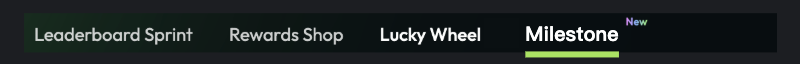

**图片说明：** 此图展示了B端Incentive Center页面的导航选项卡。页面顶部有一个水平导航栏，从左到右依次显示"Campaign"、"Lucky Wheel"、"Milestone"三个选项卡。其中"Milestone"选项卡右上角有一个蓝色的"new"标签，表示这是新增的功能模块。选项卡采用统一的设计风格，背景为白色，字体为深色，当前选中的选项卡会有不同的视觉状态。

把 lucky wheel 的 new 挪到 Milestone 上显示

### 详情页

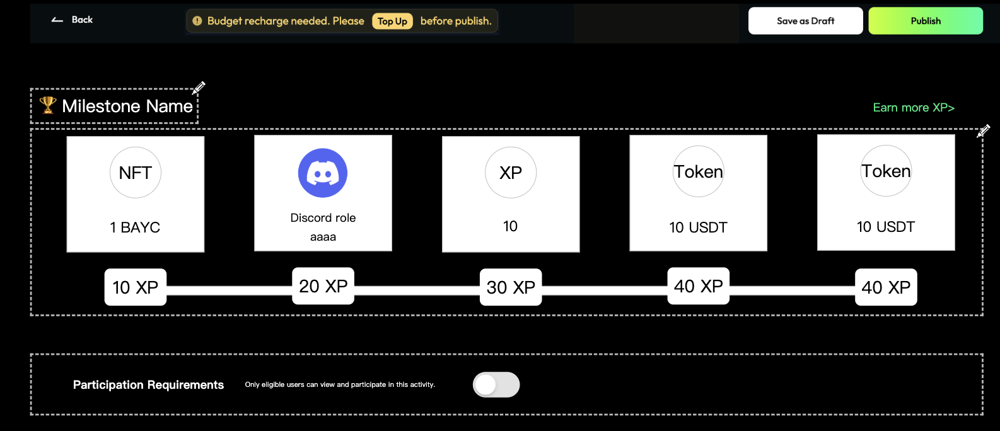

**图片说明：** 此图展示了里程碑配置页面的完整双栏布局。左侧配置区域顶部有"🏆 Milestone Name"的标题栏，下方分为三个可编辑的配置模块："Basic Info"、"Rewards"、"Participation Requirements"，每个模块右侧都有编辑图标。右侧预览区域显示"Milestone Preview"标题，下方是里程碑的实时预览效果，包含进度条、奖励展示等元素。整个界面背景为浅色，配置区域和预览区域有明显的分割线，便于用户在配置的同时实时查看效果。

提供所见即所得的方式让项目方可以对配置进行即时预览, 能配置的模块有:

Basic info

Rewards

Participation Requirements

### Basic Info

点击 🏆 Milestone Name 编辑后弹出弹窗:

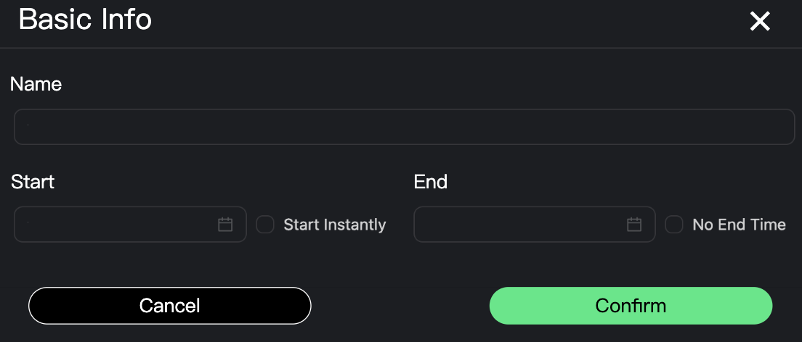

**图片说明：** 此图展示了Basic Info编辑弹窗的具体界面布局。弹窗标题为"Basic Info"，内容区域包含三个垂直排列的配置项：第一行是"Name"输入框，显示"🏆 Milestone Name"占位文本，右侧标注字符限制"30"；第二行是"Start"时间设置，左侧有日期时间选择器，右侧有"Start Instantly"复选框；第三行是"End"时间设置，同样有日期时间选择器和"No End Time"复选框。弹窗底部右侧有两个按钮："Cancel"（取消）和"Confirm"（确认），按钮采用不同的颜色区分主次操作。

**交互逻辑:**

Name: 输入框, 必填项, 用于输入里程碑的名字; 默认值: 🏆 Milestone Name,
最多能输入 30 个字符

Start: 活动开始时间, 时间控件可以复用 Quest 里配置的,
建议不要用运营后台现有的; 默认勾选 Start Instantly

End: 活动结束时间, 默认勾选 No End Time

点击 confirm 后保存配置

点击 cancel 后弹窗消失

### Rewards

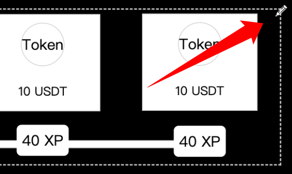

**图片说明：** 此图展示了Rewards配置模块的标题栏界面。左侧显示"Rewards"文字标题，右侧有一个小的编辑图标（铅笔形状），点击可进入奖励详细配置。这是一个简单的标题行设计，背景为白色，文字为深色，编辑图标呈灰色显示，整体设计简洁明了，符合一般的后台管理界面风格。

点击该编辑按钮后显示弹窗:

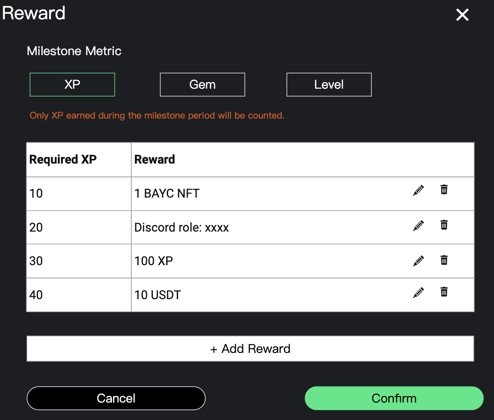

**图片说明：** 此图展示了Rewards配置弹窗的详细布局。弹窗顶部标题为"Rewards"，紧接着是"Milestone Metric"下拉选择框，当前选中"TaskOn EXP"。主体是一个三列数据表格：第一列"Required XP"显示门槛值（如100、500、1000），第二列"Reward"显示对应奖励（如"10 USDT"、"0.05 ETH"、"50 USDT"），第三列是操作按钮区域，每行都有编辑和删除图标。表格底部中央有蓝色的"+ Add reward"添加按钮。弹窗底部右侧有"Cancel"和"Save"两个操作按钮，整体采用标准的模态弹窗设计。

Milestone Metric: 用于配置里程碑节点的单位

单选项, 选项范围有: 项目方的积分(如果有多积分, 需要都显示出来,
积分顺序按积分设置里的列表顺序来) 和等级, 默认值是选择第一套积分

如果是从一套积分切换到另一套积分, 则对应的节点门槛参数不需要变更;
如果是从积分切换到等级或等级切换到积分, 则对应的节点门槛参数清零

仅计算活动范围内获得的积分

表格里显示的是每个节点的门槛和对应的奖励

Required XP: 节点的门槛, 其中 XP 是动态参数, 根据配置的 Milestone Metric
来, 显示积分的名称或 Level

Reward: 显示每个节点的奖励, 奖励有四种类型:

Token: (Token数量) + (Token名字)

Discord role, 显示规则为: Discord role: xxx

积分, 显示规则为: (积分数量) + (积分名字)

NFT, 显示规则为: 1 + (NFT collection 名字) + NFT

节点的显示顺序是按照门槛的由低到高进行排序的: 积分要求越低, 排名越高;
等级要求越低, 排名越高

点击编辑后, 显示对应节点奖励的编辑弹窗

点击删除后, 提供二次确认弹窗

不同类型奖励的编辑弹窗

**奖励类型配置表**

<table>
<tr>
<th>类型</th>
<th>配置界面</th>
<th>字段说明</th>
</tr>
<tr>
<td valign="top"><strong>Token</strong></td>
<td>

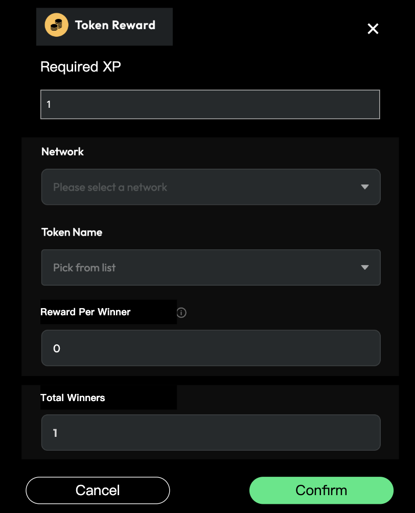

</td>
<td valign="top">

**Required XP**: 节点的门槛

如果是积分类型, 只能输入正整数, 且不能与其他节点门槛重复, 如果重复要提醒: Please ensure the threshold are unique

如果是等级, 则提供下拉列表展示现有的等级范围, 已被其他节点选中的等级, 要置灰无法被选中(因为节点门槛不能重复)

**Network**: 默认值 BSC

**Token Name**: 默认值 USDT

**Reward Per Winner**: 每个用户奖励的 token 数量, 默认值 0.1 USDT

**Total Winners**: 总共有多少个用户能拿到奖励, 默认值 1000

**注**: token 奖励设置不需要充值也可以保存成功, token 的充值流程复用 trading race 的。架构上希望支持一个节点能配置多个奖励, 本期一个节点只能配置一个奖励

</td>
</tr>
<tr>
<td valign="top"><strong>Discord Role</strong></td>
<td>

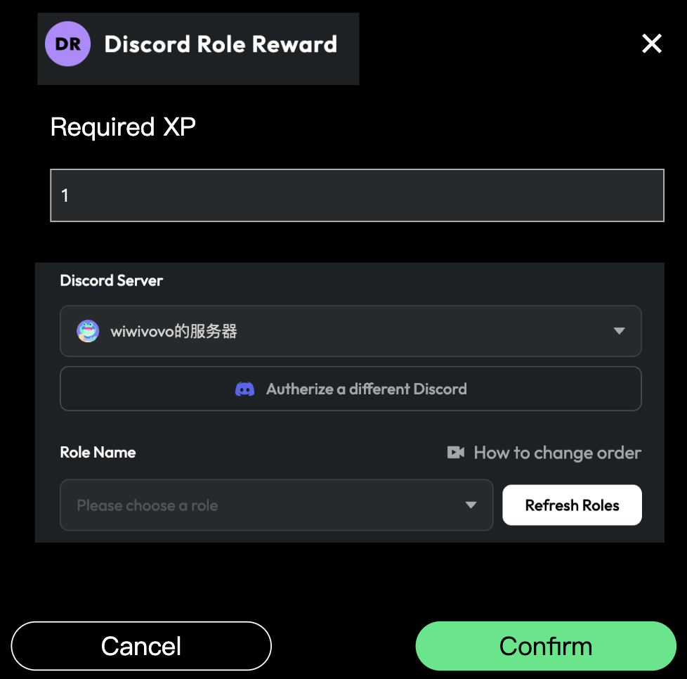

</td>
<td valign="top">

**Required XP**: 节点的门槛

剩下的配置内容复用 quest 里设置 discord role 奖励的

</td>
</tr>
<tr>
<td valign="top"><strong>积分</strong></td>
<td>

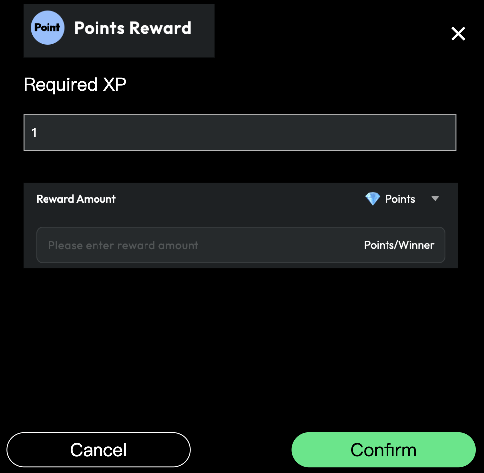

</td>
<td valign="top">

**Required XP**: 节点的门槛

剩下的配置内容复用 quest 里设置 points 奖励的

</td>
</tr>
<tr>
<td valign="top"><strong>NFT</strong></td>
<td>

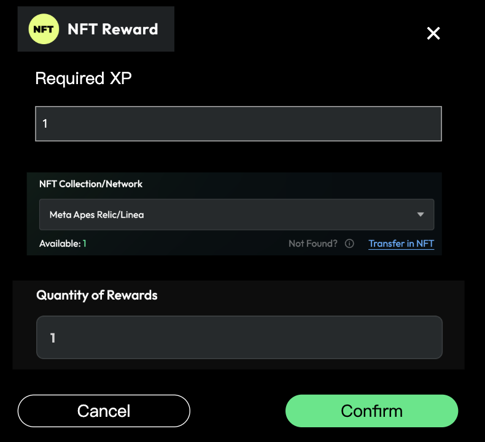

</td>
<td valign="top">

**Required XP**: 节点的门槛

剩下的配置内容复用 quest 里设置 NFT 奖励的

</td>
</tr>
</table>

用户创建里程碑时, 要有一套默认的奖励设置:

10 积分, 奖励20积分

100积分, 奖励 0.1 USDT

用户点击 Add rewards 后, 显示该弹窗:

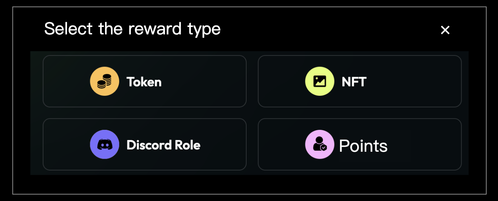

**图片说明：** 此图展示了Add rewards奖励类型选择弹窗。弹窗标题为"Add rewards"，内容区域以2x2网格布局显示四种奖励类型：左上角是"Token"（代币图标），右上角是"NFT"（NFT徽章图标），左下角是"Discord Role"（Discord标志），右下角是"PoAP"（PoAP徽章图标）。每个选项都是一个可点击的卡片，包含图标和对应的文字标签。界面背景为白色，选项卡片有边框，整体设计清晰直观，便于用户快速选择需要配置的奖励类型。

根据选择的选项, 跳出对应类型的编辑弹窗, NFT 奖励在开发侧的优先级低

### Participation Requirements

**图片说明：** 此图展示了Participation Requirements模块的标题行。左侧显示"Participation Requirements"文字标题，右侧有一个toggle切换开关，当前处于关闭状态（开关滑块在左侧位置，背景为灰色）。这是一个简洁的单行配置界面，背景为白色，文字为深色，开关控件采用标准的滑动开关设计，用于控制是否启用参与条件限制功能。

只有符合条件的用户才能参与里程碑, 开关默认关闭.

开关打开后, 在页面右侧拉出选项让项目方选择:

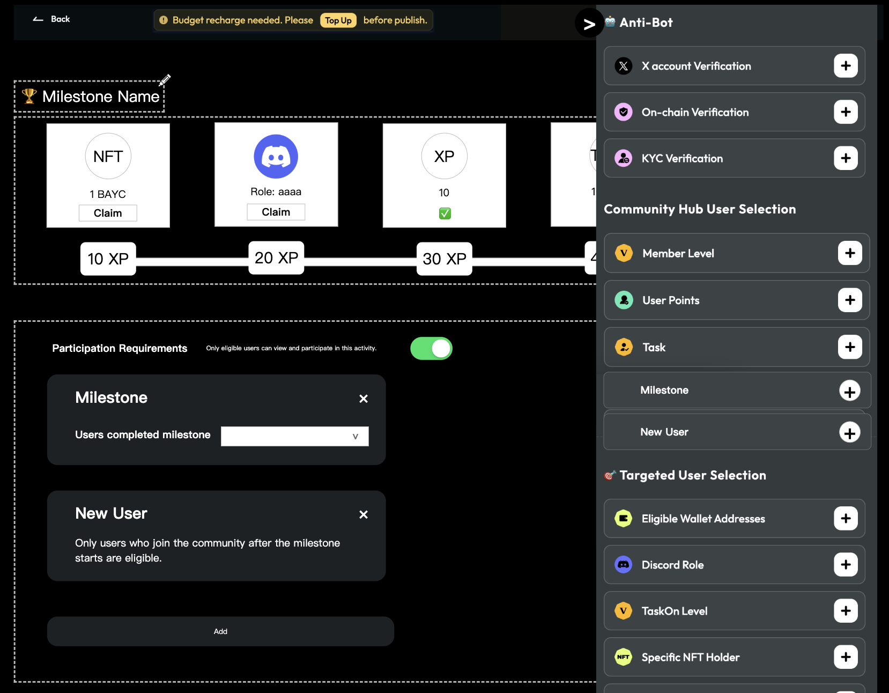

**图片说明：** 此图展示了从右侧滑出的Participation Requirements详细配置面板。面板分为两个主要部分：上半部分是"Anti-bot"区域，包含Twitter验证、Discord验证等选项，每个选项都有对应的开关控制；下半部分是"Community Hub User Selection"区域，列出了多种筛选条件包括"Hold Token"、"Hold NFT"、"Quest Participation"、"Milestone"等，每个条件前都有复选框。面板底部有配置按钮。整个面板背景为白色，采用标准的侧边栏设计，便于用户设置复杂的参与条件组合。

Anti-bot 板块: 复用 community anti bot 的

Community Hub User Selection 板块: 复用 quest eligibility 的,
并且在原来的基础上新增两种类型的 eligibility

Milestone

如果项目方有非draft状态的里程碑, 则在 task 下新增 milestone 选项,
该选项代表只有用户完成了某一个里程碑后, 才能参与该里程碑

提供下拉列表让项目方进行选择, 默认值是 milestone 列表中第一个选项

New User

只有在该里程碑开始后加入社区的用户才能参与, 加入算首次加入社区时间.
退出社区之后再重新加入不能被定义为新加入

Targeted User Selection 板块: 复用 community anti bot 的

### 列表页

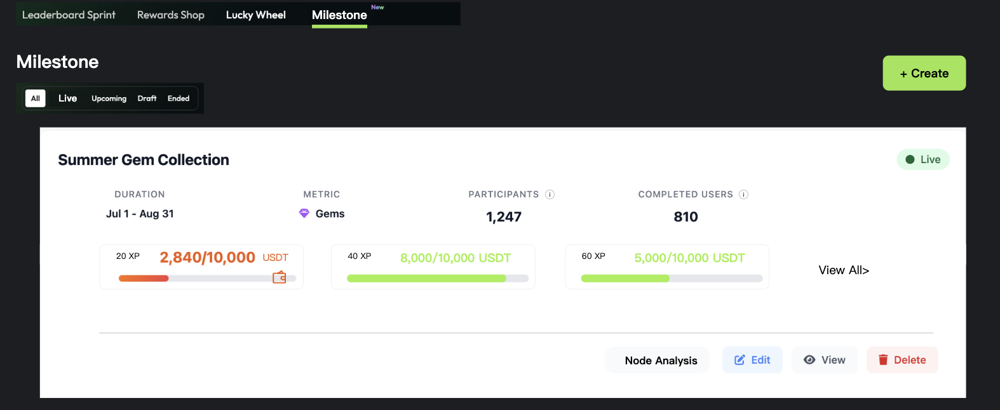

**图片说明：** 此图展示了B端里程碑管理列表页的完整表格界面。表格包含6个主要列：第1列显示里程碑名称（如"Summer Gem Collection"），第2列"DURATION"显示活动时间范围，第3列"METRIC"显示计算单位（如"TaskOn EXP"），第4列"PARTICIPANTS"显示参与人数统计，第5列"COMPLETED USERS"显示完成用户数量，第6列"TOKEN BALANCE"显示代币奖励池余额。表格右侧还有操作按钮列，每行都有编辑、查看、删除等操作选项。表格采用标准的数据表设计，行与行之间有分隔线，便于项目方管理和监控里程碑活动。

**显示字段**

Summer Gem Collection: 里程碑名称

DURATION: 里程碑的开始结束时间

METRIC: 里程碑节点的计算单位

PARTICIPANTS: 里程碑活动时间内有领取过奖励的人数

COMPLETED USERS: 里程碑活动时间内领取了所有节点奖励的人数

TOKEN BALANCE: 显示 token 奖励剩余金额

注意: 如果没有配置 token 奖励则不需要显示

如果有多个节点上配置了 token 奖励, 则需要把每个节点上 token balance
信息显示出来, 多于3个的情况下, 显示 View All 按钮, 点击后展开 Node Data
弹窗 (下面有)

如果剩余金额小于20%, 则颜色变成红色, 并显示⚠️, hover后提示:

> Your reward pool is running low. Add more rewards to ensure users
> continue receiving incentives.

每个节点卡片上提供充值入口, 点击充值后显示弹窗:

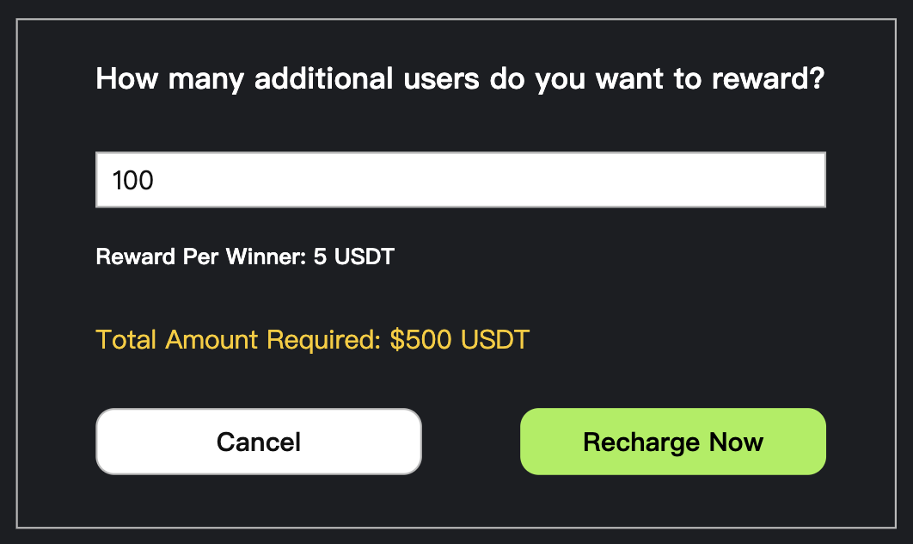

**图片说明：** 此图展示了Token奖励池充值弹窗的具体界面。弹窗顶部标题为"Add Additional Reward"，紧接着是提示文案"How many additional users do you want to reward?"。主体包含三个输入区域：第一行是用户数量输入框（占位文本"Enter users number"），第二行显示每用户奖励金额（"Reward Per Winner: 5 USDT"），第三行显示计算后的总金额（"Total Amount Required: $500 USDT"）。弹窗底部有两个按钮："Cancel"（灰色）和"Recharge Now"（蓝色主按钮）。整体采用标准的模态弹窗设计，界面简洁实用。

文案: How many additional users do you want to reward? :

输入框内只能填写正整数, 默认置空, 提示文案: Enter users number

Reward Per Winner: 5 USDT: 显示项目方在这个需要充值的的节点上的奖励设置

Total Amount Required：\$500 USDT : 代表项目方总共需要充值多少钱,
计算公式是: user number × Reward Per Winner

点击 cancel 后, 弹窗消失

点击 Recharge Now 后, 调用现有的 token 充值模块; 充值成功后,
需要更新列表页上的 token balance

根据不同的活动状态显示对应的 action 按钮:

**不同状态的Action按钮**

| **状态** | **Action 按钮** |
|----------|----------------|
| Draft | **Edit**: 编辑, 点击后跳转到里程碑详情页进行编辑 **Delete**: 删除, 点击后提供弹窗二次确认, 确认后删除 |
| Upcoming | **Edit**: 复用改成 draft 状态 **View**: 点击后, 打开新页面, 跳转到C端的 Milestone tab 页面 **Delete** |
| Live | **Node Data** **Edit** **View** |
| End | **Node Data** **View** |

**Node Data 弹窗**:

| **Required XP** | **Users Qualified** | **Claimed Users** | **Token Balance** |
|-----------------|-------------------|-------------------|-------------------|
| 10 | 5,554 | 3,554 | / |
| 20 | 4,322 | 2,322 | 2,840/10k USDT **[Recharge]** |
| 30 | 3,342 | 1,322 | / |

Users Qualified: 符合领奖条件的用户

Claimed Users: 已完成领奖的用户

Token Balance: 针对 token 奖励显示剩余的 token, 并且提供充值入口.
点击充值后显示充值弹窗.

**功能介绍**

有两个页面的介绍需要增加 milestone:

**Milestone介绍页面配置**

<table>
<tr>
<th>页面位置</th>
<th>界面截图</th>
<th>介绍内容</th>
</tr>
<tr>
<td valign="top">第一个是 incentive center 页面</td>
<td>

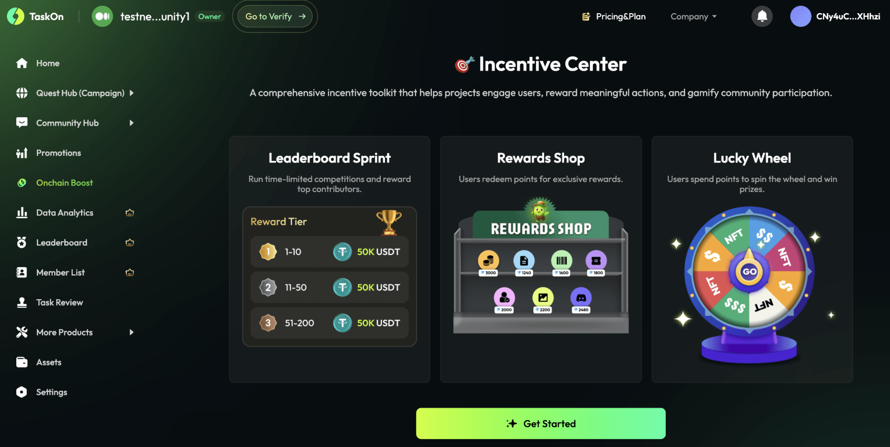

</td>
<td valign="top">

在 lucky wheel 右边加一个模块

**标题**: Milestone

**描述**: Users accumulate points or levels to access step-by-step rewards.

</td>
</tr>
<tr>
<td valign="top">第二个是 milestone 的空结果页, 类似 leaderboard sprint 的介绍页</td>
<td>

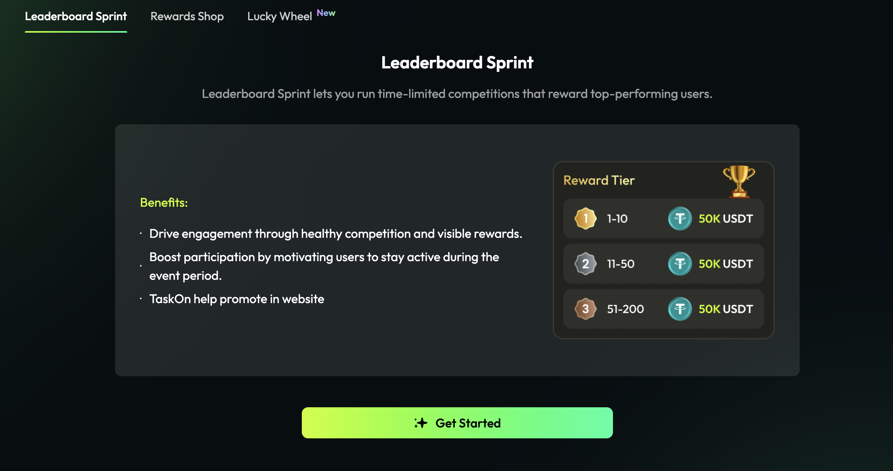

</td>
<td valign="top">

**标题**: Milestone

**标题描述**: Users accumulate points or levels to access step-by-step rewards.

**Benefits 里的文案**:

**Boost Engagement** -- Motivate users with progressive rewards.

**Drive Completion** -- Turn big goals into achievable steps.

**Stay Flexible** -- Configure rewards by points or levels to fit your growth strategy.

*样式上的优化, 希望标题描述的样式更加强一点

**注意**: Milestone 是 pro 及以上的套餐才能使用

</td>
</tr>
</table>

**装修**

在 Leaderboard 下面加一个选项: Milestone, 是开关选项, 打开后, 在 home
页显示; 关闭后, 在 home 页隐藏

当有新的里程碑发布时, milestone 开关自动打开.

该板块的组件需要支持拖动, 占据一行空间.

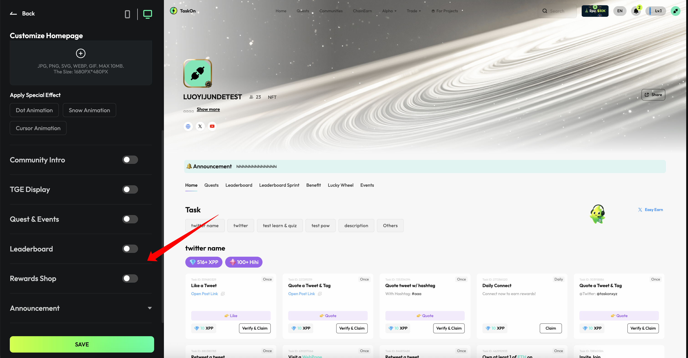

**图片说明：** 此图展示了B端装修功能中Milestone模块的开关配置界面。在装修设置页面中，可以看到"Leaderboard"模块下方新增了"Milestone"选项，该选项带有一个toggle开关控件。当开关打开时，里程碑模块会在社区Home页显示；关闭时则隐藏。这个配置项与其他装修模块保持一致的设计风格，便于项目方统一管理首页内容的展示。

根据

**不同状态的样式显示**

| **状态** | **样式说明** |
|----------|-------------|
| 没有 upcoming 或 live 状态 | 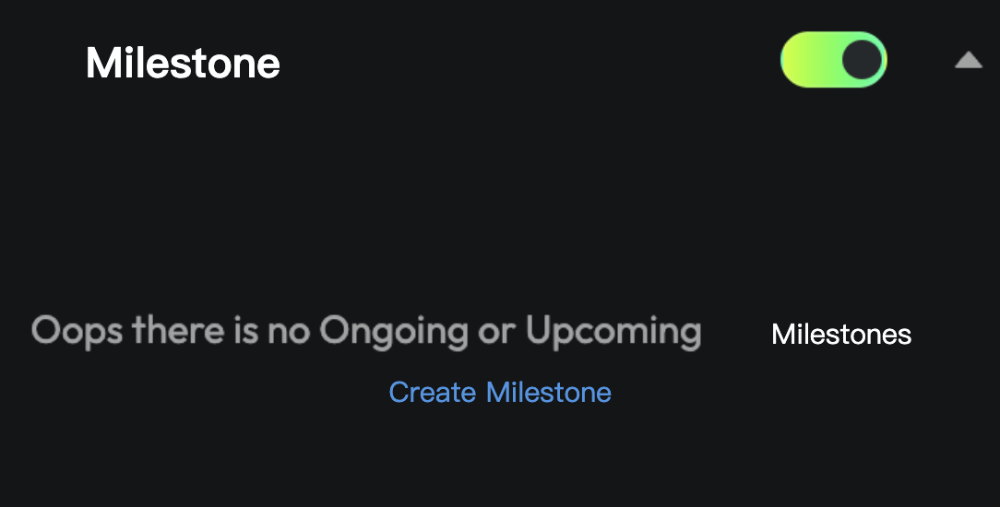  显示文案：**Oops there is no Ongoing or Upcoming Milestones**  点击 create milestone 后打开新页面, 跳转至 milestone 的列表页 |
| 未付费 | 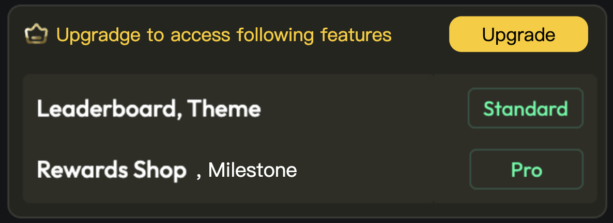  保持原有的升级提示, 但是在样式上做一下调整, milestone 是 pro 及以上的套餐才能使用 |

## C端展示

### 社区Home页里程碑模块

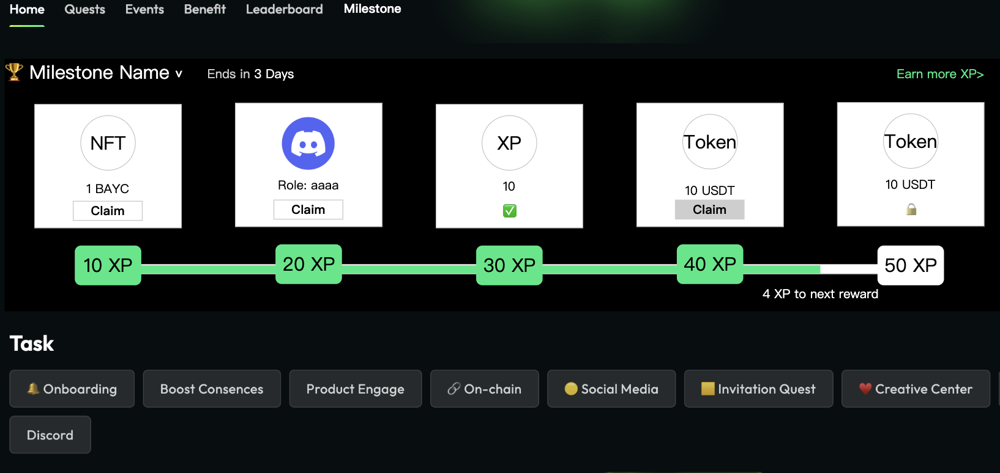

**图片说明：** 此图展示了C端社区Home页中里程碑模块的实际展示效果。里程碑模块以卡片形式嵌入在Home页面中，卡片包含里程碑的基本信息，如标题、进度展示、时间信息和奖励预览。卡片设计简洁美观，与整个Home页的风格保持一致。用户可以通过这个模块快速了解当前可参与的里程碑活动，并直接点击进入详细页面。模块占据一行空间，支持拖拽调整位置。

Milestone 模块在首页显示需要同时满足以下两个条件:

项目方在装修模块中开启了 milestone 显示

至少有一个处于 live 状态 或 upcoming 且符合 eligibility 的里程碑
(未登录无法判断的情况下, 当作符合 eligibility)

**里程碑展示:**

如果同时有多个里程碑, 先将里程碑分为两类：**未完成里程碑** 和
**已完成里程碑**。

**未完成里程碑** 按 **开始时间从早到晚** 排序，显示在前。

**已完成里程碑** 排序在未完成里程碑之后，可按完成时间顺序降序。

最终列表的顺序为：**未完成里程碑（按开始时间升序）→
已完成里程碑(按完成时间降序)**。

提供下拉列表供用户选择, 列表范围: 处于 live 状态且符合 eligibility
的里程碑

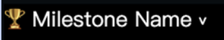

**图片说明：** 此图展示了Home页中里程碑信息的具体展示内容。包含里程碑名称"🏆 Milestone Name"和结束时间提示"End in 3 days"等关键信息。设计简洁明了，让用户一目了然地了解里程碑的基本状态和时间信息。

**里程碑信息包括:**

🏆 Miletone Name: 里程碑的名字

End in 3 days: 显示里程碑结束的时间距离当前时间的距离,
如果设置的是没有结束时间, 则不需要显示

Earn more XP\>: XP 是动态参数, 根据设置的 milestone metric 来显示,
如果是积分的话, 直接显示积分名字, 如果是等级,
则显示升级所需要的积分名字; 点击后页面下滑, 定位到 Task 板块

**里程碑节点显示:**

每个节点上显示对应的奖励

节点上的奖励分四种状态: 未解锁/未领取/已领取/缺库存

未解锁: 当用户未满足门槛时, 所有奖励都是未解锁状态, 在奖励卡片上显示 🔒

未领取: 当用户到达门槛时, NFT/discord 奖励需要用户手动领取,
未领取时在奖励卡片上提供 claim 按钮, 领取流程复用 quest 中的.

已领取: 已领取完奖励, 在奖励卡片上显示 ✅

缺库存: 仅针对 Token 奖励有这种情况. 当用户满足门槛, 但 token
又已经被领取完之后, 进入该状态, 则 claim 按钮置灰, 鼠标 hover 后提示: No
token left to claim. Please contact xx for help. Xx 是 community 的名字

**里程碑进度显示:**

积分类型的进度条:

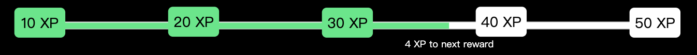

**图片说明：** 此图展示了积分类型里程碑的进度条显示效果。进度条采用水平条形设计，左侧显示起始值，右侧显示目标积分值，中间的填充部分用蓝色表示当前完成进度。进度条上方或下方可能显示具体的积分数值（如"1,200 / 2,000 TaskOn EXP"），让用户清楚了解距离下一个里程碑节点还需要多少积分。整体设计简洁直观，符合一般进度条的视觉习惯。

等级类型的进度条:

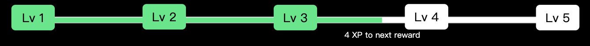

**图片说明：** 此图展示了等级类型里程碑的进度条显示方式。与积分类型不同，等级类型的进度显示更注重等级阶段的概念，可能显示为等级徽章或分段式的进度指示器。界面可能显示当前等级（如"Lv.3"）和目标等级（如"Lv.5"），中间用连接线或阶梯式设计表示进度。这种设计更符合等级系统的特点，让用户直观了解自己在等级里程碑中的位置和进展。

**注意: 当用户完成任务后获得积分后, 该进度条需要实时更新**

当用户完成一个里程碑 (达到了所有节点的门槛要求) 后,
若该里程碑是另一个里程碑的解锁条件, 并且该里程碑是 live 状态,
则需要做差异化展示:

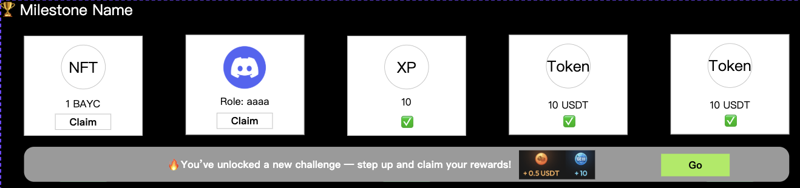

**图片说明：** 此图展示了当用户完成一个里程碑后解锁新挑战的提示界面。页面显示"You ve unlocked a new challenge --- step up and claim your rewards！"的提示文案，并展示新里程碑的奖励内容，鼓励用户继续参与。

在进度条上展示: You ve unlocked a new challenge --- step up and claim
your rewards！

显示另一个里程碑的所有奖励,同一币种的 token 奖励合并显示(比如a节点奖励10
USDT, b 节点奖励 20 USDT, 这里显示 30 USDT) , 同一积分奖励合并显示

点击 Go 后, 切换显示至另一个里程碑

如果当前里程碑有未领取的奖励,
则弹窗告知用户未领取的奖励可以在哪里看得到:

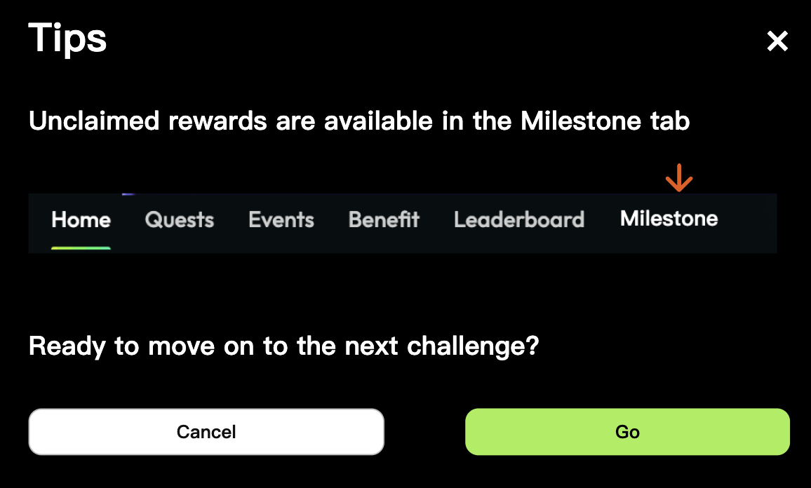

**图片说明：** 此图展示了点击Go按钮后出现的确认弹窗。弹窗提醒用户当前里程碑有未领取的奖励，并告知可以在哪里查看这些奖励。设计人性化，避免用户遗漏奖励。

点击弹窗上的 Go 后, 弹窗消失, 切换显示至另一个里程碑

### 里程碑Tab页

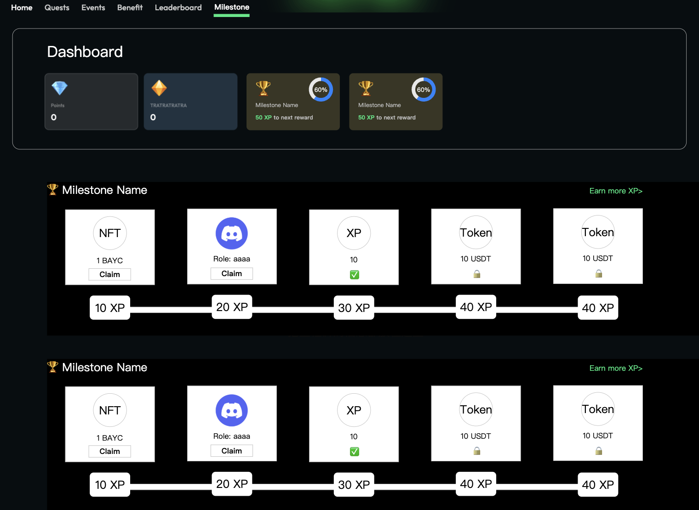

**图片说明：** 此图展示了C端里程碑Tab页面的完整布局。页面顶部显示用户积分信息（"2,490 TaskOn EXP"）和等级（"Lv.3"），下方是当前参与的里程碑进度展示区域。主体部分垂直排列显示多个里程碑卡片，每个卡片包含里程碑名称、时间信息、进度条和奖励预览。卡片采用白色背景，有圆角边框，进度条使用蓝色填充显示完成状态。页面整体设计简洁，信息层次清晰，便于用户查看和管理自己的里程碑参与情况。

当项目方非 draft 的里程碑数量大于0时, 显示该 tab

该 Tab 显示的内容有:

用户当前的积分和等级信息(未登录下不需要显示该信息)

用户参与的里程碑进度

历史上每一个里程碑的详细信息

里程碑排序规则：优先显示 live 状态，其次 upcoming，最后
end；同一状态下按开始时间先后排序

eligibility 设置了新用户的里程碑, 面对不满足条件的用户, 需要隐藏

**用户信息和里程碑进度**

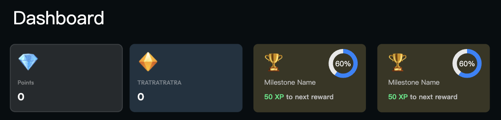

**图片说明：** 此图展示了用户信息和里程碑进度的展示区域。包含用户当前的积分和等级信息，以及正在参与的里程碑进度显示。界面设计清晰，让用户能够快速了解自己的当前状态。

积分和等级: 显示里程碑涉及到的积分, 在积分后面放等级信息

里程碑进度

里程碑参与百分比进度 = 满足门槛的节点数量/所有节点数量

这里仅显示进度大于0且满足参与条件的的里程碑

如果没到达100%的情况且里程碑正在进行的情况下,
显示用户距离下一个节点奖励相差的积分数量

如果没到达100%但里程碑已结束的情况下, 文案显示: End

如果已到达100%的情况下, 文案显示: 🎉 Congratulation!

**中奖记录**

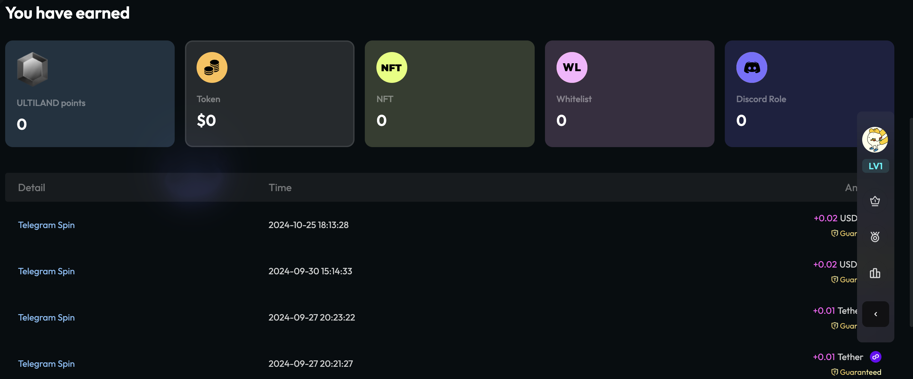

**图片说明：** 此图展示了用户的中奖记录界面。显示用户在各个里程碑中获得的奖励记录，包括Points/Token/NFT/Discord Role等各种类型的奖励。设计清晰有序，便于用户查看历史获奖情况。

### 个人中心里程碑记录

在 Community 个人中心增加里程碑的获奖记录, Points/Token/NFT/Discord Role
都需要支持

Detail 上显示 Milestone 的名称, 点击后跳转至 Milestone Tab

### 里程碑详情页

#### Eligibility 校验

**不符合条件**

当用户不符合条件时, 里程碑使用以下样式:

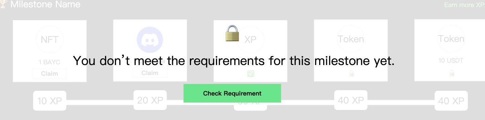

**图片说明：** 此图展示了用户不符合参与条件时的里程碑卡片样式。里程碑卡片整体呈现灰化/置灰效果，内容包括里程碑标题、时间信息和奖励预览，但所有文字和图标都显示为灰色状态。卡片底部有一个蓝色的"check requirement"按钮，这是唯一保持彩色的交互元素。这种视觉设计清楚地向用户传达该里程碑当前不可参与，需要先满足相关条件。

**点击 check requirement 后显示 Eligibility 不符合条件弹窗:**

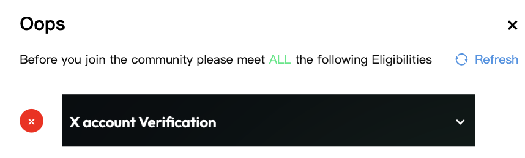

**图片说明：** 此图展示了Eligibility资格检查弹窗的界面布局。弹窗顶部标题为"Before you join this activity please meet ALL the following Eligibilities"，其中"ALL"为粗体强调。主体内容列出了具体的资格要求条件，包括多个检查项，每个条件前都有状态图标（如×表示未满足）。弹窗右上角有一个刷新按钮，用于重新检查用户是否满足条件。弹窗底部可能有相关的操作按钮。整个弹窗采用标准的模态设计，背景为白色，便于用户清楚了解需要满足的具体要求。

**标题改一下:** Before you join this activity please meet ALL the
following Eligibilities

ALL 的文案是动态的: 根据 eligibility 里的设置来显示 ALL 或者 ANY

刷新按钮 (同 quest)

每条Eligibility对应的展示

Anti-Bot

X account Verification（同quest）

On-chain Verification（同quest）

KYC Verification（同 action）

Community Hub User Selection

Member level (同quest）

User points (同quest）

Task (同quest）

Milestone: 新增, 文案待定

New user: 新增, 文案待定

Target User Selection

Eligible Wallet Addresses（同quest）

Discord Role（同quest）

TaskOn Level（同quest）

Specific NFT Holder（同quest）

Minimum Token Balance（同quest）

Resident of Specific Countries/Regions（同quest）

Days on discord（同 quest)

**没有所需账号信息**

里程碑使用以下显示样式:

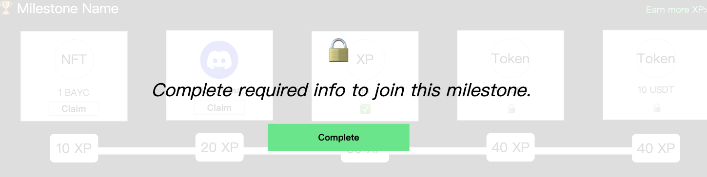

**图片说明：** 此图展示了用户符合参与条件时的里程碑卡片正常显示状态。里程碑卡片保持完整的彩色显示，包含清晰的里程碑标题、时间信息、进度条和奖励内容。卡片底部有一个蓝色的"Complete"按钮，表示用户可以正常参与该里程碑活动。整体视觉效果与置灰状态形成鲜明对比，所有文字、图标和UI元素都以正常的颜色和对比度显示，向用户明确传达该里程碑可以参与。

点击 Complete 后跳出弹窗:

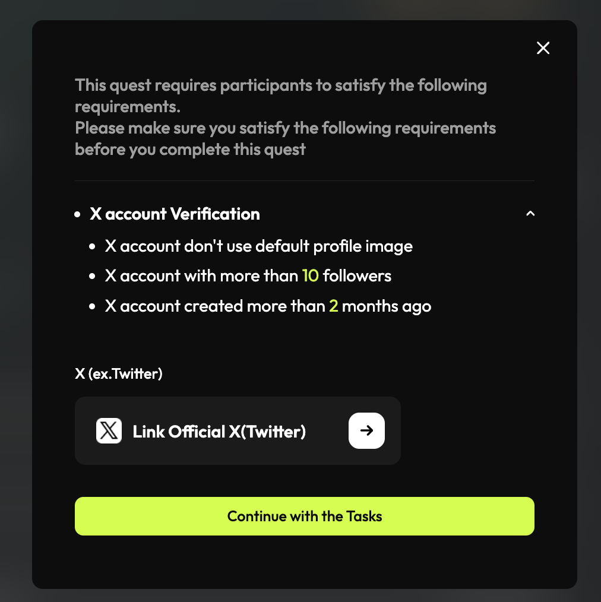

**图片说明：** 此图展示了账户连接引导弹窗的详细界面。弹窗顶部标题提示用户需要满足相关要求，主体部分垂直列出了需要连接的各种社交账户和钱包类型，包括Twitter、Discord、Wallet等，每种连接类型都有对应的图标和"Connect"按钮。有些已连接的账户会显示绿色的对勾状态图标。弹窗底部有一个主要的"Verify"按钮，用于验证所有必需的连接是否完成。整个弹窗设计清晰，便于用户逐步完成所需的账户连接过程。

复用 quest 引导连接的弹窗, 做以下变更:

文案变更: Please make sure you satisfy the following requirements before
you join this milestone.

continue with tasks 按钮改成 Verify, 仅当用户已将 eligibility
中所需要校验的账号信息都连接完毕后激活该按钮, 用户点击后校验是否符合
eligibility:

如果符合条件, 弹窗消失, 并且弹出 totast 提示: You can join this
milestone now!

如果不符合条件, 则展示**不符合eligibility 弹窗**

**未登录**

正常显示

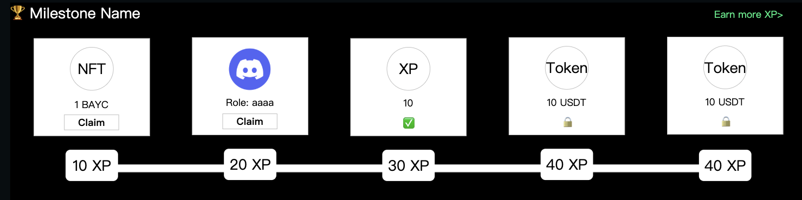

**图片说明：** 此图展示了当用户不符合条件时的详细提示信息界面。显示了具体的不符合原因和相关的提示信息，帮助用户了解需要满足哪些条件才能参与里程碑。
