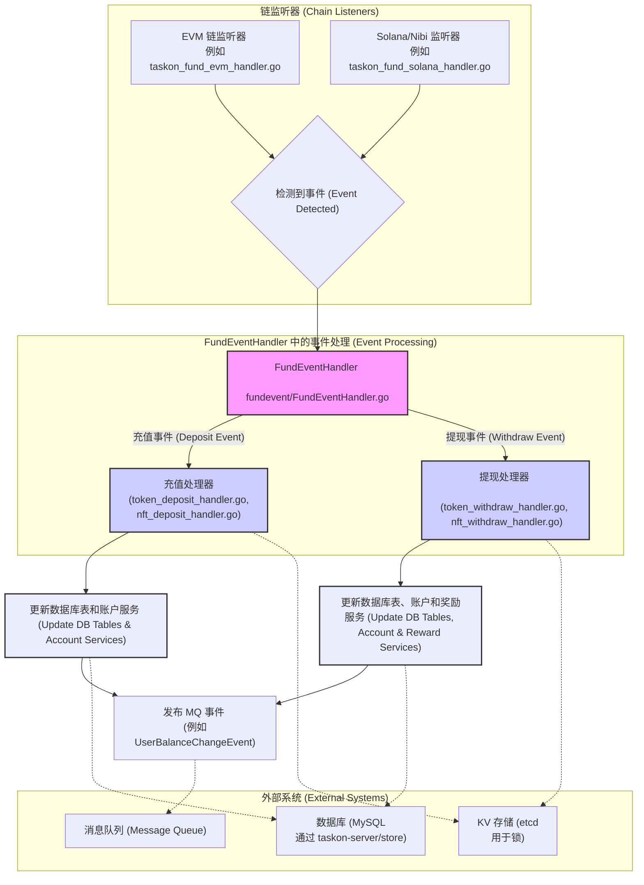

# TaskOn Scanner: TaskOnFund 事件扫描

## 引言

本文档概述了 `taskon-scanner` 微服务中的 "TaskOnFund 事件扫描"。它详细说明了这些功能的业务逻辑、技术调用链，以及与数据库表和键值存储的交互。

## TaskOnFund 事件扫描

### 业务概述

TaskOnFund 事件扫描功能负责监控各种支持的区块链（EVM 兼容链、Solana、Nibi）上与 TaskOnFund 合约相关的链上事件。这些事件主要包括：

* **代币充值 (Token Deposits):** 用户将同质化代币充值到 TaskOnFund。
* **NFT 充值 (NFT Deposits):** 用户将非同质化代币 (NFT) 充值到 TaskOnFund。
* **代币提现 (Token Withdrawals):** 用户从 TaskOnFund 提取同质化代币。
* **NFT 提现 (NFT Withdrawals):** 用户从 TaskOnFund 提取 NFT。

在检测并确认这些事件（经过一定数量的区块确认后），`taskon-scanner` 服务会处理它们。这包括：

1. 验证事件数据（例如，用户是否存在、代币/NFT 元数据）。
2. 更新相关数据库表以反映用户余额的变化 (`token_account`, `nft_account`)。
3. 记录交易详情 (`account_deposit`, `nft_deposit`, `account_withdraw`, `nft_withdraw`, `account_tx`)。
4. 如果提现与奖励相关（例如，活动奖励、推荐奖励），则更新该奖励的状态或详情 (`user_campaign_reward`, `user_referral_reward_reward`)。
5. 向消息队列发布消息（例如，`UserBalanceChangeEvent`）以通知其他服务这些更改。
6. 利用 `etcd` 进行分布式锁定，以确保在对账户余额进行关键更新时的数据完整性。

### 技术调用链 (简化)



### 技术调用链 (详细 - 以代币充值为例)

```mermaid
graph TD
    subgraph "特定链处理器 (Chain-Specific Handler - 例如 EvmHandler)"
        ChainHandler_Scan["扫描链上日志/交易<br/>(Scan On-chain Logs/Txs)"]
        ChainHandler_Parse["解析充值事件 (Parse Deposit Event)"]
        ChainHandler_CallAddLog["调用 fundEventHandler.AddTokenDepositConfirmingLogs()"]
    end
    ChainHandler_Scan --> ChainHandler_Parse;
    ChainHandler_Parse --> ChainHandler_CallAddLog;

    subgraph "FundEventHandler (fundevent/FundEventHandler.go)"
        FEH_AddConfirming["AddTokenDepositConfirmingLogs(logs, currentHeight)"]
        FEH_OnNew["OnNewTokenDepositLog(log, currentHeight)"]
        FEH_OnConfirmed["OnTokenDepositLogConfirmed(log, currentHeight)"]
        FEH_ConfirmDeposit["confirmTokenDeposit(tokenDeposit)"]
    end
    ChainHandler_CallAddLog --> FEH_AddConfirming;

    subgraph "确认中日志列表 (ConfirmingLogList Component)"
        CLL_Add["AddConfirmingLogs()"]
        CLL_ProcessNew["处理新日志并回调 OnNew... (Process New & Callback)"]
        CLL_ProcessConfirmed["检查确认并回调 On...Confirmed (Check & Callback Confirmed)"]
    end
    FEH_AddConfirming --> CLL_Add;
    CLL_Add -.-> CLL_ProcessNew;
    CLL_ProcessNew -- "回调 (Callback)" --> FEH_OnNew;
    CLL_ProcessConfirmed -- "回调 (Callback)" --> FEH_OnConfirmed; 

    subgraph "账户服务 (AccountService - from taskon-server)"
        AccSvr_GetOrAddTokenAcc["GetOrAddTokenAccountInfo(tx, userId, chain, tokenId)"]
        AccSvr_TokenDepositCompleted["TokenDepositCompleted(tx, accountDeposit)"]
    end

    subgraph "元数据服务 (MetadataServices - from taskon-server)"
        TokenMetaSvr_GetOrAdd["tokenMetadataSvr.GetOrAddTokenMetadataByAddress()"]
    end

    subgraph "存储服务 (Storage - taskon-server/store)"
        Store_GetUserInfo["GetUserInfoById()"]
        Store_GetAccDeposit_ByTx["GetAccountDepositByTxHashAndTokenId()"]
        Store_BeginTx["BeginTx()"]
        Store_AddAccDeposit["AddAccountDeposit(tx, accDeposit)"]
        Store_AddAccTx["AddAccountTx(tx, accountTx)"]
        Store_CommitTx["Commit()"]
        Store_GetAccDeposit_ById["GetAccountDepositById()"]
        Store_UpdateAccDepositStatus["(由 AccSvr 调用)<br/>UpdateAccountDepositStatus()"]
        Store_UpdateTokenAccBalance["(由 AccSvr 调用)<br/>UpdateTokenAccountBalance()"]
    end
  
    DB_MySQL["数据库 (MySQL Tables)"]

    subgraph "Etcd 服务 (EtcdService - from taskon-server)"
        Etcd_Lock["获取/释放分布式锁<br/>(Acquire/Release Lock via db_tx)"]
        Etcd_DelEventKey["DelUserBalanceChangeEventKey()"]
    end

    subgraph "消息队列服务 (MQService - taskon-scanner/mq)"
        MQ_SendMsg["SendUserBalanceChangeEvent()"]
    end

  
    FEH_OnNew --> Store_GetUserInfo;
    Store_GetUserInfo --> DB_MySQL;

    FEH_OnNew --> TokenMetaSvr_GetOrAdd;
    TokenMetaSvr_GetOrAdd --> DB_MySQL; 

    FEH_OnNew --> Store_GetAccDeposit_ByTx;
    Store_GetAccDeposit_ByTx --> DB_MySQL;

    FEH_OnNew -- "若是新日志 (If New Log)" --> Store_BeginTx;
    Store_BeginTx --> DB_MySQL; 

    FEH_OnNew -- "(在事务内) 1." --> AccSvr_GetOrAddTokenAcc;
    AccSvr_GetOrAddTokenAcc --> DB_MySQL; 

    FEH_OnNew -- "(在事务内) 2." --> Store_AddAccDeposit;
    Store_AddAccDeposit --> DB_MySQL; 

    FEH_OnNew -- "(在事务内) 3." --> Store_AddAccTx;
    Store_AddAccTx --> DB_MySQL; 

    FEH_OnNew -- "(在事务内) 4." --> Store_CommitTx;
    Store_CommitTx --> DB_MySQL; 


  
    FEH_OnConfirmed --> FEH_ConfirmDeposit;

    FEH_ConfirmDeposit --> Store_GetAccDeposit_ById;
    Store_GetAccDeposit_ById --> DB_MySQL;

    FEH_ConfirmDeposit --> AccSvr_TokenDepositCompleted;
    AccSvr_TokenDepositCompleted -- "使用 (Uses)" --> Etcd_Lock;
    AccSvr_TokenDepositCompleted -- "更新 (DB Tx Updates)" --> Store_UpdateAccDepositStatus;
    Store_UpdateAccDepositStatus --> DB_MySQL; 
    AccSvr_TokenDepositCompleted -- "更新 (DB Tx Updates)" --> Store_UpdateTokenAccBalance;
    Store_UpdateTokenAccBalance --> DB_MySQL; 


    FEH_ConfirmDeposit -- "若成功 (If Successful)" --> Etcd_DelEventKey;
    FEH_ConfirmDeposit -- "若成功 (If Successful)" --> MQ_SendMsg;

  
    style FEH_OnNew fill:#lightyellow,stroke:#333,stroke-width:2px;
    style FEH_OnConfirmed fill:#lightyellow,stroke:#333,stroke-width:2px;
    style AccSvr_TokenDepositCompleted fill:#lightblue,stroke:#333,stroke-width:2px;
    style CLL_Add fill:#e6ffe6,stroke:#333,stroke-width:1px;
    style CLL_ProcessNew fill:#e6ffe6,stroke:#333,stroke-width:1px;
    style CLL_ProcessConfirmed fill:#e6ffe6,stroke:#333,stroke-width:1px;
```



### 技术调用链 (详细 - 以代币提现为例)

```mermaid
graph TD
    subgraph "特定链处理器 (Chain-Specific Handler - 例如 EvmHandler)"
        Withdraw_ChainHandler_Scan["扫描链上日志/交易<br/>(Scan On-chain Logs/Txs for Withdrawals)"]
        Withdraw_ChainHandler_Parse["解析提现事件 (Parse Withdraw Event)"]
        Withdraw_ChainHandler_CallAddLog["调用 fundEventHandler.AddTokenWithdrawConfirmingLogs()"]
    end
    Withdraw_ChainHandler_Scan --> Withdraw_ChainHandler_Parse;
    Withdraw_ChainHandler_Parse --> Withdraw_ChainHandler_CallAddLog;

    subgraph "FundEventHandler (fundevent/FundEventHandler.go)"
        Withdraw_FEH_AddConfirming["AddTokenWithdrawConfirmingLogs(logs, currentHeight)"]
        Withdraw_FEH_OnNew["OnNewTokenWithdrawLog(log, currentHeight)"]
        Withdraw_FEH_OnConfirmed["OnTokenWithdrawLogConfirmed(log, currentHeight)"]
    end
    Withdraw_ChainHandler_CallAddLog --> Withdraw_FEH_AddConfirming;

    subgraph "确认中日志列表 (ConfirmingLogList Component) - Withdraw"
        Withdraw_CLL_Add["AddConfirmingLogs() for Withdrawals"]
        Withdraw_CLL_ProcessNew["处理新提现日志并回调 OnNew... (Process New & Callback)"]
        Withdraw_CLL_ProcessConfirmed["检查提现确认并回调 On...Confirmed (Check & Callback Confirmed)"]
    end
    Withdraw_FEH_AddConfirming --> Withdraw_CLL_Add;
    Withdraw_CLL_Add -.-> Withdraw_CLL_ProcessNew;
    Withdraw_CLL_ProcessNew -- "回调 (Callback)" --> Withdraw_FEH_OnNew;
    Withdraw_CLL_ProcessConfirmed -- "回调 (Callback)" --> Withdraw_FEH_OnConfirmed;

    subgraph "账户服务 (AccountService - from taskon-server)"
        Withdraw_AccSvr_TokenWithdrawCompleted["TokenWithdrawCompleted(tx, accountWithdraw)"]
    end

    subgraph "元数据服务 (MetadataServices - from taskon-server)"
        Withdraw_TokenMetaSvr_GetByAddr["tokenMetadataSvr.GetTokenMetadataByAddress()"]
    end

    subgraph "存储服务 (Storage - taskon-server/store)"
        Withdraw_Store_GetTokenMetaByAddr["GetTokenMetadataByAddress()"] 
        Withdraw_Store_GetAccWithdraw_ByNonce["GetAccountWithdrawByChainAndNonceAndTokenId()"]
        Withdraw_Store_AddAccWithdraw_Failed["AddAccountWithdraw() (for failed/invalid cases)"]
        Withdraw_Store_UpdateAccWithdraw["UpdateAccountWithdraw() (tx_hash, status to confirming, etc.)"]
        Withdraw_Store_GetAccWithdraw_ById["GetAccountWithdrawById() (implicitly by AccSvr)"]
        Withdraw_Store_UpdateAccWithdrawStatus["(由 AccSvr 调用)<br/>UpdateAccountWithdrawStatus() to Completed"]
        Withdraw_Store_UpdateTokenAccBalance_Debit["(由 AccSvr 调用)<br/>UpdateTokenAccountBalance() (Debit)"]
    end
  
    Withdraw_DB_MySQL["数据库 (MySQL Tables)"]

    subgraph "Etcd 服务 (EtcdService - from taskon-server)"
        Withdraw_Etcd_Lock["获取/释放分布式锁<br/>(Acquire/Release Lock via db_tx for Account Update)"]
        Withdraw_Etcd_DelEventKey["DelUserBalanceChangeEventKey()"]
    end

    subgraph "消息队列服务 (MQService - taskon-scanner/mq)"
        Withdraw_MQ_SendMsg["SendUserBalanceChangeEvent()"]
    end

  
    Withdraw_FEH_OnNew --> Withdraw_TokenMetaSvr_GetByAddr;
    Withdraw_TokenMetaSvr_GetByAddr --> Withdraw_DB_MySQL;

    Withdraw_FEH_OnNew --> Withdraw_Store_GetAccWithdraw_ByNonce;
    Withdraw_Store_GetAccWithdraw_ByNonce --> Withdraw_DB_MySQL;

    Withdraw_FEH_OnNew -- "若提现请求不存在或无效 (If Withdraw Request Not Found/Invalid)" --> Withdraw_Store_AddAccWithdraw_Failed;
    Withdraw_Store_AddAccWithdraw_Failed --> Withdraw_DB_MySQL; 

    Withdraw_FEH_OnNew -- "若提现请求存在且状态为 Signed (If Request Exists & Status is Signed)" --> Withdraw_Store_UpdateAccWithdraw;
    Withdraw_Store_UpdateAccWithdraw --> Withdraw_DB_MySQL; 

  
    Withdraw_FEH_OnConfirmed --> Withdraw_AccSvr_TokenWithdrawCompleted;
  
    Withdraw_AccSvr_TokenWithdrawCompleted -- "使用 (Uses)" --> Withdraw_Etcd_Lock;
    Withdraw_AccSvr_TokenWithdrawCompleted -- "更新 (DB Tx Updates)" --> Withdraw_Store_UpdateAccWithdrawStatus;
    Withdraw_Store_UpdateAccWithdrawStatus --> Withdraw_DB_MySQL; 
  
    Withdraw_AccSvr_TokenWithdrawCompleted -- "更新 (DB Tx Updates)" --> Withdraw_Store_UpdateTokenAccBalance_Debit;
    Withdraw_Store_UpdateTokenAccBalance_Debit --> Withdraw_DB_MySQL; 

    Withdraw_FEH_OnConfirmed -- "若成功 (If Successful)" --> Withdraw_Etcd_DelEventKey;
    Withdraw_FEH_OnConfirmed -- "若成功 (If Successful)" --> Withdraw_MQ_SendMsg;

  
    style Withdraw_FEH_OnNew fill:#lightyellow,stroke:#333,stroke-width:2px;
    style Withdraw_FEH_OnConfirmed fill:#lightyellow,stroke:#333,stroke-width:2px;
    style Withdraw_AccSvr_TokenWithdrawCompleted fill:#lightblue,stroke:#333,stroke-width:2px;
    style Withdraw_CLL_Add fill:#ffe6e6,stroke:#333,stroke-width:1px;   
    style Withdraw_CLL_ProcessNew fill:#ffe6e6,stroke:#333,stroke-width:1px;
    style Withdraw_CLL_ProcessConfirmed fill:#ffe6e6,stroke:#333,stroke-width:1px;
```



### 技术调用链 (详细 - 以 NFT 充值为例)

```mermaid
graph TD
    subgraph "特定链处理器 (Chain-Specific Handler - 例如 EvmHandler) - NFT Deposit"
        NftDeposit_ChainHandler_Scan["扫描链上日志/交易<br/>(Scan On-chain Logs/Txs for NFT Deposits)"]
        NftDeposit_ChainHandler_Parse["解析 NFT 充值事件 (Parse NFT Deposit Event)"]
        NftDeposit_ChainHandler_CallAddLog["调用 fundEventHandler.AddNFTDepositConfirmingLogs()"]
    end
    NftDeposit_ChainHandler_Scan --> NftDeposit_ChainHandler_Parse;
    NftDeposit_ChainHandler_Parse --> NftDeposit_ChainHandler_CallAddLog;

    subgraph "FundEventHandler (fundevent/FundEventHandler.go) - NFT Deposit"
        NftDeposit_FEH_AddConfirming["AddNFTDepositConfirmingLogs(logs, currentHeight)"]
        NftDeposit_FEH_OnNew["OnNewNftDepositLog(log, currentHeight)"]
        NftDeposit_FEH_OnConfirmed["OnNftDepositLogConfirmed(log, currentHeight)"]
        NftDeposit_FEH_ConfirmNftDeposit["confirmNftDeposit(nftDeposit)"]
    end
    NftDeposit_ChainHandler_CallAddLog --> NftDeposit_FEH_AddConfirming;

    subgraph "确认中日志列表 (ConfirmingLogList Component) - NFT Deposit"
        NftDeposit_CLL_Add["AddConfirmingLogs() for NFT Deposits"]
        NftDeposit_CLL_ProcessNew["处理新 NFT 充值日志并回调 OnNew... (Process New & Callback)"]
        NftDeposit_CLL_ProcessConfirmed["检查 NFT 充值确认并回调 On...Confirmed (Check & Callback Confirmed)"]
    end
    NftDeposit_FEH_AddConfirming --> NftDeposit_CLL_Add;
    NftDeposit_CLL_Add -.-> NftDeposit_CLL_ProcessNew;
    NftDeposit_CLL_ProcessNew -- "回调 (Callback)" --> NftDeposit_FEH_OnNew;
    NftDeposit_CLL_ProcessConfirmed -- "回调 (Callback)" --> NftDeposit_FEH_OnConfirmed;

    subgraph "账户服务 (AccountService - from taskon-server) - NFT"
        NftDeposit_AccSvr_GetOrAddNftAcc["GetOrAddNftAccountInfo(tx, userId, chain, collectionId)"]
        NftDeposit_AccSvr_NftDepositCompleted["NftDepositCompleted(tx, nftDeposit)"]
    end

    subgraph "元数据服务 (MetadataServices - from taskon-server) - NFT"
        NftDeposit_NftMetaSvr_GetOrAdd["nftMetadataSvr.GetOrAddNftCollectionMetadataByAddress()"]
    end

    subgraph "存储服务 (Storage - taskon-server/store) - NFT Deposit"
        NftDeposit_Store_GetUserInfo["GetUserInfoById()"]
        NftDeposit_Store_GetNftDeposit_ByTx["GetNftDepositByTxHashAndCollectionId()"]
        NftDeposit_Store_BeginTx["BeginTx()"]
        NftDeposit_Store_AddNftDeposit["AddNftDeposit(tx, nftDeposit)"]
        NftDeposit_Store_AddAccTx_Nft["AddAccountTx(tx, accountTx for NFT)"]
        NftDeposit_Store_CommitTx["Commit()"]
        NftDeposit_Store_GetNftDeposit_ById["GetNftDepositById()"]
        NftDeposit_Store_UpdateNftDepositStatus["(由 AccSvr 调用)<br/>UpdateNftDepositStatus()"]
        NftDeposit_Store_UpdateNftAccBalance["(由 AccSvr 调用)<br/>UpdateNftAccountBalance() (增加TokenIds和Quantity)"]
        NftDeposit_Store_AddNftAccountTokenIds["(由 AccSvr 调用)<br/>AddNftAccountTokenIds()"]
    end
  
    NftDeposit_DB_MySQL["数据库 (MySQL Tables)"]

    subgraph "Etcd 服务 (EtcdService - from taskon-server) - NFT Deposit"
        NftDeposit_Etcd_Lock["获取/释放分布式锁<br/>(Acquire/Release Lock via db_tx for NftAccount)"]
        NftDeposit_Etcd_DelEventKey["DelUserBalanceChangeEventKey() (NFT variant if exists, or generic)"]
    end

    subgraph "消息队列服务 (MQService - taskon-scanner/mq) - NFT Deposit"
        NftDeposit_MQ_SendMsg["SendUserBalanceChangeEvent() (for NFT if specific, or generic)"]
    end

  
    NftDeposit_FEH_OnNew --> NftDeposit_Store_GetUserInfo;
    NftDeposit_Store_GetUserInfo --> NftDeposit_DB_MySQL;

    NftDeposit_FEH_OnNew --> NftDeposit_NftMetaSvr_GetOrAdd;
    NftDeposit_NftMetaSvr_GetOrAdd --> NftDeposit_DB_MySQL;

    NftDeposit_FEH_OnNew --> NftDeposit_Store_GetNftDeposit_ByTx;
    NftDeposit_Store_GetNftDeposit_ByTx --> NftDeposit_DB_MySQL;

    NftDeposit_FEH_OnNew -- "若是新日志 (If New Log)" --> NftDeposit_Store_BeginTx;
    NftDeposit_Store_BeginTx --> NftDeposit_DB_MySQL;

    NftDeposit_FEH_OnNew -- "(在事务内) 1." --> NftDeposit_AccSvr_GetOrAddNftAcc;
    NftDeposit_AccSvr_GetOrAddNftAcc --> NftDeposit_DB_MySQL; 

    NftDeposit_FEH_OnNew -- "(在事务内) 2." --> NftDeposit_Store_AddNftDeposit;
    NftDeposit_Store_AddNftDeposit --> NftDeposit_DB_MySQL; 

    NftDeposit_FEH_OnNew -- "(在事务内) 3." --> NftDeposit_Store_AddAccTx_Nft;
    NftDeposit_Store_AddAccTx_Nft --> NftDeposit_DB_MySQL; 

    NftDeposit_FEH_OnNew -- "(在事务内) 4." --> NftDeposit_Store_CommitTx;
    NftDeposit_Store_CommitTx --> NftDeposit_DB_MySQL;


  
    NftDeposit_FEH_OnConfirmed --> NftDeposit_FEH_ConfirmNftDeposit;

    NftDeposit_FEH_ConfirmNftDeposit --> NftDeposit_Store_GetNftDeposit_ById;
    NftDeposit_Store_GetNftDeposit_ById --> NftDeposit_DB_MySQL;

    NftDeposit_FEH_ConfirmNftDeposit --> NftDeposit_AccSvr_NftDepositCompleted;
    NftDeposit_AccSvr_NftDepositCompleted -- "使用 (Uses)" --> NftDeposit_Etcd_Lock;
    NftDeposit_AccSvr_NftDepositCompleted -- "更新 (DB Tx Updates)" --> NftDeposit_Store_UpdateNftDepositStatus;
    NftDeposit_Store_UpdateNftDepositStatus --> NftDeposit_DB_MySQL; 
    NftDeposit_AccSvr_NftDepositCompleted -- "更新 (DB Tx Updates)" --> NftDeposit_Store_UpdateNftAccBalance; 
    NftDeposit_Store_UpdateNftAccBalance --> NftDeposit_DB_MySQL;
    NftDeposit_AccSvr_NftDepositCompleted -- "更新 (DB Tx Updates)" --> NftDeposit_Store_AddNftAccountTokenIds; 
    NftDeposit_Store_AddNftAccountTokenIds --> NftDeposit_DB_MySQL;


    NftDeposit_FEH_ConfirmNftDeposit -- "若成功 (If Successful)" --> NftDeposit_Etcd_DelEventKey;
    NftDeposit_FEH_ConfirmNftDeposit -- "若成功 (If Successful)" --> NftDeposit_MQ_SendMsg;

  
    style NftDeposit_FEH_OnNew fill:#lightyellow,stroke:#333,stroke-width:2px;
    style NftDeposit_FEH_OnConfirmed fill:#lightyellow,stroke:#333,stroke-width:2px;
    style NftDeposit_AccSvr_NftDepositCompleted fill:#lightblue,stroke:#333,stroke-width:2px;
    style NftDeposit_CLL_Add fill:#e6e6ff,stroke:#333,stroke-width:1px;    
    style NftDeposit_CLL_ProcessNew fill:#e6e6ff,stroke:#333,stroke-width:1px;
    style NftDeposit_CLL_ProcessConfirmed fill:#e6e6ff,stroke:#333,stroke-width:1px;
```



### 技术调用链 (详细 - 以 NFT 提现为例)

```mermaid
graph TD
    subgraph "特定链处理器 (Chain-Specific Handler - 例如 EvmHandler) - NFT Withdrawal"
        NftWithdraw_ChainHandler_Scan["扫描链上日志/交易<br/>(Scan On-chain Logs/Txs for NFT Withdrawals)"]
        NftWithdraw_ChainHandler_Parse["解析 NFT 提现事件 (Parse NFT Withdraw Event)"]
        NftWithdraw_ChainHandler_CallAddLog["调用 fundEventHandler.AddNFTWithdrawConfirmingLogs()"]
    end
    NftWithdraw_ChainHandler_Scan --> NftWithdraw_ChainHandler_Parse;
    NftWithdraw_ChainHandler_Parse --> NftWithdraw_ChainHandler_CallAddLog;

    subgraph "FundEventHandler (fundevent/FundEventHandler.go) - NFT Withdrawal"
        NftWithdraw_FEH_AddConfirming["AddNFTWithdrawConfirmingLogs(logs, currentHeight)"]
        NftWithdraw_FEH_OnNew["OnNewNftWithdrawLog(log, currentHeight)"]
        NftWithdraw_FEH_OnConfirmed["OnNftWithdrawLogConfirmed(log, currentHeight)"]
        NftWithdraw_FEH_UpdateUserReward["updateUserRewardValue(nftWithdraw)"]
    end
    NftWithdraw_ChainHandler_CallAddLog --> NftWithdraw_FEH_AddConfirming;

    subgraph "确认中日志列表 (ConfirmingLogList Component) - NFT Withdrawal"
        NftWithdraw_CLL_Add["AddConfirmingLogs() for NFT Withdrawals"]
        NftWithdraw_CLL_ProcessNew["处理新 NFT 提现日志并回调 OnNew... (Process New & Callback)"]
        NftWithdraw_CLL_ProcessConfirmed["检查 NFT 提现确认并回调 On...Confirmed (Check & Callback Confirmed)"]
    end
    NftWithdraw_FEH_AddConfirming --> NftWithdraw_CLL_Add;
    NftWithdraw_CLL_Add -.-> NftWithdraw_CLL_ProcessNew;
    NftWithdraw_CLL_ProcessNew -- "回调 (Callback)" --> NftWithdraw_FEH_OnNew;
    NftWithdraw_CLL_ProcessConfirmed -- "回调 (Callback)" --> NftWithdraw_FEH_OnConfirmed;

    subgraph "账户服务 (AccountService - from taskon-server) - NFT"
        NftWithdraw_AccSvr_NftWithdrawCompleted["NftWithdrawCompleted(tx, nftWithdraw)"]
    end

    subgraph "元数据服务 (MetadataServices - from taskon-server) - NFT"
        NftWithdraw_NftMetaSvr_GetByAddr["nftMetadataSvr.GetNftCollectionMetadataByAddress()"]
    end

    subgraph "存储服务 (Storage - taskon-server/store) - NFT Withdrawal"
        NftWithdraw_Store_GetCollectionMetaByAddr["GetNftCollectionMetadataByAddress()"] 
        NftWithdraw_Store_GetNftWithdraw_ByNonce["GetNftWithdrawByChainAndNonce()"]
        NftWithdraw_Store_AddNftWithdraw_Failed["AddNftWithdraw() (for failed/invalid cases)"]
        NftWithdraw_Store_UpdateNftWithdraw["UpdateNftWithdraw() (tx_hash, status to confirming, etc.)"]
      
        NftWithdraw_Store_GetCampaignRewardById["GetCampaignRewardById()"]
        NftWithdraw_Store_GetUserCampaignReward["GetUserCampaignReward()"]
        NftWithdraw_Store_UpdateUserCampaignRewardValue["UpdateUserCampaignRewardValueById()"]
      
        NftWithdraw_Store_GetNftWithdraw_ById["GetNftWithdrawById() (implicitly by AccSvr)"]
        NftWithdraw_Store_UpdateNftWithdrawStatus["(由 AccSvr 调用)<br/>UpdateNftWithdrawStatus() to Completed"]
        NftWithdraw_Store_UpdateNftAccBalance_Debit["(由 AccSvr 调用)<br/>UpdateNftAccountBalance() (减少TokenIds和Quantity)"]
        NftWithdraw_Store_RemoveNftAccountTokenIds["(由 AccSvr 调用)<br/>RemoveNftAccountTokenIds()"]
    end
  
    NftWithdraw_DB_MySQL["数据库 (MySQL Tables)"]

    subgraph "Etcd 服务 (EtcdService - from taskon-server) - NFT Withdrawal"
        NftWithdraw_Etcd_Lock["获取/释放分布式锁<br/>(Acquire/Release Lock via db_tx for NftAccount Update)"]
        NftWithdraw_Etcd_DelEventKey["DelUserBalanceChangeEventKey() (NFT variant or generic)"]
    end

    subgraph "消息队列服务 (MQService - taskon-scanner/mq) - NFT Withdrawal"
        NftWithdraw_MQ_SendMsg["SendUserBalanceChangeEvent() (for NFT or generic)"]
    end

  
    NftWithdraw_FEH_OnNew --> NftWithdraw_NftMetaSvr_GetByAddr;
    NftWithdraw_NftMetaSvr_GetByAddr --> NftWithdraw_DB_MySQL;

    NftWithdraw_FEH_OnNew --> NftWithdraw_Store_GetNftWithdraw_ByNonce;
    NftWithdraw_Store_GetNftWithdraw_ByNonce --> NftWithdraw_DB_MySQL;

    NftWithdraw_FEH_OnNew -- "若提现请求不存在或无效" --> NftWithdraw_Store_AddNftWithdraw_Failed;
    NftWithdraw_Store_AddNftWithdraw_Failed --> NftWithdraw_DB_MySQL; 

    NftWithdraw_FEH_OnNew -- "若提现请求存在且状态为 Signed" --> NftWithdraw_Store_UpdateNftWithdraw;
    NftWithdraw_Store_UpdateNftWithdraw --> NftWithdraw_DB_MySQL; 
    NftWithdraw_Store_UpdateNftWithdraw -- "可能触发" --> NftWithdraw_FEH_UpdateUserReward;
  
    NftWithdraw_FEH_UpdateUserReward --> NftWithdraw_Store_GetCampaignRewardById;
    NftWithdraw_Store_GetCampaignRewardById --> NftWithdraw_DB_MySQL;
    NftWithdraw_FEH_UpdateUserReward --> NftWithdraw_Store_GetUserCampaignReward;
    NftWithdraw_Store_GetUserCampaignReward --> NftWithdraw_DB_MySQL;
    NftWithdraw_FEH_UpdateUserReward --> NftWithdraw_Store_UpdateUserCampaignRewardValue;
    NftWithdraw_Store_UpdateUserCampaignRewardValue --> NftWithdraw_DB_MySQL;
  

  
    NftWithdraw_FEH_OnConfirmed --> NftWithdraw_AccSvr_NftWithdrawCompleted;
  
    NftWithdraw_AccSvr_NftWithdrawCompleted -- "使用 (Uses)" --> NftWithdraw_Etcd_Lock;
    NftWithdraw_AccSvr_NftWithdrawCompleted -- "更新 (DB Tx Updates)" --> NftWithdraw_Store_UpdateNftWithdrawStatus;
    NftWithdraw_Store_UpdateNftWithdrawStatus --> NftWithdraw_DB_MySQL; 
  
    NftWithdraw_AccSvr_NftWithdrawCompleted -- "更新 (DB Tx Updates)" --> NftWithdraw_Store_UpdateNftAccBalance_Debit;
    NftWithdraw_Store_UpdateNftAccBalance_Debit --> NftWithdraw_DB_MySQL; 
    NftWithdraw_AccSvr_NftWithdrawCompleted -- "更新 (DB Tx Updates)" --> NftWithdraw_Store_RemoveNftAccountTokenIds;
    NftWithdraw_Store_RemoveNftAccountTokenIds --> NftWithdraw_DB_MySQL;

    NftWithdraw_FEH_OnConfirmed -- "若成功 (If Successful)" --> NftWithdraw_Etcd_DelEventKey;
    NftWithdraw_FEH_OnConfirmed -- "若成功 (If Successful)" --> NftWithdraw_MQ_SendMsg;

  
    style NftWithdraw_FEH_OnNew fill:#lightyellow,stroke:#333,stroke-width:2px;
    style NftWithdraw_FEH_OnConfirmed fill:#lightyellow,stroke:#333,stroke-width:2px;
    style NftWithdraw_AccSvr_NftWithdrawCompleted fill:#lightblue,stroke:#333,stroke-width:2px;
    style NftWithdraw_CLL_Add fill:#fff0e6,stroke:#333,stroke-width:1px;   
    style NftWithdraw_CLL_ProcessNew fill:#fff0e6,stroke:#333,stroke-width:1px;
    style NftWithdraw_CLL_ProcessConfirmed fill:#fff0e6,stroke:#333,stroke-width:1px;
    style NftWithdraw_FEH_UpdateUserReward fill:#peachpuff,stroke:#333,stroke-width:1px;
```



### 访问的数据库表 (MySQL - 通过 `taskon-server/store`)

* `account_deposit`: 存储代币充值记录。(读/写)
* `nft_deposit`: 存储 NFT 充值记录。(读/写)
* `account_withdraw`: 存储代币提现记录。(读/写)
* `nft_withdraw`: 存储 NFT 提现记录。(读/写)
* `user_info`: 存储用户信息；读取以验证用户并关联交易。(读)
* `token_metadata`: 存储代币的元数据（例如，地址、符号、精度）。(读/写 - 例如 `GetOrAddTokenMetadataByAddress`, `SetTokenToBurnToken`)
* `nft_collection_metadata`: 存储 NFT 集合的元数据。(读 - 例如 `GetNftCollectionMetadataById`)
* `account_tx`: 记录与用户账户相关的通用交易（包括充值和提现）。(写)
* `token_account`: 表示用户的代币余额/账户；在确认充值/提现后由 `AccountService` 更新。(读/写)
* `nft_account`: 表示用户的 NFT 持有量/账户；在确认充值/提现后由 `AccountService` 更新。(读/写)
* `campaign_reward`: 存储活动奖励的定义和详情。(读)
* `user_campaign_reward`: 存储用户特定的活动奖励数据，可能在 NFT 提现时更新（例如，记录 `tx_hash`）。(读/写)
* `referral_reward_reward`: 存储推荐计划奖励的定义和详情。(读)
* `user_referral_reward_reward`: 存储用户特定的推荐奖励数据，可能在 NFT 提现时更新。(读/写)
* `benefit_reward_value`: 存储权益类奖励的信息。(读 - 基于处理器逻辑推断)
* `user_benefit_reward_value`: 存储用户特定的权益类奖励数据，可能在 NFT 提现时更新。(读/写 - 基于处理器逻辑推断)

## 通用基础设施使用情况

### KV 存储使用情况

* **etcd (用于 TaskOnFund 事件扫描):** 主要用于分布式锁定（例如，键如 `token_account:<user_id>:<token_id>`）。这可以防止在多个扫描器实例或进程可能同时尝试更新同一用户账户余额时出现竞态条件。
* **Redis (用于 DEX 交易 - OpenOcean, 通过 `kvSvr`):** 用于存储为每个配置的推荐者成功处理的最后一个 OpenOcean 交易的 ID（例如，键 `oo_swap_handled_id:<referrer_address>`）。这使得扫描器可以从上次停止的地方恢复获取，避免冗余处理。

### 消息队列 (MQ) 使用情况

* **TaskOnFund 事件扫描:** 在充值或提现事件成功处理并确认后，`FundEventHandler` 会向 MQ 系统发布消息（例如 `UserBalanceChangeEvent`）。这使得 TaskOn 生态系统中的其他微服务能够近乎实时地收到用户余额变化的通知，并做出相应反应（例如，更新 UI、触发其他工作流程）。

本文档应作为理解 `taskon-scanner` 服务中这些关键功能的参考。

## 指南：为 TaskOnFund 事件扫描添加新链支持

本指南旨在帮助开发者在 `taskon-scanner` 微服务中为 TaskOnFund 事件扫描功能（包括充值和提现）添加对新区块链网络的支持。

### 前提条件

* 熟悉新链的 RPC API、事件/日志结构以及交易确认机制。
* 理解 Go 语言以及本项目（`taskon-scanner`）的基本架构。
* 拥有新链上已部署的 TaskOnFund 相关合约地址（用于充值、提现等）。

### 主要改动步骤

添加新链支持通常涉及以下几个核心步骤和文件修改：

1. **更新配置文件 (`config.json` 或相关配置文件):**

   * **RPC 节点信息**: 添加新链的 RPC 服务端点地址。
   * **链 ID (Chain ID)**: 如果系统使用特定的内部链 ID 映射，确保新链的 ID 被正确配置。
   * **合约地址 (Contract Addresses)**: 配置新链上 TaskOnFund 的充值、提现等相关合约的地址。
   * **区块确认数 (Confirmation Blocks)**: 根据新链的特性，配置合适的区块确认数量，以确保交易的最终性。
   * **扫描参数**: 配置起始扫描区块、每次扫描的步长等参数。
   * 示例 (假设在 `config.json` 的 `Chains` 或 `TaskOnFundScanner.Chains` 部分添加):
     ```json
     {
       // ... 其他配置 ...
       "TaskOnFundScanner": {
         "Chains": [
           // ... 已有链的配置 ...
           {
             "ChainName": "MyNewChain",
             "ChainID": 12345, // 新链的唯一标识符
             "RpcUrl": "https://rpc.mynewchain.example.com",
             "ScanIntervalSeconds": 10,
             "BatchSize": 100, // 一次处理的区块数量
             "ConfirmBlocks": 6,
             "StartBlock": 0, // 初始扫描区块
             "FundTokenContract": "0xTokenContractAddressOnNewChain",
             "FundNftContract": "0xNftContractAddressOnNewChain",
             // 其他可能需要的合约地址或参数
             "IsEnabled": true
           }
         ]
         // ...
       }
     }
     ```
2. **实现链特有的处理器 (Chain-Specific Handler):**

   * 在 `taskon-scanner/service/taskonfund/` 目录下创建一个新的 Go 文件，例如 `taskon_fund_mynewchain_handler.go`。
   * 参考现有的处理器（如 `taskon_fund_evm_handler.go`, `taskon_fund_solana_handler.go`）的结构，为新链实现一个处理器。
   * **定义处理器结构体**:
     ```go
     package taskonfund

     import (
         // ... 必要的 import ...
         "github.com/taskon-xyz/taskon-scanner/service/taskonfund/fundevent"
     )

     type MyNewChainFundHandler struct {
         chainConfig      *ChainConfig // 来自配置文件的链配置
         rpcClient        *MyNewChainRpcClient // 新链的 RPC 客户端实例
         fundEventHandler *fundevent.FundEventHandler
         logger           *zap.Logger
         // ... 其他必要的字段，如合约 ABI、事件签名等 ...
     }

     func NewMyNewChainFundHandler(cfg *ChainConfig, feHandler *fundevent.FundEventHandler, logger *zap.Logger) (*MyNewChainFundHandler, error) {
         // 初始化 RPC 客户端
         // 加载合约 ABI (如果需要)
         // ...
         return &MyNewChainFundHandler{
             chainConfig:      cfg,
             rpcClient:        rpcClient,
             fundEventHandler: feHandler,
             logger:           logger.Named(cfg.ChainName + "-FundHandler"),
         }, nil
     }

     func (h *MyNewChainFundHandler) Start() {
         h.logger.Info("Starting fund event scanner for MyNewChain")
         // 实现主扫描循环逻辑
         // 1. 获取当前扫描到的区块高度 (通常持久化存储或从配置/KV获取)
         // 2. 循环获取新区块
         // 3. 扫描区块中的交易/日志，查找与 TaskOnFund 合约相关的事件
         //    - GetBlockByNumber / GetLogs
         // 4. 解析事件数据
         //    - 解析充值事件 (Token Deposit, NFT Deposit)
         //    - 解析提现事件 (Token Withdraw, NFT Withdraw)
         // 5. 将解析后的事件数据封装成 `fundevent.TokenDepositLog`, `fundevent.NftDepositLog`, 等结构体
         // 6. 调用 `h.fundEventHandler` 的相应方法将事件添加到确认队列:
         //    - h.fundEventHandler.AddTokenDepositConfirmingLogs([]*fundevent.TokenDepositLog{log}, currentBlockHeight)
         //    - h.fundEventHandler.AddNftDepositConfirmingLogs([]*fundevent.NftDepositLog{log}, currentBlockHeight)
         //    - h.fundEventHandler.AddTokenWithdrawConfirmingLogs([]*fundevent.TokenWithdrawLog{log}, currentBlockHeight)
         //    - h.fundEventHandler.AddNftWithdrawConfirmingLogs([]*fundevent.NftWithdrawLog{log}, currentBlockHeight)
         // 7. 更新扫描到的区块高度
         // 8. 处理错误和重试
     }

     // (可选) 实现一个 Stop 方法用于优雅关闭
     func (h *MyNewChainFundHandler) Stop() {
         h.logger.Info("Stopping fund event scanner for MyNewChain")
     }
     ```
   * **RPC 客户端**: 你可能需要为新链实现一个 RPC 客户端，或者使用已有的通用 JSON-RPC 库（如果适用）。
   * **事件解析**: 核心在于正确解析新链上合约事件的原始数据，并将其转换为 `FundEventHandler` 所需的标准化结构。
3. **集成处理器到主服务 (`taskon-scanner/service/taskonfund/taskonfund_service.go`):**

   * 在 `TaskOnFundService` 结构体中，如果需要，可以添加对新类型处理器的引用（尽管通常通过一个通用接口或映射来管理）。
   * 修改 `NewTaskOnFundService` 函数：
     * 读取新链的配置。
     * 如果新链被启用 (`IsEnabled: true`)，则创建其实例：
       ```go
       // ... 在 NewTaskOnFundService 中 ...
       for _, chainCfg := range serviceConfig.TaskOnFundScanner.Chains {
           if !chainCfg.IsEnabled {
               logger.Info("Chain is disabled, skipping", zap.String("chainName", chainCfg.ChainName))
               continue
           }
           switch chainCfg.ChainName { // 或者根据 ChainType/ChainID
           // ... case for "Evm", "Solana", "Nibi" ...
           case "MyNewChain":
               handler, err := NewMyNewChainFundHandler(&chainCfg, fundEventHandler, logger)
               if err != nil {
                   // 处理错误
                   return nil, fmt.Errorf("failed to create MyNewChainFundHandler for %s: %w", chainCfg.ChainName, err)
               }
               s.chainHandlers = append(s.chainHandlers, handler) // 假设 s.chainHandlers 是一个通用接口切片
               logger.Info("Initialized MyNewChainFundHandler", zap.String("chain", chainCfg.ChainName))
           default:
               logger.Warn("Unsupported chain type for TaskOnFund scanner", zap.String("chainName", chainCfg.ChainName))
           }
       }
       ```
   * 确保在 `TaskOnFundService` 的 `Start()` 方法中，所有初始化的处理器都会被启动，并在 `Stop()` 方法中被停止。
4. **（可能）更新通用代码和常量:**

   * **链 ID/类型**: 如果系统在其他地方（例如 `taskon-server/common` 或 `taskon-scanner/common`）使用了链的枚举或常量，确保新链的标识符已添加。
   * **错误处理**: 为新链可能产生的特定错误类型添加统一的错误码或处理方式。
5. **（可选）`FundEventHandler` 的调整 (`taskon-scanner/service/taskonfund/fundevent/`):**

   * 通常情况下，如果新链的处理器能将事件数据正确转换为 `TokenDepositLog`, `NftDepositLog` 等标准结构，则 `FundEventHandler` 不需要修改。
   * 只有当新链引入了现有事件处理器无法处理的全新类型的事件，或者其确认逻辑有本质区别时，才可能需要修改 `FundEventHandler`。这应尽量避免，优先在链特有处理器中完成数据适配和规范化。
6. **依赖管理:**

   * 如果新链的 RPC 交互或密码学操作需要新的 Go 库，请将其添加到 `go.mod` 文件中，并运行 `go mod tidy`。
7. **编写和执行测试:**

   * **单元测试**: 为新的链处理器 (`MyNewChainFundHandler`) 编写单元测试，模拟 RPC 响应和事件数据，验证其解析逻辑和与 `FundEventHandler` 的交互是否正确。
   * **集成测试**: 如果条件允许，搭建测试环境，针对新链进行端到端的集成测试，确保从链上发出事件到数据库记录更新的整个流程通畅。

### 关键注意事项

* **错误处理与重试**: 新的链处理器必须有健壮的错误处理机制，包括 RPC 调用失败、数据解析错误、临时网络问题等，并实现合理的重试逻辑。
* **并发与同步**: 如果处理器内部有并发操作，确保线程安全。
* **资源管理**: 正确管理 RPC 客户端连接和其他资源，避免泄漏。
* **日志记录**: 添加清晰、有意义的日志，方便调试和监控。
* **最终性 (Finality)**: 仔细考虑新链的交易最终性问题。`ConfirmBlocks` 配置需要基于新链的安全特性来设定，确保只处理已确认的、不可逆的事件。
* **代码复用**: 尽可能复用现有代码。例如，如果新链是 EVM 兼容的，但只是 RPC 接口或事件结构略有不同，可以考虑在现有 `EvmFundHandler` 的基础上进行扩展或参数化，而不是完全重写。

遵循以上步骤，开发者应该能够系统地为 `taskon-scanner` 添加对新链 TaskOnFund 事件的支持。
