**交易大赛-B端**

**需求概述**

Onchain Campaign支持B端创建一个自己的链上活动页面，C端可以通过活动页面进行链上交互，获取奖励。

活动的基本规则是，用户swap指定币种，在活动结束后根据trading volume比例来瓜分奖池。

**需求**

B端创建链上活动页面, 需要支持所见即所得逻辑.

即B端直接预览C端的页面样式, 点击特定的元素后可进行编辑, 编辑确认后, 在预览页面上马上看到变更后的内容.

**功能入口和列表页**

**进入条件(待定)**

|  |  |
|:---|:---|
| **功能入口方案** | **备注** |
| Quest 里加个模版 | Quest 里默认会带流量, 但这个功能偏工具属性, 没有额外的流量 |
| Community hub 下增加功能 | 作为一个付费卖点吸引项目方使用, 除此之外, 比较符合社区自带的工具属性; 与 onchain task 可能有冲突, 会引起概念上的误解 |
| 独立出来一个新功能, 位置放在 Onchain boost 下面 | 前期先独立放出来, 后期根据情况调整位置 |
| Tool 下增加功能 | 流量比较少, 依赖BD推广和新功能介绍 |

**命名方案:**

强调活动方向

On-Chain Volume Booster

Volume Incentive Program

Volume Growth Campaign

Volume-Based Promotion

强调竞赛方向:

Trading Volume Competition

Swap Volume Race

Trading Volume Battle

Trading Volume Rush

**页面布局(待定)**

列表页面: 待定

**状态规则**

Draft：可以编辑、删除，不能看数据

Upcoming：能编辑、删除、查看C端页面，不能看数据

Ongoing：无法编辑、删除、查看C端页面，能看数据

Ended：到了时间，能查看C端页面、看数据

**数据字段**

Name：直接用B端配置的活动名称作为名字

时间：展示为时间段，前面是创建时间，后面是结束时间

Budget：总预算，数量+代币名称 (有多个奖励代币, 则同时显示多个

**交互逻辑**

点击Data，跳转到数据分析页面

点击Edit（如果处于可以Edit的状态），进入与Create流程一样的编辑页面，所有字段都可以编辑

点击删除，需要弹窗二次确认

**编辑页面 — 活动信息配置**

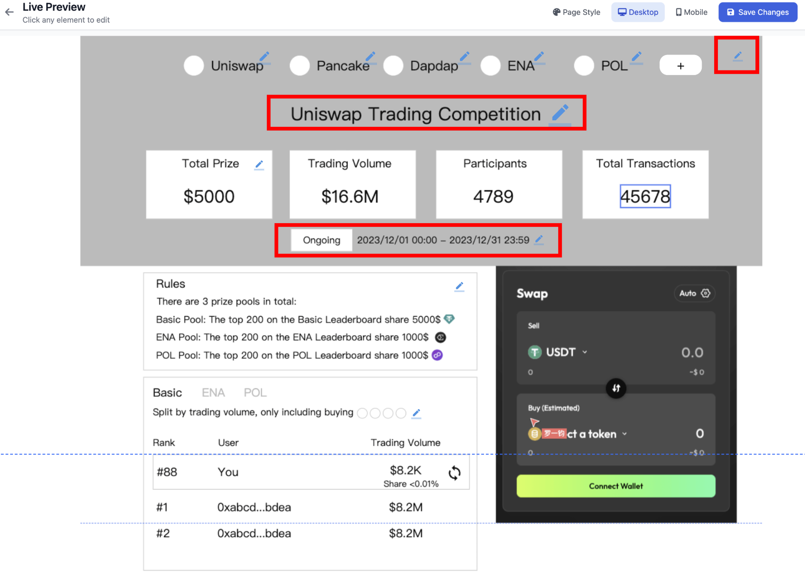

**交互逻辑:**

点击编辑按钮或红色标记的热区后进入编辑弹窗

**弹窗样式:**

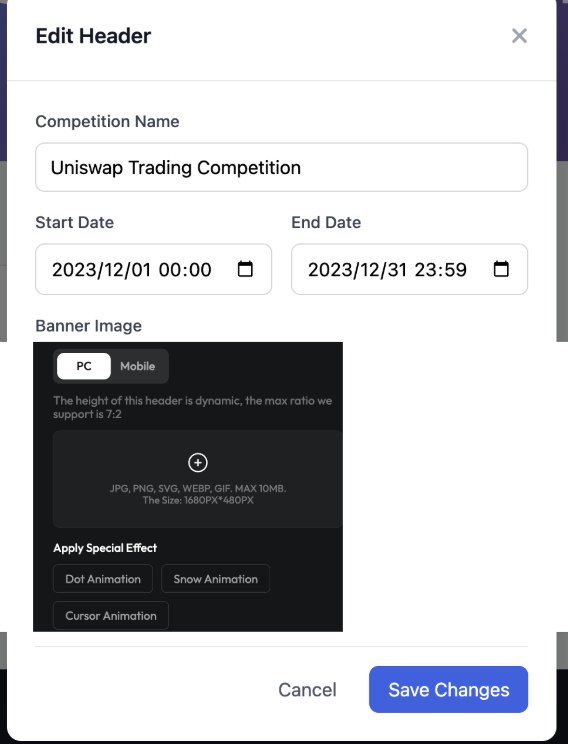

Name: 活动名称, 必填项, 输入框, 限制最多输入100个字符; 默认名称是 Trading Competition

Start date & End date: 必选项, 此处复用 quest 的设置, 默认填写为当前日期的零点到七天后的零点

Banner: 必选项, 同 community 装修模块的设置, 要分别针对 PC 和 mobile 提供一张默认图, 图片的比例 cara 看一下是不是需要更新

Dot animation: 同 community 装修模块的设置, 非必选项

**编辑页面 — 项目信息配置**

默认创建1个项目, Project name 和 logo , twitter 都使用当前项目的.

点击编辑后进入项目列表查看:

**交互逻辑:**

显示项目方配置的头像, 名称, twitter handle

有多项目的情况下支持拖动排序

点击编辑按钮进入编辑弹窗 (编辑弹窗同新建流程中出现的编辑弹窗)

点击删除后, 提供二次确认弹窗, 标题: Confirm delete? , 点击 confirm 后确认删除

点击 add new project 后进入新建流程:

**第一步、引导填入项目方的推特 handle**

点击 fetch 后根据填入的 twitter handle 自动抓取 推特 handle 的 名称和 logo 填入下一步的 project name 和 logo image.

点击 manually upload 后, 进入第二步

**第二步、项目方编辑项目信息**

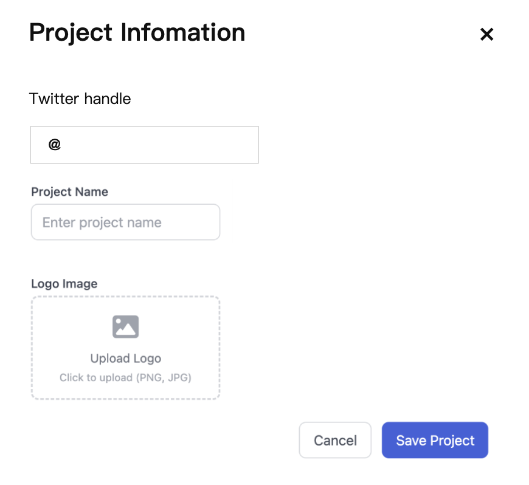

Twitter handle: 从第一步填入的信息带下来, 没有填则为空

Project name: 项目名称

Logo: 项目 logo

**第三步、**

用户点击 save project 后, 需要判断项目方是否已经发了币 (到 CMC 抓取是否有 token 或从 alpha 信息库里抓)

如果没有发币, 则文案提示: Saved successfully

如果已经发了币, 则显示以下弹窗:

**交互逻辑:**

\$\$\$ 是项目名称

Xxx 是 token 名称

点击 cool, continue 后,打开奖池配置弹窗, 自动新建一个 reward pool, 里面的 reward token 指定为项目方的币

点击 cancel 和 × 关闭弹窗

**编辑页面 — 奖励设置**

交互逻辑:

点击编辑按钮或红色标记的热区后进入编辑弹窗

**编辑弹窗样式:**

**指定 Network 和 dex 设置**

所有奖池的交易量统计都共用一套 Network 和 Dex 设置, 设置逻辑复用 request 里的配置. ( 对掉一下, 把dex放左边, network 放右边)

Network 默认值: bnb chain

Dex 默认值: Taskon Aggregator

**奖池配置**

奖池配置区分 basic pool 和指定的 reward pool.

只有一个项目方的情况下:

只能有1个 basic pool

Basic pool 不能关闭

没有 add reward pool 按钮

如果有多个项目方的情况下:

可以有1个或0个Basic Pool，1个或多个指定Pool

Basic pool 可以通过开关开启或关闭

Reward pool 可以通过 add reward pool 按钮增加

**basic pool**

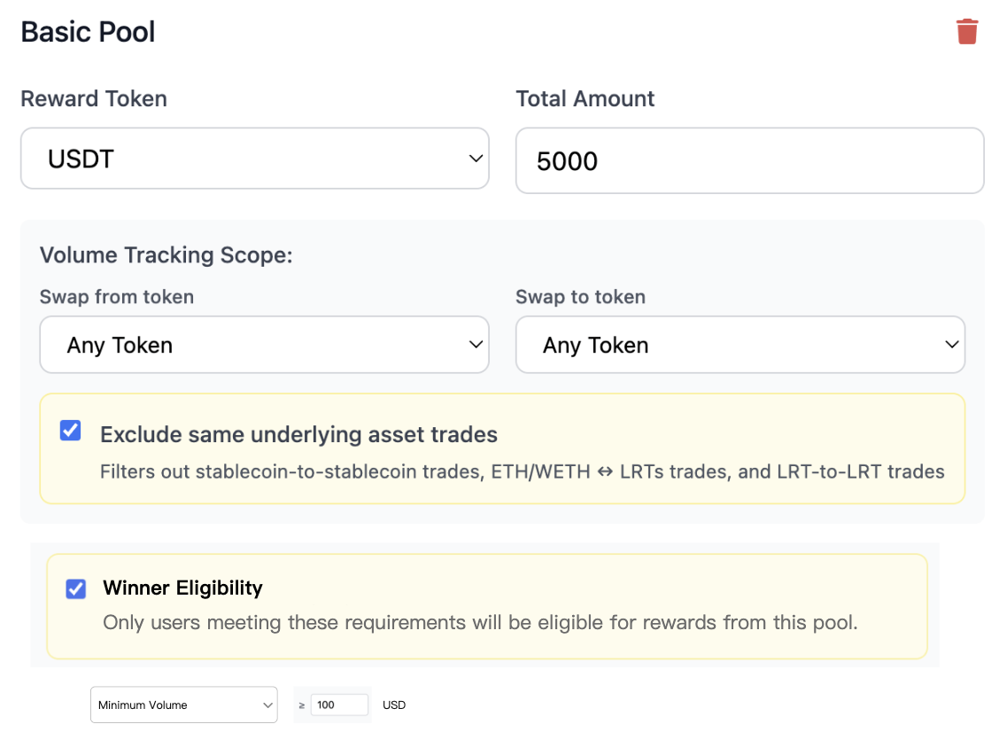

**设置的字段包括:**

奖励的 token: 默认值选 USDT

奖励的 token amount: 默认值 1000

Swap from 和 swap to 配置:

Swap from 指定的 token:

下拉列表选项包括 any token 和 指定 network 下的 token

如果用户选择的选项不是 any token 的情况下, 支持多选其他 token (最多选20个)

默认值: any token

Swap to 指定的 token: 同 Swap from 指定的 token

如果 swap from 和 swap to 都是 any token 的情况下, 提供 Exclude same underlying asset trades 开关

打开开关后, 过滤稳定币之间的交易，以及 ETH/WETH 与 LRTs 和 LRTs 与 LRTs 之间的交易 (待定)

默认打开

Winner Eligibility 设置获奖用户的要求:

开关默认关闭

开启后提供单选下拉列表选择:

(默认选项) 交易量\>=xxx USD

> 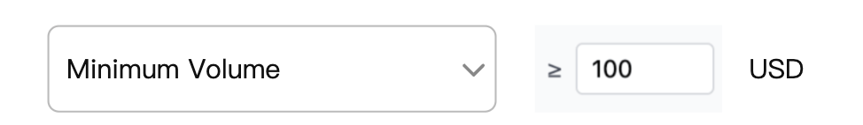

排行榜前xx名

> 

**指定 reward pool**

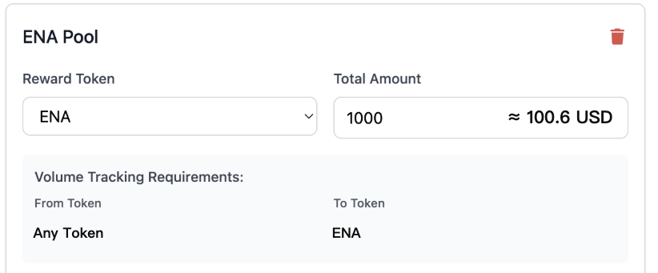

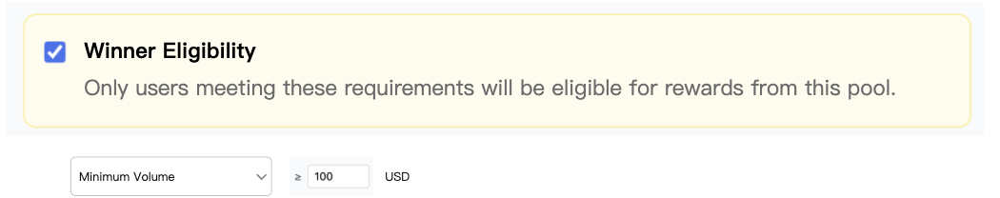

**设置的字段有:**

奖励的 token

奖励的 token amount

Swap from 和 swap to 配置

Swap from 是 any token

Swap to 与奖励的 token 保持一致

Winner Eligibility 设置获奖用户的要求:

开关默认关闭

开启后提供单选下拉列表选择:

(默认选项) 交易量\>=xxx USD，

排行榜前xx名

**交互逻辑:**

有多个指定 reward pool的情况下, 支持拖动 指定 reward pool 排序. 排序影响以下两个地方的显示:

Rule 里的规则说明 (从上到下)

Leaderboard 里的排序 (从上到下映射到从左到右)

支持删除指定 reward pool, 点击后删除

**编辑页面 — Page Style 配置**

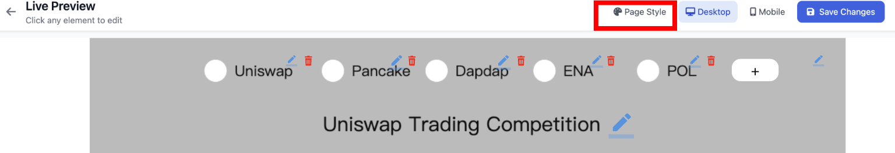

**交互逻辑:**

点击 Page style 后展示配置 background 和主题色弹窗, 配置逻辑同现有的:

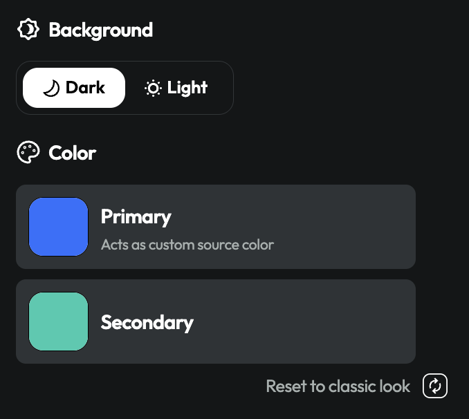

**编辑页面 — 其他功能**

**Token 充值**

当项目方设置了奖池, 且预算余额不足时, 显示以下提示:

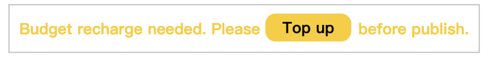

点击 Top up 后, 弹出以下弹窗:

点击 deposit 后, 调起 deposit token 弹窗, 里面的 network, token type 预填对应的 token, amount 自动填充需要充值的余额

关闭 deposit 弹窗后, 仍显示 Top up 弹窗

当项目方设置了奖池, 且预算余额充值完毕时, 显示以下提示:

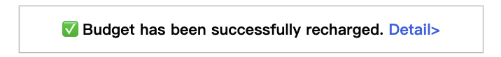

点击 detail 后显示 top up 弹窗

**切换PC/MOBILE 预览样式**

默认使用 PC 的预览样式, 点击 mobile 后切换至移动端预览样式

**Publish/Save as draft/Save Changes**

如果是新建状态的话, 替换成 save as draft 和 publish 按钮

点击 save as draft 后, 保存草稿, 不做任何校验

点击publish 后, 校验两个事情:

预算金额是否已充值完毕

如果未充值完毕, 则提示需要充值: 文案: To publish, please recharge the budget amount. 同时需要高亮 token 充值模块, 引导用户前往充值

是否设置了至少一个奖池

如果不满足条件, 则文案提示: To publish, please set at least one prize pool.

**数据分析**

**汇总数据**

顶部 tab 单选切换显示汇总和每一个 pool (pool 的顺序要与奖池设置顺序保持一致)

注意: 如果只设置了一个 pool, 则不需要提供选项切换

左侧显示 Volume, Participants, Transactions 指标, 提供环比日增数据

右侧是 Volume, Participants, Transactions 指标的日趋势, 提供 7D/30D/all 数据范围筛选.

注意: 由于volume 有可能很大, 而 Participants 很小, 因此要用双轴的坐标趋势图, volume 一组, participants 和 transactions 一组

**Leaderboard 数据**

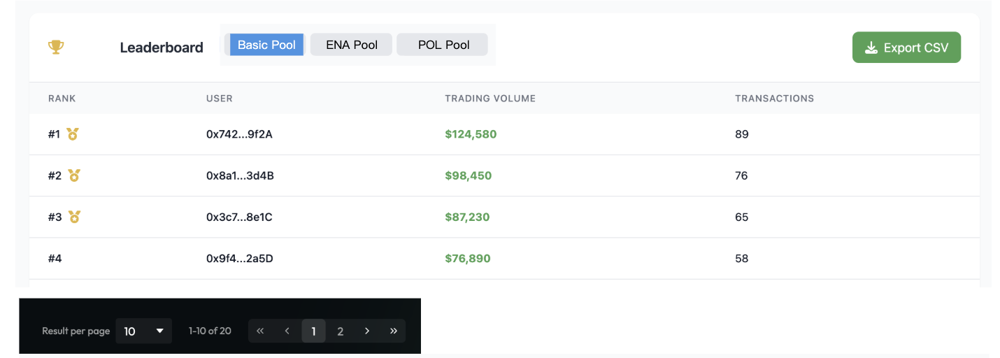

顶部 tab 单选切换每一个 pool 的 数据 (pool 的顺序要与奖池设置顺序保持一致)

注意: 如果只设置了一个 pool, 则不需要提供选项切换

表格提供排名, 做 trading 的用户地址, trading volume, transactions 数据

提供导出按钮, 导出当前选择 pool 下的所有 leaderboard 数据

分页加载组件, 默认一页20条

**明细交易数据**

顶部 tab 单选切换显示汇总和每一个 pool (pool 的顺序要与奖池设置顺序保持一致)

注意: 如果只设置了一个 pool, 则不需要提供选项切换

<table>
<colgroup>
<col style="width: 50%" />
<col style="width: 50%" />
</colgroup>
<tbody>
<tr>
<td>
表格显示的数据字段(按 time 降序排列):

Wallet：做 trading 的用户地址

Chain：交易发生的链

From：数量+币种，比如100USDT（分两列）

To：数量+币种

Time：交易时间

Hash：交易hash
</td>
<td style="text-align: left;"></td>
</tr>
</tbody>
</table>

支持导出
