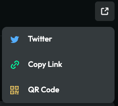
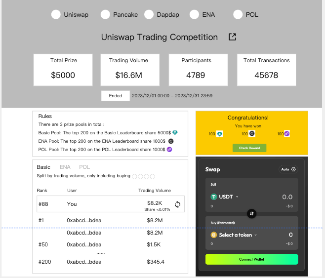

**交易大赛-C端**

**需求背景**

交易大赛支持B端创建一个自己的链上活动页面，C端可以通过活动页面进行链上交互，获取奖励。

活动的基本规则是，用户swap指定币种，在活动结束后根据trading volume比例来瓜分奖池。

**需求详情**

1\. **C端页面**

**活动规则**

一次交易大赛，可以有1个或者多个奖池，取决于项目方的设置

如果包括多个奖池，则可以有1个或0个Basic Pool，1个或多个指定Pool

Basic Pool可以允许三种设置

统计买入多种代币的交易量，需要列出来每一个代币

统计任意交易，但是排除特定币对（比如稳定币对）

统计任意交易

指定pool只能指定统计买入某一个代币的交易量，pool的名字就用代币的名字，比如指定交易ENA，就叫ENA Pool

指定pool有一个独立的Leaderboard

瓜分奖池逻辑有3种

排行榜前xx名，按交易量瓜分奖池（前xx名要分光奖池）

交易量\>=xxx USD，按交易量瓜分奖池（要分光奖池）

无门槛，按交易量瓜分奖池

如果用户交易一笔，条件满足的情况下，可以同时计入Basic Pool和指定Pool

**页面布局**

该页面是一个Dex举办交易大赛的活动页面

页面上需要包括以下内容

活动基本信息

Banner图

标题

分享按钮，复用quest这里的逻辑

> 

持续时间

当前状态：Draft、Upcoming、Ongoing、Ended

主办项目列表

点击项目方的logo，可以跳转到项目方链接（这个由B端配置，如果不配置就没有跳转）

活动数据

Total Prize：总奖池

Trading Volume：总交易量

Participants：参与钱包数

Total Transactions：总交易笔数

奖励发放规则

列出所有奖池的规则和奖励金额，以下是例子

Basic Pool: The top 200 on the Basic Leaderboard share 5000\$ （这里的金额是USD等值金额）

ENA Pool: The users on the ENA Leaderboard with volume \>= 200\$ share 2000\$

POL Pool: The users on the POL Leaderboard share 2000\$

Leaderboard

如果有多个leaderboard，tab可以切换

tab下面，展示当前leaderboard支持的币种

Basic包括以下情况

Split by trading volume, only including buying xxxx代币列表（鼠标悬浮在每个代币logo上面，展示代币的name和address，用户鼠标移动上去可以复制address）

Split by trading volume, excluding same underlying asset（这个分支是排除了稳定币和weth这种币对的情况）

Split by trading volume, including any token

指定pool：Split by trading volume, only including buying xxx

展示自己的名次、交易量、交易占比

如果占比小于0.01%，则显示\<0.01%，如果大于等于0.01%，则显示具体占比，保留两位小数

展示前50名的用户

如果该奖池选择的是top 200瓜分，则在排行榜最下面展示第200名用户的volume，来帮助用户决策

如果全部参与用户\<200人，不展示最后一行

只要选择的是top xxx瓜分，并且xxx\>50，都按照这个逻辑处理

> 

地址

交易量

Swap交互区域

如果活动设置了只限定部分币种，Swap to的代币列表打开，优先展示一个Eligible Token区域，列出来所有纳入统计的币种

1.1 **C端页面-单Leaderboard状态**

1.2 **获奖状态**

活动结束，用户已登录，且用户获奖

展示所有获得的代币数量

点击Check Reward，跳转Assets页面

1.3 **未获奖状态**

活动结束，用户已登录，且用户未获奖

用户点击check another account，触发登录弹窗，如果用户登录了新账号，则切换到新账号的状态

1.4 **未登录状态**

活动结束，且用户未登录

点击Connect，触发登录弹窗

