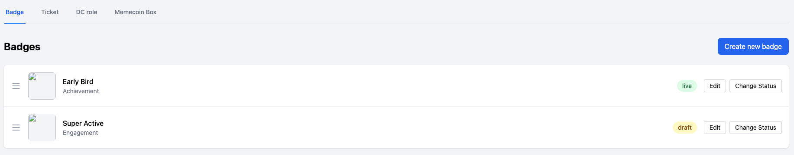
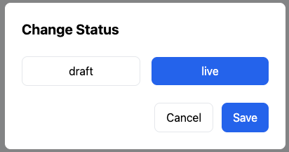

**运营体系需求文档**

Gem和XP的基础介绍

Gem基础玩法，里程碑玩法

~~新手Onboarding流程~~

**运营体系基础介绍**

1\. **用户运营体系**

用户在Taskon可以获得两类积分，第一个是EXP，就是我们之前的EXP；第二个是GEM（名字未确定）。

EXP是针对低价值行为的奖励，机器人获得也无所谓；GEM是针对高价值行为的奖励，比如Onchain行为。

EXP决定了用户等级，之前我们的用户升级体系有三种不同条件，要统一成EXP，并处理掉EXP升级的bug。

GEM是参与Season奖励的核心指标，比如当前Season奖励采用里程碑玩法，每个用户达到xx个GEM就可以解锁对应奖励。

2\. **里程碑玩法**

里程碑玩法，就是每个用户可以自己积累GEM，达到目标数量后就可以领取这个档位的奖励。

里程碑是按照Season来计算的，只计算本个Season期间内获取的GEM，不统计历史GEM。

里程碑中可以配置的奖励类型如下：

Token：固定数量或者随机数量

GEM：固定数量或者随机数量

Badge

~~DC role~~

~~Memecoin Box：可以开出各种币的盒子，提前买一些乱七八糟的meme币放入Box里~~

临时买

Ticket：一种可消耗的凭证，可以用于各种地方，比如赛季末抽一个大奖

这些奖励类型也可以在Action中发放。

在运营后台需要有一个统一的地方能创建和管理这些奖励。

**运营后台配置**

所有涉及Memecoin Box的都先不做。

DC Role的部分也不做。

1\. **定义奖励**

 定义奖励页面可以定义Badge、Ticket、~~DC role、Memecoin Box~~四种奖励。

**页面布局**

顶部是四个tab，表示四种奖励类型，分别是Badge、Ticket、DC role、~~Memecoin Box~~。

Badge页面

> 

有一个Create new badge按钮

点击打开弹窗

标题：Create new badge

输入Badge name

选择框，选择Category

下拉框展示目前所有存在的Category

如果要新增Category，只能由技术配置进去

目前只有一个Category：Education（技能教学类）

上传图片

Save as draft按钮

Cancel按钮

Save之后，会新建成功一个draft状态的badge，draft状态不会展示在C端，也不能作为reward发放

需要管理员通过change status，改为live状态，才会展示在C端和作为reward发放

一个列表，展示当前所有存在的Badge，列表字段如下

拖拽按钮，可以拖拽排序

图片：点击可以看大图

Badge name

Category

Claimed Amount：多少人领过

Status：draft、live

Edit按钮

点击打开弹窗，可以Edit

标题：Edit

编辑Badge name

编辑图片

Save按钮

Cancel按钮

Change Status按钮

live改成draft，需要判断一下是否有当前ongoing的任何reward是该badge，并且没有任何人获得过，如果还存在，则报错不能改。

> 

该板块权限控制

Reward运营权限：查看badge列表，创建draft，编辑draft

Reward管理权限：Change status，编辑live badge，拖拽排序

Ticket页面

> 

有一个Create new ticket按钮

点击打开弹窗

> 

标题：Create new ticket

输入Ticket name

输入Description

上传图片

Save as draft按钮

Cancel按钮

Save之后，会新建成功一个draft状态的ticket，draft状态不会展示在C端，也不能作为reward发放

需要管理员通过change status，改为live状态，才会展示在C端和作为reward发放

一个列表，展示当前所有存在的Ticket，列表字段如下

图片：点击可以看大图

Ticket name

Description

Claimed Amount：多少人领过

Status：draft、live

Edit按钮

点击打开弹窗，可以Edit

> 

标题：Edit

编辑Ticket name

编辑Description

编辑图片

Save按钮

Cancel按钮

Change Status按钮

live改成draft，需要判断一下是否有当前ongoing的任何reward是该Ticket，如果还存在，则报错不能改。

该板块权限控制

Reward运营权限：查看列表，创建draft，编辑draft

Reward管理权限：Change status，编辑live ticket

~~DC role~~

有一个Create new DC role按钮

点击打开弹窗，复用当前添加DC role的流程

> 

下面有两个按钮，Save和Cancel，Save必须完成所有DC role添加流程才能点

Save之后，会新建成功一个draft状态的DC role，draft状态不会展示在C端，也不能作为reward发放

需要管理员通过change status，改为live状态，才会展示在C端和作为reward发放

一个列表，展示当前所有存在的DC role，列表字段如下

DC Server

Role name

Claimed Amount：多少人领过

Status：draft、live

Change Status按钮

live改成draft，需要判断一下是否有当前ongoing的任何reward是该DC role，如果还存在，则报错不能改。

该板块权限控制

Reward运营权限：查看列表，创建draft

Reward管理权限：Change status

~~Memecoin Box（去掉这个）~~

> 

有一个Create new Box按钮

点击打开弹窗

> 

标题：Create new Box

输入Box name

添加代币

选择Network

选择Token

输入数量

添加下一个代币

删除一个代币

Availabel Amount：输入Box的限额数量

Save as draft按钮

点击会校验余额中是否有足够的代币，不够会报错

Cancel按钮

Save之后，会新建成功一个draft状态的Box，draft状态不会展示在C端，也不能作为reward发放

需要管理员通过change status，改为live状态，才会展示在C端和作为reward发放

一个列表，展示当前所有存在的Box，按照创建时间倒序排列，列表字段如下

Box ID

Box name

Token list：1000/2000 TokenA, 2000/3000 TokenB（展示盒子里所有token的列表，前面的数字是剩余token，后面的是最初的总量）

Claimed Amount：2000/3000，前面是领过的人数，后面是总数限制

Status：draft、live、canceled

Edit按钮

> 

标题：Create new Box

编辑Box name

编辑代币

选择Network

选择Token

输入数量

添加下一个代币

删除一个代币

Availabel Amount：编辑Box的限额数量

Save as draft按钮

点击会校验余额中是否有足够的代币，不够会报错

Cancel按钮

Change Status按钮

draft状态：不触发余额冻结

draft变更为live的时刻，要把memecoin占用的token余额冻结掉，用于发给用户

draft无法变更为canceled

live状态

live只有在没有发放过、并且没有当前ongoing的任何reward是该box，才能变更为draft，否则会报错

live在发放过、并且没有当前ongoing的任何reward是该box，才能变更为canceled，否则会报错

变成canceled，会把剩余未发放的token解除冻结

canceled状态

canceled状态无法变更为其他状态

2\. **设置里程碑**

**里程碑基本规则**

只能有一个Live的里程碑，所有用户展示相同的里程碑；

可以设置一个Upcoming的里程碑，时间在Live的里程碑结束之后立刻开始；

里程碑奖励中分为限量奖励和无限量奖励，限量奖励需要处理发光的问题；

比如限量奖励是Token，那么可以设置目标人数和衰减阈值比例，让有限的资金可以无限领取，防止越界；

这里开发可以自己设计算法，核心目标就是防止资金完全发光剩下的人领不了奖，同时要兼顾充值资金的场景；

Token发放过快可以自动报警，提醒我们去补充资金；

> 

**页面布局**

顶部tab分别是：Ongoing里程碑，Live里程碑，History

Ongoing里程碑页面

里程碑Name：输入框

Start Time：时间输入框

旁边有一个开关Start Instantly，打开就会在Live里程碑结束后立即开始（第一个里程碑打开这个会立刻开始）

没打开就要校验Start Time在Live里程碑的结束时间之后

End Time：时间输入框，旁边有一个开关No End Time，打开就没有结束时间

Status：draft或者ongoing

里程碑节点列表

点击创建节点，弹窗填写以下内容

> 

节点要求Gem数量：输入框，只能输入数字

节点奖励

每个节点只能选择1个奖励

选择类别：Token、Gem、Badge、DC role、~~Memecoin Box~~、Ticket

选择Gem

固定数量，输入一个固定数量的Gem奖励

随机数量，输入下限、上限、平均值，三个数量

选择Badge，下拉列表，选择存在的Badge

这里不能发education累的badge

选择DC role，下拉列表，选择存在的DC role

选择Ticket，下拉列表，选择存在的Ticket

输入Ticket的数量

选择Token

选择Network和Token

随机数量，输入下限、上限、平均值

预估目标人数

~~选择Memecoin Box~~

> 

输入Box name

添加代币

选择Network

选择Token

输入下限、上限、平均值

添加下一个代币

删除一个代币

预估目标人数

可以删除节点

已创建的节点，根据要求Gem数量自动排序，从小到大

总预算列表

列表字段：Network、Token、Amount（Amount=平均值\*预估目标人数）

上述节点奖励中，选择的所有Token和Memecoin box设计的token，汇总展示在这里

可用余额列表

展示运营账户中的可用资产列表

列表字段：Network、Token、Amount

按钮

Save：点击后保存草稿

Change Status：点击后弹窗，可以编辑Status

变更为Ongoing状态时，需要检查可用余额足够，并冻结掉预算资产

Ongoing重新变更为draft时，解除预算资产冻结

权限控制

里程碑运营权限：draft状态下，所有字段的编辑和Save

里程碑管理权限：Change status

Live里程碑

> 

里程碑Name

End Time：时间输入框，旁边有一个开关No End Time（可以编辑）

里程碑节点列表（按照Gem数量从小到大排序）

要求Gem数量

奖励类型

Gem类

固定数量，展示一个固定数量的Gem奖励

随机数量，展示下限、上限、平均值，三个数量

Badge类：展示name

~~DC role类：展示Server name和Role name~~

Ticket类：展示Ticket name

Token类：Network、Token、下限、上限、平均值、预估人数。旁边有一个增加预算按钮。

点击增加预算，弹窗，输入增加人数，根据平均值自动计算出来需要额外增加的预算，展示出来

点击确认，如果余额足够，则冻结余额

如果余额不足，报错

~~Memebox~~：代币列表（每个代币都有Network、Token、下限、上限、平均值），预估人数。旁边有一个增加预算按钮。

点击增加预算，弹窗，输入增加人数，根据平均值自动计算出来需要额外增加的预算，展示出来（这里需要计算所有代币的预算）

点击确认，如果余额足够，则冻结余额

如果余额不足，报错

每一个节点的达成人数和领奖人数

按钮

Confirm Change：点击后确认变更，目前只有结束时间可以变更

权限控制

里程碑管理权限：变更时间、增加预算、Confirm Change

History

顶部是一个列表切换，可以切换不同的里程碑name

下面展示对应里程碑的信息，字段与Live里程碑页面相同

去掉增加预算按钮

End time不可编辑

没有Confirm Change按钮

3\. **C端页面**

3.1 **导航栏**

**页面布局**

导航栏增加Gem的等级展示

鼠标悬浮/点击Gem区域，向下展开Milestone

鼠标离开Gem区域或Milestone区域，则收起Milestone区域

Milestone区域

标题

介绍文案：Only GEM earned during the season is counted

倒计时，显示里程碑结束时间，如果设置的是no end time，则不显示倒计时

下面是从小到大的里程碑节点

默认画面中心尽量定位在用户本season获得的gem数量位置（如果在刚开始，比如gem为0，不用定位在中心）

每一个节点，展示需要的gem数量和奖励，这里的节点和奖励是运营后台配置出来的

可领取奖励展示claim按钮，点击claim按钮弹窗展示领取成功，六种不同的奖励弹窗如下

> 

已领取奖励展示已领取状态

如果奖励领光了，且用户还没领，展示为Reward are gone状态

节点可以用鼠标上下拖动，查看各个奖励

点击Earn more GEM，跳转到Onchain新板块

里程碑结束之后，如果用户有没claim的奖，自动帮他领掉

3.2 **用户中心**

去掉Membership，去掉leaderboard

**页面布局**

顶部是头像

下面是Gem的数量、等级、升级进度条

再下面是EXP的数量、等级、升级进度条

右上区域是Milestone组件，替换掉之前的leaderboard

4\. **等级体系**

4.1 **Gem等级**

**Gem获取特效**

每一次获取到Gem，右上角展示Gem进度条变动的特效，如果恰好升级了要给一个升级的特效

Gem增加后，导航栏和用户中心的Gem数量要同时更新

特效分为加分不升级和加分升级两种样式

**Gem升级规则**

|      |     |
|:-----|:----|
| Lv.0 | 0   |
| Lv.1 |     |
| Lv.2 |     |
| Lv.3 |     |
| Lv.4 |     |
| Lv.5 |     |
| Lv.6 |     |

4.2 **EXP等级**

**EXP历史数据清理逻辑**

取消所有历史等级

保留所有历史EXP

根据最新的EXP升级规则，重新清算所有用户的等级

新版本上线时，告知用户等级重置了

**EXP升级规则**

|      |     |
|:-----|:----|
| Lv.0 | 0   |
| Lv.1 |     |
| Lv.2 |     |
| Lv.3 |     |
| Lv.4 |     |
| Lv.5 |     |
| Lv.6 |     |
| Lv.7 |     |
| Lv.8 |     |
| Lv.9 |     |
