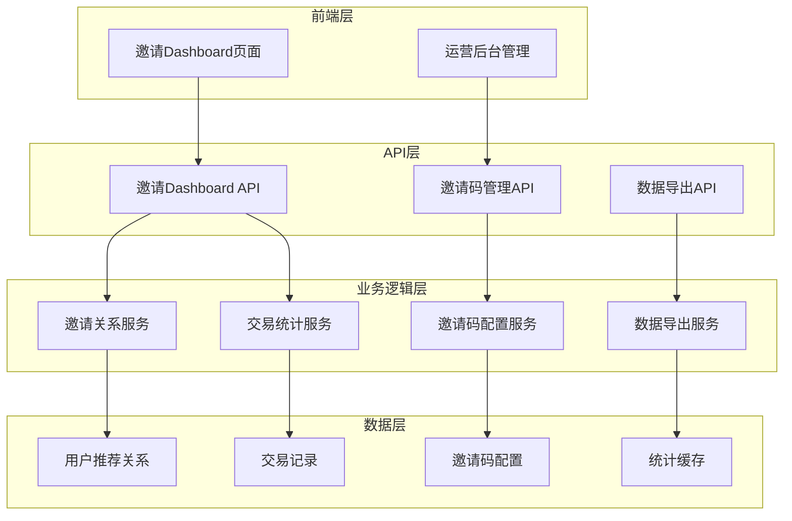
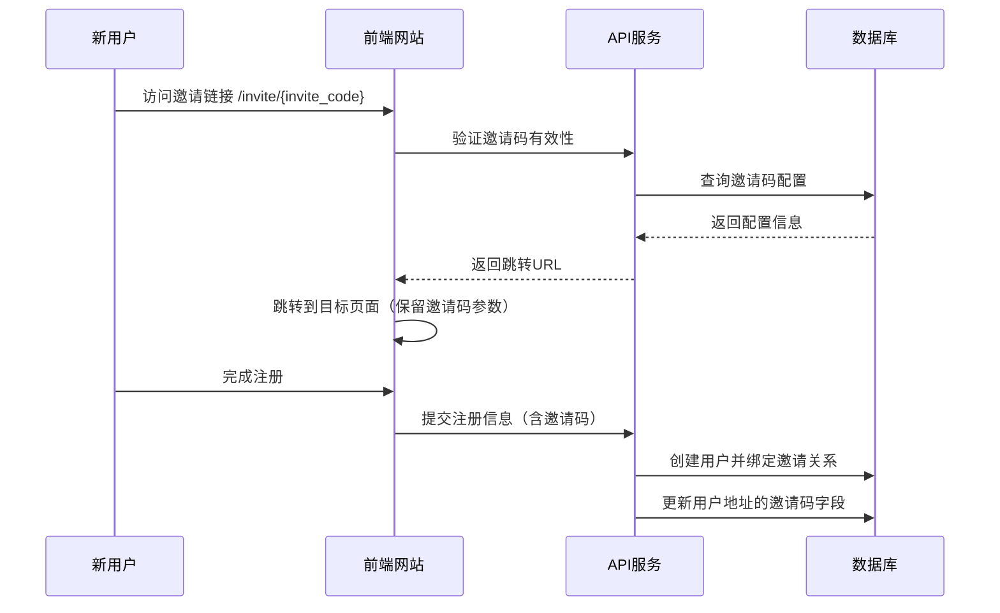
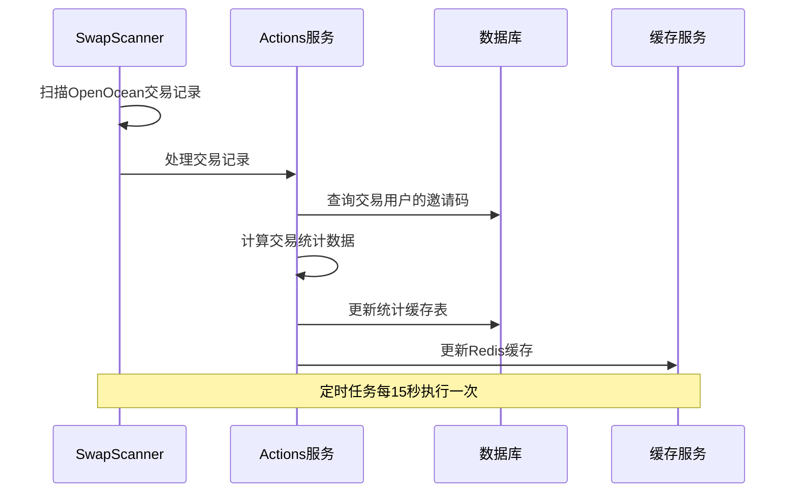
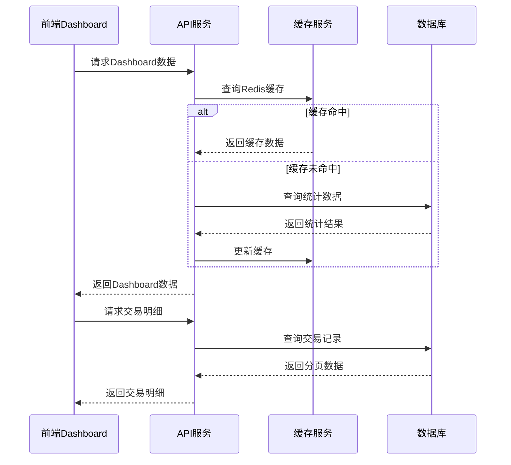
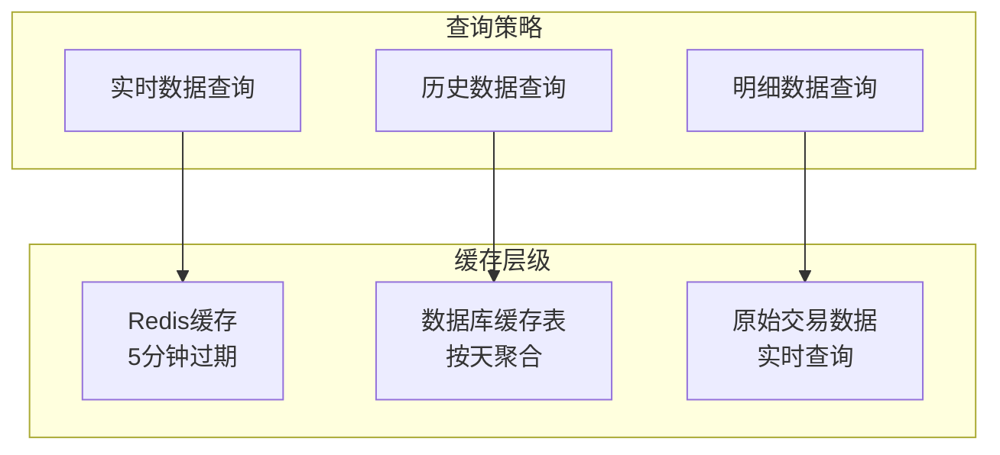
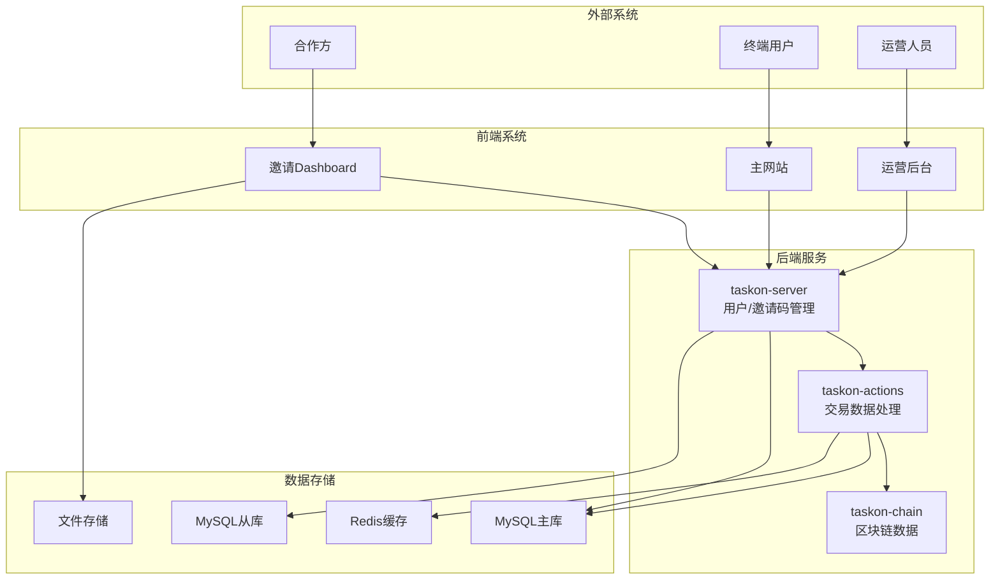
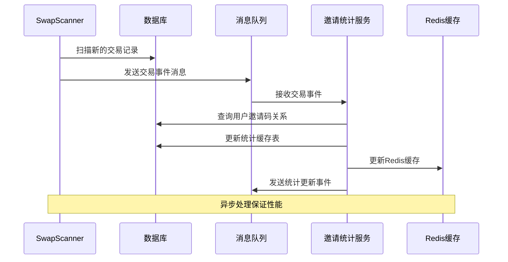

# 邀请Dashboard技术方案与任务拆解

## 1. 需求分析总结

### 1.1 核心需求
- 为流量合作方提供专属邀请链接生成和管理功能
- 实时统计邀请用户的注册数、交易数、交易量和交易费用
- 提供时间维度筛选（Yesterday、7D、30D）和交易明细查看
- 支持交易明细数据的CSV导出功能
- 运营后台支持邀请码管理和费率配置

### 1.2 业务关键点
- **邀请关系绑定**: 用户通过邀请链接注册后建立永久绑定关系
- **交易数据统计**: 统计邀请用户在TaskOn平台的swap交易数据
- **费率分成管理**: 支持不同邀请码配置不同的费率分成比例
- **数据透明化**: 为合作方提供透明的数据展示和导出功能

## 2. 现有系统分析

### 2.1 现有推荐系统（taskon-server）

**可复用组件：**
- **用户推荐关系**: users表中的invite_code、invite_by字段
- **邀请码生成**: GenerateUserInviteCode()函数
- **邀请码验证**: GetUserIdByInviteCode()函数
- **推荐关系绑定**: 用户注册时的newUser()逻辑

**数据库表结构：**
```sql
-- users表相关字段
invite_code VARCHAR(64) NOT NULL DEFAULT '' INDEX,
customize_invite_code VARCHAR(32) NOT NULL DEFAULT '' INDEX,
invite_by INTEGER NOT NULL DEFAULT 0 INDEX
```

### 2.2 现有交易系统（taskon-actions）

**可复用组件：**
- **交易记录存储**: open_ocean_swap_record表
- **交易数据扫描**: SwapScanner组件
- **用户交易历史**: user_token_swap_history表
- **交易统计方法**: GetOpenOceanSwapStats()函数

**核心数据结构：**
```go
type OpenOceanSwapRecord struct {
    TxHash     string    `db:"tx_hash"`
    Sender     string    `db:"sender"`
    UsdValue   string    `db:"usd_value"`
    Fee        string    `db:"fee"`
    Chain      string    `db:"chain"`
    BlockTime  int       `db:"block_time"`
    // ... 其他字段
}
```

## 3. 技术方案设计

### 3.1 整体架构设计



### 3.2 数据库设计

#### 3.2.1 新增表结构

**邀请码配置表 (invite_code_configs)**
```sql
CREATE TABLE invite_code_configs (
    id BIGINT PRIMARY KEY AUTO_INCREMENT,
    invite_code VARCHAR(64) NOT NULL UNIQUE COMMENT '邀请码',
    owner_user_id BIGINT NOT NULL COMMENT '所有者用户ID',
    redirect_url VARCHAR(512) NOT NULL DEFAULT '' COMMENT '跳转URL',
    fee_rate DECIMAL(5,4) NOT NULL DEFAULT 0.0000 COMMENT '费率分成比例',
    status TINYINT NOT NULL DEFAULT 1 COMMENT '状态 1-启用 0-禁用',
    created_by BIGINT NOT NULL COMMENT '创建者ID',
    description TEXT COMMENT '描述',
    create_time TIMESTAMP NOT NULL DEFAULT CURRENT_TIMESTAMP,
    update_time TIMESTAMP NOT NULL DEFAULT CURRENT_TIMESTAMP ON UPDATE CURRENT_TIMESTAMP,
    INDEX idx_invite_code (invite_code),
    INDEX idx_owner_user_id (owner_user_id),
    INDEX idx_status (status)
) ENGINE=InnoDB DEFAULT CHARSET=utf8mb4 COMMENT='邀请码配置表';
```

**邀请统计缓存表 (invite_statistics_cache)**
```sql
CREATE TABLE invite_statistics_cache (
    id BIGINT PRIMARY KEY AUTO_INCREMENT,
    invite_code VARCHAR(64) NOT NULL COMMENT '邀请码',
    stat_date DATE NOT NULL COMMENT '统计日期',
    register_users INT NOT NULL DEFAULT 0 COMMENT '注册用户数',
    trading_users INT NOT NULL DEFAULT 0 COMMENT '交易用户数',
    trading_volume DECIMAL(20,8) NOT NULL DEFAULT 0 COMMENT '交易量USD',
    trading_fee DECIMAL(20,8) NOT NULL DEFAULT 0 COMMENT '交易费用',
    create_time TIMESTAMP NOT NULL DEFAULT CURRENT_TIMESTAMP,
    update_time TIMESTAMP NOT NULL DEFAULT CURRENT_TIMESTAMP ON UPDATE CURRENT_TIMESTAMP,
    UNIQUE KEY uk_invite_code_date (invite_code, stat_date),
    INDEX idx_invite_code (invite_code),
    INDEX idx_stat_date (stat_date)
) ENGINE=InnoDB DEFAULT CHARSET=utf8mb4 COMMENT='邀请统计缓存表';
```

#### 3.2.2 现有表扩展

**用户地址表 (user_addresses) 扩展**
```sql
-- 添加邀请码字段，用于快速查询
ALTER TABLE user_addresses 
ADD COLUMN invite_code VARCHAR(64) NOT NULL DEFAULT '' COMMENT '用户邀请码',
ADD INDEX idx_invite_code (invite_code);
```

### 3.3 核心业务流程

#### 3.3.1 邀请关系建立流程



#### 3.3.2 交易数据统计流程



#### 3.3.3 数据查询与展示流程



### 3.4 API接口设计

#### 3.4.1 邀请Dashboard相关接口

**获取邀请Dashboard数据**
```javascript
// GET /api/invite/dashboard/{invite_code}
{
    "invite_code": "ABC123",
    "invite_link": "https://taskon.xyz/invite/ABC123",
    "stats": {
        "register_users": 150,
        "trading_users": 89,
        "trading_volume": "125860.50",
        "trading_fee": "2517.21"
    },
    "time_range": "yesterday" // yesterday, 7d, 30d
}
```

**获取交易明细列表**
```javascript
// GET /api/invite/transactions/{invite_code}
{
    "transactions": [
        {
            "time": "2024-01-15T10:30:00Z",
            "network": "ethereum",
            "trading_value": "1250.00",
            "trading_fee": "25.00",
            "address": "0x1234...5678"
        }
    ],
    "pagination": {
        "page": 1,
        "page_size": 50,
        "total": 1250
    }
}
```

**导出交易明细**
```javascript
// POST /api/invite/export/{invite_code}
{
    "time_range": "7d",
    "format": "csv"
}
// 返回CSV文件下载链接
```

#### 3.4.2 邀请码管理接口（运营后台）

**创建邀请码配置**
```javascript
// POST /api/admin/invite-codes
{
    "invite_code": "PARTNER001",
    "owner_user_id": 12345,
    "redirect_url": "https://taskon.xyz/chainearn",
    "fee_rate": 0.0020,
    "description": "合作伙伴A的邀请码"
}
```

**更新邀请码配置**
```javascript
// PUT /api/admin/invite-codes/{invite_code}
{
    "redirect_url": "https://taskon.xyz/special-event",
    "fee_rate": 0.0025,
    "status": 1
}
```

### 3.5 缓存策略设计

#### 3.5.1 多层缓存架构



#### 3.5.2 缓存Key设计

**Redis缓存Key：**
```
invite:stats:{invite_code}:{time_range}    # 统计数据缓存
invite:transactions:{invite_code}:{page}   # 交易明细分页缓存
invite:export:{invite_code}:{timestamp}    # 导出任务状态
```

**缓存过期策略：**
- 统计数据缓存：5分钟
- 交易明细缓存：10分钟
- 导出任务缓存：1小时

### 3.6 性能优化策略

#### 3.6.1 数据库优化

**索引策略：**
```sql
-- 用户地址表优化
CREATE INDEX idx_user_addresses_invite_code_time ON user_addresses(invite_code, create_time);

-- 交易记录表优化
CREATE INDEX idx_swap_record_sender_time ON open_ocean_swap_record(sender, block_time);
CREATE INDEX idx_swap_record_time_value ON open_ocean_swap_record(block_time, usd_value);
```

**查询优化：**
- 使用分区表按时间分区存储交易记录
- 预聚合统计数据到缓存表
- 使用读写分离减少查询压力

#### 3.6.2 API性能优化

**并发控制：**
```go
// 限制并发查询数量
var queryLimiter = make(chan struct{}, 10)

func (s *InviteService) GetDashboardData(inviteCode string) (*DashboardData, error) {
    queryLimiter <- struct{}{}
    defer func() { <-queryLimiter }()
    
    // 查询逻辑
}
```

**批量处理：**
- 批量查询用户地址映射
- 批量计算交易统计数据
- 异步处理数据导出任务

## 4. 修改范围与内容

### 4.1 taskon-server修改

#### 4.1.1 数据库层 (store/)
**新增文件：**
- `invite_code_config_db.go` - 邀请码配置数据库操作
- `invite_statistics_cache_db.go` - 邀请统计缓存数据库操作

**修改文件：**
- `user_db.go` - 扩展用户邀请码查询方法
- `user_address_db.go` - 添加邀请码字段和相关查询

#### 4.1.2 业务逻辑层 (service/)
**新增文件：**
- `invite/invite_service.go` - 邀请码管理服务
- `invite/invite_dashboard_service.go` - Dashboard数据服务
- `invite/invite_export_service.go` - 数据导出服务

**修改文件：**
- `user/user_service.go` - 扩展用户注册逻辑，支持邀请码绑定到地址

#### 4.1.3 API层 (api/)
**新增文件：**
- `handlers/invite/invite_dashboard_handler.go` - Dashboard API处理器
- `handlers/invite/invite_admin_handler.go` - 管理后台API处理器

**修改文件：**
- `jsonrpc/handler.go` - 注册新的API处理器

### 4.2 taskon-actions修改

#### 4.2.1 数据处理层
**修改文件：**
- `service/swap_scanner/swap_scanner.go` - 添加邀请码统计逻辑
- `store/open_ocean_swap_record_db.go` - 扩展查询方法支持邀请码筛选

#### 4.2.2 统计服务
**新增文件：**
- `service/invite_statistics/invite_statistics_service.go` - 邀请统计服务

### 4.3 前端修改

#### 4.3.1 邀请Dashboard页面
**新增文件：**
- `pages/invite-dashboard/[invite_code].vue` - Dashboard主页面
- `components/InviteStats.vue` - 统计卡片组件
- `components/TransactionTable.vue` - 交易明细表格
- `components/ExportModal.vue` - 导出功能模态框

#### 4.3.2 运营后台页面
**新增文件：**
- `pages/admin/invite-codes/index.vue` - 邀请码管理列表
- `pages/admin/invite-codes/create.vue` - 创建邀请码
- `pages/admin/invite-codes/edit.vue` - 编辑邀请码

## 5. 系统交互设计

### 5.1 服务间交互架构



### 5.2 数据同步机制



## 6. 开发任务拆解

### 6.1 数据库设计与实现 (2个任务)

#### 6.1.1 数据库表结构设计
- **任务描述**: 设计和创建邀请码配置表、统计缓存表
- **交付物**: 数据库迁移脚本、表结构文档
- **技术要点**: 索引优化、分区策略、字段设计

#### 6.1.2 数据库操作层实现
- **任务描述**: 实现邀请码和统计数据的数据库操作方法
- **交付物**: store层相关Go文件
- **技术要点**: CRUD操作、批量处理、事务管理

### 6.2 后端服务开发 (5个任务)

#### 6.2.1 邀请码管理服务
- **任务描述**: 实现邀请码的创建、编辑、删除、查询功能
- **交付物**: invite_service.go, invite_admin_handler.go
- **技术要点**: 参数验证、权限控制、配置管理

#### 6.2.2 邀请关系绑定服务
- **任务描述**: 修改用户注册流程，支持邀请码绑定到用户地址
- **交付物**: 修改user_service.go, user_address_db.go
- **技术要点**: 注册流程改造、地址映射、数据一致性

#### 6.2.3 Dashboard数据服务
- **任务描述**: 实现Dashboard统计数据的查询和聚合
- **交付物**: invite_dashboard_service.go, invite_dashboard_handler.go
- **技术要点**: 数据聚合、缓存策略、性能优化

#### 6.2.4 交易明细查询服务
- **任务描述**: 实现交易明细的分页查询和筛选功能
- **交付物**: 扩展open_ocean_swap_record_db.go查询方法
- **技术要点**: 分页查询、条件筛选、性能优化

#### 6.2.5 数据导出服务
- **任务描述**: 实现交易明细的CSV导出功能
- **交付物**: invite_export_service.go, 导出API
- **技术要点**: 异步处理、文件生成、下载链接

### 6.3 交易数据统计 (3个任务)

#### 6.3.1 SwapScanner扩展
- **任务描述**: 修改SwapScanner支持邀请码统计
- **交付物**: 修改swap_scanner.go
- **技术要点**: 事件处理、数据关联、性能优化

#### 6.3.2 邀请统计服务
- **任务描述**: 实现邀请码相关的统计计算服务
- **交付物**: invite_statistics_service.go
- **技术要点**: 数据聚合、实时计算、缓存更新

#### 6.3.3 缓存策略实现
- **任务描述**: 实现Redis缓存的读写逻辑
- **交付物**: 缓存相关工具类和方法
- **技术要点**: 缓存策略、过期管理、数据一致性

### 6.4 前端页面开发 (4个任务)

#### 6.4.1 邀请Dashboard页面
- **任务描述**: 实现邀请Dashboard的主页面和统计展示
- **交付物**: Vue页面组件、统计卡片组件
- **技术要点**: 响应式设计、数据可视化、实时更新

#### 6.4.2 交易明细表格
- **任务描述**: 实现交易明细的表格展示和分页
- **交付物**: TransactionTable.vue组件
- **技术要点**: 分页查询、数据筛选、表格展示

#### 6.4.3 数据导出功能
- **任务描述**: 实现数据导出的前端交互
- **交付物**: ExportModal.vue组件
- **技术要点**: 异步处理、文件下载、进度提示

#### 6.4.4 运营后台页面
- **任务描述**: 实现邀请码管理的后台页面
- **交付物**: 管理页面组件
- **技术要点**: 表单验证、列表管理、权限控制

### 6.5 系统集成与测试 (2个任务)

#### 6.5.1 服务集成测试
- **任务描述**: 完成各服务间的集成测试
- **交付物**: 集成测试用例、测试报告
- **技术要点**: 接口测试、数据一致性测试、性能测试

#### 6.5.2 端到端功能测试
- **任务描述**: 完成完整业务流程的端到端测试
- **交付物**: E2E测试用例、用户验收测试
- **技术要点**: 业务流程测试、用户体验测试、边界测试

## 7. 技术风险与应对

### 7.1 主要技术风险

#### 7.1.1 数据一致性风险
- **风险描述**: 多服务间数据同步可能出现不一致
- **应对措施**: 
  - 使用事务保证关键操作的原子性
  - 实现数据校验和修复机制
  - 建立监控告警系统

#### 7.1.2 性能风险
- **风险描述**: 大量数据查询可能影响系统性能
- **应对措施**:
  - 实现多层缓存策略
  - 优化数据库查询和索引
  - 使用异步处理和批量操作

#### 7.1.3 数据安全风险
- **风险描述**: 邀请码和交易数据的安全性
- **应对措施**:
  - 实现访问权限控制
  - 数据脱敏和加密存储
  - 操作日志记录和审计

### 7.2 业务风险与应对

#### 7.2.1 数据准确性风险
- **风险描述**: 统计数据计算错误影响结算
- **应对措施**:
  - 实现数据校验机制
  - 定期数据比对和修复
  - 建立数据质量监控

#### 7.2.2 系统可用性风险
- **风险描述**: 系统故障影响合作方数据查看
- **应对措施**:
  - 实现服务降级和熔断机制
  - 建立灾备和恢复方案
  - 实时监控和告警系统

## 8. 总结

本技术方案通过复用现有的推荐系统和交易系统，实现了邀请Dashboard的完整功能。方案采用微服务架构，具有良好的扩展性和维护性。通过合理的数据库设计、缓存策略和性能优化，能够满足大规模数据处理的需求。

**关键技术特点：**
1. **最大化复用**: 充分利用现有的用户推荐关系和交易数据处理逻辑
2. **模块化设计**: 采用清晰的分层架构，便于开发和维护
3. **性能优化**: 多层缓存和数据库优化保证系统性能
4. **数据一致性**: 通过事务和异步处理保证数据一致性
5. **可扩展性**: 支持未来功能扩展和业务变化

该方案在技术上可行，复用程度高，能够快速实现业务需求并保证系统稳定性。