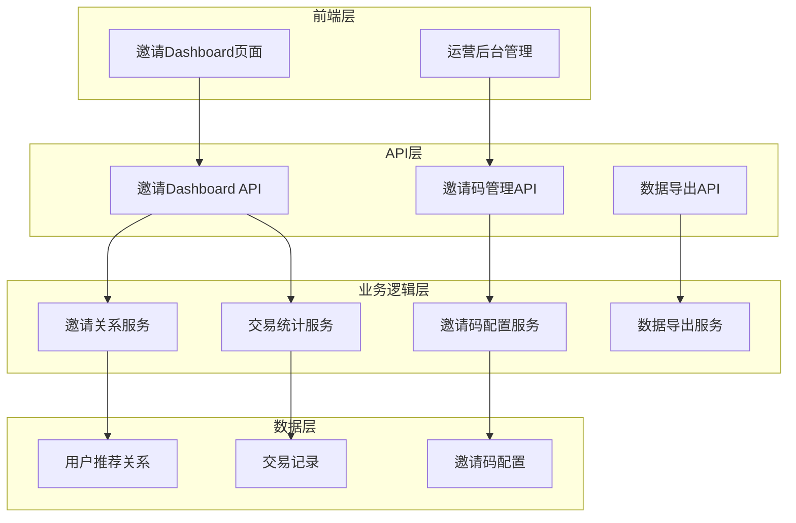
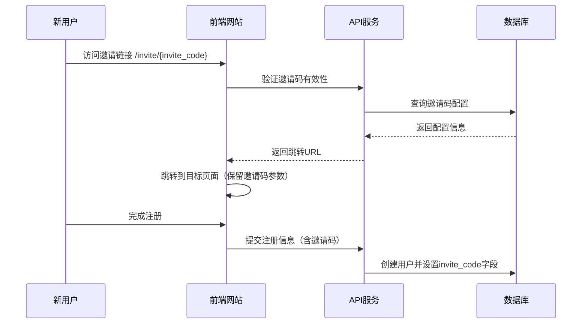
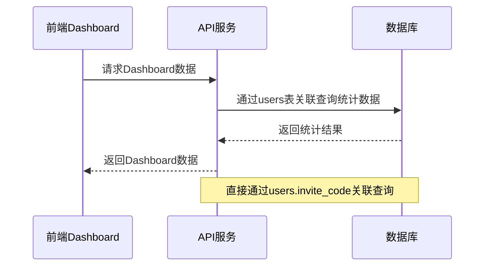

# 邀请Dashboard技术方案与任务拆解

## 1. 需求分析总结

### 1.1 核心需求
- 为流量合作方提供专属邀请链接生成和管理功能
- 实时统计邀请用户的注册数、交易数、交易量和交易费用
- 提供时间维度筛选（Yesterday、7D、30D）和交易明细查看
- 支持交易明细数据的CSV导出功能
- 运营后台支持邀请码管理和费率配置

### 1.2 业务关键点
- **邀请关系绑定**: 用户通过邀请链接注册后建立永久绑定关系
- **交易数据统计**: 统计邀请用户在TaskOn平台的swap交易数据
- **费率分成管理**: 支持不同邀请码配置不同的费率分成比例
- **数据透明化**: 为合作方提供透明的数据展示和导出功能

## 2. 现有系统分析

### 2.1 现有推荐系统（taskon-server）

**可复用组件：**
- **用户推荐关系**: users表中的invite_code、invite_by字段
- **邀请码生成**: GenerateUserInviteCode()函数
- **邀请码验证**: GetUserIdByInviteCode()函数
- **推荐关系绑定**: 用户注册时的newUser()逻辑

**数据库表结构：**
```sql
-- users表相关字段
invite_code VARCHAR(64) NOT NULL DEFAULT '' INDEX,
customize_invite_code VARCHAR(32) NOT NULL DEFAULT '' INDEX,
invite_by INTEGER NOT NULL DEFAULT 0 INDEX
```

### 2.2 现有交易系统（taskon-actions）

**可复用组件：**
- **交易记录存储**: open_ocean_swap_record表
- **交易数据扫描**: SwapScanner组件
- **用户交易历史**: user_token_swap_history表
- **交易统计方法**: GetOpenOceanSwapStats()函数

**核心数据结构：**
```go
type OpenOceanSwapRecord struct {
    TxHash     string    `db:"tx_hash"`
    Sender     string    `db:"sender"`
    UsdValue   string    `db:"usd_value"`
    Fee        string    `db:"fee"`
    Chain      string    `db:"chain"`
    BlockTime  int       `db:"block_time"`
    // ... 其他字段
}
```

## 3. 技术方案设计

### 3.1 整体架构设计



### 3.2 数据库设计

#### 3.2.1 新增表结构

**邀请码配置表 (invite_code_configs)**
```sql
CREATE TABLE invite_code_configs (
    id BIGINT PRIMARY KEY AUTO_INCREMENT,
    invite_code VARCHAR(64) NOT NULL UNIQUE COMMENT '邀请码',
    owner_user_id BIGINT NOT NULL COMMENT '所有者用户ID',
    redirect_url VARCHAR(512) NOT NULL DEFAULT '' COMMENT '跳转URL',
    fee_rate DECIMAL(5,4) NOT NULL DEFAULT 0.0000 COMMENT '费率分成比例',
    status TINYINT NOT NULL DEFAULT 1 COMMENT '状态 1-启用 0-禁用',
    created_by BIGINT NOT NULL COMMENT '创建者ID',
    description TEXT COMMENT '描述',
    create_time TIMESTAMP NOT NULL DEFAULT CURRENT_TIMESTAMP,
    update_time TIMESTAMP NOT NULL DEFAULT CURRENT_TIMESTAMP ON UPDATE CURRENT_TIMESTAMP,
    INDEX idx_invite_code (invite_code),
    INDEX idx_owner_user_id (owner_user_id),
    INDEX idx_status (status)
) ENGINE=InnoDB DEFAULT CHARSET=utf8mb4 COMMENT='邀请码配置表';
```

#### 3.2.2 现有表关系

**数据关联关系：**
- `users.invite_code` - 用户的邀请码
- `user_addresses.user_id` - 关联到用户ID
- `open_ocean_swap_record.sender` - 交易发送地址

**查询路径：**
```
users (invite_code) -> user_addresses (user_id) -> open_ocean_swap_record (sender)
```

### 3.3 核心业务流程

#### 3.3.1 邀请关系建立流程



#### 3.3.2 交易数据统计流程



### 3.4 数据查询优化

#### 3.4.1 核心统计查询

```sql
-- 邀请码统计数据查询
SELECT 
    u.invite_code,
    COUNT(DISTINCT u.id) as register_users,
    COUNT(DISTINCT CASE WHEN oor.id IS NOT NULL THEN u.id END) as trading_users,
    COALESCE(SUM(oor.usd_value), 0) as trading_volume,
    COALESCE(SUM(oor.fee), 0) as trading_fee
FROM users u
LEFT JOIN user_addresses ua ON u.id = ua.user_id
LEFT JOIN open_ocean_swap_record oor ON ua.address = oor.sender 
    AND oor.block_time >= ? AND oor.block_time <= ?
WHERE u.invite_code = ?
    AND u.create_time >= ? AND u.create_time <= ?
GROUP BY u.invite_code;
```

#### 3.4.2 交易明细查询

```sql
-- 邀请码交易明细查询
SELECT 
    oor.tx_hash,
    oor.sender,
    oor.chain,
    oor.usd_value,
    oor.fee,
    FROM_UNIXTIME(oor.block_time) as trading_time,
    u.id as user_id
FROM users u
JOIN user_addresses ua ON u.id = ua.user_id
JOIN open_ocean_swap_record oor ON ua.address = oor.sender
WHERE u.invite_code = ?
    AND oor.block_time >= ? AND oor.block_time <= ?
ORDER BY oor.block_time DESC
LIMIT ? OFFSET ?;
```

#### 3.4.3 索引优化

```sql
-- 关键索引
CREATE INDEX idx_users_invite_code_create_time ON users(invite_code, create_time);
CREATE INDEX idx_user_addresses_user_id ON user_addresses(user_id);
CREATE INDEX idx_swap_record_sender_time ON open_ocean_swap_record(sender, block_time);
CREATE INDEX idx_swap_record_time_value ON open_ocean_swap_record(block_time, usd_value);
```

### 3.5 API接口设计

#### 3.5.1 邀请Dashboard相关接口

**获取邀请Dashboard数据**
```javascript
// GET /api/invite/dashboard/{invite_code}
{
    "invite_code": "ABC123",
    "invite_link": "https://taskon.xyz/invite/ABC123",
    "stats": {
        "register_users": 150,
        "trading_users": 89,
        "trading_volume": "125860.50",
        "trading_fee": "2517.21"
    },
    "time_range": "yesterday" // yesterday, 7d, 30d
}
```

**获取交易明细列表**
```javascript
// GET /api/invite/transactions/{invite_code}
{
    "transactions": [
        {
            "time": "2024-01-15T10:30:00Z",
            "network": "ethereum",
            "trading_value": "1250.00",
            "trading_fee": "25.00",
            "address": "0x1234...5678"
        }
    ],
    "pagination": {
        "page": 1,
        "page_size": 50,
        "total": 1250
    }
}
```

**导出交易明细**
```javascript
// POST /api/invite/export/{invite_code}
{
    "time_range": "7d",
    "format": "csv"
}
// 返回CSV文件下载链接
```

#### 3.5.2 邀请码管理接口（运营后台）

**创建邀请码配置**
```javascript
// POST /api/admin/invite-codes
{
    "invite_code": "PARTNER001",
    "owner_user_id": 12345,
    "redirect_url": "https://taskon.xyz/chainearn",
    "fee_rate": 0.0020,
    "description": "合作伙伴A的邀请码"
}
```

**更新邀请码配置**
```javascript
// PUT /api/admin/invite-codes/{invite_code}
{
    "redirect_url": "https://taskon.xyz/special-event",
    "fee_rate": 0.0025,
    "status": 1
}
```

## 4. 修改范围与内容

### 4.1 taskon-server修改

#### 4.1.1 数据库层 (store/)
**新增文件：**
- `invite_code_config_db.go` - 邀请码配置数据库操作

**修改文件：**
- `user_db.go` - 扩展用户邀请码统计查询方法

#### 4.1.2 业务逻辑层 (service/)
**新增文件：**
- `invite/invite_service.go` - 邀请码管理服务
- `invite/invite_dashboard_service.go` - Dashboard数据服务（直接查询DB）
- `invite/invite_export_service.go` - 数据导出服务

#### 4.1.3 API层 (api/)
**新增文件：**
- `handlers/invite/invite_dashboard_handler.go` - Dashboard API处理器
- `handlers/invite/invite_admin_handler.go` - 管理后台API处理器

**修改文件：**
- `jsonrpc/handler.go` - 注册新的API处理器

### 4.2 前端修改

#### 4.2.1 邀请Dashboard页面
**新增文件：**
- `pages/invite-dashboard/[invite_code].vue` - Dashboard主页面
- `components/InviteStats.vue` - 统计卡片组件
- `components/TransactionTable.vue` - 交易明细表格
- `components/ExportModal.vue` - 导出功能模态框

#### 4.2.2 运营后台页面
**新增文件：**
- `pages/admin/invite-codes/index.vue` - 邀请码管理列表
- `pages/admin/invite-codes/create.vue` - 创建邀请码
- `pages/admin/invite-codes/edit.vue` - 编辑邀请码

## 5. 开发任务拆解

### 5.1 数据库设计与实现 (2个任务)

#### 5.1.1 数据库表结构设计
- **任务描述**: 设计和创建邀请码配置表
- **交付物**: 数据库迁移脚本、表结构文档
- **技术要点**: 索引优化、字段设计

#### 5.1.2 数据库操作层实现
- **任务描述**: 实现邀请码配置和统计查询的数据库操作方法
- **交付物**: store层相关Go文件
- **技术要点**: 复杂查询优化、JOIN操作、分页处理

### 5.2 后端服务开发 (3个任务)

#### 5.2.1 邀请码管理服务
- **任务描述**: 实现邀请码的创建、编辑、删除、查询功能
- **交付物**: invite_service.go, invite_admin_handler.go
- **技术要点**: 参数验证、权限控制、配置管理

#### 5.2.2 Dashboard数据服务
- **任务描述**: 实现Dashboard统计数据的直接查询和聚合
- **交付物**: invite_dashboard_service.go, invite_dashboard_handler.go
- **技术要点**: 复杂SQL查询、数据聚合、性能优化

#### 5.2.3 数据导出服务
- **任务描述**: 实现交易明细的CSV导出功能
- **交付物**: invite_export_service.go, 导出API
- **技术要点**: 异步处理、文件生成、下载链接

### 5.3 前端页面开发 (4个任务)

#### 5.3.1 邀请Dashboard页面
- **任务描述**: 实现邀请Dashboard的主页面和统计展示
- **交付物**: Vue页面组件、统计卡片组件
- **技术要点**: 响应式设计、数据可视化

#### 5.3.2 交易明细表格
- **任务描述**: 实现交易明细的表格展示和分页
- **交付物**: TransactionTable.vue组件
- **技术要点**: 分页查询、数据筛选、表格展示

#### 5.3.3 数据导出功能
- **任务描述**: 实现数据导出的前端交互
- **交付物**: ExportModal.vue组件
- **技术要点**: 异步处理、文件下载、进度提示

#### 5.3.4 运营后台页面
- **任务描述**: 实现邀请码管理的后台页面
- **交付物**: 管理页面组件
- **技术要点**: 表单验证、列表管理、权限控制

### 5.4 系统集成与测试 (2个任务)

#### 5.4.1 服务集成测试
- **任务描述**: 完成各服务间的集成测试
- **交付物**: 集成测试用例、测试报告
- **技术要点**: 接口测试、数据一致性测试、性能测试

#### 5.4.2 端到端功能测试
- **任务描述**: 完成完整业务流程的端到端测试
- **交付物**: E2E测试用例、用户验收测试
- **技术要点**: 业务流程测试、用户体验测试、边界测试

## 6. 技术优势分析

### 6.1 方案优势

#### 6.1.1 实现简单
- **无需表结构变更**: 直接使用现有的users表invite_code字段
- **无需数据同步**: 不需要SwapScanner同步邀请码数据
- **查询逻辑清晰**: 直接通过用户ID关联查询

#### 6.1.2 数据一致性强
- **单一数据源**: users.invite_code是唯一的邀请码来源
- **无同步风险**: 避免了数据同步导致的一致性问题
- **事务保证**: 所有查询都在同一事务中完成

#### 6.1.3 性能优化
- **索引优化**: 通过合理的索引设计保证查询性能
- **查询优化**: 使用JOIN操作减少多次查询
- **分页处理**: 支持大数据量的分页查询

### 6.2 与原方案对比

| 方案 | 数据源 | 同步复杂度 | 查询性能 | 开发工作量 | 维护成本 |
|------|--------|------------|----------|------------|----------|
| 原方案 | user_addresses.invite_code | 高（需要SwapScanner同步） | 中等 | 高 | 高 |
| 新方案 | users.invite_code | 无 | 高（直接JOIN） | 低 | 低 |

## 7. 总结

采用users表invite_code字段进行关联的技术方案具有以下优势：

**关键技术特点：**
1. **最大化复用**: 充分利用现有的用户推荐关系，无需额外的数据同步
2. **架构简单**: 直接通过用户ID关联，避免复杂的数据同步逻辑
3. **数据一致性**: 单一数据源，避免数据不一致问题
4. **性能优化**: 通过索引和JOIN优化保证查询性能
5. **开发高效**: 大幅减少开发工作量和维护成本

该方案在技术上更加简单可行，能够快速实现业务需求并保证系统稳定性。通过直接使用现有的用户推荐关系，避免了复杂的数据同步机制，是一个技术上优雅、实现上简单的优秀方案。
