# 新-交易大赛-B端需求文档

## 一、产品概述

### 1. 产品背景

Onchain Campaign 功能旨在支持B端（项目方）创建自定义的链上活动页面。当前的核心需求是交易大赛活动，用户通过在该活动页面进行指定币种的Swap操作，活动结束后根据交易量（Trading Volume）的比例瓜分奖池。这种活动形式为项目方提供了一种激励用户参与链上交互、提升特定代币交易活跃度的工具。
[原始文档: 交易大赛-B端.md](../md/交易大赛-B端.md)

### 2. 产品愿景

使B端能够便捷地发起和管理富有吸引力的链上交易竞赛活动，通过所见即所得的编辑方式降低活动配置门槛，从而有效提升用户参与度和项目代币的链上活跃度。
[原始文档: 交易大赛-B端.md](../md/交易大赛-B端.md)

### 3. 用户故事

- 作为一名项目方运营人员，我希望能快速创建一个交易大赛活动页面，自定义活动名称、时间、Banner等视觉元素，以吸引用户参与。[原始文档参考: 活动信息配置](../md/交易大赛-B端.md#编辑页面--活动信息配置)
- 作为一名项目方，我希望能在交易大赛中推广我们以及合作伙伴的项目，并能方便地配置项目信息，包括从Twitter自动抓取信息。[原始文档参考: 项目信息配置](../md/交易大赛-B端.md#编辑页面--项目信息配置)
- 作为一名项目方，我希望能灵活设置奖池规则，包括指定交易网络、DEX、奖励代币、奖励金额，以及设置不同的获奖资格（如交易量门槛、排行榜名次），以适应不同的活动策略。[原始文档参考: 奖励设置](../md/交易大赛-B端.md#编辑页面--奖励设置)
- 作为一名项目方，我需要活动发布前系统能进行预算校验，确保奖金已充值，并能清晰了解活动数据，包括参与人数、交易量、交易笔数以及详细的排行榜和交易明细，以便评估活动效果和发放奖励。[原始文档参考: Token 充值, Publish, 数据分析](../md/交易大赛-B端.md#token-充值)
  [原始文档: 交易大赛-B端.md](../md/交易大赛-B端.md)

## 二、业务流程

### 1. 全局业务流程图

B端用户（项目方）通过活动创建入口，进入所见即所得的编辑页面。在此页面，项目方可以配置活动的基本信息（名称、时间、Banner）、参与项目信息、奖励规则（包括网络、DEX、奖池类型、奖励代币、获奖资格）、以及页面风格。配置过程中，项目方可以随时预览C端页面的PC和Mobile样式。完成配置并确保奖金预算充足后，项目方可将活动发布。活动上线后，C端用户参与交易，系统记录数据。项目方可以通过数据分析页面查看活动汇总数据、排行榜和交易明细。活动状态会经历草稿、即将开始、进行中和已结束等阶段。

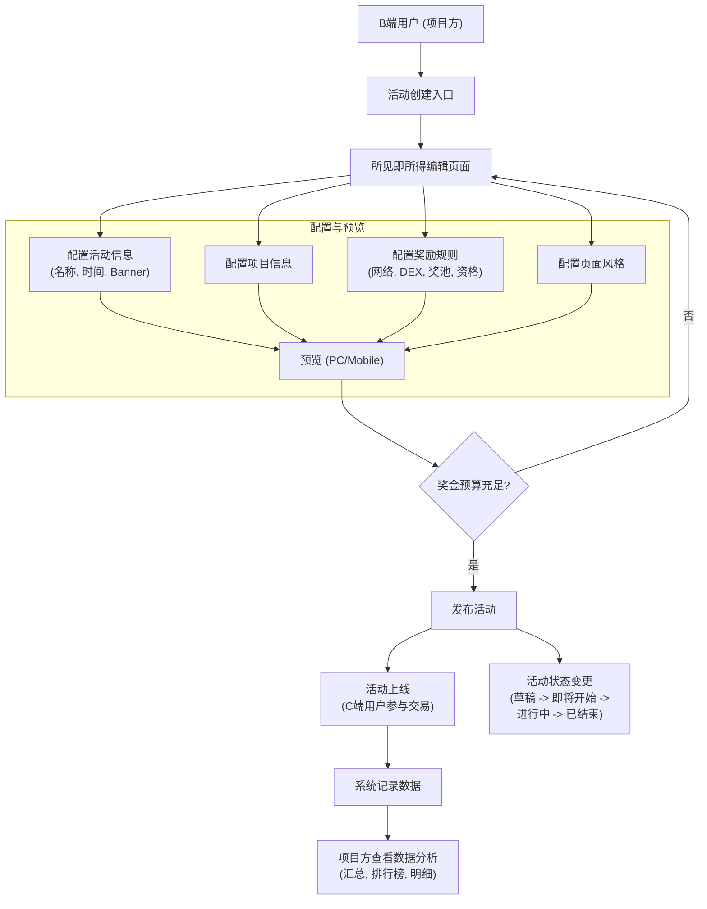

[原始文档: 交易大赛-B端.md](../md/交易大赛-B端.md)

### 2. 关键子流程图

- **活动创建/编辑流程**:
  1. 进入创建页面或从列表页点击编辑。
  2. 通过所见即所得编辑器，点击预览区域热点或编辑按钮，弹出相应配置模块。
  3. 配置活动信息、项目信息、奖励设置、页面样式。
  4. 可切换PC/Mobile预览。
  5. 保存草稿或保存更改。
     [原始文档参考: 整体编辑逻辑](../md/交易大赛-B端.md#编辑页面--活动信息配置)
- **项目信息配置流程**:
  1. 默认带入当前项目信息。
  2. 点击编辑进入项目列表，可拖动排序、编辑、删除。
  3. 添加新项目：
     a.  引导填写Twitter Handle，可Fetch自动填充名称和Logo。
     b.  或手动上传项目名称和Logo。
     c.  保存时判断项目方是否已发币 (CMC/Alpha库)，若已发币则引导配置该币种的奖励池。
     [原始文档参考: 项目信息配置](../md/交易大赛-B端.md#编辑页面--项目信息配置)
- **奖励设置流程**:
  1. 配置全局交易网络和DEX (复用Quest逻辑)。
  2. 配置奖池：
     a.  **Basic Pool**: (单项目方时必须有且不可关；多项目方时可选开关)。配置奖励Token、数量、Swap From/To (支持Any Token及多选，Any-Any时可排除稳定币等交易)、获奖资格 (交易量门槛/排行榜名次)。
     b.  **指定 Reward Pool**: (多项目方时可添加多个)。配置奖励Token、数量、Swap From (Any Token)、Swap To (同奖励Token)、获奖资格。可拖动排序、删除。
     [原始文档参考: 奖励设置](../md/交易大赛-B端.md#编辑页面--奖励设置)
- **发布流程**:
  1. 点击Publish按钮。
  2. 系统校验：预算金额是否已充值完毕；是否设置了至少一个奖池。
  3. 校验失败则提示并引导用户修正。
  4. 校验通过则活动成功发布，状态变为Upcoming或Ongoing。
     [原始文档参考: Publish/Save as draft/Save Changes](../md/交易大赛-B端.md#publishsave-as-draftsave-changes)
- **Token充值流程**:
  1. 当奖池设置完毕但预算不足时，显示Top up提示。
  2. 点击Top up，弹出弹窗显示需充值信息。
  3. 点击Deposit，调用通用Deposit Token弹窗，预填网络、Token、数量。
  4. 充值完毕后，提示变为余额充足。
     [原始文档参考: Token 充值](../md/交易大赛-B端.md#token-充值)
- **数据分析流程**:
  1. 从活动列表进入数据分析页。
  2. **汇总数据**: Tab切换总览及各Pool数据。展示Volume, Participants, Transactions指标及日增，提供7D/30D/All趋势图 (双轴)。
  3. **Leaderboard数据**: Tab切换各Pool数据。表格展示排名、用户地址、交易量、交易笔数。支持导出，分页加载。
  4. **明细交易数据**: Tab切换总览及各Pool数据。表格展示Wallet, Chain, From, To, Time, Hash。支持导出。
     [原始文档参考: 数据分析](../md/交易大赛-B端.md#数据分析)
     [原始文档: 交易大赛-B端.md](../md/交易大赛-B端.md)

## 三、功能设计

### 1. 功能地图

- **活动管理**
  - 创建活动 (所见即所得编辑器)
  - 编辑活动 (草稿、即将开始状态可编辑)
  - 删除活动 (草稿、即将开始状态可删除，二次确认)
  - 查看活动列表
    - 活动名称
    - 活动时间 (创建时间 - 结束时间)
    - 总预算
    - 状态 (Draft, Upcoming, Ongoing, Ended)
    - 操作 (Edit, Delete, Data)
- **活动配置模块 (通过点击预览区编辑)**
  - **活动信息配置**
    - 活动名称 (必填, 100字符限制)
    - 开始与结束日期 (必填, 默认7天)
    - Banner图 (必填, PC/Mobile默认图)
    - Dot Animation (可选)
  - **项目信息配置**
    - 默认带入当前项目信息
    - 支持多项目，可拖动排序
    - 添加新项目 (Twitter Handle抓取 / 手动上传)
    - 编辑项目 (名称, Logo, Twitter Handle)
    - 删除项目 (二次确认)
    - 发币项目引导创建奖池
  - **奖励设置**
    - 全局网络与DEX设置 (DEX在左, Network在右, 默认BNB/Taskon Aggregator)
    - **Basic Pool** (根据项目方数量决定是否可关闭/存在)
      - 奖励Token (默认USDT)
      - 奖励Token Amount (默认1000)
      - Swap From/To Token (Any Token / 指定多选Token, 默认Any)
      - Exclude Same Underlying Asset Trades (Swap From/To均为Any时可选, 默认开)
      - Winner Eligibility (可选开关, 默认关): 交易量 >= X USD / 排行榜前X名
    - **指定 Reward Pool** (多项目方时可添加)
      - 奖励Token
      - 奖励Token Amount
      - Swap From (Any Token)
      - Swap To (同奖励Token)
      - Winner Eligibility (可选开关, 默认关): 交易量 >= X USD / 排行榜前X名
      - 支持拖动排序、删除
  - **页面样式配置**
    - Background
    - 主题色
- **活动操作与辅助功能**
  - Token充值提示与操作 (预算不足时提示Top up, 点击引导充值)
  - PC/Mobile预览切换
  - 保存草稿 (不校验)
  - 发布活动 (校验预算和奖池设置)
  - 保存更改 (编辑已发布活动的部分字段)
- **数据分析模块**
  - **汇总数据**
    - Tab切换 (总览 / 各Pool)
    - 关键指标 (Volume, Participants, Transactions) 与日增数据
    - 趋势图 (Volume, Participants, Transactions, 7D/30D/All, 双Y轴)
  - **Leaderboard数据**
    - Tab切换 (各Pool)
    - 表格字段 (排名, 用户地址, Trading Volume, Transactions)
    - 导出数据
    - 分页 (默认20条/页)
  - **明细交易数据**
    - Tab切换 (总览 / 各Pool)
    - 表格字段 (Wallet, Chain, From, To, Time, Hash)
    - 导出数据
      [原始文档: 交易大赛-B端.md](../md/交易大赛-B端.md)

### 2. 功能描述模板

#### **功能点：活动信息配置**

- **描述：** B端用户可以配置活动的基本信息，包括活动名称、起止日期、Banner图和可选的点状动画。编辑通过点击预览区域的编辑按钮或热区触发弹窗。
- **界面参考：**
  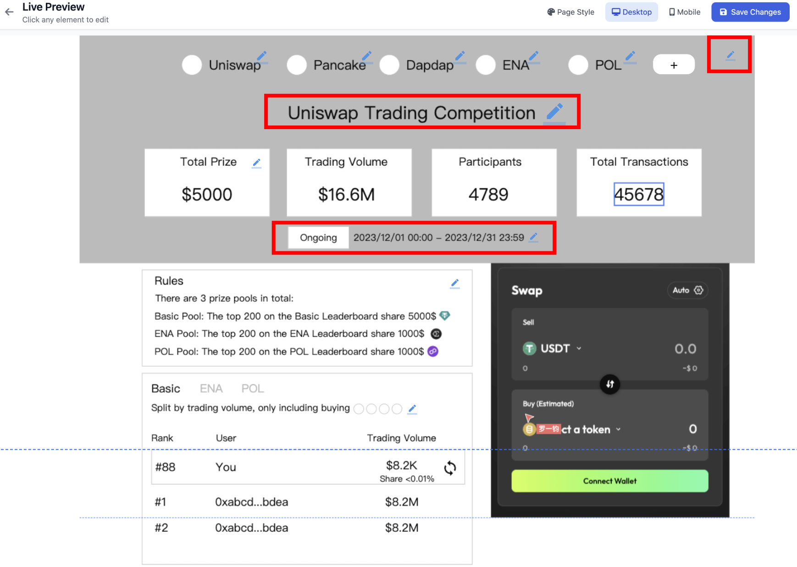
  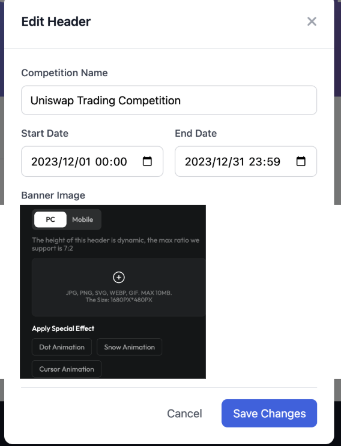
- **详细规则：**
  - Name: 必填项, 输入框, 限制最多输入100个字符; 默认名称是 Trading Competition
  - Start date & End date: 必选项, 此处复用 quest 的设置, 默认填写为当前日期的零点到七天后的零点
  - Banner: 必选项, 同 community 装修模块的设置, 要分别针对 PC 和 mobile 提供一张默认图, 图片的比例需确认是否更新
  - Dot animation: 同 community 装修模块的设置, 非必选项
- **原始文档对应章节：** [编辑页面 — 活动信息配置](../md/交易大赛-B端.md#编辑页面--活动信息配置)

#### **功能点：项目信息配置**

- **描述：** 允许配置一个或多个参与项目。默认使用当前项目信息。支持通过Twitter Handle自动抓取项目名称和Logo，或手动上传。多项目时可拖动排序。保存项目时会检查项目是否已发币，若已发币则引导创建对应代币的奖池。
- **界面参考：**
  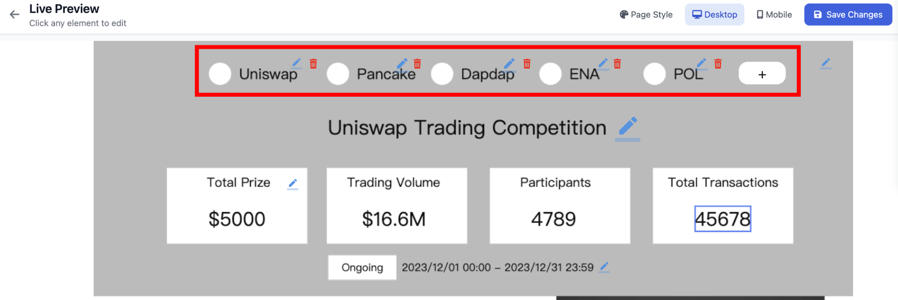
  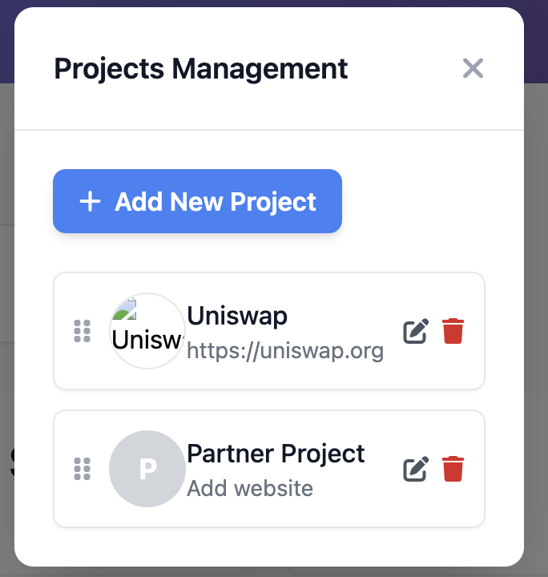
  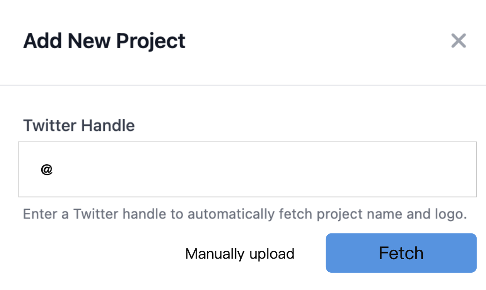
  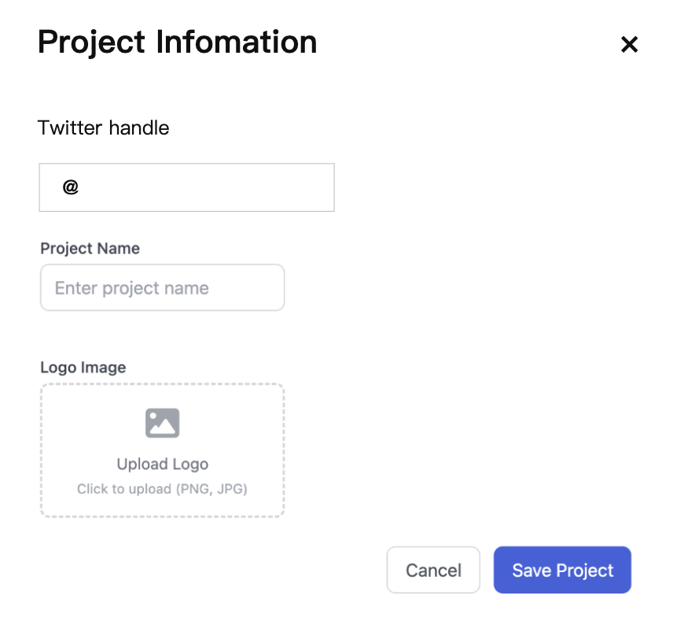
  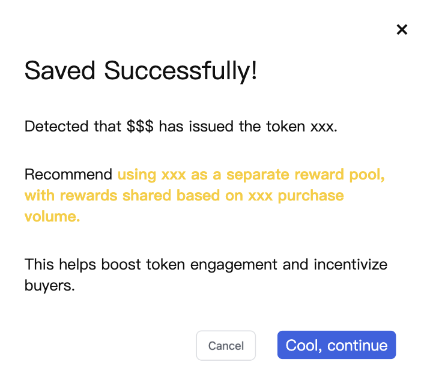
- **详细规则：**
  - 默认创建1个项目, Project name 和 logo , twitter 都使用当前项目的。
  - 多项目支持拖动排序。
  - 添加新项目流程：引导填Twitter Handle -> Fetch -> 自动填充名称/Logo 或 Manually Upload -> 编辑项目信息 (Twitter Handle, Project Name, Logo)。
  - 保存项目时，若项目已发币 (通过CMC/Alpha库检查)，弹窗提示 "Your project XXX has already launched token Xxx. Set a reward pool with Xxx token to boost its volume?"，确认后自动打开奖池配置并预设该Token。
- **原始文档对应章节：** [编辑页面 — 项目信息配置](../md/交易大赛-B端.md#编辑页面--项目信息配置)

#### **功能点：奖励设置 - 指定Network和DEX**

- **描述：** 所有奖池的交易量统计共用一套Network和DEX设置。配置逻辑复用Quest设置，但DEX在左，Network在右。
- **界面参考：**
  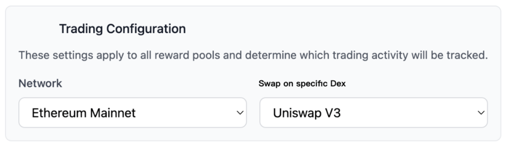
- **详细规则：**
  - Network 默认值: BNB Chain
  - Dex 默认值: Taskon Aggregator
- **原始文档对应章节：** [指定 Network 和 dex 设置](../md/交易大赛-B端.md#指定-network-和-dex-设置)

#### **功能点：奖励设置 - Basic Pool**

- **描述：**基础奖池配置。单项目方时必须存在且不能关闭；多项目方时可有1个或0个，可开关控制。
- **界面参考：**
  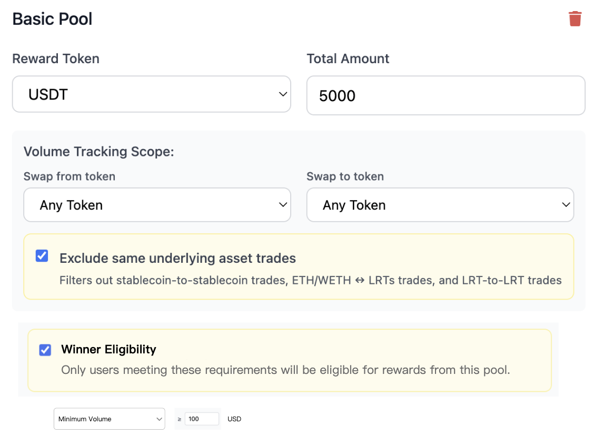
- **详细规则：**
  - 奖励Token: 默认USDT。
  - 奖励Token Amount: 默认1000。
  - Swap From/To: 下拉可选 "any token" 或指定Network下的Token (多选，最多20个)。默认 "any token"。
  - Exclude same underlying asset trades: 当Swap From/To均为 "any token" 时出现，开关默认打开，过滤稳定币间交易及ETH/WETH与LRTs等交易 (具体规则待定)。
  - Winner Eligibility: 开关默认关闭。开启后可选：(默认)交易量 >= xxx USD 或 排行榜前xx名。
    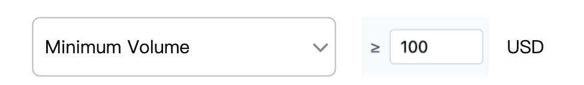
    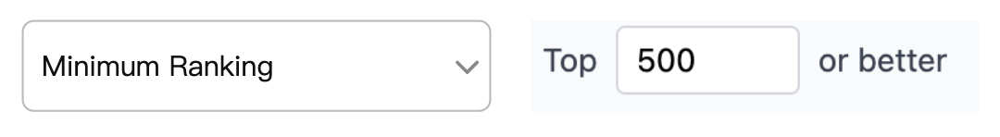
- **原始文档对应章节：** [basic pool](../md/交易大赛-B端.md#basic-pool)

#### **功能点：奖励设置 - 指定 Reward Pool**

- **描述：** 针对特定项目代币的奖励池，多项目方情况下可添加多个。
- **界面参考：**
  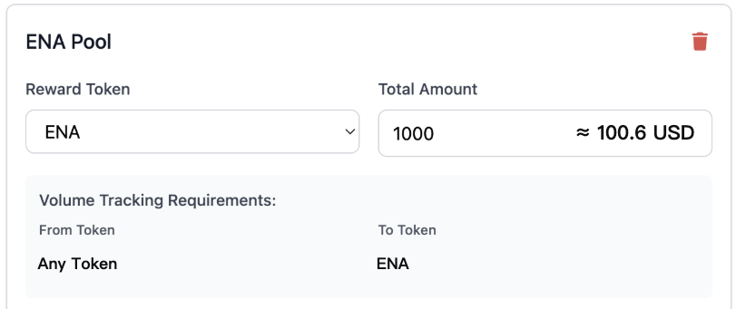
  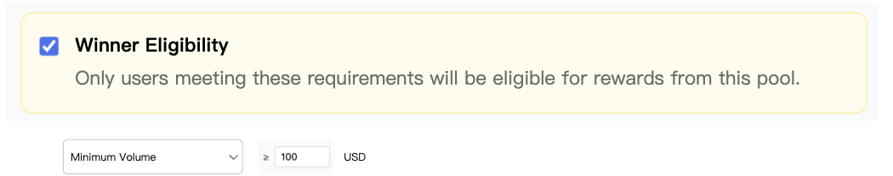
- **详细规则：**
  - 奖励Token: 由项目方指定。
  - 奖励Token Amount。
  - Swap From: "any token"。
  - Swap To: 与奖励Token一致。
  - Winner Eligibility: 开关默认关闭。开启后可选：(默认)交易量 >= xxx USD 或 排行榜前xx名。
  - 多指定Reward Pool时支持拖动排序 (影响Rule说明和Leaderboard顺序)。
  - 支持删除。
- **原始文档对应章节：** [指定 reward pool](../md/交易大赛-B端.md#指定-reward-pool)

#### **功能点：页面样式配置**

- **描述：** 配置C端活动页面的背景和主题色。
- **界面参考：**
  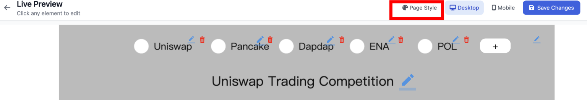
  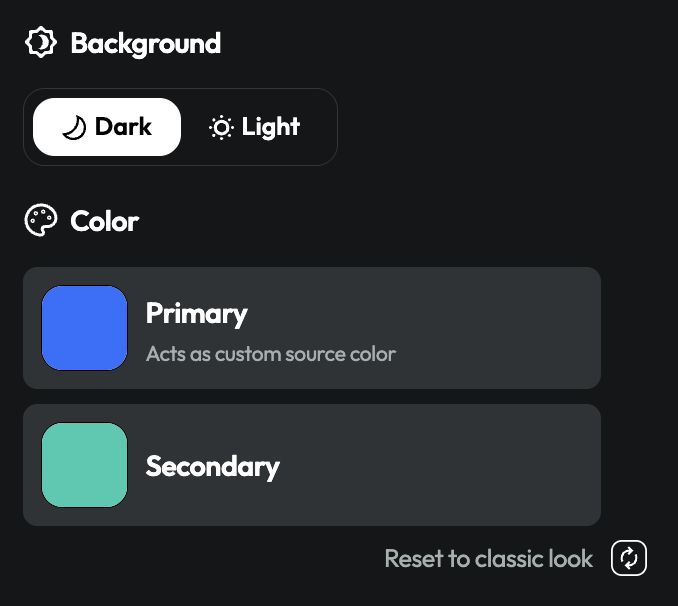
- **详细规则：** 配置逻辑同现有社区装修模块。
- **原始文档对应章节：** [编辑页面 — Page Style 配置](../md/交易大赛-B端.md#编辑页面--page-style-配置)

#### **功能点：Token充值**

- **描述：** 当项目方设置了奖池但预算余额不足时，系统会提示并引导充值。
- **界面参考：**
  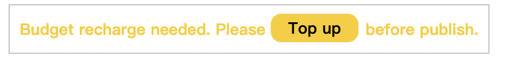
  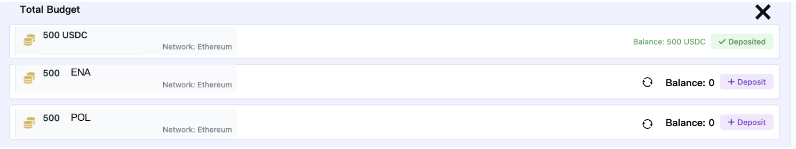
  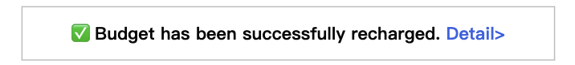
- **详细规则：**
  - 余额不足提示 "Top up"，点击后弹窗显示需充值详情。
  - 点击Deposit，调用通用充值弹窗，预填Network, Token Type, Amount。
  - 充值完毕后，提示变为 "Budget is sufficient"，点击Detail可查看充值弹窗。
- **原始文档对应章节：** [Token 充值](../md/交易大赛-B端.md#token-充值)

#### **功能点：Publish/Save as draft/Save Changes**

- **描述：** 活动的保存与发布操作。
- **界面参考：**
  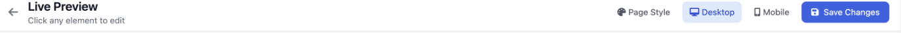
  
  
- **详细规则：**
  - 新建状态：显示 "Save as draft" 和 "Publish" 按钮。
  - 编辑状态：显示 "Save Changes" 按钮 (若适用)。
  - Save as draft: 保存草稿，不校验。
  - Publish:
    - 校验预算金额是否已充值完毕 (否则提示 "To publish, please recharge the budget amount." 并高亮Token充值模块)。
    - 校验是否设置了至少一个奖池 (否则提示 "To publish, please set at least one prize pool.")。
- **原始文档对应章节：** [Publish/Save as draft/Save Changes](../md/交易大赛-B端.md#publishsave-as-draftsave-changes)

#### **功能点：数据分析 - 汇总数据**

- **描述：** 提供活动整体及各奖池的汇总数据统计。
- **界面参考：**
  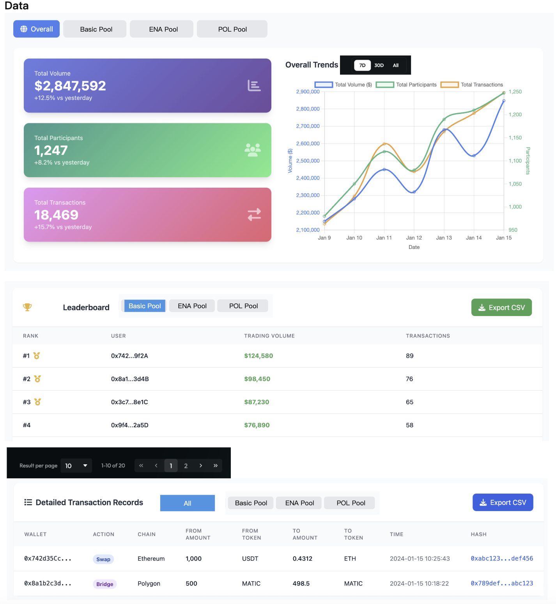
  
- **详细规则：**
  - 顶部Tab单选切换显示总览和各Pool数据 (Pool顺序同奖池设置，单Pool时不提供切换)。
  - 左侧显示Volume, Participants, Transactions指标，提供环比日增数据。
  - 右侧是上述指标的日趋势图，提供7D/30D/All数据范围筛选。
  - 趋势图使用双Y轴坐标 (Volume一组, Participants和Transactions一组)。
- **原始文档对应章节：** [汇总数据](../md/交易大赛-B端.md#汇总数据)

#### **功能点：数据分析 - Leaderboard 数据**

- **描述：** 提供各奖池的排行榜数据。
- **界面参考：**
  
  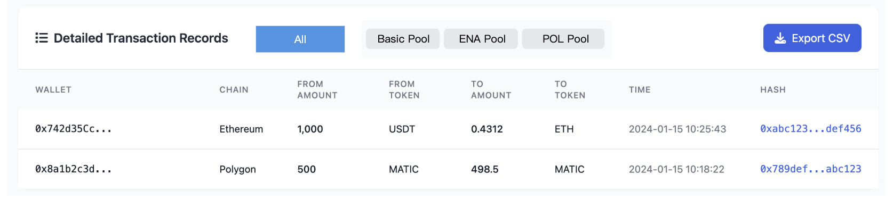
- **详细规则：**
  - Tab切换各Pool数据。
  - 表格字段：排名 (Rank), 用户地址 (User, 点击跳转Etherscan), Trading Volume, Transactions。
  - 支持导出数据。
  - 分页，默认20条/页。
- **原始文档对应章节：** [Leaderboard 数据](../md/交易大赛-B端.md#leaderboard-数据)

#### **功能点：数据分析 - 明细交易数据**

- **描述：** 提供活动整体及各奖池的明细交易数据。
- **详细规则：**
  - Tab切换总览及各Pool数据。
  - 表格字段：Wallet (用户地址, 点击跳转Etherscan), Chain, From (代币及数量), To (代币及数量), Time, Hash (交易哈希, 点击跳转Etherscan)。
  - 支持导出数据。
- **原始文档对应章节：** [明细交易数据](../md/交易大赛-B端.md#明细交易数据)

## 四、业务规则

### 1. 业务规则概述

B端配置交易大赛活动时，需遵循一系列业务规则，确保活动的公平性、可操作性和用户体验。包括项目方数量对奖池配置的影响、奖金的充值与校验、交易统计范围的定义（如排除特定交易对）、获奖资格的多样性设置等。
[原始文档: 交易大赛-B端.md](../md/交易大赛-B端.md)

### 2. 业务规则列表模板

#### 示例业务规则表格：

| 规则ID    | 规则名称                         | 描述                                                                                                                                                                                                               | 影响模块            |
| :-------- | :------------------------------- | :----------------------------------------------------------------------------------------------------------------------------------------------------------------------------------------------------------------- | :------------------ |
| BR-TB-001 | 单项目方Basic Pool强制性         | 如果只有一个项目方参与活动，则Basic Pool必须存在且不可关闭。                                                                                                                                                       | 奖励设置            |
| BR-TB-002 | 多项目方Basic Pool可选性         | 如果有多个项目方参与活动，则Basic Pool可以有1个或0个。若存在，则不可删除，但可以开关控制。                                                                                                                         | 奖励设置            |
| BR-TB-003 | 指定Reward Pool添加条件          | 只有在多个项目方参与的情况下，才可以添加指定Reward Pool。                                                                                                                                                          | 奖励设置            |
| BR-TB-004 | 项目发币与奖池引导               | 添加或编辑项目信息并保存时，如果系统检测到该项目已发行代币（通过CMC/Alpha API），则会弹窗提示项目方是否要为该代币设置一个专属的Reward Pool以提升其交易量。                                                         | 项目信息配置        |
| BR-TB-005 | Basic Pool交易对配置 - Any Token | Basic Pool中，Swap From / Swap To均可选择 "any token"。若两边都选 "any token"，则会出现 "Exclude same underlying asset trades" 开关，默认开启，用于排除如USDT/USDC, ETH/WETH等同底层资产交易。具体排除列表需维护。 | 奖励设置            |
| BR-TB-006 | Basic Pool交易对配置 - 指定Token | Basic Pool中，Swap From / Swap To也可选择指定代币（支持多选，最多20个）。                                                                                                                                          | 奖励设置            |
| BR-TB-007 | 指定Reward Pool交易对固定        | 指定Reward Pool中，Swap From固定为 "any token"，Swap To固定为该奖池设定的奖励代币。                                                                                                                                | 奖励设置            |
| BR-TB-008 | 获奖资格设置                     | Basic Pool和指定Reward Pool均可独立设置获奖资格，通过开关控制。开启后可选择 "交易量 >= xxx USD" (默认) 或 "排行榜前xx名"。两种资格共享奖池，按交易量比例分配。                                                     | 奖励设置            |
| BR-TB-009 | 预算校验与充值提示               | B端在进行奖池配置时，系统会实时计算总预算。若配置的奖励总额超出已充值金额，相关奖池下方会出现 "Top up" 提示。点击后引导用户进行充值。                                                                              | 奖励设置, Token充值 |
| BR-TB-010 | 发布活动校验                     | 点击 "Publish" 按钮时，系统会校验：1. 所有奖池的预算金额是否已充值完毕；2. 是否至少设置了一个奖池。任一条件不满足则无法发布，并给出相应提示。                                                                      | 发布活动            |
| BR-TB-011 | 活动状态与可编辑性               | 活动状态为Draft, Upcoming时，活动所有内容均可编辑。活动状态为Ongoing, Ended时，不可编辑，只能查看数据。                                                                                                            | 活动管理, 编辑      |
| BR-TB-012 | 数据分析Pool顺序                 | 数据分析页面中，若有多个Pool，其Tab切换顺序应与B端在奖励设置中配置的Pool顺序（包括Basic Pool和拖动排序后的指定Reward Pools）保持一致。                                                                             | 数据分析            |

## 五、数据需求

### 数据流说明

- **输入数据 (B端配置):**
  - 活动信息：名称, 开始/结束时间, Banner URL, Dot Animation开关。
  - 项目信息：项目名称, Logo URL, Twitter Handle (每个参与项目)。
  - 全局奖励设置：交易网络, DEX。
  - Basic Pool配置：奖励Token, 奖励数量, Swap From列表, Swap To列表, Exclude开关, 获奖资格类型及阈值。
  - 指定Reward Pool配置：奖励Token, 奖励数量, 获奖资格类型及阈值 (每个指定Pool)。
  - 页面样式：背景图/色, 主题色。
  - 操作指令：保存草稿, 发布, 充值Token。
- **后端处理与存储:**
  - 存储活动所有配置信息到数据库。
  - 与Token充值/预算模块交互，记录和校验项目方充值余额。
  - 活动发布时，校验配置完整性和预算充足性。
  - 活动进行中，从链上数据服务或索引器获取符合条件的交易数据 (基于配置的网络、DEX、交易对)。
  - 聚合交易数据，计算每个参与用户的有效交易量 (按USD计价)，并根据奖池规则进行排名和奖励分配计算。
  - 存储用户在各奖池的交易量、排名、预计/实际奖励等数据。
- **输出数据 (B端数据分析 & C端展示基础):**
  - 活动列表信息。
  - 活动配置详情 (用于编辑和预览)。
  - 数据分析：
    - 汇总数据：总交易量, 总参与人数, 总交易笔数 (及各Pool数据); 各指标日趋势。
    - Leaderboard：用户地址, 交易量, 交易笔数 (各Pool)。
    - 交易明细：钱包地址, 链, From Token/量, To Token/量, 时间, Hash (各Pool及总览)。
  - C端展示所需数据：活动规则描述文本，各奖池信息，Leaderboard数据等。
    [原始文档: 交易大赛-B端.md](../md/交易大赛-B端.md)
