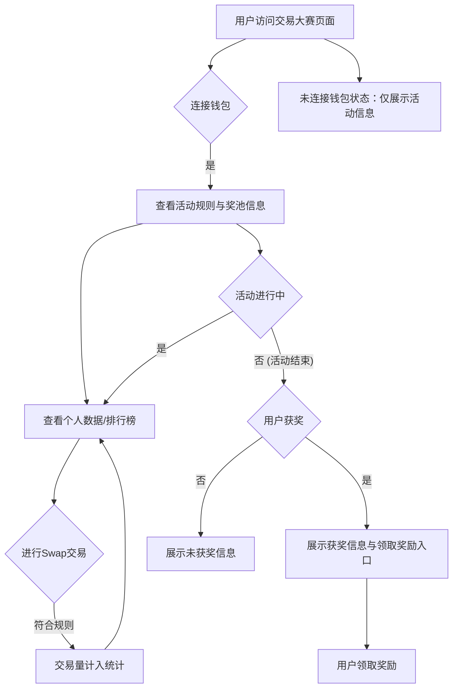
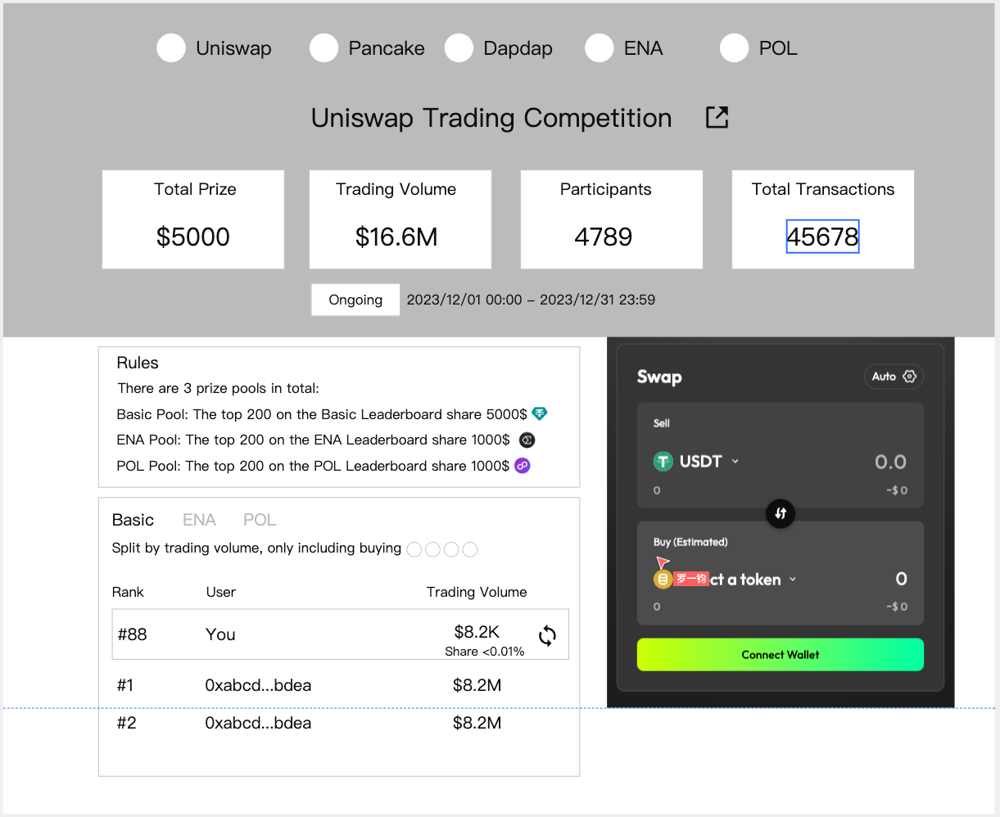
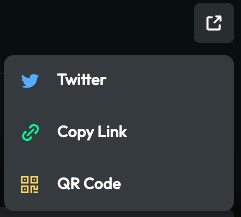
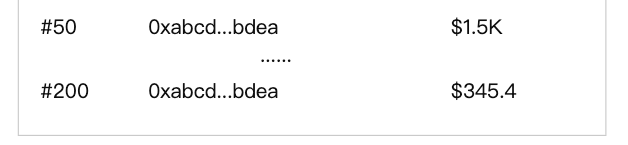
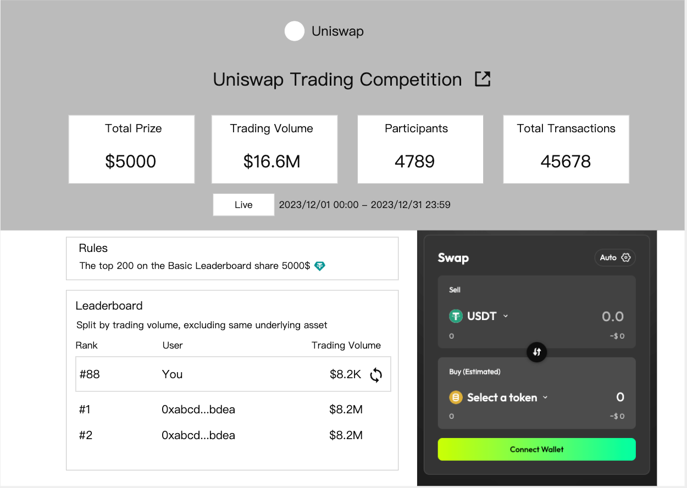
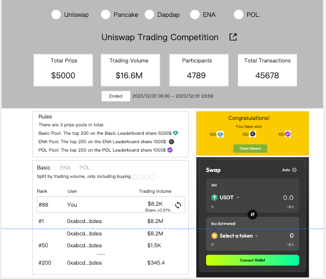
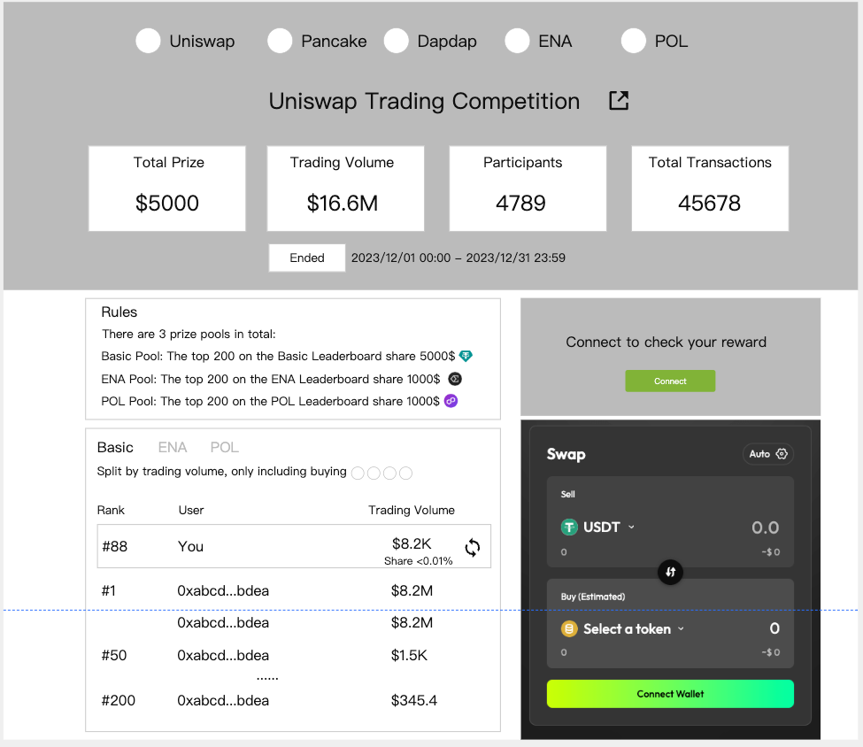

# 新-交易大赛-C端需求文档

## 一、产品概述

### 1. 产品背景

交易大赛功能允许B端（项目方）创建链上活动页面，C端用户（参与者）通过这些页面参与链上交互（主要是Swap操作特定币种）以获取奖励。活动的核心机制是用户在活动结束后，根据其有效交易量占总交易量的比例来瓜分预设的奖池。
[原始文档: 交易大赛-C端.md](../md/交易大赛-C端.md)

### 2. 产品愿景

为C端用户提供一个清晰、易用、富有吸引力的交易竞赛参与平台。用户可以方便地了解活动规则、追踪自己的表现、执行交易操作，并在活动结束后顺利查看和领取应得的奖励，从而提升用户参与链上活动的的积极性和体验。
[原始文档: 交易大赛-C端.md](../md/交易大赛-C端.md)

### 3. 用户故事

- 作为一名加密用户，我希望能在一个活动页面清晰地看到交易大赛的所有规则，包括奖池构成、如何计算有效交易量、以及不同奖池的瓜分条件，以便我决定是否参与以及如何参与。 [原始文档参考: 活动规则](../md/交易大赛-C端.md#活动规则)
- 作为一名参赛者，我希望能够在活动页面方便地连接我的钱包，并在同一个地方执行符合活动要求的Swap交易。 [原始文档参考: Swap交互区域](../md/交易大赛-C端.md#swap交互区域)
- 作为一名参赛者，我想实时查看活动的总数据（如总奖池、总交易量、参与人数）以及我在各个奖池中的排名、交易量和预计占比，以便了解自己的竞争力。 [原始文档参考: 活动数据, Leaderboard](../md/交易大赛-C端.md#活动数据)
- 作为一名参赛者，活动结束后，我希望能明确知道自己是否获奖、获得了哪些奖励，并能方便地领取这些奖励到我的钱包。 [原始文档参考: 获奖状态, 未获奖状态, 未登录状态](../md/交易大赛-C端.md#获奖状态)
  [原始文档: 交易大赛-C端.md](../md/交易大赛-C端.md)

## 二、业务流程

### 1. 全局业务流程图

[原始文档: 交易大赛-C端.md](../md/交易大赛-C端.md)

### 2. 关键子流程图

- **用户参与流程:** 访问页面 -> 连接钱包 -> 查看规则 -> 进行Swap -> 查看数据 -> (活动结束) 查看结果 -> 领取奖励。
- **数据展示流程:** 获取活动配置 -> 获取链上交易数据 -> 计算用户交易量及占比 -> 展示总览数据及个人排名。
- **奖励领取流程:** 活动结束后 -> 后端计算最终获奖名单 -> 用户访问页面 -> 显示获奖信息 -> 用户发起领取操作 -> 后端校验并发放奖励。
  [原始文档: 交易大赛-C端.md](../md/交易大赛-C端.md)

## 三、功能设计

### 1. 功能地图

- **页面头部区域**
  - 活动Banner图
  - 活动名称
  - 活动时间状态 (进行中/已结束/即将开始)
  - 主办方信息 (可多个)
  - 分享按钮
  - 规则说明入口 (弹窗)
- **活动规则弹窗**
  - 总规则说明
  - 各奖池规则 (奖励币种、总奖金、瓜分条件、指定交易对等)
- **Swap交互区域**
  - 钱包连接/切换入口
  - 交易对选择 (Swap From, Swap To)
  - 金额输入
  - 价格显示/滑点设置
  - 执行Swap按钮
  - 用户余额显示
- **活动数据展示区**
  - **总览数据**
    - 总奖池价值 (USD)
    - 总有效交易量 (USD)
    - 参与人数
  - **我的数据/Leaderboard** (Tab切换)
    - **各奖池数据** (下拉或Tab切换不同奖池)
      - 奖池名称
      - 我的有效交易量 (USD)
      - 我的交易量占比 (%)
      - 我的排名
      - 预计获得奖励 (若有)
      - 排行榜列表 (地址/昵称, 交易量, 占比, 奖励)
- **活动状态相关展示**
  - **活动进行中：** 倒计时
  - **活动已结束 - 获奖：**
    - 获奖提示
    - 各奖池获得的奖励详情
    - 领取奖励按钮 (Claim)
    - 奖励领取状态 (待领取/已领取/领取失败)
  - **活动已结束 - 未获奖：**
    - 未获奖提示
    - 最终排名和交易量数据
  - **活动未开始/用户未登录/钱包未连接：**
    - 相应状态提示
    - 引导操作按钮 (如连接钱包)
      [原始文档: 交易大赛-C端.md](../md/交易大赛-C端.md)

### 2. 功能描述模板

#### **功能点：页面整体布局与头部信息**

- **描述：** C端用户访问交易大赛活动页面的主要视觉和信息入口。
- **界面参考：**
  
  
  
- **详细规则：**
  - PC与Mobile端自适应布局。
  - Banner图、活动名称、活动状态（进行中/已结束/即将开始）、活动倒计时、主办方（可多个，显示Logo和名称）、分享按钮、规则按钮。
- **原始文档对应章节：** [PC端 &amp; Mobile 端页面布局](../md/交易大赛-C端.md#pc端--mobile-端页面布局)

#### **功能点：活动规则弹窗**

- **描述：** 清晰展示活动的参与规则、奖池构成和奖励分配方式。
- **界面参考：**
  
- **详细规则：**
  - 点击规则按钮弹出。
  - 包含总规则和各奖池的详细规则说明：
    - **Basic Pool Rules**: 奖励币种、总奖金、有效交易对 (e.g., WETH/USDT on BNB Chain)、获奖资格 (e.g., Top 10 by volume share the rewards)。
    - **Reward Pool X Rules**: (若有多个) 类似Basic Pool的规则描述。
- **原始文档对应章节：** [活动规则](../md/交易大赛-C端.md#活动规则)

#### **功能点：Swap交互区域**

- **描述：** 用户在此区域连接钱包并执行符合活动要求的Swap交易。
- **界面参考：**
  
- **详细规则：**
  - 需先连接钱包才能操作。
  - Swap组件复用现有逻辑，但需根据活动配置限定可选的交易网络和DEX。
  - 交易对选择需符合活动规则中指定的Token对（若有指定）。
  - 交易成功后，有效交易量会计入统计。
- **原始文档对应章节：** [Swap交互区域](../md/交易大赛-C端.md#swap交互区域)

#### **功能点：活动数据与排行榜 (我的数据/Leaderboard)**

- **描述：** 展示活动的总览数据以及用户个人的表现和排名。
- **界面参考：**
  
  
- **详细规则：**
  - **总览数据：** 总奖池价值(USD)，总有效交易量(USD)，参与人数。
  - **我的数据/Leaderboard Tab切换：**
    - **奖池切换：** 若有多个奖池（Basic Pool, Reward Pool 1, ...），提供下拉或Tab切换查看不同奖池的数据。
    - **我的数据：** 我的有效交易量 (USD)，我的交易量占比(%)，我的当前排名，预计获得奖励(若适用，根据当前占比估算)。
    - **Leaderboard：** 列表展示用户排名、部分钱包地址/昵称、交易量(USD)、交易量占比(%)、预计奖励。默认显示Top N，可分页或滚动加载更多。
    - 用户可在排行榜中搜索自己的地址/昵称。
- **原始文档对应章节：** [活动数据](../md/交易大赛-C端.md#活动数据)

#### **功能点：活动结束状态 - 获奖**

- **描述：** 活动结束后，向获奖用户展示其获奖信息并提供奖励领取入口。
- **详细规则：**
  - 明确的获奖提示，如 "Congratulations! You\'ve won!"。
  - 分奖池展示获得的奖励金额和币种。
  - 提供 "Claim" 或 "Claim All" 按钮。
  - 显示奖励的领取状态 (e.g., Claimable, Claimed, Failed)。
  - 若领取失败，提供重试或联系支持的指引。
- **原始文档对应章节：** [获奖状态](../md/交易大赛-C端.md#获奖状态)

#### **功能点：活动结束状态 - 未获奖**

- **描述：** 活动结束后，向未获奖用户展示最终的参与情况。
- **详细规则：**
  - 明确的未获奖提示，如 "Better luck next time!"。
  - 展示用户最终的有效交易量和排名。
- **原始文档对应章节：** [未获奖状态](../md/交易大赛-C端.md#未获奖状态)

#### **功能点：未登录/未连接钱包状态**

- **描述：** 用户在未登录或未连接钱包时访问页面的状态。
- **详细规则：**
  - 提示用户连接钱包以参与活动或查看个人数据。
  - Swap区域和个人数据区域不可用或置灰。
  - 仍可查看活动规则和总览数据（如果设计允许）。
- **原始文档对应章节：** [未登录状态](../md/交易大赛-C端.md#未登录状态)

## 四、业务规则

### 1. 业务规则概述

C端用户参与交易大赛需遵循由B端设定的活动规则。核心规则包括有效交易的定义（指定网络、DEX、交易对）、交易量计算方式（通常按USD计价）、奖池瓜分逻辑（如按交易量占比、固定排名奖励等）以及奖励的领取条件。
[原始文档: 交易大赛-C端.md](../md/交易大赛-C端.md)

### 2. 业务规则列表模板

#### 示例业务规则表格：

| 规则ID    | 规则名称                      | 描述                                                                                                                         | 影响模块                 |
| :-------- | :---------------------------- | :--------------------------------------------------------------------------------------------------------------------------- | :----------------------- |
| BR-TC-001 | 钱包连接要求                  | 用户必须连接钱包才能进行Swap操作、查看"我的数据"和领取奖励。                                                                 | Swap交互, 活动数据, 获奖 |
| BR-TC-002 | 有效交易定义                  | 只有在活动指定的网络、DEX上，针对指定的交易对（若是Any-Any则需符合排除规则）进行的Swap操作才被视为有效交易，计入交易量统计。 | Swap交互, 数据统计       |
| BR-TC-003 | 交易量计算                    | 用户交易量通常以USD计价。若Swap的非稳定币，则按交易发生时的价格换算成USD计入。具体换算逻辑需明确。                           | 数据统计                 |
| BR-TC-004 | 奖池瓜分逻辑 - 交易量占比     | （示例）某奖池总奖金X，用户A的有效交易量占所有用户总有效交易量的P%，则用户A获得 X * P% 的奖励。                              | 奖励计算                 |
| BR-TC-005 | 奖池瓜分逻辑 - 排行榜固定名次 | （示例）某奖池对排行榜前N名用户发放固定奖励，如第1名奖励Y，第2-5名奖励Z。                                                    | 奖励计算                 |
| BR-TC-006 | 获奖资格门槛                  | （示例）用户可能需要达到最低交易量X USD才有资格参与奖池瓜分，或必须进入排行榜前N名。                                         | 奖励计算                 |
| BR-TC-007 | Leaderboard数据刷新频率       | Leaderboard的数据（排名、交易量、占比）应有明确的刷新机制，如近实时更新或每隔X分钟更新，并在前端有所提示。                   | 活动数据                 |
| BR-TC-008 | 奖励领取期限                  | 活动结束后，奖励的领取可能有时间限制，过期未领取视为放弃。需在规则和获奖提示中明确。                                         | 获奖状态, 规则说明       |
| BR-TC-009 | 防作弊机制                    | 后端应对可疑的作弊交易（如刷量）进行监控和处理，确保比赛公平性。具体规则可能不直接对C端展示，但会影响最终获奖名单。          | 数据统计, 奖励计算       |
| BR-TC-010 | 多奖池参与与奖励叠加          | 用户可以同时参与多个奖池（若B端如此设置），从不同奖池获得的奖励可以叠加。                                                    | 奖励计算, 获奖状态       |

## 五、数据需求

### 数据流说明

- **输入数据 (来自后端/B端配置):**
  - 活动详情：活动名称, Banner, 起止时间, 状态, 主办方信息。
  - 规则详情：总规则文本, 各奖池的奖励币种、总奖金、瓜分条件（交易量占比/排名）、有效交易对、最低交易门槛等。
  - 用户钱包地址 (连接后)。
- **链上/索引器数据:**
  - 用户在指定网络、DEX、交易对下的Swap交易记录。
  - 代币价格信息 (用于计算USD交易量)。
- **后端处理与计算:**
  - 验证用户交易是否符合活动规则。
  - 实时/定期计算用户的有效交易量 (USD)。
  - 计算用户在各奖池的交易量占比和排名。
  - 活动结束后，根据规则计算最终获奖名单和各用户应得奖励。
  - 处理用户领奖请求，校验并发放奖励 (链上操作)。
- **输出数据 (C端展示):**
  - 页面头部信息 (Banner, 名称, 时间, 主办方)。
  - 规则弹窗内容。
  - Swap组件所需信息 (可选Token列表, 网络/DEX限制)。
  - 活动总览数据 (总奖池, 总交易量, 参与人数)。
  - "我的数据" (个人交易量, 占比, 排名, 预计奖励)。
  - Leaderboard列表数据。
  - 活动结束后的获奖/未获奖状态及信息。
  - 奖励领取按钮及状态。
    [原始文档: 交易大赛-C端.md](../md/交易大赛-C端.md)
