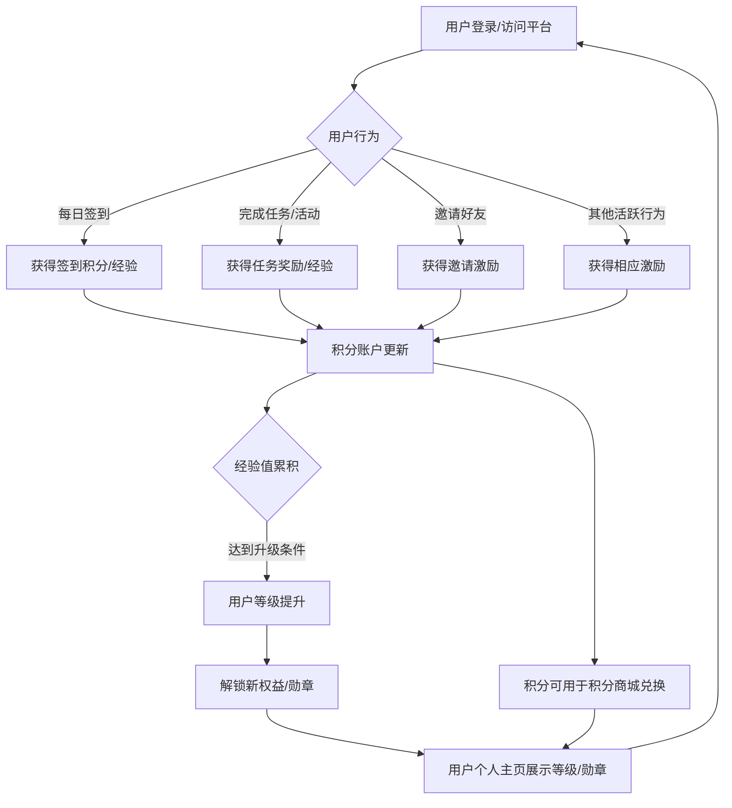
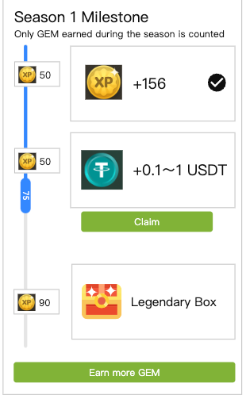
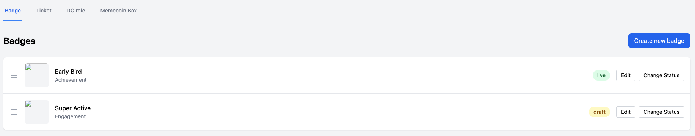
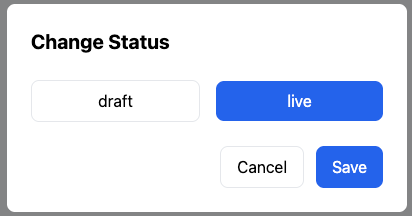
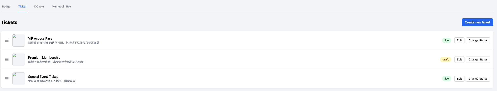

# 新-运营体系需求文档

## 一、产品概述

### 1. 产品背景
为了提升TaskOn平台的用户活跃度、留存率和生态系统的整体价值，计划引入一套全面的运营体系。该体系将围绕用户行为（每日签到、完成任务、邀请好友等）设计激励机制，并通过等级系统、积分商城、勋章墙等功能模块，为用户提供持续的参与动力和成就感。
[原始文档: 运营体系需求文档.md](../md/运营体系需求文档.md)

### 2. 产品愿景
构建一个动态且富有吸引力的用户运营生态，通过有效的激励和认可机制，鼓励用户深度参与平台活动，增强用户忠诚度，促进社区繁荣，并最终提升TaskOn的品牌影响力和市场竞争力。
[原始文档: 运营体系需求文档.md](../md/运营体系需求文档.md)

### 3. 用户故事
-   作为一名TaskOn用户，我希望通过每日签到和完成平台任务来赚取积分，这些积分可以用来兑换我感兴趣的商品或服务，让我感觉我的活跃是有价值的。
-   作为一名TaskOn用户，我希望能有一个清晰的等级系统，通过积累经验值提升等级，解锁更高的权益或获得独特的身份标识，这让我有持续活跃的动力。
-   作为一名TaskOn用户，我希望完成特定挑战或达成某些里程碑后能获得勋章，这些勋章可以展示在我的个人主页，作为我活跃和贡献的证明，让我有成就感。
-   作为一名TaskOn用户，我希望可以通过邀请朋友加入TaskOn并让他们完成任务来获得奖励，这能帮助平台增长，同时我也能受益。
[原始文档: 运营体系需求文档.md](../md/运营体系需求文档.md)

## 二、业务流程

### 1. 全局业务流程图 (用户运营体系核心循环)

[原始文档: 运营体系需求文档.md](../md/运营体系需求文档.md)

### 2. 关键子流程图
-   **每日签到流程:** 用户进入签到页面 -> 点击签到按钮 -> 系统记录签到并发放积分/经验 -> 用户查看签到日历和累计奖励。
    
-   **等级提升流程:** 用户完成任务/行为获得经验 -> 经验值达到当前等级上限 -> 系统自动升级 -> 用户收到升级通知 -> 查看新等级和解锁的权益。
    
-   **积分兑换流程:** 用户进入积分商城 -> 浏览商品列表 -> 选择商品 -> 确认兑换 -> 系统扣除积分并发放商品/权益 -> 用户查看兑换记录。
    
-   **勋章获取与展示流程:** 用户完成特定条件 (如连续签到X天、完成Y个Z类型任务) -> 系统自动授予勋章 -> 用户收到通知 -> 勋章在个人主页勋章墙展示。
    
[原始文档: 运营体系需求文档.md](../md/运营体系需求文档.md)

## 三、功能设计

### 1. 功能地图
-   **用户账户模块 (扩展)**
    -   我的积分 (显示、账单)
    -   我的经验与等级 (显示、升级进度、等级权益说明)
    -   我的勋章 (勋章墙、获取条件、佩戴)
-   **每日签到模块**
    -   签到日历
    -   签到按钮
    -   连续签到奖励提示
    -   补签功能 (可选)
-   **任务系统 (与运营体系联动)**
    -   任务列表 (包含可获得积分/经验的任务)
    -   任务完成后的积分/经验发放
-   **等级系统模块**
    -   等级定义与经验值配置 (B端)
    -   用户等级展示
    -   升级动画/提示
    -   等级权益配置与展示 (如：积分获取加速、特定活动参与资格、专属客服等)
-   **积分商城模块**
    -   商品分类与列表 (B端配置：虚拟商品、实体商品、平台权益、优惠券等)
    -   商品详情页
    -   积分兑换功能
    -   兑换记录
    -   库存管理 (B端)
-   **勋章系统模块**
    -   勋章设计与配置 (B端：名称、图标、获取条件、稀有度)
    -   勋章获取逻辑判断与自动授予
    -   用户勋章墙展示
    -   勋章分享 (可选)
-   **邀请系统 (与运营体系联动)**
    -   邀请好友成功后的积分/经验奖励
-   **通知系统 (扩展)**
    -   积分变动通知
    -   等级提升通知
    -   勋章获取通知
    -   商城兑换成功/失败通知
[原始文档: 运营体系需求文档.md](../md/运营体系需求文档.md)

### 2. 功能描述模板

#### **功能点：每日签到**
-   **描述：** 用户通过每日签到行为获取平台积分和经验值，鼓励用户每日访问。
-   **界面参考：**
    
-   **详细规则：**
    -   用户每日可签到一次，获得固定或随机积分/经验。
    -   连续签到X天可获得额外奖励。
    -   签到日历展示本月签到情况。
    -   B端可配置签到奖励、连续签到规则、是否支持补签及补签消耗。
-   **原始文档对应章节：** [每日签到](../md/运营体系需求文档.md#每日签到)

#### **功能点：等级系统**
-   **描述：** 用户通过积累经验值提升等级，不同等级对应不同的平台权益，激励用户持续活跃和贡献。
-   **界面参考：**
    
-   **详细规则：**
    -   B端配置等级名称、各等级所需经验值、以及各等级对应的权益 (如：特定活动参与权、积分获取加速、社区头衔、专属客服等)。
    -   用户完成指定行为 (如签到、完成任务、消费) 可获得经验值。
    -   经验值达到当前等级上限自动升级，并有明显提示。
    -   用户可在个人中心查看当前等级、经验进度条、以及当前等级和下一等级的权益。
-   **原始文档对应章节：** [等级与经验](../md/运营体系需求文档.md#等级与经验)

#### **功能点：积分商城**
-   **描述：** 用户可以使用通过各种行为获得的积分，在商城中兑换虚拟或实体商品、平台权益等，实现积分的价值闭环。
-   **界面参考：**
    
-   **详细规则：**
    -   B端可配置商品类型 (虚拟/实体/权益/优惠券)、名称、图片、描述、所需积分、库存、兑换限制 (如每人限兑X次、等级限制等)。
    -   C端用户浏览商品，查看详情，使用积分兑换。
    -   兑换成功后扣除积分，发放对应商品/权益。虚拟商品/权益直接到账，实体商品进入待发货流程。
    -   用户可查看自己的积分账单和兑换记录。
-   **原始文档对应章节：** [积分商城](../md/运营体系需求文档.md#积分商城)

#### **功能点：勋章墙**
-   **描述：** 用户完成特定挑战或达成特定里程碑后可获得勋章，勋章作为荣誉象征在个人主页展示，满足用户的成就感和炫耀心理。
-   **界面参考：**
    
-   **详细规则：**
    -   B端可配置勋章名称、图标、描述、获取条件 (如：累计签到X天、完成Y个Z类型任务、达到某等级、参与特定活动等)、稀有度。
    -   系统根据用户行为自动判断并授予勋章。
    -   用户获得勋章后有通知提示。
    -   用户可在个人主页的"勋章墙"查看已获得的勋章和未获得的勋章（可显示获取条件）。
    -   用户可以选择部分勋章在个人资料显眼位置佩戴展示（可选）。
-   **原始文档对应章节：** [勋章墙](../md/运营体系需求文档.md#勋章墙)

## 四、业务规则

### 1. 业务规则概述
运营体系的各项功能（签到、等级、积分、勋章）需遵循明确的业务规则，确保体系的公平性、激励的有效性以及用户体验的顺畅性。规则包括积分与经验的获取与消耗、等级的晋升与权益关联、勋章的授予标准等。
[原始文档: 运营体系需求文档.md](../md/运营体系需求文档.md)

### 2. 业务规则列表模板
#### 示例业务规则表格：

| 规则ID    | 规则名称                                | 描述                                                                                                                              | 影响模块                 |
|:----------|:----------------------------------------|:--------------------------------------------------------------------------------------------------------------------------------|:-------------------------|
| BR-OS-001 | 积分获取规则                            | 用户可通过每日签到、完成带奖励的任务、邀请好友、参与特定活动等方式获取积分。B端可配置不同行为获取积分的数量。                                               | 签到, 任务, 邀请, 活动 |
| BR-OS-002 | 经验值获取规则                          | 用户可通过每日签到、完成带奖励的任务（部分任务可能只奖励经验或同时奖励积分经验）等方式获取经验值。B端可配置不同行为获取经验值的数量。                                       | 签到, 任务, 等级系统     |
| BR-OS-003 | 积分有效期                              | （可选）积分是否设置有效期，例如每年年底清零或获取后N天有效。若有有效期，需提前通知用户。                                                                     | 积分商城, 用户账户       |
| BR-OS-004 | 等级只升不降                            | 用户等级在当前体系下设计为只升不降。                                                                                                    | 等级系统                 |
| BR-OS-005 | 等级权益叠加规则                        | （可选）高等级是否自动继承所有低等级权益，或是有部分替换/专属权益。需明确。                                                                           | 等级系统                 |
| BR-OS-006 | 勋章获取唯一性                          | 同一勋章通常只能获取一次，不可重复获取。                                                                                                  | 勋章系统                 |
| BR-OS-007 | 积分商城兑换限制                        | B端可对部分商品设置兑换限制，如每日/每周/总共可兑换次数、特定等级用户才能兑换等。                                                                         | 积分商城                 |
| BR-OS-008 | 积分与经验值数值范围                    | 积分和经验值应采用整数。需考虑数值上限，避免过大导致显示或计算问题。                                                                                      | 所有相关模块             |
| BR-OS-009 | 签到中断处理                            | 若连续签到中断，是否从第一天重新计算连续签到奖励，或是有补签机制。                                                                                        | 每日签到                 |
| BR-OS-010 | 作弊行为处理                            | 对于恶意刷积分、经验等作弊行为，平台应有监控机制和处理措施（如扣除、封禁等）。                                                                                | 所有相关模块             |

## 五、数据需求

### 数据流说明
-   **输入数据 (用户行为及B端配置):**
    -   用户操作：签到点击、任务完成提交、邀请链接生成与使用、商城兑换请求、勋章佩戴选择。
    -   B端配置：签到奖励规则、等级经验阈值、等级权益内容、商城商品信息（积分价格、库存）、勋章获取条件。
-   **后端处理与存储:**
    -   **用户账户数据：** 用户ID、当前积分余额、当前经验值、当前等级、已获取勋章列表。
    -   **行为日志：** 签到记录、任务完成记录、邀请记录、积分获取/消耗流水、经验获取流水、勋章授予记录、商城兑换订单。
    -   **配置数据：** 签到配置、等级配置、商品配置、勋章配置。
    -   **计算逻辑：** 根据用户行为和B端配置，实时/批量计算积分增减、经验增减、等级变化、勋章授予资格。
-   **输出数据 (C端展示及B端分析):**
    -   C端：
        -   签到日历及反馈。
        -   等级进度条、当前权益、下一等级权益预览。
        -   积分商城商品列表、商品详情、兑换结果。
        -   勋章墙展示、新勋章获得提示。
        -   积分/经验账单。
    -   B端：
        -   运营数据报表：用户活跃数据（签到人数、任务完成率）、等级分布、积分产出与消耗统计、勋章授予情况、商城热门兑换商品等。
[原始文档: 运营体系需求文档.md](../md/运营体系需求文档.md) 