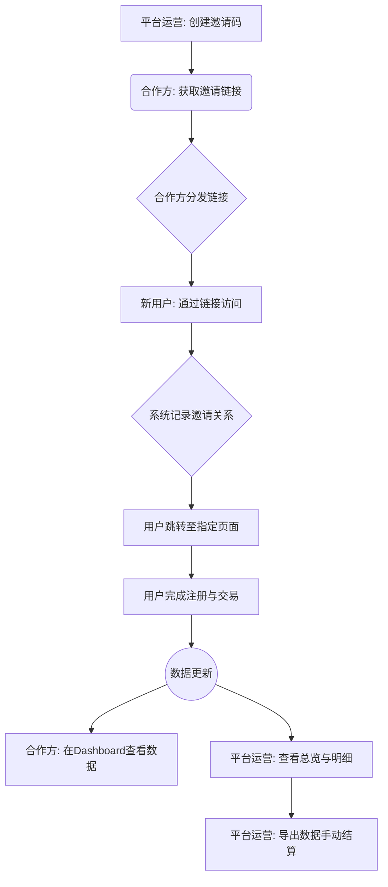
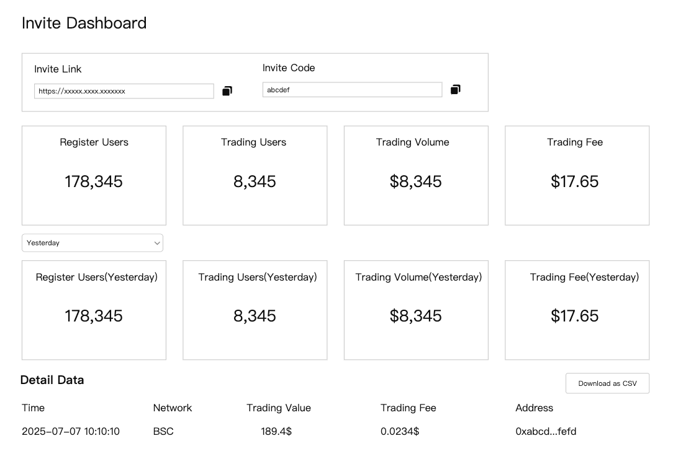

# 邀请 Dashboard 产品需求文档 (PRD)

---

### **一、产品概述**

#### **1. 产品背景**
为了满足平台与流量合作方（以下简称“合作方”）之间，按照交易量进行返佣结算的需求，需要设计并开发一套完整的邀请返佣管理流程。该流程旨在为合作方提供一个透明、高效的数据看板与管理工具。

#### **2. 产品愿景**
为合作方提供一个清晰、易用的数据看板和返佣管理后台，通过透明化的数据与流程激励合作方为平台导入更多高质量的交易用户，从而实现平台与合作方的互利共赢。

#### **3. 用户故事**
- **作为一名流量合作方**: 我 **希望** 能生成一个专属的邀请链接，并能实时查看通过我的链接所带来的用户数、交易量以及产生的佣金，**以便于** 我能准确评估我的推广效果并获得应得的报酬。
- **作为一名平台运营人员**: 我 **希望** 能为不同的合作方灵活配置邀请链接的跳转页面和返佣费率，**以便于** 平台能根据市场策略，高效地开展各类合作与营销活动。
- **作为一名平台运营人员**: 我 **希望** 能在一个统一的后台查看所有合作方的邀请数据，并能方便地导出明细数据用于手动结算，**以便于** 我能高效、准确地完成返佣工作。

---

### **二、业务流程**

#### **1. 全局业务流程图**

---

### **三、功能设计**

#### **1. 功能地图**
- **邀请 Dashboard**
    - **核心功能**
        - 邀请信息展示 (邀请链接 / 邀请码)
        - 关键指标统计 (注册用户数 / 交易用户数 / 交易总量 / 交易费用)
        - 详细数据列表 (交易明细)
    - **辅助功能**
        - 数据时间维度筛选
        - 交易明细数据导出 (CSV)

#### **2. 功能描述**

##### **2.1 邀请 Dashboard 页面**
- **访问方式**: 页面为内部使用，不设面向普通用户的C端入口。通过特定URL格式 `taskon.xyz/invitedashboard/{invite_code}` 直接访问。
- **页面布局与原型**:

***图片描述***: 该图片展示了“邀请Dashboard”的界面原型。主要包含以下几个部分：
-   **顶部**: 显示合作伙伴的邀请链接（Invite Link）和邀请码（Invite Code）。
-   **数据概览区**: 以卡片形式展示了关键指标，包括：
    -   **Register Users**: 注册用户总数。
    -   **Trading Users**: 产生过交易的用户数。
    -   **Trading Volume**: 邀请用户的总交易量。
    -   **Trading Fee**: 邀请用户产生的总交易费用。
-   **筛选与列表区**:
    -   提供了时间筛选功能（Yesterday, 7D, 30D）。
    -   下方是一个“Detail Data”表格，用于展示详细的交易记录。
    -   右上角有一个“Download”按钮，用于导出数据。

---

##### **2.2 核心模块详情**

-   **数据概览**
    -   **Register Users**: 通过该邀请码注册的用户总数。
    -   **Trading Users**: 已注册用户中，在TaskOn平台产生过交易的用户数。
    -   **Trading Volume**: 所邀请用户的总交易量，以USD计价。
    -   **Trading Fee**: 所邀请用户产生的交易费用，具体计算见业务规则。

-   **数据筛选与明细**
    -   **时间筛选**:
        -   提供 `Yesterday`、`7D`、`30D` 三个选项，默认选中 `Yesterday`。
        -   `Yesterday` 指 UTC+0 时区的上一个完整自然日。
        -   `7D` / `30D` 指包含当天的最近7天 / 30天。
    -   **Detail Data (交易明细)**:
        -   列表分页展示，每页50条。
        -   **列表字段**:
            -   `Time`: 交易发生时间 (UTC+0)。
            -   `Network`: 交易所在区块链网络。
            -   `Trading Value`: 单笔交易金额 (USD计价)。
            -   `Trading Fee`: 单笔交易产生的手续费。
            -   `Address`: 用户钱包地址。
    -   **Download (数据下载)**:
        -   点击可将当前筛选条件下的 **所有** 交易记录下载为 CSV 文件，字段与页面列表保持一致。

---

### **四、业务规则**

#### **1. 业务规则概述**
本部分定义了邀请返佣功能中的核心计算逻辑、配置和系统约束条件。

#### **2. 业务规则列表**

| 规则ID | 规则名称 | 规则描述 | 待确认/备注 |
| :--- | :--- | :--- |:--- |
| BR-001 | 邀请链接跳转规则 | 1. 邀请链接自带重定向功能，跳转后需确保邀请码参数不丢失。 2. 默认跳转到 `chainearn` 页面。 3. 可通过运营工具为每个邀请码单独配置跳转目标页面（如特定活动页）。 | |
| BR-002 | 交易手续费率规则 | 1. 可为不同的邀请码配置不同的手续费分成比例。 2. 分成比例通过后端配置文件进行统一设置。 | 【待确认】同一个邀请码，在不同活动下，是否可以设置不同的费率？ |
| BR-003 | 交易费用计算规则 | Dashboard 中展示的 `Trading Fee` 是平台**实际收入**的部分，即 `用户产生的总交易费` - `给合作方的分成` 后的金额。 | 此处 `Trading Fee` 的定义需要对合作方清晰说明，避免歧义。 |
| BR-004 | 邀请关系绑定规则 | 用户首次通过邀请链接访问并完成注册后，系统需记录其与邀请方的永久绑定关系。后续所有交易均计入该邀请方名下。| |
| BR-005 | 数据统计口径规则 | `Yesterday` 的数据统计周期为 UTC+0 时区下的一个完整自然日（00:00:00 - 23:59:59）。| |

---

### **五、数据需求**

#### **1. 数据流说明**
-   **输入数据**:
    -   用户注册事件（需包含从链接中解析出的邀请码）。
    -   用户交易事件（包含用户地址、交易额、手续费、所在链等信息）。
    -   运营配置数据（邀请码、对应的跳转链接、手续费分成比例）。
-   **处理过程**:
    1.  系统根据用户注册事件，建立`用户地址`与`邀请码`的关联。
    2.  聚合用户的交易数据，通过`用户地址`关联到对应的`邀请码`。
    3.  按`邀请码`维度，统计各项核心指标（注册数、交易量等）。
    4.  根据配置的手续费分成比例，计算给合作方的分成和平台的实际收入。
-   **输出数据**:
    -   Dashboard 页面上展示的各项统计指标和交易明细。
    -   可供下载的 CSV 格式交易明细报表。

#### **2. 数据表需求 (示例)**
-   **邀请关系表 (`invitation_relations`)**: `invite_code` (邀请码), `user_address` (用户地址), `created_at` (注册时间)
-   **交易记录表 (`user_trades`)**: `trade_id` (交易ID), `user_address` (用户地址), `trade_time` (交易时间), `network` (所在链), `trade_value_usd` (交易金额), `trade_fee` (手续费)
-   **邀请码配置表 (`invite_code_configs`)**: `invite_code` (邀请码), `redirect_url` (跳转链接), `fee_rate` (分成比例)

---

### **六、埋点需求**
- 根据当前需求文档，暂无明确的前端用户行为分析埋点需求。
- 若未来需要追踪合作方在 Dashboard 页面的交互行为（如：点击下载按钮的频率、切换时间筛选的习惯等），可另行规划并补充相关埋点事件。

